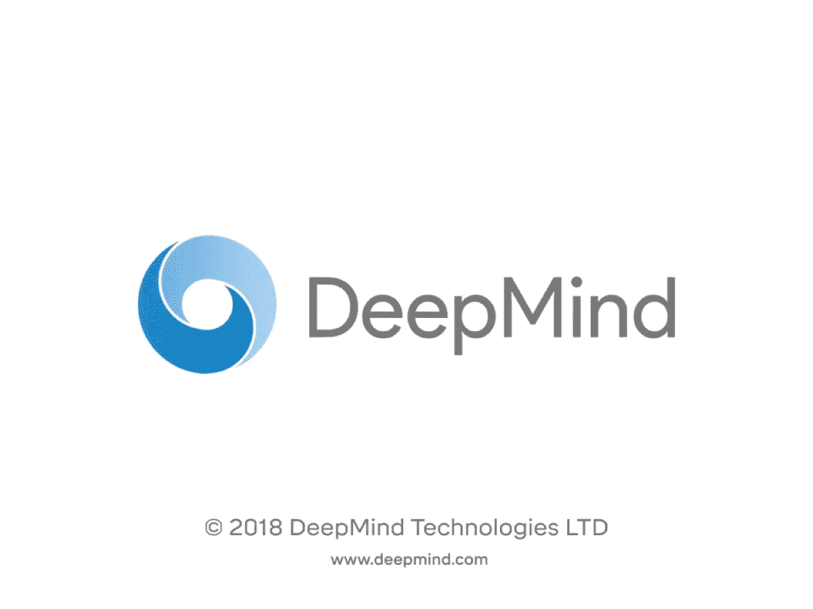

# DeepMind 惊人的混搭 RL 技术

> 原文：<https://medium.com/hackernoon/deepminds-amazing-mix-match-rl-techique-a6f8ce6ac0b4>

## #1 研究论文解释

# 混合搭配——用于强化学习的代理课程[ [arxiv](https://arxiv.org/pdf/1806.01780) ]

如今使用的[强化](https://hackernoon.com/tagged/reinforcement)学习技术非常快速，并通过基于梯度的策略优化为不太复杂的环境提供即时结果。

> 基于梯度的政策是竞争性的，而不是合作性的。

那么，如果我们需要在更复杂的环境中获得持久的结果，让代理执行复杂的任务，那该怎么办呢？

在许多世界环境中，我们没有能力改变环境，在现实世界任务中执行强化[学习](https://hackernoon.com/tagged/learning)真的很耗时。因此，为了克服这个问题，本文试图借助**课程学习**和**基于人口的培训**来解决这个问题。

# 开始之前

## 课程学习[论文](https://www.ijcai.org/proceedings/2017/0757.pdf)

> 使用迁移学习为代理设计一系列任务进行训练，以提高最终表现或学习速度。

## **基于群体的神经网络训练[** [**DeepMind 博客**](https://deepmind.com/blog/population-based-training-neural-networks/)**】**

> PBT 能够在训练时修改网络的超参数。

# 主要思想

《混搭》背后的主要理念是

> 生成 RL 代理的多个变体，其中我们没有能力修改根据训练复杂性安排的任务，而是仅使用一个混合匹配代理，该混合匹配代理是通过利用不同代理而构建的，不同代理在其策略生成过程中在结构上不同。

# 混搭框架

在学习复杂性中排列的多个代理(如上所示)被视为一个混合匹配代理，使用混合策略。

**知识转移**(即提炼)是以这样一种方式完成的，即在早期将复杂的代理与较简单的代理相匹配。

**混合系数**被控制，使得最终复杂的目标代理被用于产生经验。

# 方法详细信息

让我们假设给定一系列可训练代理 1 ( *和相应的策略π 1，…，π K，每一个都用一些θ i ⊂ θ参数化，它们可以共享一些参数*

目标是训练π K，而所有剩余的代理在那里诱导更快/更容易的学习。

让我们介绍一下**分类随机变量‘c’**∞Cat(1，…，K|α) **概率质量函数 p(c = i) = α i** ，它将用于在给定时间选择一个
策略:

Mix & Match 的要点是允许课程学习，因此我们需要 c 的概率质量函数(pmf)随着时间而改变。最初，pmf 应该具有α 1 = 1，并且在接近训练结束时α K = 1，从而允许政策课程从简单的π 1 到目标π K

现在，它应该以这样一种方式训练，最大限度地提高长期的表现，并分享知识，不像那些梯度。

为了解决这个问题，我们将使用一个类似于**蒸馏的成本(D)** 来将策略结合在一起。

我们考虑的最终优化问题只是原始的 **L^RL** **损失**(如下)，应用于控制策略 **π^mm** 和知识转移损失的加权和:

现在，让我们分步骤理解混搭架构→

## 政策混合

为了减少差异，策略混合将通过显式混合来完成。

## 知识转移

为了简单起见，我们考虑 K = 2 的情况。考虑确保**最终策略(π2)** 匹配**更简单策略(π1)** 的问题，同时访问来自**控制策略** (π **mm)** 的样本。

**Same as previous one**

为了简单起见，我们直接在轨迹上定义我们的 **M & M 损失**，并且从控制策略中采样**轨迹(s ∈ S)** 。引入了**1α**项，以便当我们切换到 **π 2** 时，蒸馏成本消失。

## 通过训练调整α (alpha)

**α** 是**群体质量函数**方程(f *第一方程*)中使用的变量。

This is the first equation

所提出的方法的一个重要组成部分是如何随时间设置α的值。为简单起见，让我们再次考虑 K = 2 的情况，其中只需要一个α(因为 c 现在来自伯努利分布),我们
将其视为时间 t 的函数。

**在线超参数调整→** 由于α随时间变化，因此不能使用典型的超参数调整技术，因为可能值的空间是时间步长数的指数形式(α = (α (1)，α(T))∈4 tk1，
其中 4 k 表示 k 维单纯形)。

为了解决这个问题，我们使用**基于人口的培训** (PBT)。

## 基于人口的培训和 M&M

**基于群体的训练** (PBT)保持并行训练的**代理**的群体，以便在训练时随着时间优化超参数，并周期性地相互询问以检查它们相对于其他代理做得如何。表现不佳的代理复制较强代理的权重(神经网络参数),并对其超参数进行局部修改。

PBT 在单次训练中修改超参数的能力使得发现强大的自适应策略成为可能，例如*自动调整学习率退火计划*。

> 这样，表现不佳的代理被用来**探索**超参数空间。

所以，我们需要定义**两个函数** →

> **eval →** 它测量当前代理的强度
> 
> **探索** →定义如何激活超参数。

## 注意:请记住，PBT 试剂是混合试剂，它已经是成分试剂的混合物。

现在，我们应该使用下面提到的两种方案中的一种，这取决于我们感兴趣的问题的特征。

1.  如果模型通过从简单模型切换到更复杂的模型而提高了性能，那么

**a )** 为 **eval** 提供混合策略的性能(即 k 集以上的奖励)。

**b )** 对于**探索**函数，对于 **α** ，我们随机增加或减去一个固定值(在 0 和 1 之间截断)。因此，一旦切换到更复杂的模式有了显著的好处——PBT 就会自动完成。

2.通常，我们希望从一个不受约束的架构切换到某个特定的、受到严重约束的架构(在这种情况下，切换可能不会带来明显的性能优势)。

当从组成的单任务策略中训练多任务策略时，我们可以使 **eval** 成为一个独立的评估作业，它只查看具有 **α K = 1** 的代理的性能。

这样，我们可以直接优化目标模型的最终性能，但代价是 PBT 需要额外的评估。

# 实验

让我们测试并分析一下我们的新 M&M 方法是否在所有情况下都能正确工作。我们现在将考虑 3 组强化学习实验，它们可以扩展到大而复杂的动作空间、复杂的代理体系结构和学习多任务策略。

在整个过程中，我们在 0 附近初始化α，并通过
时间分析其适应性。

> **注意** **→** 即使在实验部分中我们使用 K = 2，实际的课程也可能会经历无限多的因素，这是π 1 和π 2 混合的结果。

除非另有说明，eval 函数返回控制策略的最后 **30 集**的平均奖励。

DeepMind 实验室的环境套件为 RL 代理提供了一系列具有挑战性的 3D、基于第一人称视角的任务(请参见附录)。代理感知**基于 96 × 72 像素的 RGB 观察，速度为 60 fps，可以移动、旋转、跳跃和标记内置机器人**。

## 1.课程超过使用的行动数量

在 6 维向量中表示动作空间是复杂的，其中两个动作组是非常高分辨率的(*旋转和向上/向下看动作*)，其余四个是低分辨率的动作(*向前移动、向后移动或根本不移动、拍摄或不拍摄等*)。

这里用 9 个动作构造 **π 1** ，简单策略(小动作空间)。

类似于使用对角高斯分布的连续控制的研究，我们使用分解策略π 2 (a 1，a 2，…，a 6 |s) := j=1 π̂ j (a j |s)，我们称之为大动作空间。

**为了能够混合这两种策略，我们将π 1 动作映射到π 2 动作空间中的相应动作上。**

下图显示了代理网络之间的混合值。

本文还讨论了共享头和掩码 KL 技术，但这两种技术都比 M&M 技术要陈旧。

## 结果

我们看到，与大的动作空间相比，小的动作空间导致更快的学习，但阻碍了最终的表现。

> 应用于这种设置的 Mix & Match 得到了两个世界的最佳效果，它学习得很快，并且超越了大动作空间的最终表现。

FIG: Training in action
spaces experiments.

当绘制α随时间变化的曲线时(图 5 左侧),我们看到代理在早期完全切换到大的动作空间，从而表明小的动作空间只对学习的初始阶段有用。通过观察代理人通过训练采取的各种行动，可以进一步证实这一点。

图 5(右)显示了行动的边际分布如何随时间演变。我们看到新的动作通过训练被解锁，并且进一步看到最终的分布比初始的分布更熵，这意味着更多的熵导致更多的稳定性。

## 2.基于 Agent 架构的课程

我们用来自经处理的卷积信号的线性投影来代替 LSTM。我们共享卷积模块以及策略/价值函数投影。

实验集中于各种**导航任务**。

一方面，反应性策略(可以仅由前馈策略表示)应该合理快速地学习移动和探索，而另一方面，需要循环网络(具有记忆)来最大化最终性能——通过学习导航新的迷宫布局(探索小的对象位置)或避免(寻找)通过迷宫探索的不成功(成功)路径。

## 结果

FIG 6

M&M 应用于 LSTM 和 FF 的过渡，导致最终性能的显著提高。但没有 FF 的同类产品快。

FIG 7

图 8 导致了两个观察结果

1.  由于游戏级别的复杂性，绿色曲线切换到 LSTM 的时间较晚。
2.  如果需要，模型(蓝色曲线)能够切换回混合策略。

## 3.多任务课程

作为概念的最后证明，我们考虑学习能够同时解决多个 RL 问题的单个策略的任务。这类任务的基本方法是在混合环境中训练一个模型，或者等价地在多个并行环境中训练一个共享模型。

这种类型的训练有两个缺点:

→严重依赖奖励规模，会偏向
高奖励环境。

→易于训练的环境为模型提供了大量更新，因此也可能使解决方案偏向自己。

让我们来看看结果:

FIG 9

一个是**探索目标地点小**，这有高回报和陡峭的初始学习曲线(大量的回报信号来自收集苹果)。

在剩下的两个问题中，训练是困难的，代理与其他机器人以及复杂的机制(拿奖金，标记楼层等)交互。)

多任务解决方案侧重于解决导航任务，而在更具挑战性的问题上表现较差。

为了将 M&M 应用于这个问题，我们为每个环境构建一个代理
(每个代理充当前面章节中的π 1)，然后构建一个集中的“多任务”代理(前面章节中的π 2)。重要的是，代理共享卷积层，但具有独立的 LSTMs。

训练是以多任务的方式进行的，但是每个环境中的控制策略又是特定任务的π i(专家)和π mt(集中代理)的混合。

由于切换到集中策略不再有利，我们使用π mt 的
性能(即中央策略)作为 PBT 的优化标准(eval ),而不是控制策略。

我们独立评估混合物和集中剂的性能。图 9 示出了所提出的方法的每任务性能。人们可以注意到更加一致的表现—

> M 智能体学会在两种具有挑战性的激光标签环境中玩得很好，同时稍微牺牲了在单个导航任务中的性能。

这一成功的原因之一是，知识转移是在政策空间中进行的，这对于报酬比例是不变的。虽然代理人在转换到只使用
中心策略后仍然可以完全专注于高回报环境，但 M & M 训练中的这种归纳偏差确保了更高的最低分数。

# 结论

随着时间的推移，该混合物的成分权重被调整，使得在训练结束时，我们剩下由最复杂的试剂组成的单一活性成分。还有，

> 在复杂环境中提高和加速性能。
> 
> 使用混合策略将代理集合绑定在一起，作为一个单一的复合整体。
> 
> 信息可以通过共享的经验或共享的架构元素在组件之间共享，也可以通过类似蒸馏的 KL 匹配损耗来共享。

我将每周发布 2 个帖子，所以不要错过教程。

所以，跟着我上 [**中**](/@sagarsharma4244)和 [**推特**](https://twitter.com/SagarSharma4244) 看看类似的帖子吧。

如果你有任何意见或问题，请写在评论里。

**拍一下(多次)！分享一下！跟我来。**

乐意帮忙。荣誉……..

# 你会喜欢的以前的故事:

 [## 50 tensor flow . js API 5 分钟讲解| TensorFlow.js Cheetsheet

### TensorFlow API Cheetsheet

towardsdatascience.com](https://towardsdatascience.com/50-tensorflow-js-api-explained-in-5-minutes-tensorflow-js-cheetsheet-4f8c7f9cc8b2)  [## TensorFlow 1.9 已经到来！

### 你需要知道的一切…

towardsdatascience.com](https://towardsdatascience.com/tensorflow-1-9-has-arrived-1e6e9171ce5e)  [## 手机上的 TensorFlow:教程

### 在 Android 和 iOS 上

towardsdatascience.com](https://towardsdatascience.com/tensorflow-on-mobile-tutorial-1-744703297267)  [## 激活函数:神经网络

### Sigmoid，tanh，Softmax，ReLU，Leaky ReLU 解释！！！

towardsdatascience.com](https://towardsdatascience.com/activation-functions-neural-networks-1cbd9f8d91d6)