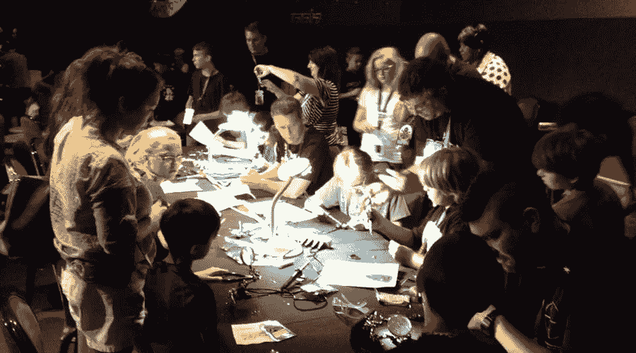
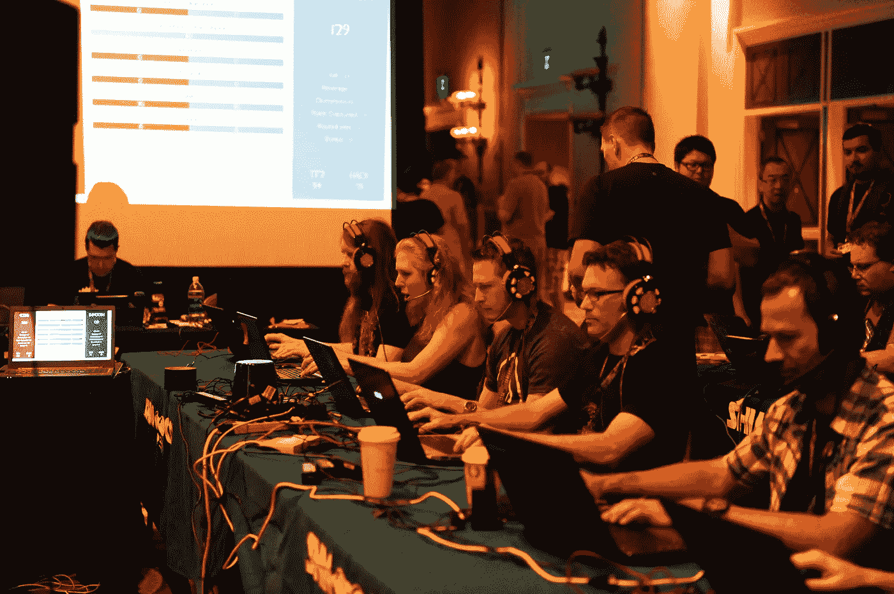
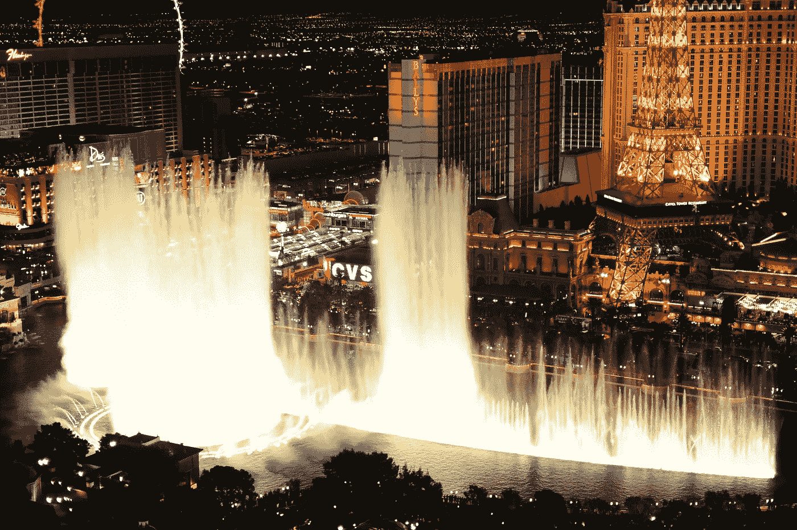

# 3 张图片中的 DEF CON

> 原文：<https://medium.com/hackernoon/def-con-in-3-pictures-5cb2da03dc5c>

探索传说中的 DEF CON 大会。第 26 届，超过 20，000 人上周聚集在拉斯维加斯！

拥有超过 24000+[黑客](https://hackernoon.com/tagged/hackers)， [DEF CON](https://hackernoon.com/tagged/def-con) 大概是**世界上最大的黑客大会**。它聚集了各种各样的人，如计算机安全专家、记者、律师、联邦政府官员和学生……他们有一个共同点，那就是他们喜欢在周末黑锁、硬件，甚至是你让他们黑的任何东西。

我们选择了三张图片，对我们来说，它们体现了 DEF CON 所代表的一些品质。

# 仁慈

**DEF CON 是一个仁慈的社区**。正如核心团队成员 April Wright 所提醒的，参与者应该**“彼此优秀”**。他们还应该关心社会的其他人。

道德黑客(又名白帽黑客)不仅对他们的同行友好，他们还在坏人之前为社会寻找和修复漏洞。他们也教育其他人:在 DEF CON 也欢迎孩子们。

Kids at R00TZ (thanks to Quinna Kim)

投票机黑客村体现了这种哲学。那里的“黑客”暴露了将在 2018 年美国中期选举中使用的机器中的潜在安全弱点**…因此他们可以及时修复。**

> 选举机构必须能够就哪些选举设备将有助于他们进行安全选举做出明智的决定，独立测试对选举机构和供应商都有帮助。

# 竞争性黑客攻击

[DEF CON 团队声明:](https://www.defcon.org/html/defcon-26/dc-26-ctf.html)

> 如今，现实世界的黑客行为大多(尽管远非完全)集中在**民族国家**、**网络犯罪企业**、训练有素(与过去的罗宾汉不同，收入丰厚)的专业人士(为**公司**工作)以及少数(且相距甚远)**黑客行动主义者**手中(甚至这些人近年来也有所减少)。我们需要扯平比分。

DEF CON 充满了小型竞赛，与开锁、机器人、艺术、口号、咖啡大战、寻宝游戏和任何你能想到的捕捉旗帜有关。旗舰 DEF CON 竞赛是 DEF CON CTF。

Focused #CTF! (thanks to Viss for the picture)

DEF CON CTF 的第一个目的是为真正的职业黑客提供一个展示他们技能的场所**，从而指出**顶级黑客**和最有效的技术(工具、自动化等。).但同样重要的是，这是一个奇观。CTF 防务展的参与者将于五月份选出。因此，**赢得 DEF CON CTF 总决赛**是你黑客能力的最强信号。**

DEF CON CTF 的第二个目的是成为一个奇观，并作为整个安全社区的镜头，放大最新的漏洞。

# 奢侈(又名拉斯维加斯)

Defcon 26 在拉斯维加斯的凯撒宫举行…赌场中的 24，000 人可以… **在拉斯维加斯发生的事情留在拉斯维加斯**！

The iconic Bellagio Fountains (thanks to Viss for the picture)

想**了解更多关于全球 DEF CON 这样的黑客事件？**

**！！！跟着我们！！！**