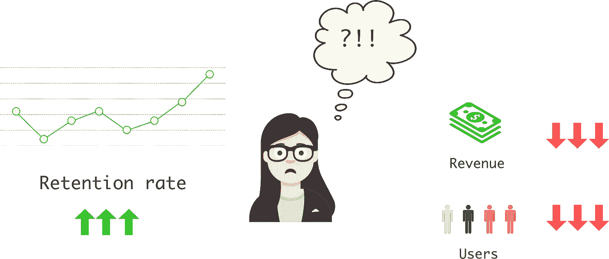
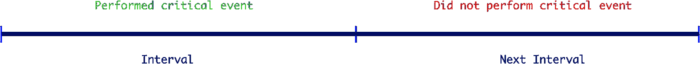
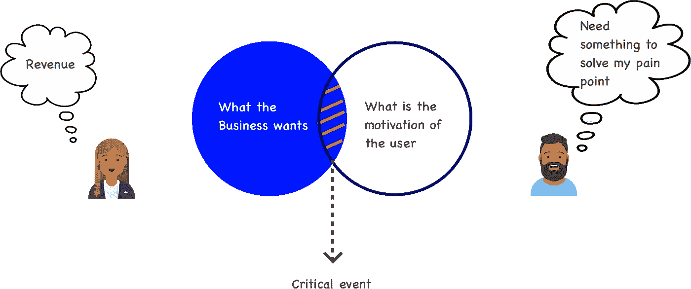
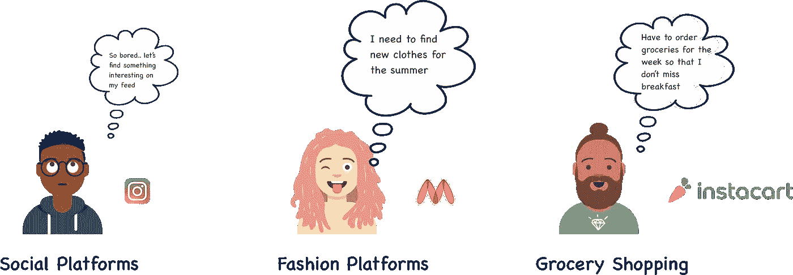
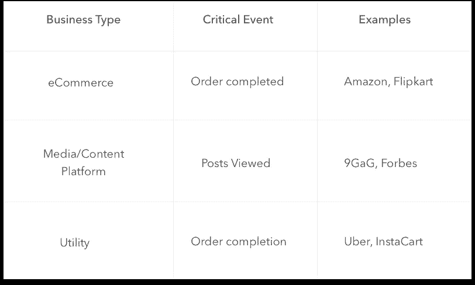
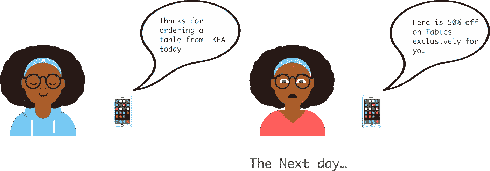
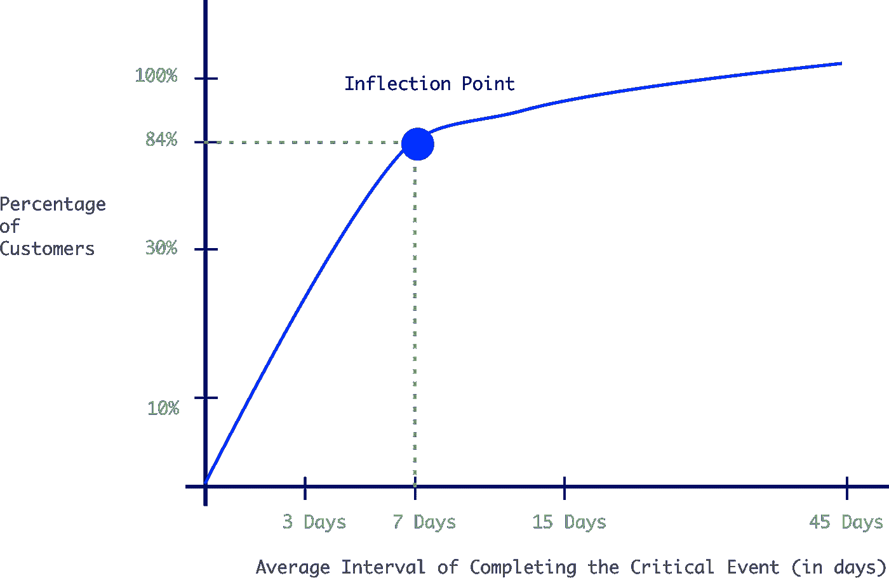

# 正确定义客户流失

> 原文：<https://medium.com/hackernoon/defining-churn-the-right-way-5396722ddb96>

> 衡量流失率是为了给企业一个方向的指标。这是公司业务健康的核心指标。但是在目前的情况下，大多数企业使用不准确的行业标准客户流失定义，这可能不太适合他们的业务。*这对你的企业来说可能是致命的，因为如果你决策所依据的指标是错误的，那么你的决策很可能就是错误的。*
> 
> 在这篇文章中，你将了解适合你的企业的客户流失定义。

*章节*

1.  *衡量客户流失与您的业务相关吗？*
2.  *分解流失定义*
3.  *关键事件:找到对你的业务重要的业务事件*
4.  *区间分析:你希望你的用户多久执行一次关键事件*
5.  *总结一下*

**您甚至需要衡量客户流失吗？**

销售家具的公司不希望他们的用户在不久的将来再次购买家具，因此他们的重点将是购买和转换，而不是流失。因此，并不是所有的企业都需要衡量客户流失。

对于没有重复购买行为的企业来说，考虑调整业务模式(例如订阅模式)以包括更多的重复购买行为可能是一个好主意，因为向现有用户销售比向新用户销售容易和便宜 5 倍。

# 打破客户流失定义

业务流失定义为用户在指定的**时间间隔**内未完成**业务/关键事件**。

# 为您的企业选择关键事件

> 为您的企业衡量的关键事件位于企业想要衡量的和客户在您的平台上实际做了什么的交叉点

**企业想要衡量什么**

企业希望衡量与收入直接相关的事件，因为最终这才是对企业至关重要的。

**客户用你的平台做什么**

客户使用你的平台来解决他们的某种需求。我们的目标是了解让用户留在平台上的事件。

找出这一点的一个方法是，将在平台上停留了很长时间的用户细分出来，以了解有助于用户在平台上停留的事件类型。

Some examples of critical events

## **良好关键事件检查表**

*   应该是客户流失的一个很好的先行指标
*   应该是大多数用户希望在平台上执行的操作
*   应该会带来收入

另外，了解你平台上的大多数用户在做什么有助于形成有趣的商业模式。例如，在媒体的情况下，读者来到平台上寻找写得好的内容。Medium 最近推出了会员计划，帮助用户轻松找到精选内容，同时从中赚钱。

# 你希望你的用户多久执行一次这个事件？

你认为大多数人

*   今天点菜明天再点？可能
*   今天订购家具，明天再订购？可能不会
*   今天预约出租车去上班，明天又预约出租车去上班？可能是的

您业务的关键事件需要在一段时间间隔内进行测量，这也是您业务的具体情况。

**定义区间的定量方式**

1.  找到在您的平台上至少完成两次关键事件的用户。
2.  查找用户完成关键事件所需的平均天数
3.  绘制天数间隔和低于该间隔的用户百分比之间的累积分布曲线

权衡的结果是如何在最少的天数内捕获大多数执行关键事件的用户。一个好的经验法则是找到曲线中有拐点的区间

# 总结一下

现在，将关键事件和窗口结合起来，您就有了新的客户流失定义。

客户流失定义的一些示例:

*   客户没有在 7 天内为食品配送公司下订单
*   客户在 3 天内没有打开社交平台的应用程序
*   客户在 15 天内没有完成教育平台的课程

这种定义流失的方式只是一个开始，仍然存在的问题是:

1.  客户流失的定义过于严格，可能不适用于您平台上的所有客户群
2.  随着业务的增长，您今天所做的客户流失定义可能不再有效

**下一步:**

*   现在你可以衡量客户流失，你如何利用它来推动你的公司朝着正确的方向发展？*(马上就要鼓捣出一篇博文了！)*

更多阅读！

*   [定义关键事件](https://amplitude.com/blog/2016/09/15/user-retention-app-critical-event)
*   [投资人如何用速动比率评估你的流失率？](/swlh/diligence-at-social-capital-part-1-accounting-for-user-growth-4a8a449fddfc)

*在* [*马拉克斯*](https://marax.ai/?utm_campaign=Define_Churn&utm_medium=Blog&utm_source=medium&utm_content=Name_of_company) *，改进我们定义客户流失的方式只是我们利用人工智能/深度* [*学习*](https://hackernoon.com/tagged/learning) *技术来帮助企业减少客户流失的聪明方法之一*

*我们目前处于有限发布预览阶段，这意味着我们正在让公司慢慢尝试我们的平台，以获得减少平台流失的最佳体验。如果你想试用这个平台，* [***在这里注册***](http://utm.io/ub5HN) *，成为构建唯一一个人工智能支持的全栈流失管理平台*的一员

如果你对此感兴趣，并想进一步讨论这个问题，请留言或发短信给我。