# 正在使用的人工智能示例的最终列表

> 原文：<https://medium.com/hackernoon/definitive-list-of-examples-of-artificial-intelligence-in-use-e02e3328ce26>

> 多学科人工智能——他将资源、人力资本、技术、技术援助和本体论(信息科学)结合起来，以释放和拥抱个人、系统和政策的潜力。

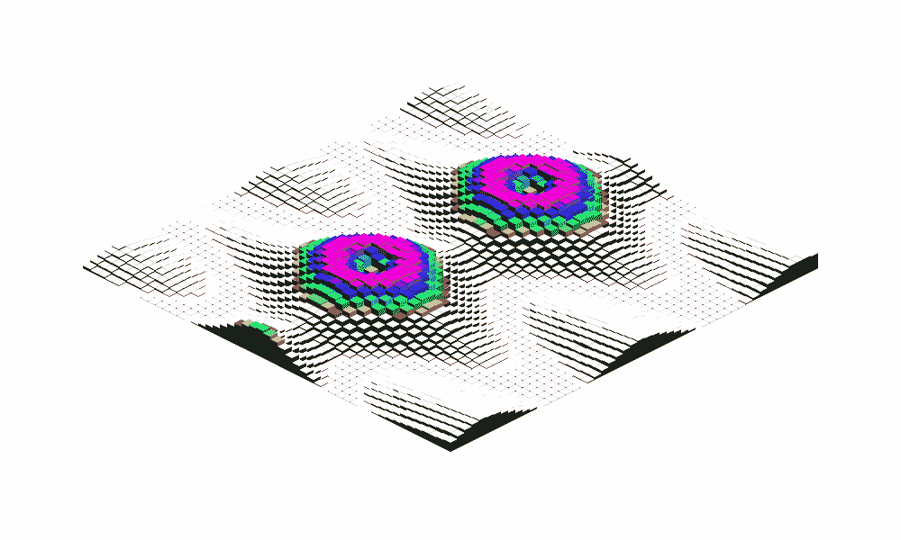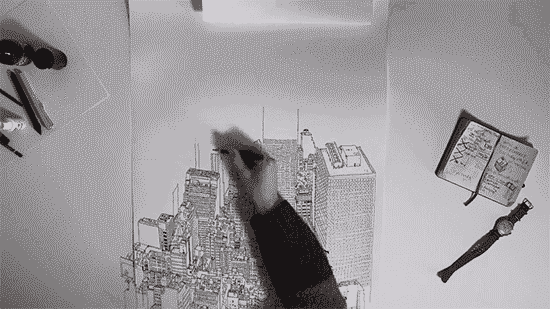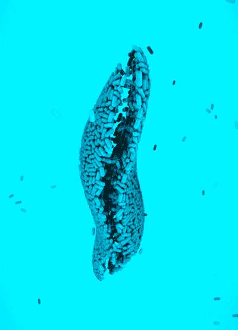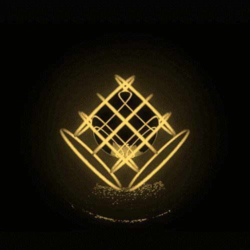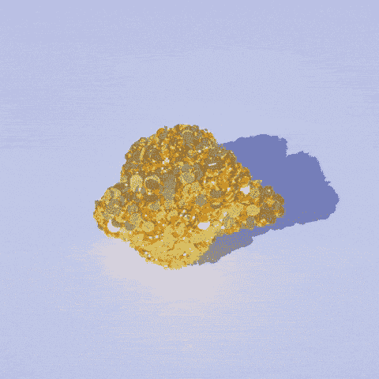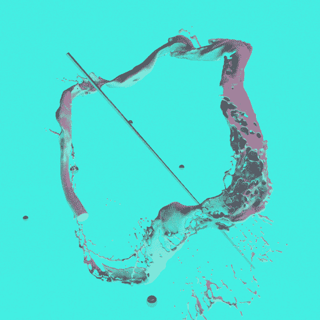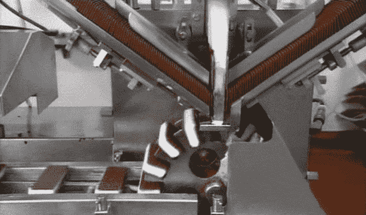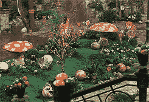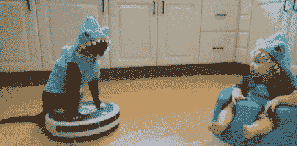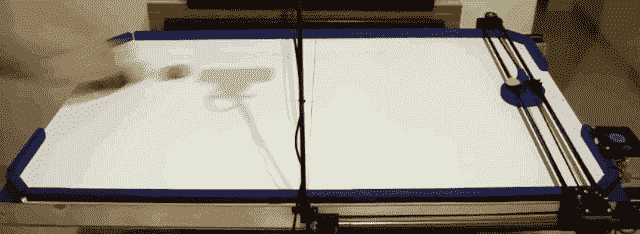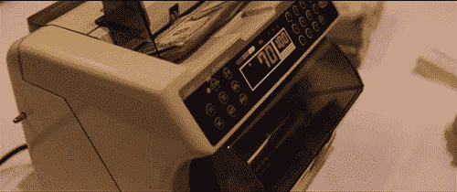

GIPHY — top source for the best & newest GIFs & Animated Stickers online.

人工智能就在我们身边，并且有有用的应用。人工智能是新的电力，将改变每个行业。特定领域的人工智能和增强智能可能是新的垂直市场的崛起。增强智能可能会找到我们无法或不愿找到的解决方案。在没有意识到的情况下，我们已经使用了多种形式的人工智能。在搜索中，我们利用机器学习、自然语言处理和图像识别。

关注多学科是关键。当今的挑战与多个行业交织在一起，需要广泛的技能来评估、评价和理解未来的解决方案。许多人工智能工具集是现成的解决方案，可以应对今天的明天的挑战。

这是一个[聚会场所、对话和虚拟孵化器](https://disruptiontalk.com/)的开始，高管、企业主、企业家、工程师、艺术家和设计师分散了专业知识、关系和对多学科人工智能的理解。

从过去的经历中，我了解到有时很难获得正确的关系和信息。然而，数字边界的奇迹让任何人都可以通过稳定的互联网连接进行实时合作和学习。

一个受众智能设计公司的成立，激发了成为数字游牧者的想法。除了专业的电子邮件营销和自动化应用程序，[面向目标受众的社交媒体推广计划](https://socialplan.co/)，以及由移动云支持的协同工作弹出窗口。

## 这是什么意思？

把每一个终端计算设备或者智能手机都变成孵化器意味着什么？将每一家咖啡店、餐厅、客厅和未充分利用的办公室或商业空间都变成共同工作空间意味着什么？

有复原力的社会将释放和拥抱个人的潜力。深度学习相关的很多论文、[数据集](https://code.google.com/archive/p/word2vec/)、[图像识别层级](http://image-net.org/index)、[软件工具](http://deeplearning.net/software/theano/)都是开源的。这带来了民主化的效果，使个人能够构建强大的应用程序。

WhatsApp 只用 50 名工程师就能建立一个服务 9 亿用户的全球信息系统[，相比之下，前几代信息系统需要数千名工程师。](http://www.wired.com/2015/09/whatsapp-serves-900-million-users-50-engineers/)

共享经济的颠覆正在人工智能领域发生。像 Theano 和 TensorFlow 这样的软件工具，通过云数据中心进行培训，通过廉价的 GPU 进行部署，可以让个人和小型分布式团队建立最先进的人工智能系统。或者使用 Movidius 神经计算棒即插即用特定领域的人工智能选项。

O 组织、非政府组织和数字社区将寻求在全球市场上实现最大盈利和可持续性的平台。新兴技术、系统和政策将需要分析，以了解对人类、社会、国家和地球的累积影响。

为新兴的信息通信技术(ICT)、生物技术和新材料建立安全标准和通用协议就在我们中间。没有监管标准的人工智能的开发和部署对人类来说可能是固有的危险。未能为多学科人工智能制定标准会导致经济效率低下，并失去经济机会。

# 个人或小型分布式团队下一步将构建什么样的区块链人工智能产品、服务或流程？：

## 劳工和教育

[找工作](https://hackernoon.com/farewell-education-welcome-api-as-a-service-for-micro-entrepreneurship-f045710b9454)
[发展业务或项目](https://disruptiontalk.com/) [标记论文](https://www.newscientist.com/article/mg21128285-200-automated-marking-takes-teachers-out-of-the-loop/)
[做助教](https://www.washingtonpost.com/news/innovations/wp/2016/05/11/this-professor-stunned-his-students-when-he-revealed-the-secret-identity-of-his-teaching-assistant/)
[创建定制教材](http://contenttechnologiesinc.com/)
[创建个性化学习计划](https://www.theverge.com/2016/4/25/11492102/bill-gates-interview-education-software-artificial-intelligence)
[辅导孩子数学](http://hellothinkster.com/)

## 管理的

[拿到停车费](http://www.ibtimes.co.uk/how-appeal-parking-ticket-this-ai-robot-lawyer-will-fight-fines-you-free-1567908)
[整理你的照片](https://betanews.com/2017/06/03/google-photos-ai-archiving/)
[做你的私人助理](https://techcrunch.com/2016/05/25/sherpa-a-spanish-language-ai-based-personal-assistant-raises-6-5m/)
[做数据录入](https://www.hyperscience.com/products/)
[提高你的写作水平](https://www.grammarly.com/about)
[做一份人事值班表](http://www.rotageek.com/about)
[安排你的会议](https://x.ai/how-it-works/)
[在会议上做笔记](https://clarke.ai/)

## 金融

[检测付款欺诈](https://techcrunch.com/2017/01/16/fraugster/)
[做账](https://www.accountingtoday.com/opinion/the-future-of-automation-and-accounting)
[寻找廉价航班](https://www.hopper.com/corp/about.html)
[帮你照看你的钱](https://www.meetcleo.com/)
[做借贷决策](http://lending-times.com/2017/07/19/ai-credit-scoring-fad-or-the-future/)
[管理对冲基金](https://www.bloomberg.com/news/features/2017-09-27/the-massive-hedge-fund-betting-on-ai)
[优化你的支出](http://wallet.ai/#about)
[价格风险](https://cytora.com/company)
[确定目标受众](https://socialplan.co/)
[市场透明度](https://elementus.io/token-sales-history)

## 专业的

[云存储业务](https://www.smarterbackups.com/)
[购买并投放广告](https://martechtoday.com/value-applying-artificial-intelligence-display-advertising-199306)
[查看商业贷款协议](https://www.independent.co.uk/news/business/news/jp-morgan-software-lawyers-coin-contract-intelligence-parsing-financial-deals-seconds-legal-working-a7603256.html)
[优化零售库存](https://edited.com/about/)
[审核盗窃保险理赔](https://www.lemonade.com/blog/lemonade-sets-new-world-record/)
[组建项目团队](https://www.profinda.com/)
[蔻驰呼叫中心员工](http://www.cogitocorp.com/)
[开展 M &尽职调查](https://www.slaughterandmay.com/news-and-recent-work/news/luminance-launches-with-backing-of-invoke-capital-and-in-collaboration-with-slaughter-and-may/)
[开展法律案例研究](http://www.rossintelligence.com/lawyers/)
[设计](https://www.forbes.com/sites/benkepes/2014/08/26/good-idea-bad-use-of-jargon-feedvisor-raises-6m-for-its-algorithmic-repricing-platform/) [个性化客户体验](http://www.boxever.com/solution-overview/)
[点评 NDAs](http://mitsloan.mit.edu/newsroom/articles/artificial-intelligence-enabled-klarity-helps-companies-identify-risks-in-contracts/)
[点评汽车保险理赔](https://tractable.ai/products/insurance/)
[经营豪华礼宾](https://www.johnpaul.com/en/home/)
[撰写财经简报](https://qz.com/228218/the-aps-newest-business-reporter-is-an-algorithm/)
[撰写体育简报](http://www.ibtimes.co.uk/associated-press-expand-its-sports-coverage-by-using-ai-write-minor-league-baseball-articles-1568804)
[预测票房表现](https://www.vaultml.com/what-we-do.html)
[预测法庭案件](https://www.ucl.ac.uk/news/news-articles/1016/241016-AI-predicts-outcomes-human-rights-trials)
[预测时尚趋势](https://www.economist.com/news/business/21725599-technology-may-be-disrupting-peculiar-business-can-data-predict-fashion-trends)

## 家居与生活方式

[推荐电影](https://www.wired.co.uk/article/how-do-netflixs-algorithms-work-machine-learning-helps-to-predict-what-viewers-will-like)
[推荐音乐](https://qz.com/571007/the-magic-that-makes-spotifys-discover-weekly-playlists-so-damn-good/)
[推荐东西买](https://www.wired.com/2016/05/amazons-giving-away-ai-behind-product-recommendations/)
[调节你的灯光](/@Cubic.ai/cubic-making-of-the-ai-butler-3ff534d95591)
[清洁你的窗户](https://www.ecovacs.com/us/winbot-window-cleaning-robot/WINBOT-950)
[给你时尚建议](https://www.psfk.com/2017/11/alibaba-has-introduced-an-ai-fashion-assistant.html)
[猜猜你认识谁](https://www.usatoday.com/story/tech/columnist/2017/07/30/why-facebooks-people-you-may-know-makes-some-weird-suggestions/521264001/)
[发明菜谱](https://www.ice.edu/about-us/brand-at-ice/ibm-cognitive-cooking-with-chef-watson-partnership)
[学学你的周店](http://www.getcapitan.com/)
[调鸡尾酒](https://www.wgsn.com/blogs/sxsw-ibm-watson-could-be-mixing-your-next-drink-and-analysing-your-personality-too/)
[现在](https://usa.robomow.com/) [减少你的水费](https://www.engadget.com/2017/11/21/buoy-iot-water-sensor/)
[用吸尘器清扫你的地板](http://www.irobot.com/For-the-Home/Vacuuming/Roomba.aspx)
[代你买东西](https://techcrunch.com/2014/01/18/amazon-pre-ships/)
[控制你的整个房子](https://techcrunch.com/2016/12/20/watch-mark-zuckerbergs-morgan-freeman-voiced-jarvis-ai-in-action/)
[做饭](https://www.forbes.com/sites/eustaciahuen/2016/10/31/the-worlds-first-home-robotic-chef-can-cook-over-100-meals/)

## 安全性

[拦截垃圾邮件](https://techcrunch.com/2017/05/31/google-says-its-machine-learning-tech-now-blocks-99-9-of-gmail-spam-and-phishing-messages/)
[检测恶意软件](https://www.networkworld.com/article/3043202/security/how-to-use-deep-learning-ai-to-detect-and-prevent-malware-and-apts-in-real-time.html)
[增强像素化图像](https://www.theguardian.com/technology/2017/feb/08/google-ai-system-pixelated-faces-csi)
[检测被攻破的用户账户](https://bdtechtalks.com/2016/04/15/the-role-of-big-data-in-securing-online-identities/)
[标记极端分子视频](https://www.ft.com/content/2775d8a4-b3f8-11e7-aa26-bb002965bce8)
[识别地对空导弹站点](https://www.wired.com/story/ai-can-help-hunt-down-missile-sites-in-china/)
[操作哨兵枪](https://en.wikipedia.org/wiki/Samsung_SGR-A1)
[巡逻商场](http://uk.businessinsider.com/knightscope-security-robots-microsoft-uber-2017-5)
[现场窃贼](https://www.popsci.com/article/gadgets/defend-your-home-artificial-intelligence#page-2)
[现场推特上的巨魔【上的 还有暴动](https://www.wired.com/2017/02/googles-troll-fighting-ai-now-belongs-world/)
[预测谁要犯罪](https://futurism.com/chinas-minority-report-style-plans-will-use-ai-to-predict-who-will-commit-crimes/)
[看穿墙壁](https://www.theregister.co.uk/2017/06/20/drones_and_wifi_see_thru_walls/)

## 产业的

[管理供应链](https://chronicled.com/) [降低工业能耗](http://uk.businessinsider.com/google-deepmind-ai-in-every-company-data-centre-end-of-year-2016-7)
[喷洒农药](https://www.wired.com/2016/05/future-humanitys-food-supply-hands-ai/)
[清洁地板](https://twitter.com/2morrowknight/status/942275170957344768)
[检测农作物病害](https://www.frontiersin.org/articles/10.3389/fpls.2016.01419/full)
[预测农作物产量](https://www.theverge.com/2016/8/4/12369494/descartes-artificial-intelligence-crop-predictions-usda)
[预测维修任务](https://tractable.ai/products/preventative-maintenance/)
[分拣黄瓜](https://cloud.google.com/blog/big-data/2016/08/how-a-japanese-cucumber-farmer-is-using-deep-learning-and-tensorflow)
[捡拾水果蔬菜](https://www.theguardian.com/business/2017/jan/31/hand-ocado-robot-shopping-fruit-vegetables)
[经营工厂](https://www.marketwatch.com/story/germany-develops-smart-factories-to-keep-an-edge-2014-10-27)
[运行](https://www.wired.co.uk/article/ocado-automated-distribution-warehouse)

## 运输

[调度出租车](https://eng.uber.com/engineering-an-efficient-route/)
[导航](https://motherboard.vice.com/en_us/article/4x3pp9/the-simple-elegant-algorithm-that-makes-google-maps-possible)
[驾驶汽车](https://en.wikipedia.org/wiki/Autonomous_car)
[驾驶卡车](https://www.technologyreview.com/s/603493/10-breakthrough-technologies-2017-self-driving-trucks/)
[驾驶 F-16 战斗机](https://techcrunch.com/2017/04/11/u-s-air-force-and-lockheed-demonstrate-autonomous-f-16-strike-capabilities/)
[驾驶无人驾驶飞机](https://www.theverge.com/2017/9/20/16325084/matternet-autonomous-drone-network-switzerland)
[预测停车可用性](https://research.googleblog.com/2017/02/using-machine-learning-to-predict.html)
[设计跑车](https://www.fastcompany.com/3054028/inside-the-hack-rod-the-worlds-first-ai-designed-car)
[预测你想去哪里](http://www.datacenterknowledge.com/machine-learning/how-mercedes-benz-uses-ai-predict-where-you-want-go)

## 科学

[寻找亚原子粒子](https://futurism.com/ai-is-changing-everything-even-science-itself/)
[将极端天气事件](https://www.nextplatform.com/2016/05/18/climate-research-first-push-deep-learning-traditional-supercomputers/)
[分类发现生物学新模型](https://now.tufts.edu/news-releases/planarian-regeneration-model-discovered-artificial-intelligence)
[发现新行星](https://www.wired.co.uk/article/why-artificial-intelligence-is-the-future-of-astronomy)
[发现现有药物的新用途](https://www.technologyreview.com/s/603384/machine-vision-helps-spot-new-drug-treatments/)
[识别细菌](https://scienmag.com/bidmc-researchers-use-artificial-intelligence-to-identify-bacteria-quickly-and-accurately/)
[起草研究论文](https://www.timeshighereducation.com/news/rise-research-bots-ai-software-writes-your-papers-you#survey-answer)
[发明肉类替代品](http://www.bbc.com/future/story/20171214-could-ai-help-create-a-meat-free-world)
[预测聚变反应的中断](https://www.princeton.edu/news/2017/12/15/artificial-intelligence-helps-accelerate-progress-toward-efficient-fusion-reactions)
[预测地震](https://www.scientificamerican.com/article/can-artificial-intelligence-predict-earthquakes/)

## 医学的

[诊断肺炎](https://qz.com/1130687/stanford-trained-ai-to-diagnose-pneumonia-better-than-a-radiologist-in-just-two-months/)
[诊断皮肤癌](https://spectrum.ieee.org/the-human-os/biomedical/diagnostics/computer-diagnoses-skin-cancers)
[预测自闭症](https://spectrum.ieee.org/the-human-os/biomedical/imaging/ai-predicts-autism-from-infant-brain-scans)
[预测心脏病和中风](https://spectrum.ieee.org/the-human-os/biomedical/diagnostics/ai-predicts-heart-attacks-more-accurately-than-standard-doctor-method)
[诊断白内障](https://spectrum.ieee.org/the-human-os/biomedical/diagnostics/ophthalmologists-vs-ai-its-a-tie)
[生成肿瘤治疗计划](https://www.ibm.com/watson/health/oncology-and-genomics/oncology/)
[识别糖尿病视网膜病变](https://www.wired.com/2016/11/googles-ai-reads-retinas-prevent-blindness-diabetics/)
[识别血液中的疟原虫](https://spectrum.ieee.org/the-human-os/robotics/artificial-intelligence/aipowered-microscope-counts-malaria-parasites)
[预测老年痴呆症](https://spectrum.ieee.org/the-human-os/biomedical/diagnostics/can-deep-learning-help-clinicians-predict-alzheimers-disease)
[预测高血压](https://www.wired.com/story/ai-can-help-apple-watch-predict-high-blood-pressure-sleep-apnea/) 睡眠呼吸暂停
[在家检测跌倒](https://www.theengineer.co.uk/radar-ai-vulnerable-healthcare/)
[诊断常见病症](https://spectrum.ieee.org/the-human-os/biomedical/diagnostics/doc-1-apps-0)
[诊断前列腺癌](https://cloud.google.com/customers/maxwell-mri/)
[做精确的切口](https://spectrum.ieee.org/the-human-os/biomedical/devices/in-fleshcutting-task-autonomous-robot-surgeon-beats-human-surgeons)
[监测门诊病人](http://sensely.com/features/)
[预测再入院](http://hitconsultant.net/2017/12/12/partners-connected-health-ai-hospital-readmissions/)
[筛查宫颈癌](https://pratt.duke.edu/news/ditch-the-speculum)
[缝合伤口](https://spectrum.ieee.org/the-human-os/robotics/medical-robots/autonomous-robot-surgeon-bests-human-surgeons-in-world-first)

## 视力

[从你的脸识别你](https://en.wikipedia.org/wiki/Facial_recognition_system)
[从你的走路姿势识别你](https://www.newscientist.com/article/mg21528835-600-cameras-know-you-by-your-walk/)
[描述一幅画中发生的事情](https://www.independent.co.uk/life-style/gadgets-and-tech/news/captionbot-microsoft-picture-caption-analyse-describe-artificial-intelligence-a6984246.html)
[区分巧克力片与葡萄干饼干](https://gigaom.com/2014/12/05/deep-learning-startup-metamind-launches-with-8m-and-a-star-team/)
[为视障人士识别物体](https://www.technologyreview.com/s/601098/app-spots-objects-for-the-visually-impaired/)
[识别植物和动物种类](https://news.developer.nvidia.com/ai-app-identifies-plants-and-animals-in-seconds/)
[在照片中标记你的朋友](/@ageitgey/machine-learning-is-fun-part-4-modern-face-recognition-with-deep-learning-c3cffc121d78)
[追踪人群中的多张脸](https://techcrunch.com/2017/03/30/new-tech-can-spot-small-faces-in-the-crowd/)
[检测虐童图像](http://www.telegraph.co.uk/technology/2017/12/18/artificial-intelligence-will-detect-child-abuse-images-save/) [猜你的年龄](https://www.theverge.com/2015/4/30/8522649/microsoft-how-old-do-i-look)
[识别图片中的情绪](https://www.wired.co.uk/article/microsoft-predict-emotions-artificial-intelligence)
[识别部分隐藏的人脸](https://arxiv.org/abs/1708.09317)
[把照片变成视频](http://carlvondrick.com/tinyvideo/)

## 计算

[整理你的脸书新闻提要](https://sideways-view.com/2016/12/01/optimizing-the-news-feed/)
[搜索网页](https://www.wired.com/2016/02/ai-is-changing-the-technology-behind-google-searches/)
[改进你的 UX 设计](http://www.eyequant.com/)
[预测硬盘故障](http://www.digitaljournal.com/tech-and-science/technology/hitachi-uses-ai-to-predict-when-server-hard-drives-will-fail/article/504575)
[提高你的 WiFi 性能](https://www.networkworld.com/article/3211528/mobile-wireless/mist-uses-ai-to-improve-wireless-network-performance.html)
[学习如何使用电脑](https://www.wired.com/2016/12/openais-universe-computers-learn-use-apps-like-humans/)
[学习如何使用加密](https://www.wired.co.uk/article/google-artificial-intelligence-encryption)
[将线框化为工作应用](https://thenextweb.com/apps/2017/05/26/ai-raw-design-turn-source-code/)
[编写人工智能软件](https://www.technologyreview.com/s/603381/ai-software-learns-to-make-ai-software/)

## 言语和语言

[唇读](https://www.technologyreview.com/s/602949/ai-has-beaten-humans-at-lip-reading/)
[从人群中挑出一个声音](https://www.newscientist.com/article/2151268-an-ai-has-learned-how-to-pick-a-single-voice-out-of-a-crowd/)
[翻译 100 多种语言](https://translate.google.co.uk/)
[翻译来自星际舰队舰长的命令](https://www.theverge.com/2017/5/11/15621930/star-trek-bridge-crew-voice-commands-ibm-watson)
[说话自然](https://deepmind.com/blog/wavenet-generative-model-raw-audio/)
[转录对话](https://blogs.microsoft.com/ai/2016/10/18/historic-achievement-microsoft-researchers-reach-human-parity-conversational-speech-recognition)
[实时翻译](https://www.engadget.com/2017/10/04/google-pixel-buds-translation-change-the-world/)
[撰写令人信服的评论](https://arxiv.org/abs/1708.08151)
[学会像别人一样说话](https://arstechnica.co.uk/information-technology/2016/07/luka-ai-chatbot-speaking-to-the-dead-mind-uploading/)

## 创造性的

[伪造某人说话的视频](https://www.theverge.com/2017/7/12/15957844/ai-fake-video-audio-speech-obama)
[模仿著名艺术家](https://motherboard.vice.com/en_us/article/wnjve5/artificial-intelligence-can-now-paint-like-arts-greatest-masters)
[现场伪造艺术品](https://www.technologyreview.com/s/609524/this-ai-can-spot-art-forgeries-by-looking-at-one-brushstroke/)
[作曲古典音乐](https://qz.com/488701/humans-are-confusing-music-composed-by-a-computer-for-j-s-bach/)
[临摹自己的笔迹](https://www.dailydot.com/layer8/handwriting-algorithm-privacy-security/)
[设计 logo](https://www.indiehackers.com/businesses/logojoy)
[直接展板展示](http://www.telegraph.co.uk/news/2017/12/16/hear-one-robot-director-bbc-ai-film-comedy-music-shows/)
[绘制令人毛骨悚然的图片](http://nightmare.mit.edu/)
[编辑照片](https://thenextweb.com/artificial-intelligence/2017/07/14/google-taught-ai-to-edit-photos-like-a-pro-and-the-results-are-glorious/)
[生成逼真的人脸](https://futurism.com/these-people-never-existed-they-were-made-by-an-ai/)
写电影
[写小说](https://www.digitaltrends.com/cool-tech/japanese-ai-writes-novel-passes-first-round-nationanl-literary-prize/)
[写诗歌](https://motherboard.vice.com/en_us/article/vvbxxd/the-poem-that-passed-the-turing-test)
[写歌曲](https://www.theverge.com/2017/8/27/16197196/taryn-southern-album-artificial-intelligence-interview)

## 比赛

[玩雅达利 2600](https://deepmind.com/research/publications/playing-atari-deep-reinforcement-learning/)
[玩战舰](https://www.technologyreview.com/s/609507/this-inquisitive-ai-will-kick-your-butt-at-battleship/)
[玩围棋](https://en.wikipedia.org/wiki/AlphaGo_versus_Lee_Sedol)
[玩 Jeopardy！](http://www.nytimes.com/2011/02/17/science/17jeopardy-watson.html?pagewanted=all)
[玩 Shogi](https://arxiv.org/abs/1712.01815)
[玩德州扑克](https://www.wired.com/2017/01/mystery-ai-just-crushed-best-human-players-poker/)
[玩象棋](https://en.wikipedia.org/wiki/Deep_Blue_versus_Garry_Kasparov)
[玩毁灭战士](https://arxiv.org/abs/1609.05521)
[玩 Dota 2](https://arstechnica.co.uk/gaming/2017/08/ai-bot-takes-on-the-pros-at-dota-2-and-wins/)
[玩推箱子](https://deepmind.com/blog/agents-imagine-and-plan/)
[玩超级马里奥兄弟](https://www.youtube.com/watch?v=iakFfOmanJU)
[玩乒乓球](https://www.theverge.com/2017/10/9/16448488/table-tennis-playing-robot-ai-forpheus-omron)

## 机器人和正电子大脑

[一个想象](https://www.technologyreview.com/s/610253/the-ganfather-the-man-whos-given-machines-the-gift-of-imagination/)
[在半空中玩杂耍球](https://gizmodo.com/5786711/quadrotor-drones-can-juggle-balls-with-each-other)
[动画便便表情符号](https://www.theverge.com/2017/9/12/16290210/new-iphone-emoji-animated-animoji-apple-ios-11-update)
[舞蹈江南 Style](https://www.youtube.com/watch?v=yP9NCMMqxCs)
[做一个后空翻](https://www.theverge.com/circuitbreaker/2017/11/17/16671328/boston-dynamics-backflip-robot-atlas)
[钉一个智商测试](http://observer.com/2015/06/artificially-intelligent-computer-outperforms-humans-on-iq-test/)
[判断你是否在做梦](https://thenextweb.com/artificial-intelligence/2017/08/07/scientists-create-ai-that-can-tell-if-youre-dreaming/)
[评判一场选美比赛](https://www.wired.co.uk/article/robot-beauty-contest-beauty-ai)
[人的宽容与豁达](https://techcrunch.com/2016/03/24/microsoft-silences-its-new-a-i-bot-tay-after-twitter-users-teach-it-racism/)

准备好释放和拥抱你的潜力了吗？ [得到答案](https://alexanderjones.co/)。