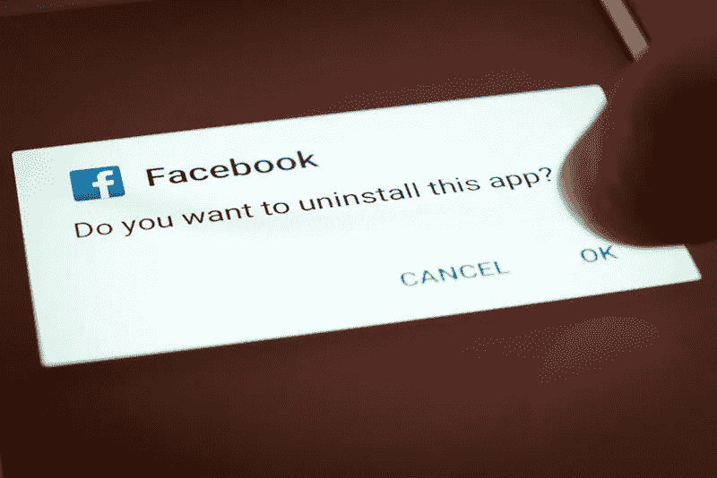

# 删除脸书，替换为区块链。

> 原文：<https://medium.com/hackernoon/delete-facebook-replace-with-blockchain-82d0d7ca9e1b>

[#DeleteFacebook](https://www.theverge.com/2018/3/20/17145200/brian-acton-delete-facebook-whatsapp) campaign post-Cambridge Analytica scandal. (Shutterstock)

随着 [#deletefacebook](https://www.theverge.com/2018/3/20/17145200/brian-acton-delete-facebook-whatsapp) 活动如火如荼地展开，脸书的前景一片大好，人们不禁要问，有没有其他选择？

这一丑闻凸显了我们在互联网上随意泄露了多少个人数据，以及我们对此缺乏足够的控制。

# 问题

对脸书和剑桥分析公司有两项核心指控。

1.  用户同意是出于一个目的，但数据被处理并透露给了那些将数据用于完全不同目的的组织。
2.  用户没有充分意识到他们的同意包括商业使用和披露他们的数据。

脸书和剑桥分析公司坚持他们的立场，即他们自始至终都是合法行事，相关当局尚未对这些指控进行调查，更不用说证实了。

那么，随着每一次点击，每一个广告，每一次联系，被监控和告诉别人一些关于我们的事情，我们如何正确地控制谁可以访问我们的个人数据？

# 解决办法

在 [Lightstreams](http://lightstreams.network/) ，我们开发了一种技术，可以让你随时控制与谁分享你的个人数据。

[Lightstreams Network](http://lightstreams.network/)

使用我们的技术，未来的应用程序将只在您的设备和您同意的设备上存储您的个人数据。为了让你与朋友、家人和同事交流，没有必要让脸书这样的中介持有你的数据。

借助该解决方案，您将能够:

1.  **撤销访问权限** —如果您的数据无意中被第三方共享，访问权限可以随时被撤销，您的数据将从他们的系统中删除。
2.  **跟踪和追踪** —如果数据未经同意被共享或出售给第三方，几乎所有国家都有适当的政策进行起诉(例如英国的数据保护法案)，困难在于证明这是何时发生的以及由谁所为。为了帮助当局，Lightstreams 区块链是一个防篡改的记录，显示你的数据是如何在你的同意下转手的，以及水印来显示在什么时候可能发生了违规。

# 什么是光流？

Lightstreams 是互联网技术层，我们相信未来的[去中心化应用](https://blockgeeks.com/guides/dapps/) (DApps)将建立在这一层之上。DApps 与脸书这样的中央控制实体截然相反，后者会吸取你的数据并存储在他们的中央数据库中。相反，DApps 可以与您的设备进行交互，并直接与您同意的其他设备进行交互。

我们的技术结合了区块链和点对点(P2P)文件共享技术。区块链技术可确保永久记录您何时以及谁同意访问您的数据。P2P 文件共享技术确保没有任何中介需要保存你的数据。

如果你想知道更多，了解我们在 Lightstreams 正在做什么，请访问我们的[网站](http://lightstreams.network/)了解更多信息。

# 行动呼吁

我们的目标是改变今天在互联网上处理数据的方式，我们希望让更多的人参与进来。如果你愿意支持，请…

*   告诉朋友。
*   在[电报](https://t.me/lightstreams)上加入对话。
*   参与我们的代币销售。

最后，请为你对这篇文章的赞赏鼓掌，并让其他人知道有一个替代方案。

谢了。

[光流网](http://lightstreams.network/)
[电报组](https://t.me/lightstreams)