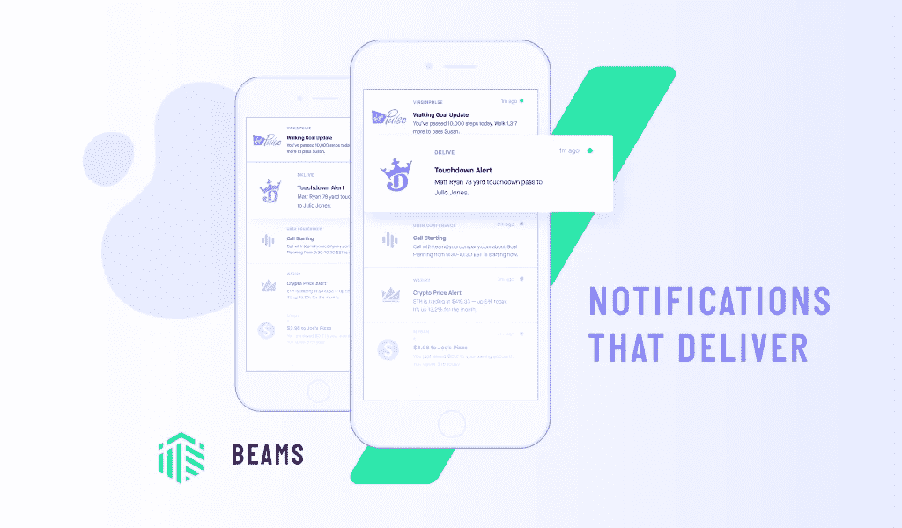

# 使用推送波束发送关键交易推送通知

> 原文：<https://medium.com/hackernoon/deliver-critical-transactional-push-notifications-with-pusher-beams-4895c98f9662>

Pusher Beams

我们很高兴地宣布[推杆光束](https://pusher.com/beams)已经退出测试，并普遍适用于您的生产应用！

Beams 是一个托管的[推送](https://hackernoon.com/tagged/push)通知 [API](https://hackernoon.com/tagged/api) ，专为需要每次都交付关键事务信息的开发人员设计。

我们感到自豪的是，全球有超过 10，000 名开发人员使用它来发送重要的事务通知。

以下是光束包含的内容:

*   统一的 [API](https://docs.pusher.com/push-notifications/reference/publish-api) 可在 iOS、Android 和 MacOS 设备间发送推送通知
*   用于管理 iOS 和 Android 应用的设备令牌生命周期的托管服务
*   [工程师精心制作的 Android](https://docs.pusher.com/push-notifications/reference/android) 和[iOS](https://docs.pusher.com/push-notifications/reference/ios)SDK，包含最新的 FCM 和 APNs 更新
*   [兴趣](https://docs.pusher.com/push-notifications/concepts/interests)使用灵活的发布/订阅模式发送通知
*   [洞察](https://docs.pusher.com/push-notifications/concepts/insights)跟踪确认并直接在客户端打开事件
*   具有实时通知生命周期事件日志的调试控制台

你可以[今天试用](https://dash.pusher.com/authenticate/register?ref=pn-blog) Beams，阅读[文档](https://docs.pusher.com/push-notifications)，或者开始学习 [iOS](https://pusher.com/tutorials/push-notifications-ios) 或 [Android](https://pusher.com/tutorials/push-notifications-android) 教程。

# 发送通知后亮起灯

当我们发布一个测试版，让开发者用单一 API 向他们的 iOS 和 Android 应用发送推送通知时，我们了解到，开发者在向苹果和谷歌的通知网关、APN 和 FCM 发送通知后，缺乏透明度。

通知是应用程序的生命线——当交付正在进行中、新闻报道、喜爱的球员得分或电话会议开始时提醒用户——但开发人员没有办法确认他们发送的通知已被交付或打开。

我们从头开始构建 Beams，以提供实时通知交付和透明度来开发您的 iOS 和 Android 应用程序。

# 跟踪设备上的交付事件

FCM 和 APNs 都不提供交货保证。使用 Beams，您可以在发送通知后了解客户端设备上发生的情况。

当通知被发送到具有 Beams 的设备时，一旦接收到通知，客户端 SDK 将报告回一个**确认事件**。如果用户点击通知打开应用程序，客户端 SDK 将报告一个**打开事件**。

您可以使用 [Insights](https://docs.pusher.com/beams/concepts/insights) 以图表形式查看确认和打开事件，或者在**调试控制台**的实时通知生命周期事件日志中查看。

所有打开的 Beams 通知中有一半是在一分半钟内打开的，这反映了通知提醒用户无论他们在哪里并引导他们当场采取行动的能力。

# 让通知对开发人员更加友好

APNs 和 FCM 可以免费使用，但是我们从很多开发者那里听说围绕这些网关构建托管服务是一件令人头疼的事情。事实上，在开始使用 Beams 之前，我们 80%的用户都是通过免费的苹果和谷歌服务直接集成通知的。

一旦开发者注册了 Beams，75%的人可以在 30 分钟或更短的时间内获得测试通知服务。

Beams 客户端 SDK 在整个设备生命周期中保持这些令牌的最新状态，因此开发人员无需担心管理它们。在 Beams beta 期间，FCM 和 APNs 在幕后刷新了 10%的设备令牌。

该 API 旨在扩展，允许开发人员每分钟向 100 万台 iOS 设备和每 17 秒向 100 万台 Android 设备发送通知。

# 梁的下一步是什么？

我们计划为开发人员提供更大的灵活性，以向用户发送通知，提高服务运行状况的透明度，并提高您所有设备的可送达性。

Beams 有一个活跃的开发人员社区——对该社区的特别支持[React Native SDK](https://github.com/b8ne/react-native-pusher-push-notifications)——我们很高兴听到您对我们下一步应该构建什么的想法！

加入 Slack 上的 [Pusher 社区](https://feedback-beta.pusher.com/)或使用我们在 [docs](https://docs.pusher.com/beams) 或 [dashboard](https://dash.pusher.com/) 上的对讲机聊天。

如果你喜欢你所看到的，并且你感觉很慷慨，用一条 [tweet](https://ctt.ac/j3b65) 帮助传播这个消息，或者在 Github 上启动我们的 Beams [iOS](https://github.com/pusher/push-notifications-swift) 和[Android](https://github.com/pusher/push-notifications-android)SDK。