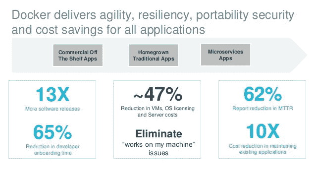

# 集装箱技术的民主化

> 原文：<https://medium.com/hackernoon/democratization-of-container-technologies-95cbbfaee08d>

“我们相信上帝，所有其他人都必须带来数据”~ W.E .戴明

docker 作为一个[工具](https://hackernoon.com/tagged/tool)来打包&运行软件的兴起无异于一个正在成真的都市传奇。在这篇文章中，我将使用数据点来展示该技术成功的绝对重要性&强调跨企业采用容器的趋势。

本文是系列文章的第一部分，在下一篇[文章](/@junaid.wani/challenges-in-container-adoption-72540b0be7ad)中，我将讨论组织在尝试采用容器时面临的挑战。

***Docker*** 是一个开放平台，用于在笔记本电脑、数据中心虚拟机或云上构建、发布和运行分布式应用。它可以将应用程序从基础设施中分离出来，还可以将应用程序打包在一个松散隔离的环境中运行，这个环境称为容器。这些属性使团队能够更快更有效地交付软件。

理解 docker 平台增长的最好方法是看一下 Figure 的 1.0 & 1.1。这些图表通过绘制一段时间内从 docker 官方商店下载的图像的累计总数，直接显示了与 docker 平台交互的用户。

从图 1.0 中可以明显看出，该技术花了大约两年时间(2015 年年中的某个时候)才达到**临界点**，此后采用率以指数方式增长。

**Fig 1.0** (source: blog.docker.com)

在写这篇文章的时候，大约每两周就有 10 亿张图片从 docker 在线商店被下载，到目前为止，大约有 380 亿张图片被下载。在过去的一年里，超过 100 万的新开发者加入了 docker 的行列。

像这样的采用率在软件行业几乎是前所未有的&部分是由于创始人在其生命周期早期开源技术的策略。今天，一个活跃的大型社区正在为这个平台的成功做出贡献

**Fig 1.1** (source: blog.docker.com)

我们将不得不追溯到千年之初，去寻找另一个在它存在的早期就获得如此巨大成功的软件。2000 年初，Salesforce 在特立独行且备受争议的**“软件的终结”**广告宣传活动之后，从一开始就没有回头。

docker 的伟大之处在于，它减轻了 SDLC 所有领域的技术人员的棘手问题。因此，Docker 在最优秀的架构师、开发人员、测试人员以及运营工程师中找到了早期的推动者。

这些早期采用者热衷于分享他们获得的知识，并希望与志同道合的个人合作，以实现技术的成功。组织了黑客马拉松，计划了会面，写了博客，创建了在线研讨会。简而言之，尽一切可能分享知识！更广泛的社区参与进来，使用该技术来解决他们现有的棘手问题，体验其好处，并推动其在组织内的采用。

接下来是各种规模和业务的组织对基于传统**拉动的**技术的采用，如下图 2.0 所示。

**Fig 2.0**

随着容器技术变得非常流行，围绕它的生态系统也开始以惊人的速度增长。"**docker 的力量是如此强大"**以至于当时所有的技术巨头&领头羊都加入了竞争，并开始投资创建自己的平台，以提供基于 docker 的服务、产品或托管平台。

**Fig 2.1** (source: blog.docker.com)

到目前为止，大多数企业已经开始以某种形式在非生产环境中试验这项技术。随着生态系统的成熟，越来越多的生产工作负载被转移到容器中，传统的应用程序被容器化&很大比例的新应用程序被设计成与 docker 兼容。

截至 2018 年，docker 已经证明了其生产能力，根据 Datadog 的一份报告，大约 25%的企业客户在生产中采用了容器&只有 8 %的企业客户放弃了这项技术**(图 3.0)** 。大多数涉足该技术的组织最终也会成为采纳者。采用趋势线一直保持积极，没有显示出下降的迹象，按照这个速度，到 2021 年，所有企业中大约有 45–50%将在生产中使用集装箱。

**Fig 3.0** (source: Datadog)

这里需要特别注意的是，一旦企业决定使用容器，容器中的工作负载就会以极快的速度增长，仅在过去一年中，部署率就增长了 75 %，如图 3.1**所示。同样值得注意的是，部署率逐年增加。这个数据点本身就证明了容器给企业带来的价值。**

**Fig 3.1** (source: Datadog)

虽然容器的用例可能因企业而异，但是如果容器策略考虑周全，所获得的好处往往是一致的。docker 的使用为 MTTR **(~ 60 %)** 、开发人员生产力 **(~65%)** &带来了实质性的改善，虚拟机数量&服务器成本 **(~ 45%)的降低。**这些改进将大大缩短上市时间，改善用户体验&降低成本。

**Fig 3.2** (source: state of App Development survey)

采用容器的另一个重要方面是，大多数企业正在使用托管容器平台跨内部和基于云的设置在生产中部署容器(**图 3.3)。**从下面的数据还可以推断出，大多数企业都选择使用他们已经合作的云供应商的托管容器平台。而 Kubernetes & Docker Swarm 已经成为运行生产工作负载的主要 orchestrator 引擎。

**Fig 3.2**(source RightScale )

随着容器采用的增长和生态系统的不断发展，学习错误并为成功迁移到容器化环境创建蓝图变得越来越重要&这是现有 it 团队应该关注的焦点。

在下一篇文章中，我将讨论组织在采用容器时所面临的挑战。点击此处查看链接[容器采用中的挑战](/@junaid.wani/challenges-in-container-adoption-72540b0be7ad)。