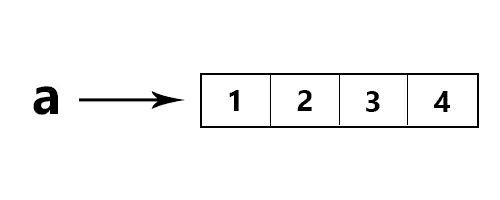

# Demysti-py: "==" vs "is "

> 原文：<https://medium.com/hackernoon/demysti-py-vs-is-dbf51d76df08>


大多数程序员新手在使用这些比较操作符时都认为它们是一回事。你可能会发现在大多数情况下他们会给出相同的答案，但总有一天会不是这样，你会感到抓耳挠腮。今天我想澄清这个误解。

看看这些运营商哪里会给出相同的答案，哪里不会。

```
>>> a = [1, 2, 3, 4]
>>> b = a
>>> a == b
True
>>> a is b
True
```

那么有什么区别呢？让我们看另一个例子:

```
>>> a = [1, 2, 3, 4]
>>> b = [1, 2, 3, 4]
>>> a == b
True
>>> a is b
False
```

那是一些有趣的行为。让我们仔细看看引擎盖下发生了什么。我想指出的是，Python 列表比数组复杂得多，但我不会在这里讨论它们的 CPython 实现。然而，如果你有兴趣了解它们是如何实现的，我强烈推荐你看看劳伦特·卢斯的这篇文章[](https://www.laurentluce.com/posts/python-list-implementation/)*。*

*当你给一个变量赋值一个链表时，就像上面的例子一样，Python 为这个链表分配内存，但是实际的链表并不存储在我们的变量中。相反，Python 创建了一个列表对象，并将对该对象的引用存储在变量中。本质上，我们的变量现在**指向**列表，如下所示:*

**

*‘a’ references (points to) a list*

*在我们的第一个例子中，我们说 **b = a.** 这意味着 **b** 正在引用 **a** ，后者引用了我们的列表对象。它们现在引用同一个对象。*

**

*‘a’ and ‘b’ reference (point to) the same list*

*现在来区分 **'=='** 和**'是'。***

***'== '检查相等**。比方说，我们有一个生产 t 恤的工厂。如果生产两件 t 恤，并把它们放在一起，我们无法区分它们。所以我们会说这两件 t 恤是 **'== '。***

***‘是’身份检查**。通过我们的两件 t 恤，我们知道它们不是一回事。所以我们会说 t 恤 1 是 t 恤 2 是假的。*

*在 python 中，除了使用‘is’操作符检查引用之外，基本上是一样的。*

*在我们的第一个例子中，' **a == b** '返回 **true** ，因为 ever **a** 引用的内容与 **b** 引用的内容完全相同，并且' **a is b** 返回 **true** ，因为 **a** 和 **b** 引用的是同一个列表对象。*

*然而，在我们的第二个例子中，我们说 a = [1，2，3，4]和 b = [1，2，3，4]*

*这将创建一个列表对象，并将对它的引用存储在 a 中，然后创建第二个列表对象，并将对它的引用存储在 b 中。*

***'a == b'** 依然是**真**。然而，**‘a 是 b’**现在是**假**。这是因为 **a** 和 **b** 现在引用**不同的对象**。这可以从下面观察到:*

**

*‘a’ and ‘b’ reference (point to) different list objects.*

# *概括起来*

*   ***如果操作数引用同一个对象，则“is”返回 True。***
*   ***'== '如果操作数引用的对象内容相等，则返回 True。***