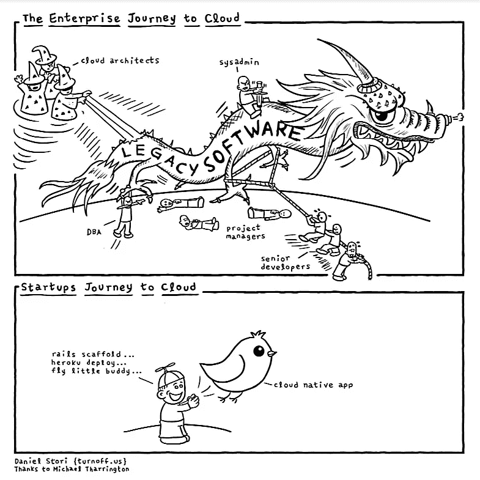

# 揭秘:云计算的 6 个神话

> 原文：<https://medium.com/hackernoon/demystified-6-myths-of-cloud-computing-f5d1731208d4>

云计算已经成为空气的同义词——它无处不在，每个企业都需要免费使用它才能生存。还是真的如此？

虽然[向云](https://itsvit.com/blog/moving-infrastructure-cloud-5-not-obvious-benefits/)的过渡无疑是几乎所有公司的正确决定(并且是宜早不宜迟的一步)，但这一步应该是经过深思熟虑和评估的。谨慎的方法有助于避免不愉快的[向云](https://itsvit.com/blog/avoid-cloud-migration-mistakes/)过渡的错误，并从第一天就开始受益。因此，应该在充分了解云计算的好处的情况下做出这样的决定，而不要听信围绕它的任何神话。在本文中，为了您的利益，我们揭开了云计算的 6 个最流行的神话！

以下是这些神话，排名不分先后:

1.  云有助于节省大量资金
2.  非云解决方案已经过时，毫无用处
3.  所有企业软件、工作流和应用程序都应该尽快迁移到云中
4.  你应该选择一个市场领导者，并留在那里
5.  云不如本地基础架构安全
6.  迁移到云意味着放弃您的本地服务器

下面我们解释为什么所有这些神话并不完全是它们看起来的样子。

# 云并不能节省财富

虽然与维护您自己的基础设施相比，使用 IaaS 云解决方案肯定更便宜，但如果不选择大量付费的 SaaS 解决方案，或者雇佣承包商来为您完成这项工作，最大限度地使用云计算是不可能的。因此，虽然云确实削减了前期支出，但它也增加了一系列其他高要求的支出项目。不过，投资于云计算的投资回报率和价值肯定更高。您只需为花费的资源付费，而不必担心冗余、硬件升级和设备闲置。

# 云不是所有情况下的灵丹妙药

构建和维护自己的解决方案比使用可信云解决方案提供商提供的现成 SaaS 要昂贵得多。例如，通过共享链接在谷歌文档或电子表格上进行协作，比使用自托管替代方案或开发自己的应用程序要好得多。因此，还没有出现像 Adobe Photoshop、Articulate Storyline 或 Adobe Captivate、Camtasia 和其他大量独立工具这样的基于云的解决方案。各种各样的软件过去、现在和将来都将被开发和发布，但它们都无意将其连接到云。这并没有使这些工具变得不好，它们只是应该这样工作。

# 并非所有的基础设施和系统都可以迁移到云中

专有和遗留企业系统也是如此，其中许多系统在完全重建之前永远无法迁移到云中。这也不意味着这些系统应该保持原样。

处理遗留软件龙的最佳方式是理解它们的方式，并构建云原生的类似物；分析现有的数据存储，分几个阶段将它们转移到云中，同时培训人员使用新系统。这样做是为了最终拥有一个完全可操作的遗留系统副本，并在一夜之间完成转换，但这种方法显然既耗时又昂贵。

# 云计算并不局限于特殊的提供商

虽然亚马逊 AWS 和微软 Azure 无疑是云服务提供商中的市场领导者，但它们不是唯一的解决方案，也不是完美的。这就是为什么如此多的企业选择[多云战略](https://itsvit.com/blog/digital-transformation-multi-cloud-strategy/)，来自不同提供商的云服务可以与定制的本地解决方案相结合，形成最能满足您业务需求的独特生态系统。选择正确的[管理解决方案，如 Kubernetes](https://itsvit.com/blog/kubernetes-management-choose-start/) 有助于平稳可靠地完成这样一个项目。

在某些情况下，即使是私有云也可能成为可行的解决方案，因为云计算有多种类型，确保各种规模的企业都能选择最适合自己的类型。

# 云实际上非常安全

早在 2014 年，当世界各地的人们都在网上浏览从他们的 iCloud 账户中窃取的名人裸照时，云服务提供商正在投资数亿美元来加强他们的安全协议。这种做法肯定得到了十倍的回报，当时 [CIA 与 AWS](https://www.theatlantic.com/technology/archive/2014/07/the-details-about-the-cias-deal-with-amazon/374632/) 签署了 6 亿美元的合同，随后[美国国防部在 2017 年 9 月将他们的数据转移到 AWS](https://investorplace.com/2017/09/amazon-amzn-aws-hosts-defense-departments-most-classified-data-ggsyn/#.WfG__HVJbCI) 。

微软 Azure 还托管了各种跨国企业，如 Adobe、GE Healthcare 和 Honeywell，并声称为 90%的财富 500 强公司提供服务。你可以打赌，像这样的巨头会密切关注他们的安全——云计算站起来履行承诺。

# 云可以是任务关键型系统和工作负载的家园

即使在采用了[混合云计算](https://itsvit.com/blog/3-types-cloud-computing-fits-smb-best/)方法并构建了可持续的云计算基础设施之后，许多企业仍然对将关键任务工作负载和系统托付给云服务提供商持谨慎态度。他们遵循在早期试点和测试用例进行期间所采用的“将基本要素隐藏起来”的范例。

然而，最近由甲骨文和麻省理工科技评论对 700 多名高管进行的[调查](https://www.oracle.com/solutions/erp-hcm/mit-technology-review.html)显示，将近一半的企业已经完全部署到云。46%的经理表示，他们影响组织流程的能力有了显著提高。

之前在我[公司的博客](https://itsvit.com/blog/demystified-6-myths-cloud-computing/)上贴过这个提示。