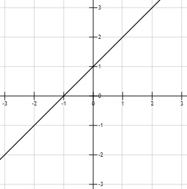
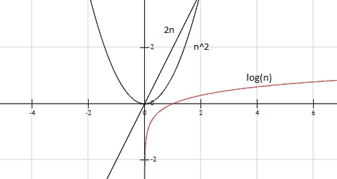

# 揭秘大 O:论计算复杂性

> 原文：<https://medium.com/hackernoon/demystified-big-o-on-computational-complexity-2d25b0ae0dac>

如果你曾经有机会和你的工程师同事讨论软件性能，你可能已经注意到，我们很多人喜欢用这个臭名昭著的“ [Big O](https://hackernoon.com/tagged/big-o) ”来解释为什么某些东西运行得慢(或快)。

你可能听说过“在多项式时间内运行”或“指数”或“[对数](https://hackernoon.com/tagged/logarithmic)”的东西，以及其中一些如何比其他的更好，但你从未听到过它们为什么更好的实际解释。

我个人的经验是，当谈到算法讨论时，人们很少费心去解释与其他算法相比，某个算法在哪些方面表现得更好？如果我告诉你，谈到驾驶速度，宝马比越野车快得多，你可能会立即注意到有一个问题——测量它们性能的条件截然不同。

当我们讨论算法时，可以也应该使用同样的逻辑——在贴上标签之前考虑一下上下文。但是，在我们深入实际的定义和解释之前，让我们快速浏览一下在讨论算法性能时对大 O 的常见误解。

# 常见的误解

*   大 O 测量速度

这是你在与还没有完全掌握概念的人讨论复杂性时最有可能听到的一句话。大多数时候，大 O 不能告诉你任何关于算法实际运行时间的信息。

*   大 O 是关于时间的陈述

虽然部分正确，但根据定义，这不仅仅是时间的问题。大 O 可以用来描述空间复杂度以及时间复杂度，或者任何其他复杂度，如果你愿意的话。

# 大 O 其实是什么？

从软件工程的角度来看，我喜欢使用的一个定义是，大 O 实际上代表了*事情变得非常糟糕的速度*。例如，看看下面的问题:

*   *在我的 web 服务器出现故障之前，我可以承受的流量增加量是多少？*
*   *在我的定制 JSON 反序列化器失败之前，HTTP 请求体可以变得多大？*
*   *为什么我的图像处理器可以很好地处理 2 KB 的图像，但处理 10KB 的图像却需要很长时间？*

如果这些是你发现自己无法回答的问题，你可能有一个需要正确的时间复杂性识别和潜在补救措施的问题。能够认识到复杂性的潜在问题可能会为您节省数小时或数天不必要的性能监控和检查。

现在让我们深入研究，尝试一个不同的定义。

> 给定大小为 n 的输入，Big O 描述了算法需要执行的相关原始操作数的上限。

这在数学上是不正确的，也有些模糊，但仍然是一个很好的起点——让我们深入研究一下，稍后我们将讨论更正式的定义。

## 原始操作

什么是原始操作？

> **原始操作**是由算法执行的基本计算。例如，计算表达式、给变量赋值、索引数组、调用方法、从方法返回等等。它们在伪代码中很容易识别，并且在很大程度上独立于编程语言。

让我们看一个例子:

```
public void SimpleFunction(List<int> n)
{
  int a = 1;
  int b = 2;
  int sum = a + b;
  Console.WriteLine(sum);
}
```

我们这里有多少原始操作？让我们来分解一下:

```
public void SimpleFunction(List<int> n)
{
  int a; // declaration
  a = 1; // assignment
  int b; // declaration
  b = 2; // assignment
  int sum; // declaration
  sum = a + b; // two primitive operations, addition and assignment
  Console.WriteLine(sum); // method call
}
```

所以，我们有三个声明，三个赋值，加法和一个方法调用。如果我们同意这是我们的基本操作，我们应该能够计算出:给定 n 的输入大小，该函数将执行的操作数是 8，或者更正式地说，f(n) = 8。

我们可以清楚地看到，输入的大小在这里一点也不重要，这个函数将总是执行相同的、恒定数量的操作。

让我们尝试一个不同的方法:

```
public void SumFunction(List<int> n)
{
  int sum = 0;
  for (int i = 0; i < n.Count; i++)
  {
    sum = sum + i;
  }
  Console.WriteLine(sum);
}
```

这个看起来更难打破，但是让我们试一试。让我们更容易的一件事是将这个 for 循环转换成一个相同的 while 循环。

```
public void SumFunction(List<int> n)
{
  int sum; 
  sum = 0; 
  int i; 
  i = 0;

  while (i < n.Count) // n comparisons
  { 
    sum = sum + i; // n additions and assignments
    i = i + 1; // n additions and assignments
  } sum = sum + 5; // one addition and one assignment
  Console.WriteLine(sum);
}
```

很明显，我们最初有两个声明和两个赋值，但是还有其他的。这个循环将对`i`和`n`精确地评估 *n 次*，并执行同样多的加法和赋值。此外，我们将在最后增加一个新的内容。这就是我们现在的情况:2 次声明，2 次赋值，n 次比较，n 次加法，n 次赋值，1 次加法，1 次赋值和 1 次方法调用。

如果你还记得上一个定义，如果我们想测量某个东西，我们需要决定哪一个基本操作与我们相关。一旦我们这样做了，我们将忽略所有其他的，我们将认为它们的执行不占用任何资源——时间或空间，我们将只关注相关的、原始的操作。

请注意，声明什么是原语操作很大程度上取决于许多因素，如编译器实现或处理器架构。然而，出于实用的目的，您可以基于您想要用作视点的抽象级别将任何东西声明为原始操作。

对我们来说，合理的做法是选择加法作为我们的原始操作，并查看这个函数根据它的输入执行了多少次加法——这将是 n 次加法，最后还有一次。我们将把它记为:

*f(n) = n + 1*

这意味着，给定大小为 n 的输入，我们将需要执行 n + 1 次加法。100 个数字的列表会给我们 101 个加法，1000 个数字的列表会给我们 1001 个加法。现在，根据我们之前对大 O 的定义，我们可以推断，上面的 SumFunction 大约执行 n 次相关的原始操作，或者它在 ***O(n)*** 时间内执行。你可能知道，f(n) = n + 1 称为线性函数(函数值随输入值线性增长)— O(n)作为近似值因此称为 ***线性时间*** 。



Linear function f(n) = n + 1

但是我们之前的函数 *f(n) = 8* 呢？首先，我们需要为它定义一个相关的原始操作——选择加法将得到 *f(n) = 1* 。在时间复杂性理论中，这被称为 ***恒定时间*** ，记为 ***O(1)*** 。

让我们考虑以下情况:

```
public void DoSomething(List<int> n)
{
  SimpleFunction(n);
  SumFunction(n);
}
```

我们有一个 O(1)和 O(n)依次运行的函数。这将给我们一个 O(n) + O(1)的运行时间。添加大 O 近似值遵循最高阶函数优先的规则，其他所有的都被忽略。那将意味着 *O(n+1) = O(n)* 和 *O(n) + O(1) = O(n)。同样，我们可以忽略任何常数——f(n)= 3n+5 属于 O(n)阶。这对我们来说非常重要，因为我们需要找出薄弱点——一个增长最快的功能，一个会让我们的系统崩溃的功能。*

在我们讨论上界和其他函数阶之前，让我们回到原始运算。正如我提到的，你可以选择你的相关的，原始的操作，我会给你一个例子来说明这在实践中意味着什么。让我们来看看这段代码:

```
public void Email(List<Employee> employees)
{
  for (int i = 0; i < employees.Count; i++)
  {
    _emailService.SendHolidayNotificationEmail(employees[i].Email);
    _logger.Log("Email sent");
  }
}
```

我们知道发送一封电子邮件要比登录花费更多的时间，我们选择它作为这个功能的基本操作是合理的。该函数本身可能会产生 O(n)个不同的原始操作(例如，基于电子邮件长度的验证)，但我们可以将其抽象掉，因为这不是我们方法的 input 的 ***函数。改变雇员列表的大小不会改变*SendHolidayNotificationEmail*方法的运行时间。***

我们可以放心地忽略日志记录，将其视为微不足道的操作(正如我们在实践中大多数时候所做的那样)。对于什么应该是原始操作，没有硬性的规则，但是您应该始终记住，在您尝试测量性能之前，您需要为您的函数定义一个原始操作，否则这只是胡乱猜测。

## 但是上限呢？

考虑下面这段代码:

```
public void FindItem(List<Employee> employees)
{
  string name = "";
  for (int i = 0; i < n.Count; i++)
  {
    if (employees[i].Name == "Mark")
      break;
  }
  Console.WriteLine(name);
}
```

这个函数的运行时间是多少？…

嗯，这取决于列表中是否有那个名字的员工及其职位。将数组访问声明为原始操作，给定大小为 n 的列表，我们可以执行 1 到 n 个数组访问。没有具体的统计分布，我们可以安全地假设，平均来说，Mark 会在中间的某个地方被找到，我们需要执行大约 *n/2* 次数组访问来找到他。

但是大 O 不是关于一般情况，而是关于**最坏情况**，最坏情况将是 *n* 数组访问。更具体地说，说某事在 O(n)时间内执行意味着某个算法将需要执行小于或等于 n 次运算的 ***。***

## 函数的阶

有不同类型的运行时间。看一下这个例子:

```
public void Multiplies(int n)
{
  for (int i = 0; i < n; i++)
  {
    for (int j = 0; j < n; j++)
    { 
      Console.WriteLine(i * j);
    }
  }
}
```

随着原始操作是控制台写，我们可以看到我们需要执行 n * n 次操作或 n .这是**二次时间**或 **O(n )** 。

但是这个呢？

```
public void MultipliesWithCatch(int n)
{
  for (int i = 0; i < n; i++)
  {
    for (int j = 0; j < 5; j++) // <-- only to 5
    { 
      Console.WriteLine(i * j);
    }
  }
}
```

这是 O(n)吗？

不，不是的。给定输入 n 的大小，执行的最大操作数将是 5 * n，这使它处于 O(n)阶。这是一个非常重要的注意事项— **大 O 描述了相对于输入大小的函数增长**。改变输入的大小不会影响内循环中的操作数，因为它总是 5。现在我们有进展了！

现在，还有其他类型的函数，所以肯定有其他类型的大 O 符号，对吗？三次函数会给我们三次运行时间，指数函数会给我们指数运行时间等等。



Different types of functions

但是还有更复杂的函数——它们呢？正如我们已经看到的，最高阶函数优先，其他函数被忽略。因此，让我们假设我们已经测量了某个函数执行的原始操作的确切数量，并且我们得到了以下结果:

f(n) = n⁵ + 6n + 5

根据提到的规则，这属于 O(n⁵).有无限的变化，但运行时间总是由函数增长最快的部分来声明。这些称为多项式运行时间，其中 O(n)和 O(n)是的子集。还有其他类型的运行时间，如指数、对数或阶乘以及某些著名的算法。

我们将在下一部分讨论通过大 O 符号描述的其他常见运行时间。