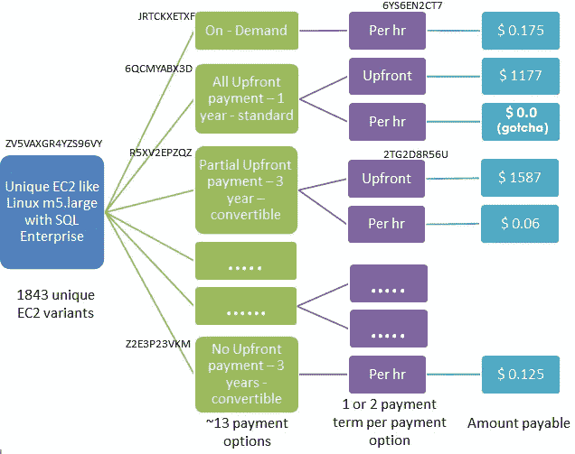

# 揭开 AWS 定价 API 及其神秘代码的神秘面纱

> 原文：<https://medium.com/hackernoon/demystifying-aws-pricing-apis-its-cryptic-codes-1acda3496cd>


Be like Bob

Bob 是一名高级 IT 人员，负责一家中型制造公司，该公司在 10 个国家开展业务，在 2 个国家设有工厂。

两年前，该公司决定将其 80%的 IT 基础设施迁移到 AWS。由于鲍勃领导这项活动，他是财务部核实账单的关键人物。

几个月来，Bob 通过自己的眼睛和头脑，浏览 AWS 网站和清理定价数据，管理账单和预算计划的验证。

但是，鲍勃是一个公认的聪明人。所以，他决定让它自动化。

怎么会？让我们听听鲍勃的意见。

**我:**嘿鲍勃，*你好吗*？

鲍勃:(微笑，因为他听起来像我)酷人，谢谢。

我: Bob，你使用了 AWS 定价 API。是什么迫使你这样做的？

**Bob:** 浏览 AWS 网站所需的时间，了解价格详情。

我们使用数百个不同口味、不同大小、不同存储类型、数据库等的 ec2。而这只是 AWS 庞大产品中的一小部分。

手动查看价格，在特定日期记录价格，不断寻找变化太多了。所以，决定做点什么。

通过集成 AWS APIs，现在我们有了一个根据我们的需求定制的仪表板，并且总是最新的。我们还为我们的用户创建了自己定制的计算器。它整合了 AWS 价格和当地供应商的价格。

这有助于简化我们的消费，价格现在更容易预测。

**我:**这对于像你这样的人来说是有意义的，因为你每天都要处理这么多 AWS 组件，并对费用负责。

是的，那是真的。

**我:**我浏览了 AWS 定价的 [API](https://hackernoon.com/tagged/api) 文档。我来总结一下我所理解的，问一下你我的疑惑。

鲍勃:当然

**我:**一、基础知识:

1.  API 访问是通过 https 进行的。
2.  AWS 以 json 或 csv 的形式提供定价信息。
3.  这些 API 无需 AWS 帐户即可公开访问。
4.  访问 json/csv 的基址是[https://pricing.us-east-1.amazonaws.com/](https://pricing.us-east-1.amazonaws.com/)
5.  上述 url 中的 us-east-1 是所有信息都可用的地方，并且不仅限于此区域。

为了访问数据，我遵循了以下步骤

**步骤 1** :通过下载从 AWS 获取产品列表

[https://pricing . us-east-1 . Amazon AWS . com/offers/v 1.0/AWS/index . JSON](https://pricing.us-east-1.amazonaws.com/offers/v1.0/aws/index.json)。

它有所有 AWS 产品的详细信息以及从哪里获得其价格的信息。

例如。

```
“AmazonEC2”: { “offerCode” : “AmazonEC2”, “versionIndexUrl” : “/offers/v1.0/aws/AmazonEC2/index.json”, “currentVersionUrl”: “/offers/v1.0/aws/AmazonEC2/current/index.json”, “currentRegionIndexUrl”: “/offers/v1.0/aws/AmazonEC2/current/region_index.json” },(Note: A product, like AmazonEC2, is referred as ‘Offer’)
```

**第二步**:从上面的设置中，访问‘currentRegionIndexUrl’网址

[https://pricing . us-east-1 . Amazon AWS . com/offers/v 1.0/AWS/amazone C2/current/region _ index . JSON](https://pricing.us-east-1.amazonaws.com/offers/v1.0/aws/AmazonEC2/current/region_index.json)

它给出了每个地区的详细价格。

例如。

```
"ap-south-1" :
{

"regionCode" : "ap-south-1",

"currentVersionUrl":"/offers/v1.0/aws/AmazonEC2/20180628005902/ap-south-1/index.json"

},
```

现在，事情变得越来越模糊。这是一片混乱的数据海洋。

涉及到一些**神秘的代码**，我找不到任何解释这些代码的 AWS 文档。此外，一些部分显示价格为 **0.0 美元**。这怎么可能呢？

鲍勃:到目前为止的总结是正确的。您已经到达了数据的来源，但是您正在努力从中提取信息。要做到这一点，你必须了解产品，并找到模式。

例如，您正在访问 EC2 定价。现在，EC2 定价有多种变化，如按需、专用主机、保留主机。此外，还有各种方式，如全额/无/部分预付等。

这种变异是通过那些看起来像外星人的代码捕捉到的。

让我们举个例子:

**我们想查看预装 SQL Enterprise 的 Linux m5.large 的价格。**

通过解析，得到这个变体的代码— ZV5VAXGR4YZS96VY

用这个代码搜索，你会得到文件中的多个块。

每个区块代表同一产品的一个独特变体——上面提到了不同的因素，如支付条款、专用主机等

每个块将有一个唯一的标识符，“Offertermcode”。例如，“JRTCKXETXF”代表按需定价，按小时付费。

另一个例子，“HU7G6KETJZ”代表保留定价，包含部分前期费用。因此，账单将包括一些预付金额和一些每月。“2TG2D8R56U”用于预付费用，而“6YS6CT7”用于每小时费用。

就是这样。

总而言之，深度有三个层次。



1.  EC2 的唯一代码—比如 ZV5VAXGR4YZS96VY
2.  上述变体的唯一报价术语代码—
    按需、全额预付、无预付等—13 个唯一报价术语代码
3.  预付和/或按小时支付条款

我:谢谢鲍勃。现在清楚了，去神秘化了。

我真的想和你一样。

AWS 价格 API 文档可在此处访问[。](https://docs.aws.amazon.com/awsaccountbilling/latest/aboutv2/price-changes.html)

本帖原帖[此处](https://blog.calsoftinc.com/2018/08/demystifying-aws-pricing-apis-cryptic-codes.html)。

请在评论区提供您的反馈。它会帮助我提高。你也可以发电子邮件到 dhruvdesaai@gmail.com 给我。