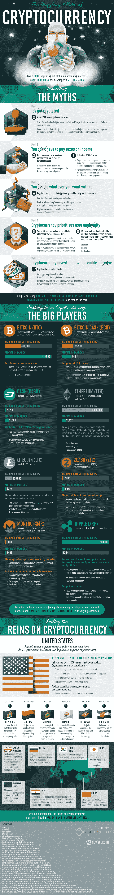

# 揭开你需要知道的关于加密货币的一切

> 原文：<https://medium.com/hackernoon/demystifying-everything-you-need-to-know-about-cryptocurrency-6237cf2056b5>

关于加密货币有很多神话，相信这些神话可能会让你陷入很多麻烦，无论是财务上还是法律上。当加密货币首次为公众所知时，是因为它涉及人口贩运和毒品交易。由于这种联系，人们开始相信，你可以使用加密货币进行交易，而不会受到政府的干涉。不幸的是，这一点都不准确。虽然联邦政府不承认加密货币是货币，但它承认它是财产，当你获得资本收益时，这些财产是要纳税的。

与普遍的看法相反，加密货币是受监管的，你不能用它做任何你想做的事情，它不是完全匿名的，是的，现在可能正在形成泡沫。加密货币正在发展和变化，尽管监管机构并不总是知道具体如何应对它，但监管机构正在迎头赶上。

加密货币的种类比你想象的要多——不仅仅是比特币。以太、瑞波、莫内罗、莱特币和更多的东西每天都在获得更多的关注。就连 Dogecoin 也在卷土重来。在你投资这些之前，从这张信息图中了解更多关于[加密货币神话](http://coincentral.com/dispelling-myths-cryptocurrency-world/)的信息。

