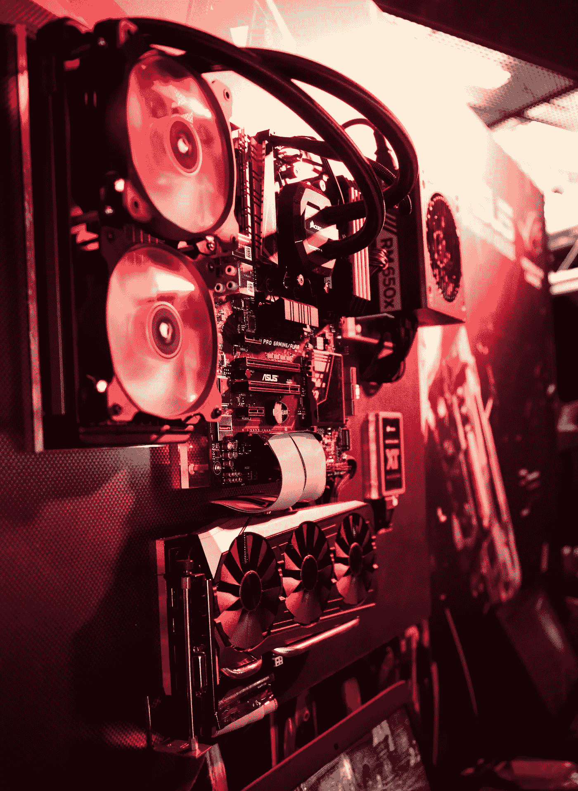
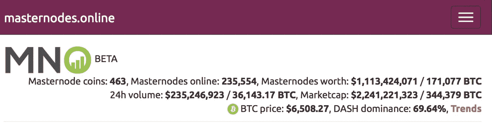
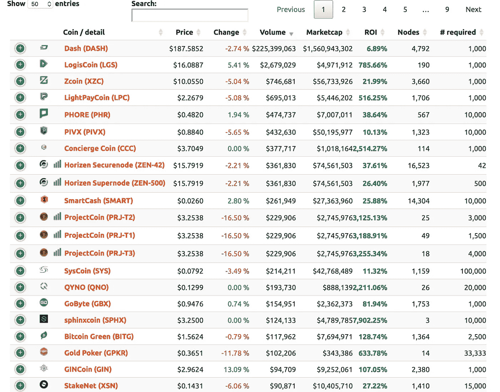

# 揭开主节点的神秘面纱&恶性膨胀

> 原文：<https://medium.com/hackernoon/demystifying-master-nodes-hyperinflaton-418b6f5a4bdc>

Don’t let Masternodes faze you (Image Credit: Unsplash)

主节点是狂热、神话和希望的同等部分。当你听到一个人谈论主节点时，从来没有中间地带。他们似乎把意见分为赞成和反对。

在这里，我们试图解开围绕这个有趣话题的神话&希望对于我们这些从未下过兔子洞的人来说，这可以作为一张随时可用的可信地图。

## 主节点在区块链生态系统中的位置？

[区块链](https://hackernoon.com/tagged/blockchain)系统由几台计算机组成，称为节点，遍布世界各地，共享它们都同意的公共数据分类账。

进入分类账的数据是以块的形式组织的&计算机如何同意添加块的方法被称为共识机制。

共识方法多种多样。节点投入的工作有助于保持区块链的安全&处理交易。节点在这样做时会产生成本。毕竟，节点是全速运行的计算机，为区块链提供最大的网络容量。电脑需要电力和维护。两者都可能很贵。如果节点 24x7 全天候运行，则需要非常频繁地更换计算机活动部件。必须安装最新的安全套件来保护计算机本身免受试图控制节点的恶意行为者的攻击。这可能看起来有点敌意和苛刻。但是节点承担所有这些风险的原因当然是受到社区的激励/奖励，社区从体验平滑、快速和完整的区块链中受益。根据节点用来与其余区块链节点保持同步的共识机制，这些奖励被称为各种名称。让我们称之为节点奖励，直到我们很快看到几个共识机制。

## 共识机制

在众多可能的共识机制中，有两种被广泛引用/采用——工作证明和利益证明。

命名法泄露了不同之处。

***工作证明(战俘):***

节点被迫解决一个加密的数学问题。由于通过暴力破解锁(尝试所有可能的组合)相对困难，所以节点之间的时间竞赛是为了解决这个难题并获得奖励。

解决这个难题的过程叫做挖掘。

每当一个新的区块被开采，首先解决它的矿工得到奖励(区块奖励，交易费)。这激励了矿工继续采矿。同时，数学问题的复杂性与有限的计算能力防止了作弊/渎职。

要获得对整个网络的控制，需要控制大多数节点，即大约 51%的网络。

攻击网络需要大量的协调、能量和硬件(在此期间会失去采矿奖励)。如此大规模的资源对马歇尔来说非常具有挑战性，尽管并非不可能。

因此，使用工作证明的区块链受到复杂性、规模和分布的保护。挖掘的节点通过挖掘奖励(块奖励和交易费)对其贡献进行奖励

使用 POW Consensus 机制的区块链的一个例子是[比特币](https://hackernoon.com/tagged/bitcoin)。

***股权证明(POS):***

利害关系的证明用利害关系取代了大量能源消耗和计算能力的必要性。

《韦氏词典词典》对利益的定义是:

答:为了得到或失去而与[赌上](https://www.merriam-webster.com/dictionary/staked)的东西

b:竞赛中的奖品

:在一项事业或企业中的利益或股份

股份是指个人愿意在一定时间内持有的货币数量(该货币原产于区块链)。这种参与的动机是，能够决定下一个开采区块的机会与赌注成正比。赌注越高，决定下一个区块的机会就越大，因此奖励的可能性也就越大

下注的硬币越大，中奖的可能性就越大。

想象一个银行储蓄账户的类比。存入的现金越多，产生的利息就越大。或者股权分红。

POW & POS 下的节点奖励现在可以称为采矿奖励或赌注奖励。

***两种动力& POS 机构*** 都存在缺点

电力最常被引用的缺点是它是资源密集型的&对环境不友好的(电力消耗)

POS 最常见的缺点是，它颠覆了区块链社区的精神，将其变成了富人的游戏，紧接着相关的富人试图通过买断 51%的节点来劫持网络。

与富人的论点相反的是，随着资金池系统的出现，个人可以与其他人共同参与购买一个节点

## 主节点

那么什么是主节点呢？

主节点是具有额外的网络功能职责的节点，其代价是需要大量的硬币，但是具有被给予比通常的赌注/挖掘路由更好的红利/奖励的动机。

与普遍的看法相反，主节点不仅仅是 POS 系统的专利。主节点同样可以在 POW 系统中工作，有许多 POW 币实现了主节点层级。

在功能上，运行主节点类似于打桩。

拥有主节点允许产生被动收入，因为钱包中有硬币会产生奖励。这是一个充满机遇但也充满陷阱的领域。尽管一个业余投资者可能会从硬币推销商那里听到，这就像打开一个主节点一样简单&看着钱包装满，但经验丰富的专家认为事实并非如此。

尽管 MasterNodes 的广阔前景可能会引起混淆，但它们的总体特征是:

1.  锁定最小数量的硬币
2.  在区块链/生态系统中执行某些任务
3.  接受奖励

引用:匿名

(正确操作时)下注是一种神奇的用户体验。

*1。参与共识
2。保护网络安全
3。赚钱👏💸👏💸👏💸*

主节点产生多少回报？

看看 masternodes.online 网站就会发现以下内容

(Website : [www.masternodes.online](http://www.masternodes.online))

网站上列出了 463 个主节点硬币，有 235，554 个主节点参与，下注超过 10 亿美元。

市值为 22.5 亿美元&破折号币占据主导地位，就像比特币主宰加密货币一样

页面下方有硬币的详细列表。

每枚 masternode 硬币都有详细的价格、数量、市值、投资回报、节点数量和需要下注的硬币数量

(Website : [www.masternodes.online](http://www.masternodes.online))

通常一个有主节点系统的币推出，初期的币主很可能是主节点赌注者。这直接导致了硬币膨胀的问题。

简单来说，ROI 的计算方法是(每个节点的 MN 奖励/主节点抵押品)*100

使用这个公式的简单逻辑，很容易得出这样的结论:随着越来越多的主节点加入网络，ROI 将会下降

投资回报率从几个百分点到几万个百分点不等。在所有条件相同的情况下，ROI 是对您未来 1 年(365 天)投资回报的一个快速衡量。

当一个团队创建一个主节点硬币时，他们通常会做一个预售/ICO 来筹集资金。该团队随后申请将这枚硬币上市。

最初节点数量有限，但回报会很高&投资回报率会飙升。这使得渴望回报的交易者/投资者注意到了这枚硬币。他们迅速介入，目的是获得尽可能多的回报。随着回报滚滚而来&初始费用被支付，主节点持有者出售他们的一些硬币来购买更多的节点。

随着越来越多的投资者加入这个网络，这个团队认为这是一个成功。

价格涨幅逐渐减小。早期投资者将寻求出售他们新铸造的硬币，以避免损失。这些卖单引发了价格下跌的恶性循环。这导致投资者增加抛售，以确保他们避免损失。这种抛售压力导致了另一轮下跌。团队想知道哪里出了问题。他们意识到这是恶性通货膨胀！奖励结构/激励措施被匆忙改变，以使系统更具可持续性。但伤害早已造成。供应过剩引发了连锁反应，硬币传递给了卖方。需求转向市场上更好的替代品。

## 恶性通货膨胀

通货膨胀仅仅是硬币的供给。如前所述，在供应不变的情况下，高投资回报率导致新投资者涌入，从而导致新硬币的实施。随着硬币创造(供应)的周期呈指数增长，系统中的通货膨胀也成比例增长。

让我们举个例子来理解恶性通货膨胀。

在主节点硬币的市值为 500 万英镑的情况下。假设每年奖励 120%,大约 80%的硬币锁定在主节点。

这导致了 96%的有效年通胀率。一年分为 12 个月，得出每月 8%的通货膨胀率。

500 万的 8%就是 40 万。这意味着每月需要 400，000 美元的新流入，以保持系统内的价格“稳定”。如果更少的钱进入系统，硬币价格开始下跌。

随着更多主节点的推出，一个项目每月继续吸引 40 万美元是不现实的。贬值迟早会开始全面生效

## 那么，如何选择投资哪种硬币呢？

这是一个令人望而生畏的景象，有超过 400 枚 masternode 硬币，承诺 10000%的投资回报率&同时完全控制钱包。许多新手屈服于丰厚回报的诱惑，结果却被烧伤了。

极高的投资回报率并不意味着良好的年回报率。高投资回报率肯定会导致超高通胀，侵蚀任何有意义的收益。很有可能价格会下跌&很快硬币就会变成一座鬼城。

降低风险的可靠方法是寻找一些真实世界的控制措施，例如:

1.  团队:硬币背后是谁？团队经验丰富吗？他们有偿付能力吗？创始人是谁？他们以前有过管理这种业务的经验吗？如果是，他们之前的项目怎么样了？团队是否活跃并公开交流？尝试并确定这不是泵送和倾倒操作。参与 Reddit & telegram 社区对话，了解最新信息。
2.  确保主节点支持硬币。然而，如果硬币宣布他们将在开始交易后支持主节点，硬币的价格将飙升至极高，因为投资者将争相建立主节点。这反过来导致投资回报率下降
3.  研究硬币是如何促进主节点的:与只开采或只运行主节点相比，主节点在联合开采时可能会提供更好的产量
4.  ROI:它不是成功投资的唯一决定因素&很难精确计算。收益率和价格总是在不断变化。
5.  流动性:找出哪些交易所，硬币将要上市/正在交易。Masternode 硬币通常寻求非溢价交易。主节点社区中流行的是 Graviex、Cryptopia 和 CryptoBridge。这些交易所的流动性并不令人鼓舞。
6.  钱包:确保所提供的钱包是安全的，并且有一个实用的用户界面。有了主节点币，钱包界面还有很多需要改进的地方。但是决不能在安全方面妥协。不太知名的硬币钱包有时会带有病毒。如果您必须下载这样的钱包，请务必清除文件中的病毒/恶意软件。如果可能，在沙盒/虚拟机中运行它们。
7.  主节点投资的关键是在硬币没变大之前找到它。Dash Master Node 在 2015 年首次推出时，成本约为 3000 美元，如今的价值超过 20 万美元(2018 年 9 月的基价为 200 美元)。

## 特别提到 DASH

作为市值排名前十的加密货币之一(截至 2018 年 9 月中旬，aprx 为 16.2 亿美元——来源 CoinmarketCap.com)，DASH 值得在本文中特别提及。这是唯一一个持续拥有前 10 名硬币(按市值计算)的 MasterNode 系统。

DASH 网络上的主节点执行诸如“私人发送”和“即时发送”的任务。今天运行的绝大多数主节点硬币都在某个时候脱离了 DASH。

因此，如果一枚新硬币试图将“私人发送”和“即时发送”作为一项功能进行营销，请不要相信它，因为它已经内置于 DASH 网络中&而不是由新网络开发的新功能

***好的做法***

1.  总是问自己，即使没有主节点，你是否会投资硬币。你看到硬币存在背后的根本原因了吗？它是否解决了生态系统中的一些关键问题？币的用例基础有没有瑕疵？
2.  赌注&主节点币通常涉及热门钱包。如果你是一个新手，请在投入任何资金之前，尽可能多地阅读有关钱包安全的内容。问，问，问。
3.  寻求长期可持续价值与回报之间的平衡。

***失误避免***

1.  以高价购买。这是最容易导致亏损的方式之一。这可能意味着这匹马已经脱缰&市场正在争相购买 masternodes。如果一个主节点的现行价格非常高，把它当作一个需要进一步调查的信号。除非你做了进一步的研究，否则不要购买/投资。
2.  忽略通货膨胀:这个问题在这里已经讨论过很多次了，但是在投资于投资回报率为 5 位数的硬币后，你的投资唯一的方向是下跌
3.  FOMO:看到那个关于 14 天收回投资的广告了吗？阅读#1 (以虚高的价格购买)

***进一步研究/资讯:***

[www。Masternodes . online](http://www.masternodes.online)Master Node 币的一般趋势，奖励&统计
Bitcointalk——大量研究 Master nodes 的论坛
电报——Master Node 群组中的大量对话

如果你觉得这是有帮助的，请为我们鼓掌，分享给你的朋友，并随时在 genbvc.com 给我们发短信。点击这里> 查看我们的电报频道[，点击这里>](https://t.me/genesisblockholdings) 关注我们的博客

**免责声明:本文中的任何内容都不构成也无意构成财务建议。这不是一份投资文件。请做任何投资之前，你自己的研究(DYOR)。与本文中提到的任何项目都没有关联**

作者:[Suraz Kottakki](https://www.linkedin.com/in/suraz)&[Joel Palathinkal 博士](http://www.genbvc.com)

*最后说一句关于* [*创世纪区块控股*](http://www.genbvc.com) *:*

[***创世纪区块控股***](http://www.genbvc.com) *是一家* ***【区块链】*** *风险投资公司，****crypto****quant 对冲基金，以及* ***矿业*** *公司专注于投资区块链生态系统内的项目。我们专注于将资本、网络和专业知识的力量带给前沿技术团队，以解决世界上最大的问题*