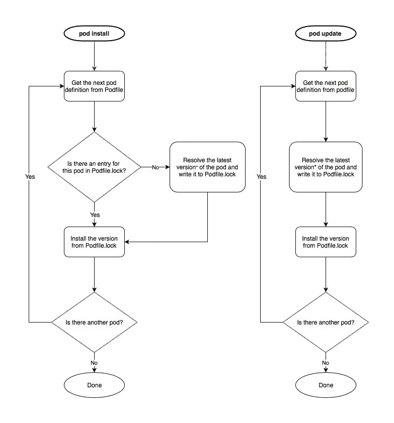

# 揭开 Pod 安装和 Pod 更新的神秘面纱

> 原文：<https://medium.com/hackernoon/demystifying-pod-install-and-pod-update-1751dc35de43>

## 安装和更新 pod 的权威指南

`pod install`和`pod update`之间的区别是微妙的，你应该使用哪一个并不总是很清楚。但是，很好地理解这些命令的作用可以让您更好地控制如何在项目中管理依赖关系，所以了解它们的区别是值得的。

在本文的第一部分，我会给你一个食谱列表，告诉你在一些常见的情况下是应该运行`pod install`还是`pod update`。然后在第二部分，我将解释为什么不同的命令做不同的事情，以及 [CocoaPods](https://hackernoon.com/tagged/cocoapods) 如何使用`Podfile.lock`文件来实现这一切。

# 第 1 部分:食谱

为了让这些方法起作用，确保`Podfile`和`Podfile.lock`致力于源代码控制。

## 您第一次在项目中设置 CocoaPods，并且已经创建了您的 Podfile

`pod install`

这将安装您在新的[pod 文件](https://hackernoon.com/tagged/podfile)中指定的每个 pod 的最新版本*。如果还没有文件的话，它还会创建一个`*MyProject*.xcworkspace`文件。

## 您在您的 pod 文件中添加了一个新的 pod

`pod install`

这将安装添加到您的 pod 文件中的任何新 pod 的最新版本*，而保持您的其他 pod 不变。

如果你运行`pod update`，它会安装新的 pods *和*更新你现有的 pods 到最新版本*。

## 您希望获得 pod 文件中所有 pod 的最新版本

`pod update`

这将检查您的所有 pod，并确保每个 pod 的最新版本*都安装在您的项目中。

## 您只想获得 pod 文件中一个 pod 的最新版本

`pod update *SomePod*`

这将确保安装您指定的 pod 的最新版本*，同时保持您的其他 pod 不变。

## 您正在使用一个开发窗格，并希望获得您的最新更改

`pod update *MyDevelopmentPod*`

这将确保安装最新版本的 pod，同时保持其他 pod 不变。

## 您已经下载了使用 CocoaPods 的现有项目的源代码

`pod install`

这将把 Podfile 中的所有 pods 安装到先前安装在这个源代码片段中的*精确版本*中。

如果您运行`pod update`，它将在 pod 文件中安装每个 pod 的最新版本*。如果最新版本与项目中的其他代码不兼容，这可能会阻止项目的构建。我建议运行`pod install`来构建代码，然后以可控的方式更新 pods。

## 您正在编写一个脚本来在构建服务器上构建一个项目

`pod install`

这将把 pod 文件中的所有 pod 安装在正在构建的版本中安装的确切版本上。这对于稳定的构建非常重要，因为这些是开发代码的版本，这意味着代码片段的每个构建都将使用相同的 pod 版本。如果您使用`pod update`来代替，您的构建可能会在每次构建时使用不同版本的 pods。

## Xcode 报告了与 pod 相关的奇怪构建错误

在更新窗格之后，或者在包含不同版本的相同窗格的项目分支之间切换之后，这种情况偶尔会发生。

删除`/Pods`目录，然后运行`pod install`

这将把 Podfile 中的所有 pods 重新安装到之前安装的版本上，通常足以解决 Xcode 发现的任何问题。

有时人们建议删除`/Pods`目录*和*文件`Podfile.lock`，然后运行`pod install`。这将解决 Xcode 的任何问题，但也会将 Podfile 中的每个 pod 升级到其最新版本*。

# 第 2 部分:它如何工作

`pod install`和`pod update`的区别在于它们如何与`Podfile.lock`文件交互。该文件用于存储项目中当前安装的每个 pod 的确切版本。

理解其工作原理最简单的方法就是看下图(免责声明:*这是一个简单的原理图而不是准确的技术图*)。

Pod install vs. pod update

## pod 更新

`pod update`在检查版本时忽略`Podfile.lock`。它会查找 pod 的最新可用版本*，如果尚未安装，则会进行安装。

## pod 安装

`pod install`在检查版本时首先在`Podfile.lock`中查找。如果某个版本的 pod 在`Podfile.lock`中列出，它将安装*那个确切的版本。*如果该 pod 未在`Podfile.lock`中列出(或`Podfile.lock`尚不存在)，它将按照`pod update`的方式运行，即找到最新可用版本*并安装。

在这两种情况下，CocoaPods 都会用安装的任何新版本号更新`Podfile.lock`。

这允许你在一个项目的不同安装中一致地使用 pod 版本(例如，当从一个存储库安装时，在多个团队成员中，或者在一个构建服务器上)，这也是为什么`Podfile.lock`应该被提交到源代码控制中。

# 摘要

在这篇文章中，我给出了在一些常见情况下是运行`pod install`还是`pod update`的方法。然后，我描述了这两个命令如何以及为什么以不同的方式工作。如果你觉得它有用，请鼓掌和/或分享，并关注我的其他有用的文章。

[*]我所说的*最新版本*是指满足您的 Podfile 中的需求和依赖关系的*最新版本。更多信息，请参见[pod 文件](https://guides.cocoapods.org/using/the-podfile.html)官方指南中的**指定 pod 版本**部分。*

Gabrielle 是一名 iOS 专家，领导技术团队开发移动应用。关于 app 开发和更多内容，请在 [*拦截 IP*](https://www.interceptip.com/contact/) *(原控 F1)联系她，在* *链接的* [*上查找她，或在*](https://www.linkedin.com/in/gabrielle-earnshaw-29284120/)[*@ GabEarnsh*](https://twitter.com/GabEarnsh)*的 twitter 上说“嗨”。*

## 阅读更多我的故事:

 [## 在 Xcode 项目中实现草图文本设计系统

### 在 Xcode 中更改文本样式就像在设计文件中一样容易

medium.com](/sketch-app-sources/implementing-a-sketch-text-design-system-in-your-xcode-project-5c7cb61809a4)  [## 使用 Sketch 和 Xcode 为 iOS 应用程序轻松生成图标——第 1 部分

### 如何在几秒钟内创建你所有的图标尺寸

medium.com](/sketch-app-sources/painless-icon-generation-for-ios-apps-with-sketch-and-xcode-part-1-a169794aac8b)  [## 使用生成器模式的下一级 Swift 单元测试

### 使单元测试更容易编码、审查和维护

medium.com](/swift2go/next-level-swift-unit-tests-using-the-builder-pattern-d242c447d10c)