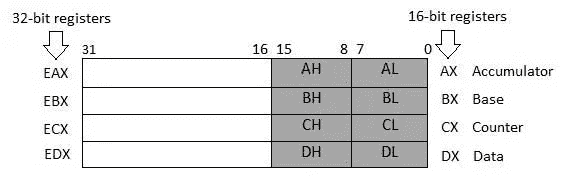
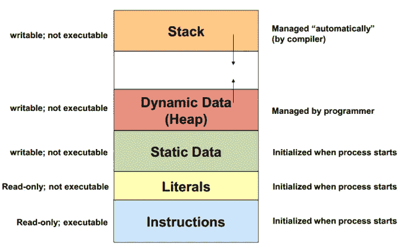

# 揭秘寄存器

> 原文：<https://medium.com/hackernoon/demystifying-registers-23dea1e83702>


让我们到引擎盖下，了解一下寄存器。

寄存器是处理器用来更有效地处理数据的内部存储器存储位置。如果没有寄存器，处理器将被迫在任何时候与控制总线进行交互，以便从存储器中读取或写入数据。

寄存器类似于变量，除了在任何给定的架构上都有固定数量的寄存器。寄存器存储用于处理的数据元素，而不必深入研究和访问存储器。更具体地说，每个寄存器都是 CPU 中存储单个数据的特殊位置。通常，寄存器保存的指针引用内存中的其他位置，寄存器之间的值移动非常常见。32 位 IA-32 架构中有 10 个不同的寄存器。这些寄存器分为三类。

1.  通用寄存器
2.  控制寄存器-比较和数学计算
3.  段寄存器——存储不同段(代码、数据和堆栈)的起始地址

通用寄存器可以进一步细分为以下子组:

*   数据寄存器-算术、逻辑和其他操作
*   指针寄存器-指向堆栈和内存中的位置
*   变址寄存器-变址寻址

最常见的 32 位寄存器是 EAX、EBX、ECX 和 EDX。

寄存器有效地利用了空间。事实上，32 位寄存器的下半部分可以用作 16 位或 8 位寄存器。

例如，AX 是主累加器寄存器。它通常用于输入输出和大多数算术指令中。例如，在乘法运算中，根据特定操作数的大小，一个操作数存储在 EAX、AX 或 AL 寄存器中。



一个特别重要的通用寄存器是 eax 寄存器。Eax 有两个常见的用途，存储函数的返回值和作为特定计算的特殊寄存器。Eax 是一个易失性寄存器；也就是说，一旦函数返回，寄存器不能保证保留其值。这意味着在函数返回后，处理器可以使用这个寄存器空间来存储不同的数据。但是，在函数的作用域中，eax 在函数返回之前被设置为函数的返回值。下面是一个设置为返回 3 的函数:

```
return 3;  // Return the value 3
```

以下是汇编中的相同代码:

```
mov eax, 3 ; Set eax (the return value) to 3
ret        ; Return
```

另一个重要的通用语域是 esp 语域。esp 寄存器存储一个指向堆栈顶部的指针。请注意，堆栈在虚拟内存中朝着堆的方向向下增长。



希望你对收银机感觉更舒服。简单地说，它们只是 CPU 中为特定类型的数据保留的特殊位置。当函数求值并最终终止时，这些值是不断变化的。