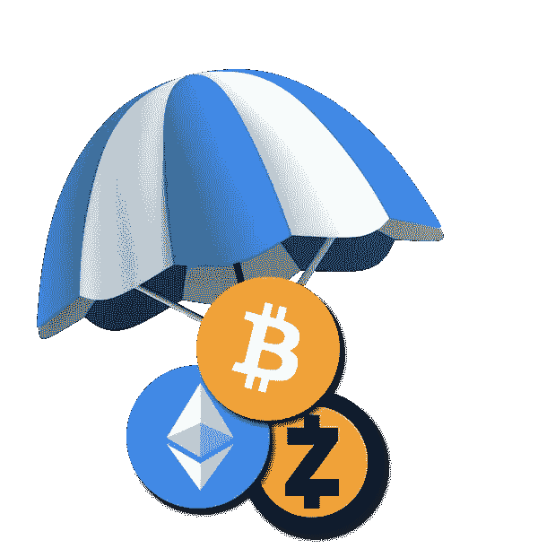

# 揭秘 SEC 关于空投的命令

> 原文：<https://medium.com/hackernoon/demystifying-sec-order-on-airdrops-69dba05346fd>

几周前，美国证券交易委员会(SEC)针对 Tomahawk Exploration LLC 的一个名为“Tomahawkcoins”或“TOM”的欺诈性 ICO 发布了[停止令](https://www.sec.gov/litigation/admin/2018/33-10530.pdf)，该 ICO 试图通过 ICO 筹集 500 万美元，据称是为了资助加利福尼亚州克恩县的石油钻探。他们之前曾试图通过私人投资和公共资本市场为该项目筹集资金，但没有成功。这一命令特别有趣，因为这是 SEC 首次直接处理空投和赏金行动的合法性问题。

**什么是空投和赏金战役？**

空投是免费分发特定项目的令牌，通常是向其他流行的加密货币如以太和比特币的持有者分发。它们有时也用于激励潜在投资者/用户注册项目或使用项目开发的公用设施。这类似于向潜在用户提供免费样品或各种订阅服务的免费试用期。这里的主要目标是传播对该项目的认识。

奖励活动是将特定项目的代币颁发给某些关键意见领袖(kol)或影响者，以在他们的追随者中推广该项目。它为项目提供了一种廉价的自我宣传方式。

自从美国证券交易委员会(SEC)开始将 ico 归类为证券销售，以此打击 ico 以来，关于空投和奖金活动的命运，一直存在相当大的争议。加密社区的许多人认为，由于空投令牌是免费发放的，没有任何金钱上的考虑，因此它们不被视为证券销售。然而，美国证券交易委员会却不这么认为。

**为什么空投和赏金运动是一种证券销售？**

根据 SEC 的规定，大多数 ico 都具有投资合同的性质。投资合同涉及对一项共同事业的投资，其前提是对从他人的创业或管理努力中获得利润的合理预期。大多数项目在进行 ICO 时都处于非常早期的阶段，项目的成功高度依赖于管理团队的努力。因此，它们最有可能被归类为证券。此外，在 TOM 代币的情况下，持有人有将 TOM 代币转换为 Tomahawk Exploration LLC 股票的“选择权”。因此，它们构成了“任何证券的期权或特权”，因此被视为证券本身。

一旦代币被归类为证券，缺少货币对价并不意味着没有证券出售或要约出售。如在 [SEC 诉 Sierra Brokerage Servs 一案中所主张的那样。，Inc](https://www.courtlistener.com/opinion/1465164/ussec-v-sierra-brokerage-services-inc/) ，只要发行人通过处置证券获得一些实际利益，它就被视为证券出售。

在 TOM ICO 的案例中，发行者通过在线营销的形式，包括在博客和其他在线论坛上推广 ICO，以换取奖金分配。发行人还从为其证券创建公开交易市场中获得了价值。因此，它实际上不是一个礼物，而是一个价值交换，因此，构成了证券销售。

**SEC 所说的真正利益是什么意思？**

真正的利益这个词含义很广，可以有很多含义。这里有一些例子。

*   **赏金活动:**发行人通过在各种论坛上营销和推广 ICO 来获取价值，这有助于提高对该项目的认识，该项目被认为非常有价值。
*   **注册奖励:**当一些人注册时，发行人获得的[个人信息](https://www.sec.gov/news/headlines/webstock.htm)被 SEC 认为是有价值的。
*   **推荐活动:**这些活动同样被认为是有价值的，因为它有助于传播对项目的认识，有助于招募更多的人来注册某个特定的项目，从而有助于销售项目。
*   **空投以实现去中心化:**许多人会认为这是纯粹的捐赠，因为没有收集信息，发行者也没有获得明显的利益。但美国证券交易委员会仍然认为这是有价值的，因为在他们看来，这可能有助于发行者为他们的代币创造一个新兴的公开市场，增加他们的业务，创造宣传，增加他们网站的流量，并产生对他们 ICO 的兴趣。

底线是没有免费的午餐，无论你如何组织空投，它总是会给发行人带来直接或间接的利益，因此会被 SEC 视为证券销售。

**该命令对以美国人为目标的 ico 意味着什么？**

*   空投活动:这对于任何试图通过向以太坊等流行的区块链网络的用户空投令牌来实现去中心化的新项目都有重大影响，因为美国有大量的加密服务商。此外，由于区块链的假名性质，几乎不可能区分属于美国人和非美国人的钱包。因此，这将意味着一揽子空投的结束，在一揽子空投中，特定区块链网络的所有用户都可以根据他们的持有量获得免费代币。期待空投变得更有针对性。
*   **赏金活动:**这对美国的 kol 和有影响力的人来说是个坏消息，因为他们不能再参与赏金活动，除非发行人遵守美国证券法。即使美国的 kol 和影响者的服务被用来瞄准非美国投资者，也是如此。

**这项命令对针对非美国人的 ico 意味着什么？**

*   空投活动:空投被视为证券销售的关键原因是代币本身被视为证券。证券的构成因管辖区而异。只要代币本身在特定的管辖范围内不被视为证券，空投就应该是合法的。因此，只要代币本身在特定司法管辖区不被视为证券，发行者就可以继续使用空投方式在大多数非美国司法管辖区宣传他们的项目。
*   赏金战役:上述分析通常也适用于赏金战役。只要代币本身在特定司法管辖区不被视为证券，赏金活动在该特定司法管辖区就应该是合法的。

希望这能帮助你更好地理解 SEC 关于空投和赏金战役的命令。如果你觉得这篇文章有帮助，那么请鼓掌表达你的爱，并与你的朋友分享。请分享你的观点，并通过评论文章提出问题。你的反馈会激励我继续这样写有用的内容。最后但同样重要的是，这些都不是法律建议，在依赖本文中提出的观点之前，请咨询律师。

**关于我:**作为 [ICOMain](http://www.ICOMain.io) 的 ICO 顾问，我帮助企业筹集实现其潜力和愿景所需的关键资源。ICOMain 是一个一站式商店，为您提供完成一个成功的 ICO 所需的一切。我们会全程陪伴您。

**您知道吗:**我们尖端的专有**贡献者关系管理(CRM)** 系统可以帮助您以结构化的方式管理整个代币销售流程，包括预售、空投、奖励活动、推荐、主销售和多轮销售，而不会丢失任何线索。我们提供这一点和更多。要了解我们如何帮助您成功完成 ICO，请给我发邮件至 nirav.gala@icomain.io。我们免费为您的 ICO 项目提供初步的一对一咨询和评估。