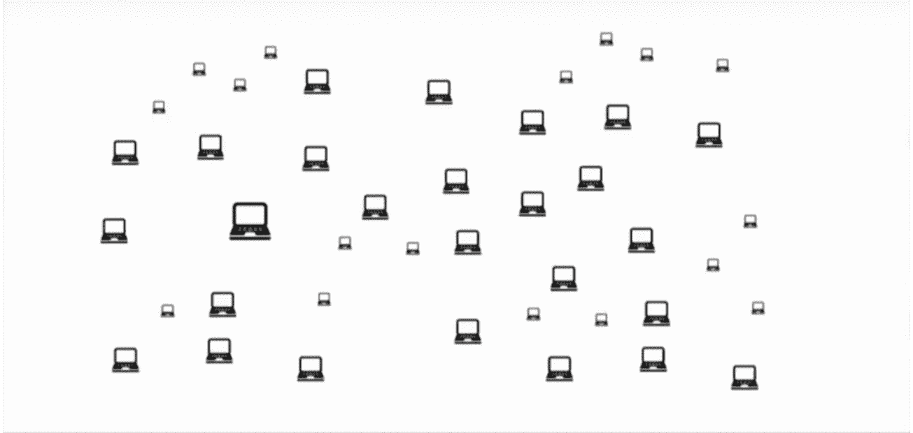

# 揭秘“雪花变雪崩”

> 原文：<https://medium.com/hackernoon/demystifying-snowflake-to-avalanche-4e2f8fbe87b0>

# 介绍

不是每天都有分布式系统领域的人出来说“*我有一个关于*的新突破要告诉你”。然而，最近，康奈尔大学的 Emin Gün Sirer 教授说，他有。在本文中，我们将向您描述几个月前刚刚出现的一个新的共识协议家族。“团队 Rocket——一个化名的团队——与 Sirer 教授合作，在 IPFS 发表了这篇题为“[雪花到雪崩:一个新的加密货币亚稳态共识协议家族](https://ipfs.io/ipfs/QmUy4jh5mGNZvLkjies1RWM4YuvJh5o2FYopNPVYwrRVGV)”的论文。这篇论文建立在非学术界人士不容易理解的全面的低级细节和证据之上。在本文中，我们将为您简化和可视化该协议，让您了解这种新方法。

# 两类共识协议

当许多分布式计算机共享相同的任务和资源时，一致性是要实现的最重要的目标之一。

一个典型的例子是在多个服务器上维护银行系统中的账户余额。银行不依赖一个单一的数据库来承载数据，而是依靠遍布全球的许多地理上分散的机器来处理这些交易。他们需要一种方法来维护所有这些机器的稳定视图，从而反映帐户余额的一致表示。

另一个例子是保持亚马逊在线购物服务的一致性。为了在全球范围内扩展这些服务，它们必须(在地理上)分布在大型数据中心。亚马逊要求定期查看库存产品，否则可能会发生意想不到的不良行为，例如，最后一件商品可能会卖给两个不同的人两次。

长期以来，这一直是计算机科学中的一个重要问题。为此，学者/工程师们在过去的 40 年里一直在努力寻找有效的解决方案。在分布式系统领域中，只有两个现有的共识协议族，我们接下来将对其进行描述。

## 经典共识协议

第一类被称为*经典共识*协议是由两位伟大的计算机科学家开发的，即 *Leslie Lamport* 和 *Barbara Liskov。他们都是图灵奖的获得者——这相当于计算机科学家的诺贝尔奖。该协议的优点是多方面的，包括快速终结和对提交事务的快速保证。
然而，这是有代价的:*

*   它们不能很好地扩展到超过 10 到 1000 个节点。这是因为在参与的节点之间，它们需要二次通信成本，即 O(n)。
*   它们要求网络中的每个人都认识所有其他参与者。

基本上，它们的安全性归结于确认看到相同事物并继续提交它的节点的法定数量之间的明智重叠。当构建一个许可的[区块链](https://hackernoon.com/tagged/blockchain)时，这种方法是合理的，然而，当你处于一个不可信节点的动态环境中时，这不是一个好的基础。因此，无许可链基于不同的共识协议。

## Nakamoto 共识协议

2009 年，另一个新的家庭出现了。中本聪提出了他的新协议系列，并展示了他独特的健壮解决方案:

*   我们不需要知道参与网络的所有节点。任何节点都可以在任何时间点离开或加入，任何矿工都可以拿出一个块并加入系统。
*   它可以扩展到大量的全球节点和参与者。

然而，这些好处是有代价的，特别是:

*   [比特币](https://hackernoon.com/tagged/bitcoin)速度非常慢，平均来说，用户需要等待大约 10-60 分钟才能确认他们的交易被存储在链上。
*   吞吐量也非常有限。比特币每秒可以处理大约 3-7 笔交易，当然，这与成为世界货币的任务相去甚远。
*   最后，比特币消耗巨大的能量；比特币的能量大约相当于 4 座切尔诺贝利核电站的能量。这是花费在簿记上的大量精力。

# 雪崩

Avalanche 的出现结合了两者的优点，特别是，

*   **快速终结和低延迟**:也就是说，在全球范围内只需要大约 2 秒钟就可以终结。这基本上意味着，2 秒钟后，你可以得到你的付款处理和验证。
*   **更高的吞吐量**:每秒 1000–10，000 个事务。
*   健壮的:网络不需要就参与者达成一致来达成不可否认的共识。
*   **静止协议**:最重要的是，协议是绿色的。这意味着它是可持续的，它不浪费任何能源，也没有特殊的矿工生态系统，他们的利益与用户无关。

## 核心思想:亚稳定性

The Avalanche protocol in action¹. The core idea relies of subsampled voting.

雪崩的核心思想是**亚稳态**。对于共识协议来说，最糟糕的事情是无法在两个选择之间做出决定，也就是说，你不希望它说这发生了或者那发生了，你希望它属于双方中的一方。Avalanche 的亚稳态协议旨在将选择倾向于其中一方。

为了解释流程的核心直觉，让我们看一个简化的例子，如上图所示。考虑一个由不信任的节点组成的网络，这些节点想要选择蓝色或红色。

*   网络的单个节点从随机挑选少量的对等节点开始，比如说五个，并要求他们选择一种颜色。
*   然后，每个对等节点用一个*投票*来响应，请求节点使用该投票来形成所有投票的加权结果。在上图(第一帧)中，从节点的角度来看，基于一轮轮询，整个网络向红色倾斜。
*   这个过程会在其他人身上重复。

该协议类似于循环二次抽样投票过程。这里发生的情况是，即使我们开始时最糟糕的情况是红蓝双方各占一半，一轮过后，这种情况很有可能不再持续。此外，在两轮后，这种可能性非常小，在三轮后甚至更小，以此类推，也就是说，它呈指数衰减。该协议旨在提示，而不是留在中间。随着它越来越多地倾斜，网络的感知转移到一种颜色或另一种颜色。我们向一个方向移动的速度(节点投票选择一种颜色多于另一种颜色)将会越来越快，在某个点上，我们到达了一个不可逆转的点，在这个点上，整个网络都同意一种颜色。

## 关于议定书的说明

*   **高效的可伸缩性:**该协议是轻量级的，因此允许可伸缩性和低延迟。
*   **拜占庭容忍:**可以容忍很大比例的拜占庭参与者，且对安全性没有影响。特别是，您可能有多达 50%的节点是拜占庭式的，即试图欺骗网络并保持整个网络不平衡的节点。但是，它们不能以导致两个节点决定两种不同颜色的方式来实现这一点。
*   **平等主义生态系统:**雪崩协议产生了平等主义生态系统，即网络中的所有节点生来相同。没有矿工，也没有给予他们特权。
*   **冲突交易没有活性保证:**如果攻击者试图在两个不同的交易中两次花费相同的钱(重复花费)，那么雪崩协议将无法在这两者之间做出决定，导致这笔钱丢失。传统的共识协议和 Nakamoto 协议会决定一个事务或另一个事务，然而，雪崩协议可能不会。对于协议来说，这是一个非常有趣的特性，它隐含地、自然地惩罚了不良行为者，而没有给协议带来任何额外的复杂性。

## 雪崩的象征:AVA

AVA——Avalanche 的缩写，类似于该协议所代表的新令牌。

*   **通过标记阻止 Sybil:**雪崩协议通过标记 AVA 令牌来防止 Sybil 攻击。这意味着节点用 AVA 令牌来表明它们在系统中拥有一些所有权。与以太坊和其他公司不同，这些股份不是抵押品，永远不会丢失。如果你行为不端，你的钱不会被拿走。所以这里的赌注完全是为了确保你不能冒充其他人。这是雪崩协议的伟大成果之一。跑马圈地不是用来达成共识的，事实上是完全独立于它的。
*   **通过投票进行经济治理:**这整个系统给出了一个有趣的观点，那就是治理。到目前为止采用的核心思想是二次抽样投票以达成共识。我们可以使用同样的机制来商定协议本身的关键参数。例如，如果没有足够的赌注者，网络可以决定提高造币率。相反，网络可以决定降低铸币率以提高价格并减少硬币的可用供应。相比之下，中本聪不得不拿出他的固定的 2100 万铸造曲线。相反，Avalanche 本质上是一个群众先知，它用那些既得利益者取代了央行，这些既得利益者希望看到硬币得到妥善管理，以符合他们自己的利益。

# 结论

人们经常谈论比特币中使用的共识协议，好像它是一种纯粹的分散方法，平等地决定所有网络参与者的意见。不幸的是，事实并非如此，在比特币领域，决策大多由矿商做出。

相比之下，Avalanche 将共识问题与治理问题分开。每一个都被模块化和独立地处理。共识是通过八卦协议与循环二次抽样的巧妙结合实现的。而公平治理是通过抽样和标桩实现的，从而在用户和他们的决策之间建立直接联系。

# 参考资料:

1.  Cryptoconf 2018，Emin Gün Sirer talk —雪花到雪崩
2.  雪花到雪崩:加密货币的新型亚稳态共识协议家族，火箭队，2018 年

# 如果你喜欢这篇文章，或者如果你有任何进一步的问题或图表要求，请通过 [Twitter](https://twitter.com/Drmelseidy) 或 [LinkedIn](https://www.linkedin.com/in/mohamed-elseidy/) 联系我。

***免责声明:本文信息仅供教育之用，不能作为投资建议。***