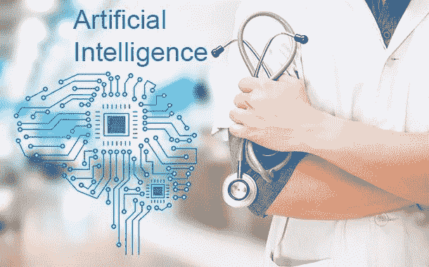

# 艾和美国食品和药物管理局

> 原文：<https://medium.com/hackernoon/demystifying-the-current-upward-trend-in-fda-approvals-of-medical-devices-using-artificial-cb9cc18d175>

## 详细了解最近 FDA 批准使用人工智能( [AI](https://hackernoon.com/artificial-intelligence/home) )的医疗设备的上升趋势，以及世界其他地区(如欧盟、中国、英国和加拿大)人工智能和医疗保健方面的文化转变

