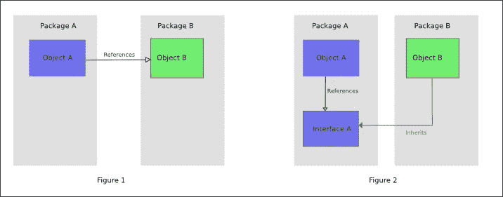

# 从属倒置原则

> 原文：<https://medium.com/hackernoon/dependency-inversion-principle-e402e5b69e70>

## 解耦、模块化和干净的架构

这是第五篇，也是最后一篇关于[坚实](https://hackernoon.com/solid-principles-530b2cc2badf)原则的文章。查上一条，界面偏析原理，[此处](/@wrong.about/interface-segregation-principle-bdf3f94f1d11)。

## 定义

像往常一样，我从[维基百科](https://en.wikipedia.org/wiki/Dependency_inversion_principle)的引文开始:

> A.高层模块不应该依赖低层模块。两者都应该依赖于[抽象](https://en.wikipedia.org/wiki/Abstraction_(computer_science))。抽象不应该依赖于细节。细节应该依赖于抽象。

罗伯特·马丁原著中并没有对 *A* 和 *B* 项进行这样的划分。维基百科有，可惜没有详细说明为什么会这样。此外，不清楚高级和低级模块承担的是什么。我认为它值得一些注释。

对象的存在是为了完成一些工作。他们可以自己做，或者借助一些其他物体。这些“助手”对象很可能代表一些有用的抽象，也就是说，有不止一个类能够实现特定的契约。所以我想在代码中反映这个事实:

```
**class** A
{
    **private $b**;

    **public function** __construct(B $b)
    {
        $this->**b** = $b;
    }
}
```

对象 *$b* 是类 *A* 对象的实现细节。因此，接口 *B* 是，或者*应该按照 *A* 来定义，并且与 *A* 在同一个包中。这就是为什么任何实现接口 *B* 的对象都被认为是相对于 *A* 的较低层次。*

所以根据它的定义，依赖反转原理讲的就是两件事:解耦和[正确模块化](https://hackernoon.com/how-to-decompose-a-system-into-modules-796bd941f036)。

## 让我们进一步阐述一下

在美好的过去，当没有人使用接口时，对象就在使用它们的类中被实例化。所以他们直接依赖于那些实现细节(下图中的图 1)。今天，我们重视解耦和多态，所以我们使用接口来[明确我们的依赖关系](https://codeburst.io/static-classes-are-evil-or-make-your-dependencies-explicit-af3e73bd29dd)。这还不是依赖反转原理，这只是一个[依赖注入](https://en.wikipedia.org/wiki/Dependency_injection)。为了使它成为一个倒置，我们必须声明消费者类拥有他的依赖抽象。现在，表示实现细节的模块依赖于更抽象的模块(下图中的图 2)。因此，依赖倒置原则颠倒了消费者代码和依赖实现代码之间的依赖方向。



Source: [en.wikipedia.org/wiki/Dependency_inversion_principle](https://en.wikipedia.org/wiki/Dependency_inversion_principle)

## 向清洁建筑发展

作为一个特例和进一步的发展，DIP 声明业务逻辑不应该直接依赖于技术细节。相反，它应该定义一个自己拥有的接口，这样所有的实现代码(例如，数据库查询、http 通信、电子邮件发送和几乎所有的基础设施逻辑)都依赖于这个中心层——策略层。对我来说，这听起来像是一个[清洁建筑](https://8thlight.com/blog/uncle-bob/2012/08/13/the-clean-architecture.html)的先兆:


## 最后的想法

嗯，这个原则基本上可以归结为一个古老的松耦合的东西，它已经存在了至少 50 年。David Parnas 已经说了关于如何定义模块的所有必要内容。我想依赖倒置原则的唯一优势是它比其他的在稳固家庭中更少的模糊性。