# 在(免费)IBM 区块链启动计划上部署业务网络

> 原文：<https://medium.com/hackernoon/deploy-a-business-network-on-free-ibm-blockchain-starter-plan-93fafb3dd997>

我今天庆祝我在 IBM 工作一周年。哇，我在脑子里念的时候听起来怪怪的。听起来好像我刚开始和我的女朋友约会什么的。还有什么比写一篇关于如何部署您的客户的帖子更好的方式来庆祝我的第一年呢🍌(.bna)文件到 IBM [区块链](https://hackernoon.com/tagged/blockchain)首发计划？但是在我们开始之前，让我先给你看一下你将要构建的东西。我想确定这个博客值得你花时间。附注:我从二月起就没写过博客了，所以请原谅我生疏的⌨️.

# 试映

> 目标是建立一个拍卖应用程序。这个应用程序将由一个 composer-rest-server(即一个 Swagger UI)控制。你将在这个应用程序中添加成员，提出报价，并最终结束竞标，用户界面将通过显示物品为“**已售出**”做出响应，如下所示:

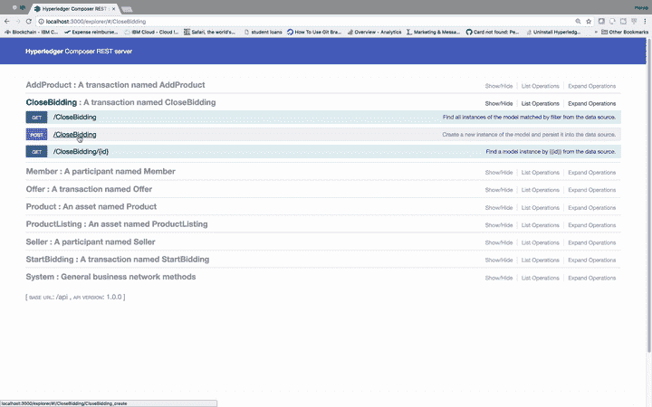

The final step in this app is to close the bidding. Commands are given using the (composer-rest-server) Swagger UI.

> 对于您使用 composer-rest-server 发出的每个成功请求，将调用 chaincode，您将能够在 IBM Blockchain 平台上看到 chaincode 日志，如下所示。只要您的区块链服务运行在云上，日志就会一直存在。

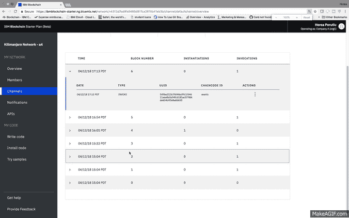

Checking chaincode logs after making requests with the composer-rest-server.

# 语境

像我的其他博文一样，焦点中的底层技术是 Hyperledger Fabric 框架。这是一个致力于推进跨行业区块链技术的框架。如果你不熟悉 [Hyperledger Fabric](https://www.hyperledger.org/about) ，请在阅读这篇文章之前做一些研究。

> 我今天将帮助您部署您客户🍌文件提交到 IBM Cloud，并向您展示如何通过 composer-rest-server 向您的区块链网络提交事务。在博客的最后，您应该能够使用 IBM Blockchain 平台查看从 composer-rest-server 提交的 chaincode 日志。

**另外，从现在开始，当我使用🍌表情符号，我指的是。bna 文件。**

你的🍌文件将您的所有业务逻辑(或智能合同，或链码)包含在一个文件中，该文件可以安装在组织的对等设备上。一旦您在对等体上安装了这个文件，您就可以启动[网络](https://hackernoon.com/tagged/network)，并根据🍌文件。如果你想学习更多关于创造的知识。bna 文件，看看这个[教程](http://goo.gl/vZEJuF)。

# 先决条件

1.  免费 [IBM 云账户](https://ibm.biz/BdjLxy)
2.  [NPM](http://goo.gl/hkUPRP) 和安装的节点(本博客用节点版本 8.10.0 测试)
3.  如果您使用过其他版本的 composer-cli，或者以前部署过. bna 文件，请运行以下命令:

```
$ npm uninstall -g composer-rest-server$ rm -rf ~/.composer$ rm *.card$ rm -rf credentials/
```

4.(可选—如果由于 docker 容器已经运行而出现错误):

```
$ docker kill $(docker ps -q)$ docker rm $(docker ps -aq)$ docker rmi $(docker images -q)
```

5.这一步极其重要。Starter Plan 仅适用于 Composer 版本 0.19.4。这个我在很多帖子里都回答过。所以我要再说一遍。**首发计划仅适用于** **作曲** **版本 0.19.4。使用以下命令检查您的 composer 版本:**

```
$ composer -v
```

如果您看到“v0.19.4 ”,您就是👍🏼。否则，卸载 Composer:

```
$ npm uninstall -g composer-cli
```

然后安装 Composer 版本 0.19.4:

```
$ npm install -g composer-cli@0.19.4
```

# 步骤 1:创建🍌文件

首先，我们需要克隆一个包含三个组件的 repo，这三个组件是创建🍌文件:一个逻辑文件**(。js)** ，一个模型文件**(。cto)** 和访问控制**(。acl)** 文件。

1.  克隆包含这三个文件的回购协议，以及一个功能完整的业务网络

```
$ git clone https://github.com/IBM/BlockchainEvents-CompositeJourney.git
```

2.进入 Composer 目录，创建**。bna 文件。**

```
$ cd BlockchainEvents-CompositeJourney/Composer$ npm install
```

如果此命令失败，请检查您是否拥有正确的节点版本(应为 8.10.0)和 npm v 5.6.0。

3.现在你应该有一个🍌文件，( **events.bna** )，它位于您的`BlockchainEvents-CompositeJourney/Composer/dist`目录中。

# 步骤 2:创建区块链服务

1.  在你的浏览器中，进入你闪亮的新 IBM 云账户:[https://console.bluemix.net/dashboard/apps](https://console.bluemix.net/dashboard/apps)
2.  创建区块链服务:

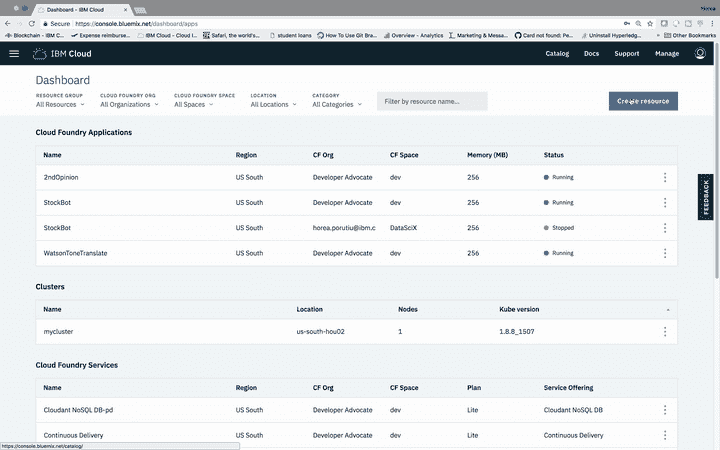

Create a blockchain service on IBM Cloud.

# 第三步:获取秘密

1.  启动您的区块链服务，点击连接配置文件，并查看原始 JSON
2.  一路向下滚动，直到你看到“注册”，然后在“注册”将是“注册秘密”。复制这个秘密，我们将需要它为下一步

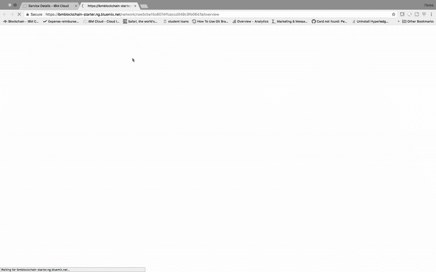

Inside the blockchain platform, go to the connection profile, and get the enrollSecret and copy it.

# 步骤 4:使用 secret 从证书颁发机构(CA)获取证书

1.  返回并下载连接概要文件，而不是查看原始 JSON。
2.  将下载的 JSON 文件重命名为“connection-profile.json”
3.  将 connection-profile.json 文件移动到`BlockchainEvents-CompositeJourney`目录
4.  使用上一步中的 **enrollSecret** 发出这个命令，为证书颁发机构(CA)创建一个业务网卡。这个命令假设我的 **enrollSecret** 是‘123456789’，*，但是你的可能不同。*

```
$ composer card create -f ca.card -p connection-profile.json -u admin -s 123456789
```

5.使用以下命令导入卡

```
$ composer card import -f ca.card -c ca
```

6.最后，我们使用导入的包含我们的 **enrollSecret** 的卡向 CA 请求证书。证书存储在完成此命令后创建的凭据目录中。

```
$   composer identity request --card ca --path ./credentials -u admin -s 123456789
```

# 步骤 5:使用“admin-pub.pem”文件向对等方添加证书

1.  回到区块链服务，点击成员选项卡，然后添加证书。转到您的`BlockchainEvents-CompositeJourney/credentials`目录，将“admin-pub.pem”文件的内容复制并粘贴到证书框中。提交证书并重新启动对等方。注意:重新启动对等机需要一分钟时间。

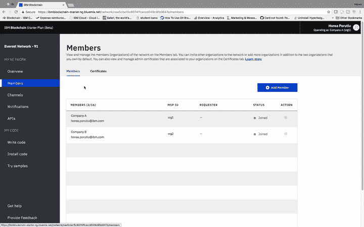

Adding certificates to members and restarting the peers.

2.接下来，我们需要同步通道的证书。从我们的区块链服务，在“我的网络”下点击“频道”,然后三点按钮。然后单击“同步证书”。


Sync certificates of the channel.

# 步骤 6:创建管理业务网卡

1.  既然我们已经与同行同步了证书，我们就可以安装 Hyperledger Composer 运行时，并通过创建管理卡来启动网络。使用以下命令创建具有渠道管理员和对等管理员角色的管理员卡:

```
$ composer card create -f adminCard.card -p connection-profile.json -u admin -c ./credentials/admin-pub.pem -k ./credentials/admin-priv.pem --role PeerAdmin --role ChannelAdmin
```

2.导入通过前面的命令创建的卡:

```
$ composer card import -f adminCard.card -c adminCard
```

# 步骤 7:安装运行时并启动网络

1.  将 events.bna 文件复制并粘贴到`BlockchainEvents-CompositeJourney`目录中。

```
$ cp Composer/dist/events.bna .
```

1.  现在，我们将使用上一步中的管理卡，通过以下命令安装运行时:

```
$   composer network install -c adminCard -a events.bna
```

如果此时出现错误，请稍等片刻，然后重试。

3.通过提供管理卡启动业务网络。bna 文件，以及从 CA 收到的凭证。该命令将发出一张我们将删除的卡，名为“delete_me.card”。注意:**确保版本与上述 composer 网络安装命令输出的版本相匹配。**

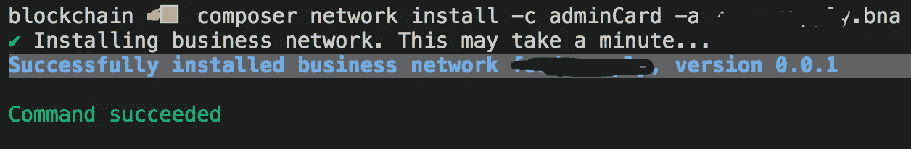

Version here is 0.0.1, so that is what version you need to use in the step below.

```
$ composer network start -c adminCard -n events -V 0.0.1 -A admin -C ./credentials/admin-pub.pem -f delete_me.card
```

如果此时出现如下所示的错误，请等待几秒钟，然后重试。

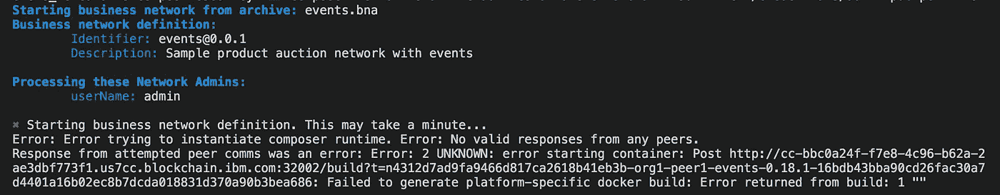

Docker build error.

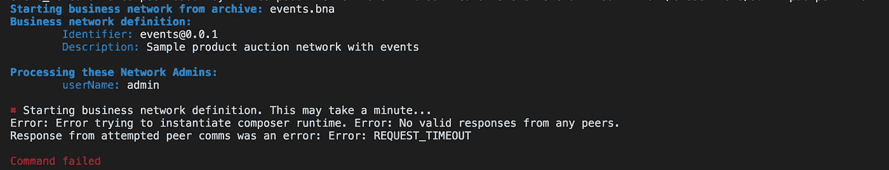

REQUEST_TIMEOUT error.

一旦命令生效，您应该会看到下面的输出:

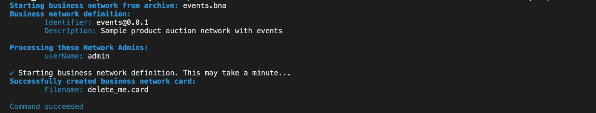

Success!

接下来，我们删除`delete_me.card`:

```
$ rm delete_me.card
```

# 第八步:创建一张新的名片

1.  在我们安装了运行时并启动了网络之后，我们需要创建一个卡，我们将把它部署到启动计划中:

```
$ composer card create -n events -p connection-profile.json -u admin -c ./credentials/admin-pub.pem -k ./credentials/admin-priv.pem
```

这个命令应该已经创建了一个名为“adminCard.card”的卡。

2.导入业务网卡:

```
$ composer card import -f ./admin@events.card
```

很好。此时你应该感觉很好。我们差不多完成了…


weeeee! Stuff works!!

# 步骤 9:创建 composer-rest-server 并启动 web UI

1.  让我们安装 composer-rest-server:

```
$ npm install -g composer-rest-server@0.19.4
```

2.现在，让我们启动服务器。确保你和你的`connection-profile.json`在同一个目录下

```
$ composer-rest-server -c admin@events -n never -w true
```

3.在您的浏览器中，转到[*http://localhost:3000/explorer*](http://localhost:3000/explorer)

4.打开一个新的终端窗口，进入`BlockchainEvents-CompositeJourney/Web`

5.安装依赖项:

```
$ npm install
```

6.启动服务器:

```
$ node server.js
```

7.在浏览器中进入[*http://localhost:8000/buyer . html*](http://localhost:8000/buyer.html)

# 步骤 10:测试网络并查看链码日志

1.  在端口 3000 上运行的 composer-rest-server 中，使用以下 JSON 在**‘Seller’**上发出 POST 请求:

```
{"$class": "org.acme.product.auction.Seller","organisation": "ACME","email": "auction@acme.org","balance": 100,"products": []}
```

2.让我们检查一下链码日志。在您的区块链服务中，转到“频道”选项卡。点击“默认频道”。单击最新调用中的蓝色“>”符号。然后，在“操作”下，单击三点符号。然后单击查看详细信息。日志将显示您已经用上面的 JSON 创建了一个卖家。


Checking chaincode logs.

3.接下来，让我们创建一个产品，并将其添加到拍卖中。让我们用以下 JSON 向“AddProduct”发布一个帖子:

```
{"$class": "org.acme.product.auction.AddProduct","description": "Sample Product","owner": "resource:org.acme.product.auction.Seller#auction@acme.org"}
```

4.现在我们需要获取我们刚刚创建的示例产品的 productId。让我们做一个“产品”的 GET。productId 将出现在响应正文中，如下所示:

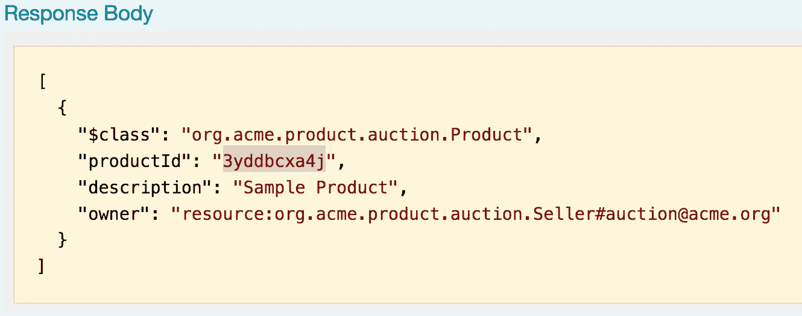

GET for ‘Product’ gets us our productId that we need to start bidding.

5.开始竞价吧。让我们用下面的 JSON 发布到“StartBIdding ”,同时**用上一步的产品 id 替换<产品 Id >。**

```
{"$class": "org.acme.product.auction.StartBidding","reservePrice": 50,"product": "resource:org.acme.product.auction.Product#<productId>"}
```

成功发布“开始竞价”后，用户界面将会更新，如下所示:

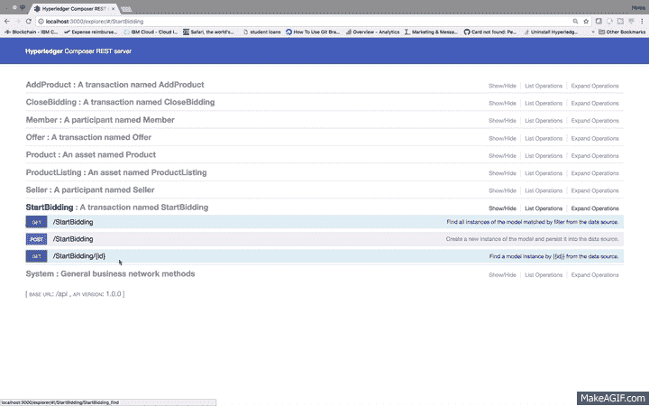

The UI is updated to show that our item is ready to be bid on.

> 在这一点上，你可以称自己为区块链开发者。太棒了。给自己一个鼓励。如果你想继续使用这个应用程序-提出几个报价，并关闭投标，然后继续与我联系。否则，你已经学到了很多，所以现在再见！👋🏼如果你喜欢这个，点击👏🏼以表明你觉得这很有用。

继续磨吧！！再走几步，我们就完成了云中运行的区块链的拍卖。

6.让我们创建两个成员，他们可以对我们拍卖的产品出价，方法是用下面的 JSON 向“Member”发送帖子

```
{"$class": "org.acme.product.auction.Member","firstName": "Amy","lastName": "Williams","email": "memberA@acme.org","balance": 1000,"products": []}
```

让我们再贴一次，但是用稍微不同的 JSON:

```
{"$class": "org.acme.product.auction.Member","firstName": "Billy","lastName": "Thompson","email": "memberB@acme.org","balance": 1000,"products": []}
```

7.现在让我们进入“产品列表”并从那里复制“listingId ”,如下面我的截图所示:

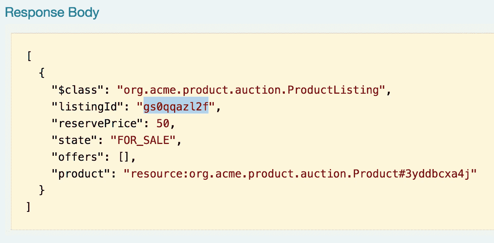

listingId that we need to make an offer.

8.让我们通过如下所示的 JSON POST ' to ' Offer '来提供两个报价，但是将<listingid>替换为**您唯一的 listingId** :</listingid>

```
{"$class": "org.acme.product.auction.Offer","bidPrice": 50,"listing": "resource:org.acme.product.auction.ProductListing#<listingId>","member": "resource:org.acme.product.auction.Member#memberA@acme.org"}
```

让我们再提一次价，这次比第一次高一点:

```
{"$class": "org.acme.product.auction.Offer","bidPrice": 100,"listing": "resource:org.acme.product.auction.ProductListing#<listingId>","member": "resource:org.acme.product.auction.Member#memberB@acme.org"}
```


Making two offers, one from each member.

此时，您的 UI 应该如下所示:

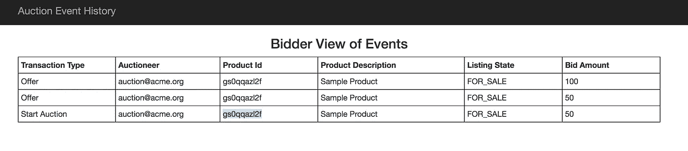

Updated UI.

9.让我们用以下 JSON 将<listingid>替换为**您的唯一列表 Id** ，然后发布“CloseBidding”来结束拍卖:</listingid>

```
{"$class": "org.acme.product.auction.CloseBidding","listing": "resource:org.acme.product.auction.ProductListing#<listingId>"}
```

10.你们都完了！您的列表状态应该是“已售出”，如果您向会员发出“GET ”,您应该会看到会员 b 的余额减少了 100 英镑，并且在产品[]中还列出了“样品产品”。


Member b won the auction, so he has a new product, but has a smaller balance.

卖家以 100 英镑开始，现在又有 100 英镑，来自成员 B，所以如果我们访问“卖家”，我们将看到他的总额现在是 200 英镑。

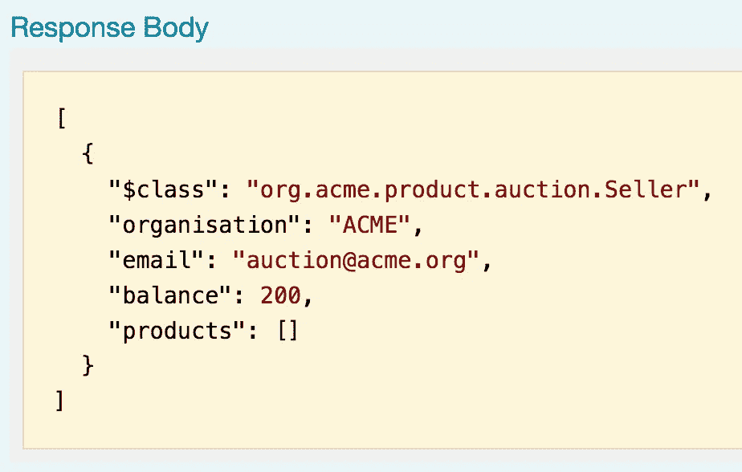

The seller has a balance of 200 now.

'//;/你完了！您已经成功地基于我们的。bna 文件，并通过 Swagger UI 发出请求与我们的应用程序进行交互。我们所有的请求都成功地记录在我们的通道中，我们可以看到每个链代码调用的细节。感谢你的阅读，如果你喜欢它，请保持下去👏🏼按钮！

如果你有任何问题，你可以联系 horeaporutiu@gmail.com，通过 [LinkedIn](https://www.linkedin.com/in/hporutiu) 联系我，或者通过 [Twitter](https://twitter.com/horeaporutiu/) 和 [Medium](/@horeaporutiu) 关注我。干杯！