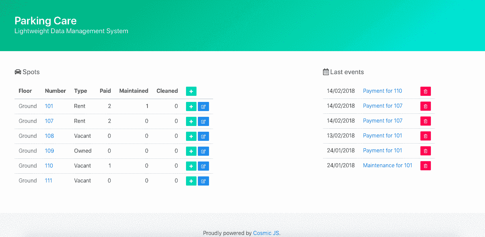
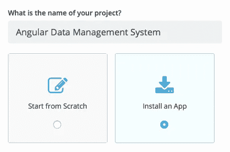
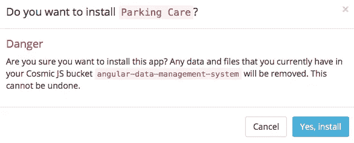
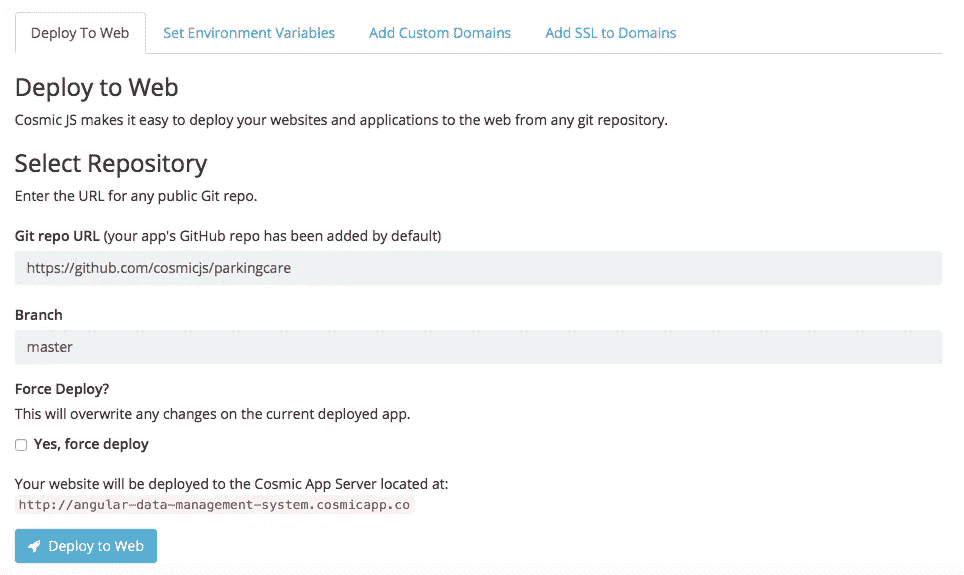
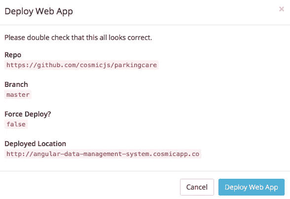

# 分三步部署轻量级角度数据管理系统

> 原文：<https://medium.com/hackernoon/deploy-a-light-weight-angular-data-management-system-in-3-steps-94ae57f6e7be>

在这篇博客中，我将分三步演示部署一个轻量级角度数据管理系统。这个小应用程序旨在保持停车场的日常操作，但可以调整为任何其他存储或使用相同工作流的情况。非常简单，但是有足够的开始！该应用由 [Bhulat Kutliev](https://cosmicjs.com/kutliev) 为 [Cosmic JS](https://cosmicjs.com) 社区打造，基于 Node.js、Angular JS 和 [Cosmic JS](https://cosmicjs.com) 构建。

从您的 [Cosmic JS](https://cosmicjs.com) Bucket Dashboard 安装和管理您的角度数据管理系统及其所有内容。简单。😎可以参考下面的[原创教程](https://cosmicjs.com/articles/how-to-create-a-management-system-with-cosmic-js-and-angular)从头开始搭建 app，也可以继续阅读简单 3 步部署角度数据管理系统。

# TL；速度三角形定位法(dead reckoning)

[角度数据管理系统](https://cosmicjs.com/apps/parking-care)
[角度数据管理系统演示](https://cosmicjs.com/apps/parking-care/demo)
[角度数据管理系统代码库](https://github.com/cosmicjs/parkingcare)
[如何用 Cosmic JS 和 AngularJS 创建数据管理系统](https://cosmicjs.com/articles/how-to-create-a-management-system-with-cosmic-js-and-angular)

我们将使用 [Cosmic JS](https://cosmicjs.com/) 来安装我们的示例应用程序，部署并进行内容更新。Cosmic JS 是一个 API 优先的内容管理平台，允许开发人员以任何编程语言构建应用程序，同时为内容编辑器提供一个熟悉的内容编辑器来管理来自云的动态内容。如果你还没有，那就从[注册](https://cosmicjs.com/signup)宇宙 JS 开始吧。

# 1.创建新的存储桶

您的 bucket 的名称是您正在构建的网站、项目、客户端或 web 应用程序的名称。

# 2.安装角度数据管理系统

[Cosmic JS](https://cosmicjs.com/) 让你能够在 Node.js、Vue.js、React、AngularJS 等编程语言之间进行筛选。

# 确认应用程序安装

# 3.部署到 Web

导航至位于 Bucket Dashboard 左侧导航栏设置下方的“部署 Web 应用程序”。我点击了“部署到 Web”。然后，我可以在部署 web 应用程序时编辑对象。您将收到一封电子邮件，确认您的 web 应用程序的部署。如果您在部署过程中遇到任何问题，您可能会被转到[宇宙 JS 故障排除页面](https://cosmicjs.com/troubleshooting)。

# 确认部署位置和分支

我在宇宙 JS 社区中使用来自[布拉特·库特列耶夫](https://cosmicjs.com/kutliev)的内容就绪应用，所以我将使用他的主报告:[https://github.com/cosmicjs/parkingcare](https://github.com/cosmicjs/parkingcare)

# 部署分支机构确认模式

现在你的应用已经部署到了 Cosmic JS 应用服务器，你可以自由地从一个地方完全管理你的[角度数据管理系统](https://cosmicjs.com/apps/parking-care)及其所有内容。

[Cosmic JS](https://cosmicjs.com/) 是一个 API 第一的基于云的内容管理平台，可以轻松管理应用和内容。如果你对 Cosmic JS API 有任何疑问，请联系 Twitter 或 Slack 的创始人。

[卡森·吉本斯](https://twitter.com/carsoncgibbons)是[宇宙 JS](https://cosmicjs.com/) 的联合创始人& CMO，宇宙 JS 是一个 API 第一的基于云的[内容管理平台](https://cosmicjs.com/)，它将内容与代码分离，允许开发者用他们想要的任何编程语言构建流畅的应用和网站。