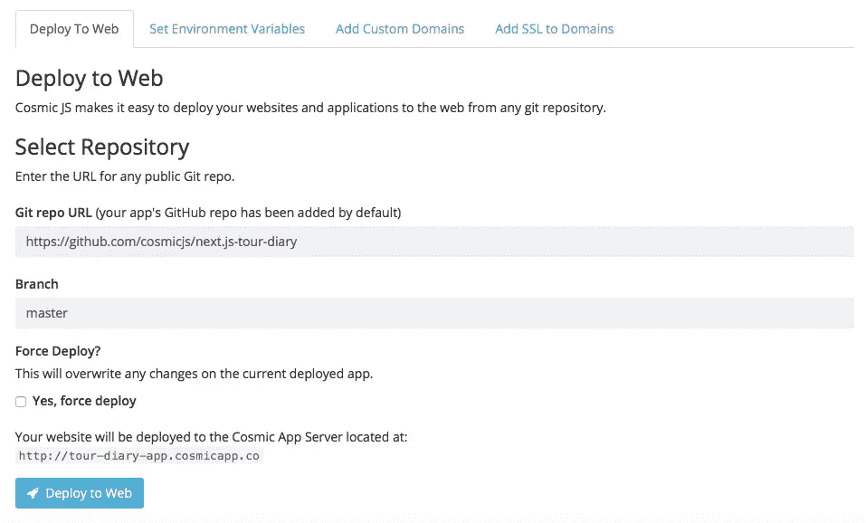

# 分 3 步部署 Next.js 旅游日记应用程序

> 原文：<https://medium.com/hackernoon/deploy-a-next-js-tour-diary-app-in-3-steps-8d12f6745468>

在这篇博客中，我将分三步演示如何部署一个[旅行日记应用程序](https://cosmicjs.com/apps/nextjs-tour-diary)。这个简单的旅游日记应用程序是使用 React、Next.js 和 Redux 构建的。它由 Cosmic JS API 提供支持。这个应用程序包含了 CRUD 操作模块，用于将旅程添加到日记中，并管理每个旅程中的时间线。

从你的宇宙 JS 桶仪表板安装和管理你的[旅行日记应用](https://cosmicjs.com/apps/nextjs-tour-diary)和它的所有内容。简单。😎可以参考下面的[原创教程](https://cosmicjs.com/articles/how-to-build-a-tour-diary-app-using-next-js-and-cosmic-js-jci5wyod)从头开始搭建 app，也可以继续阅读简单分 3 步部署[游日记 App](https://cosmicjs.com/apps/nextjs-tour-diary) 。

# TL；速度三角形定位法(dead reckoning)

[游日记 App](https://cosmicjs.com/apps/nextjs-tour-diary)
[游日记 App 演示](https://cosmicjs.com/apps/nextjs-tour-diary/demo)
[游日记 App 代码库](https://github.com/cosmicjs/next.js-tour-diary)
[如何使用 Next.js 和 Cosmic JS 构建游日记 App](https://cosmicjs.com/articles/how-to-build-a-tour-diary-app-using-next-js-and-cosmic-js-jci5wyod)

我们将使用 [Cosmic JS](https://cosmicjs.com/) 来安装我们的示例应用程序，部署并进行内容更新。Cosmic JS 是一个 API 优先的内容管理平台，允许开发人员以任何编程语言构建应用程序，同时为内容编辑器提供一个熟悉的内容编辑器来管理来自云的动态内容。如果你还没有，那就从[注册](https://cosmicjs.com/signup)宇宙 JS 开始吧。

# 1.创建新的存储桶

您的 bucket 的名称是您正在构建的网站、项目、客户端或 web 应用程序的名称。

# 2.安装 Next.js 旅游日记 App

[Cosmic JS](https://cosmicjs.com/) 让你能够在 Node.js、Vue.js、React、AngularJS 等编程语言之间进行筛选。

# 确认应用程序安装

# 3.部署到 Web

导航至位于 Bucket Dashboard 左侧导航栏设置下方的“部署 Web 应用程序”。我点击了“部署到 Web”。然后，我可以在部署 web 应用程序时编辑对象。您将收到一封电子邮件，确认您的 web 应用程序的部署。如果您在部署过程中遇到任何问题，您可能会被转到 [Cosmic JS 故障排除页面](https://cosmicjs.com/troubleshooting)。

# 确认部署位置和分支

我正在使用来自宇宙 JS 社区[阿里哈桑](https://cosmicjs.com/malihassan20)的内容就绪应用，所以我将使用他的主回购:【https://github.com/cosmicjs/next.js-tour-diary】T4

# 部署分支机构确认模式

现在你的应用已经部署到了 Cosmic JS 应用服务器，你可以自由地从一个地方完全管理你的[旅行日记应用](https://cosmicjs.com/apps/nextjs-tour-diary)和它的所有内容。

[Cosmic JS](https://cosmicjs.com/) 是一个 API 第一的基于云的内容管理平台，可以轻松管理应用和内容。如果你对 Cosmic JS API 有任何疑问，请联系 Twitter 或 Slack 的创始人。

[卡森·吉本斯](https://twitter.com/carsoncgibbons)是[宇宙 JS](https://cosmicjs.com/) 的联合创始人& CMO，宇宙 JS 是一个 API 第一的基于云的[内容管理平台](https://cosmicjs.com/)，它将内容与代码分离，允许开发者用他们想要的任何编程语言构建流畅的应用和网站。