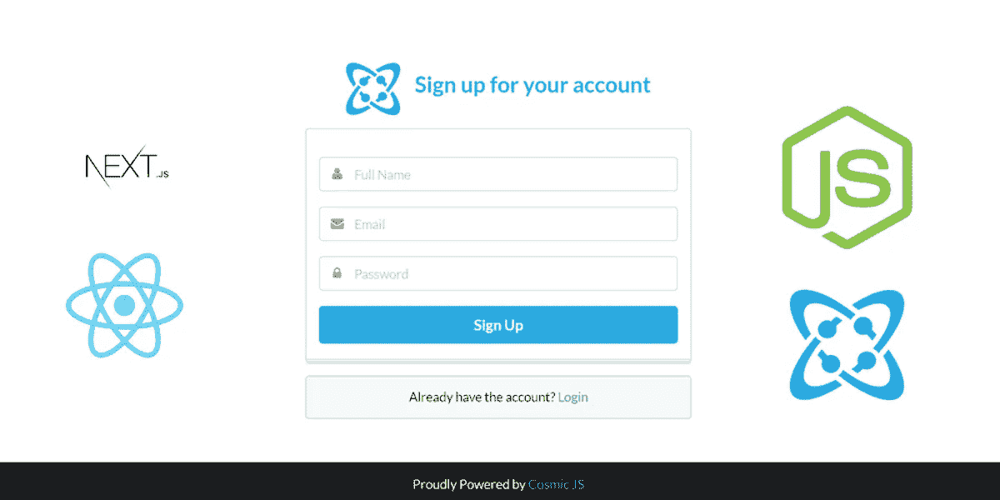
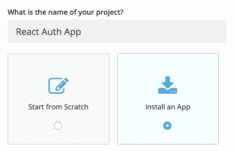
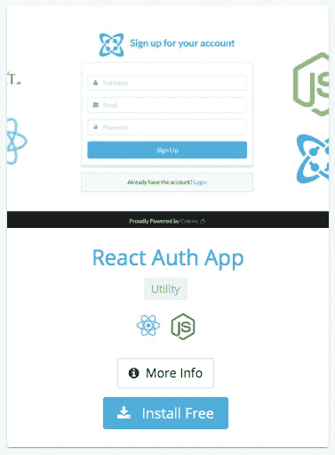
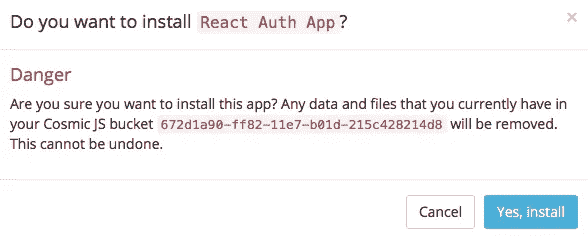
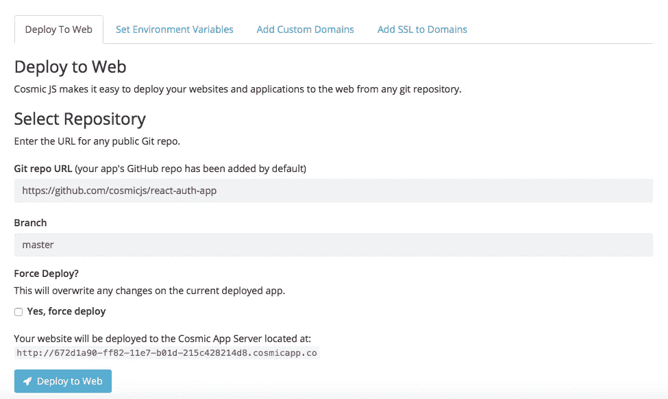
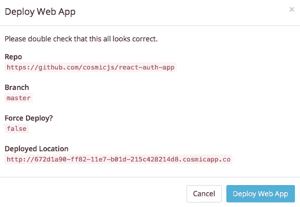

# 分 3 步部署 React Auth 应用程序

> 原文：<https://medium.com/hackernoon/deploy-a-react-auth-app-in-3-steps-61350b20d426>

在这篇博客中，我将分三步演示如何部署一个 [React Auth App](https://cosmicjs.com/apps/react-auth-app) 。这个应用程序展示了使用[宇宙 JS API](https://cosmicjs.com) 在 [ReactJS](https://cosmicjs.com/knowledge-base/react-cms) ，NextJS 和 [NodeJS](https://cosmicjs.com/knowledge-base/nodejs-cms) 中实现认证。这个应用程序有所有的基本模块，如登录，注册，查看/编辑个人资料，忘记密码和重置密码。

从您的[Cosmic JS](https://cosmicjs.com)Bucket Dashboard 安装并管理您的 [React Auth 应用](https://cosmicjs.com/apps/react-auth-app)及其所有内容。简单。😎可以参考下面的[原创教程](https://cosmicjs.com/articles/how-to-build-a-react-auth-app-using-react-cosmic-js-and-node)从头构建 app，也可以继续阅读简单 3 步部署 [React Auth App](https://cosmicjs.com/apps/react-auth-app) 。

 [## 如何使用 React、Cosmic JS 和 Node 构建 React Auth App

### TL；速度三角形定位法(dead reckoning)

hackernoon.com](https://hackernoon.com/how-to-build-a-react-auth-app-using-react-cosmic-js-and-node-9022c0ca328c) 

# TL；速度三角形定位法(dead reckoning)

[React Auth App](https://cosmicjs.com/apps/react-auth-app)
[React Auth App Demo](https://cosmicjs.com/apps/react-auth-app/demo)
[React Auth App code base](https://github.com/cosmicjs/react-auth-app)
[如何使用 React、Cosmic JS 和 Node 构建 React Auth App](https://cosmicjs.com/articles/how-to-build-a-react-auth-app-using-react-cosmic-js-and-node)

我们将使用 [Cosmic JS](https://cosmicjs.com/) 来安装我们的示例应用程序，部署并进行内容更新。 [Cosmic JS](https://cosmicjs.com) 是一个 API 优先的内容管理平台，允许开发人员以任何编程语言构建应用程序，同时为内容编辑人员提供一个熟悉的内容编辑器来管理来自云的动态内容。如果你还没有，从[报名](https://cosmicjs.com/signup)参加[宇宙 JS](https://cosmicjs.com) 开始吧。

# 1.创建新的存储桶

您的 bucket 的名称是您正在构建的网站、项目、客户端或 web 应用程序的名称。

# 2.安装 React Auth 应用程序

[Cosmic JS](https://cosmicjs.com/) 让你能够在 Node.js、Vue.js、React、AngularJS 等编程语言之间进行筛选。

# 3.部署到 Web

导航至位于 Bucket Dashboard 左侧导航栏设置下方的“部署 Web 应用程序”。我点击了“部署到 Web”。然后，我可以在部署 web 应用程序时编辑对象。您将收到一封电子邮件，确认您的 web 应用程序的部署。如果您在部署过程中遇到任何问题，您可能会被转到[宇宙 JS 故障排除页面](https://cosmicjs.com/troubleshooting)。

# 确认部署位置和分支

我正在使用来自宇宙 JS 社区[穆罕默德·穆萨](https://cosmicjs.com/musaghauri)的内容就绪应用，所以我将使用他的主回购:[https://github.com/cosmicjs/react-auth-app](https://github.com/cosmicjs/react-auth-app)

 [## 穆罕默德穆萨|宇宙 JS

### 查找有关 Muhammad Musa 的信息，并了解如何使用 Cosmic JS(API-first CMS 平台)更快地构建应用程序。

cosmicjs.com](https://cosmicjs.com/musaghauri) 

# 部署分支机构确认模式

现在您的应用程序已经部署到了 Cosmic JS 应用程序服务器，您可以从一个位置自由地完全管理您的 React Auth 应用程序及其所有内容。

[Cosmic JS](https://cosmicjs.com/) 是一个 API 第一的基于云的内容管理平台，可以轻松管理应用和内容。如果你对 Cosmic JS API 有任何疑问，请联系 Twitter 或 Slack 的创始人。

[卡森·吉本斯](https://twitter.com/carsoncgibbons)是[宇宙 JS](https://cosmicjs.com/) 的联合创始人& CMO，宇宙 JS 是一个 API 第一的基于云的[内容管理平台](https://cosmicjs.com/)，它将内容与代码分离，允许开发者用他们想要的任何编程语言构建流畅的应用和网站。