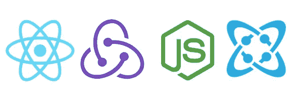
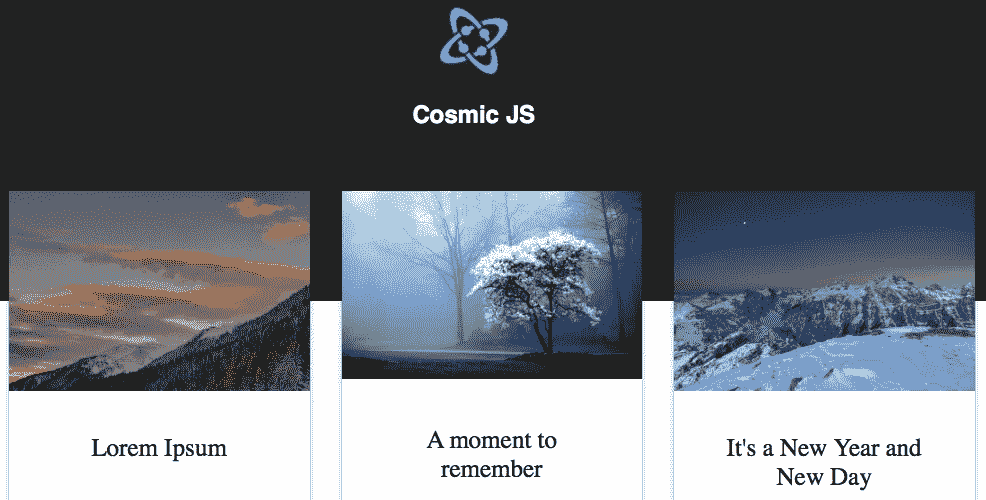
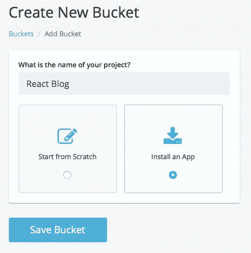
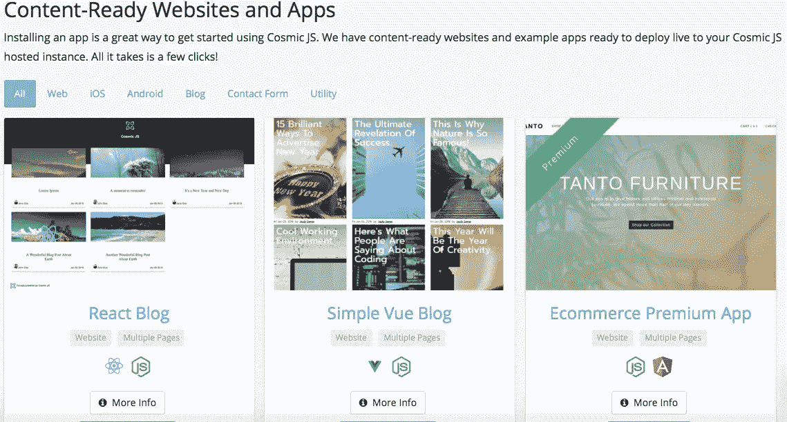
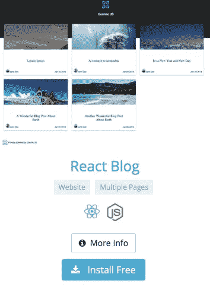
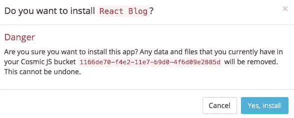
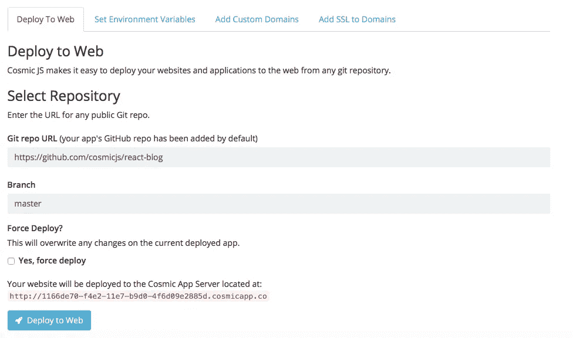

# 使用 Cosmic JS 部署 React 博客

> 原文：<https://medium.com/hackernoon/deploy-a-react-blog-using-cosmic-js-d8c1e49ba89b>

在这篇博客中，我将分三步演示如何部署一个 [React 博客应用](https://cosmicjs.com/apps/react-blog)。这个简单的博客应用程序是使用 React，Redux，& Node.js 构建的。使用 [Cosmic JS NPM 包](https://www.npmjs.com/package/cosmicjs)来查询你的博客内容，React 构建一个客户端应用程序。Cosmic JS 允许内容作者和开发者同时工作，创建最好的内容和代码。安装并管理你的 [React 博客](https://cosmicjs.com/apps/react-blog)和它的所有内容。简单。😎你可以参考下面的[原创教程](https://cosmicjs.com/articles/how-to-build-a-simple-blog-using-vue-cosmic-js-and-deploy-to-netlify)从头构建 app，或者继续阅读简单 3 步部署 React 博客。

# TL；速度三角形定位法(dead reckoning)

[React Blog](https://cosmicjs.com/apps/react-blog)
[React Blog Demo](https://cosmicjs.com/apps/react-blog/demo)
[React Blog code base](https://github.com/cosmicjs/react-blog)
[如何使用 Cosmic JS 和 React 建立博客](https://cosmicjs.com/articles/how-to-build-a-blog-with-cosmic-js-and-react-jc2f3o9g)

[https://cosmicjs.com/apps/react-blog](https://cosmicjs.com/apps/react-blog)

我们将使用 [Cosmic JS](https://cosmicjs.com/) 来安装我们的示例应用程序，部署并进行内容更新。Cosmic JS 是一个 API 优先的内容管理平台，允许开发人员以任何编程语言构建应用程序，同时为内容编辑器提供一个熟悉的内容编辑器来管理来自云的动态内容。如果你还没有，那就从[注册](https://cosmicjs.com/signup)宇宙 JS 开始吧。

# 1.创建新的存储桶

您的 bucket 的名称是您正在构建的网站、项目、客户端或 web 应用程序的名称。

# 2.安装 React 博客

[Cosmic JS](https://cosmicjs.com/) 让你能够在 Node.js、Vue.js、React、AngularJS 等编程语言之间进行筛选。

# 3.部署到 Web

导航至位于 Bucket Dashboard 左侧导航栏设置下方的“部署 Web 应用程序”。我点击了“部署到 Web”。然后，我可以在部署 web 应用程序时编辑对象。您将收到一封电子邮件，确认您的 web 应用程序的部署。如果您在部署过程中遇到任何问题，您可能会被转到 [Cosmic JS 故障排除页面](https://cosmicjs.com/troubleshooting)。

# 确认部署位置和分支

[https://cosmicjs.com/apps/react-blog](https://cosmicjs.com/apps/react-blog)

我在宇宙 JS 社区使用 Brian Ray 的内容就绪应用程序，所以我将使用他的主回购:【https://github.com/cosmicjs/react-blog

现在您的应用程序已经部署到了 Cosmic JS 应用程序服务器上，您可以从一个地方自由地完全管理您的 React 博客及其所有内容。

[Cosmic JS](https://cosmicjs.com/) 是一个 API 第一的基于云的内容管理平台，使管理应用和内容变得容易。如果你有关于 Cosmic JS API 的问题，请在 [Twitter](https://twitter.com/cosmic_js) 或 [Slack](https://cosmicjs.com/community) 上联系创始人。

[卡森·吉本斯](https://twitter.com/carsoncgibbons)是 [Cosmic JS](https://cosmicjs.com/) 的联合创始人& CMO，这是一个 API 第一的基于云的[内容管理平台](https://cosmicjs.com/)，它将内容从代码中分离出来，允许开发人员用他们想要的任何编程语言构建流畅的应用程序和网站。