# 使用 Alexa 部署群集群

> 原文：<https://medium.com/hackernoon/deploy-a-swarm-cluster-with-alexa-ae5fa8b8dffa>

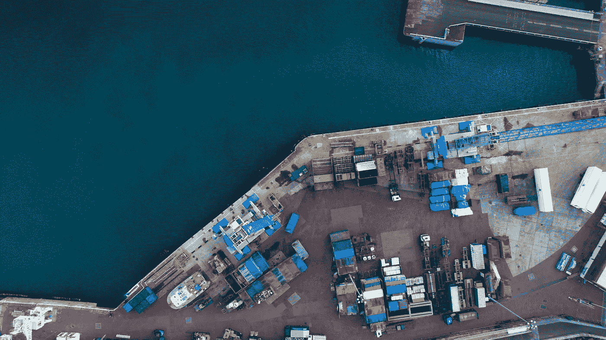

**无服务器**和**容器**改变了我们利用公共云的方式，以及我们编写、部署和维护应用的方式。结合这两种范式的一个很好的方法是基于 **Lambda** 函数用 **Alexa** 构建一个语音助手——用 **Go** 编写——在 **AWS** 上部署 **Docker Swarm** 集群。

下图显示了使用 Alexa 在 AWS 上部署生产就绪 Swarm 集群所需的所有组件。

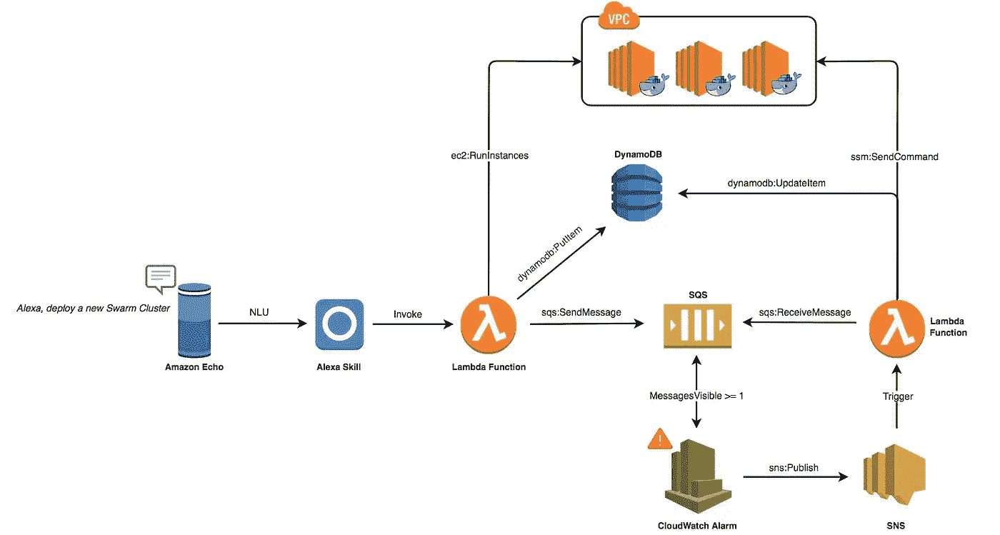

注意:我的 [GitHub](https://github.com/mlabouardy/alexa-swarm) 上有完整的代码。

用户将要求亚马逊 Echo 部署一个群集群:

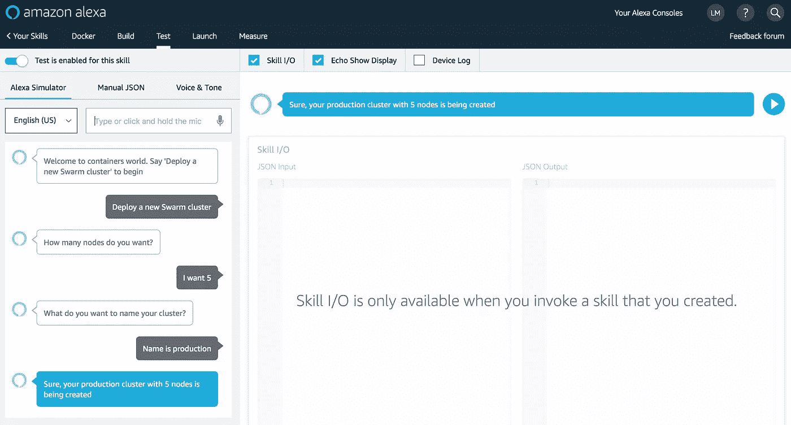

**Echo** 会以内置的自然语言理解和语音识别拦截用户的语音指令。将它们传送到 Alexa 服务。一个定制的 Alexa 技能会将语音命令转换成意图:

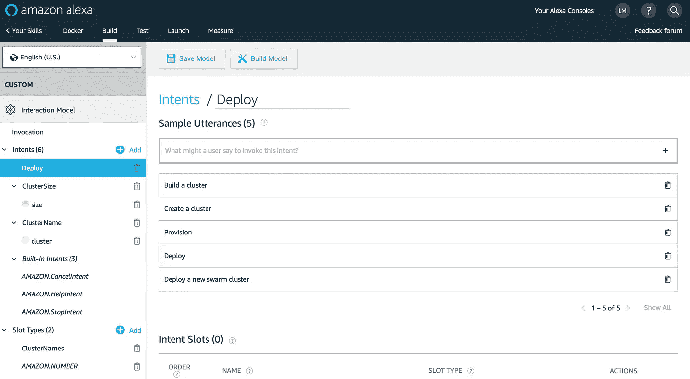

**Alexa 技能**将触发 Lambda 功能以实现意图:

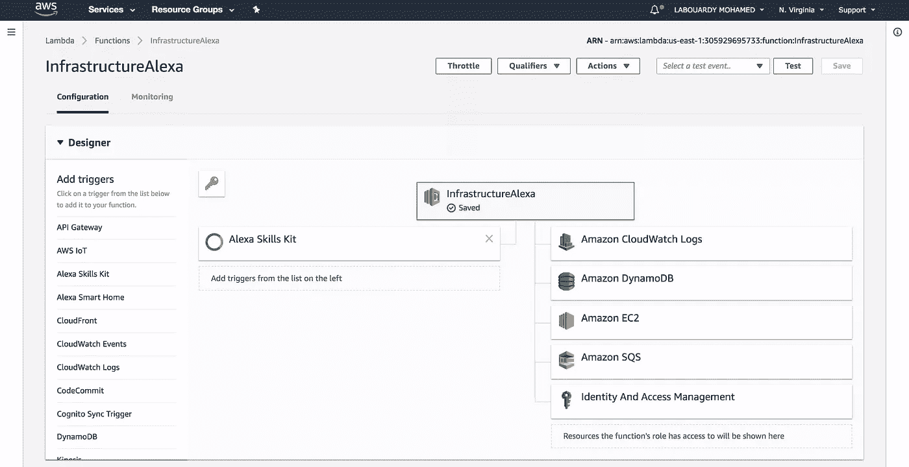

Lambda 函数将使用 **AWS EC2 API** 从预装了 **Docker CE** 的 **AMI** 中部署一队 EC2 实例(我使用 **Packer** 来烘焙 AMI 以减少实例的冷启动)。然后，将群集 IP 地址推送到 SQS:

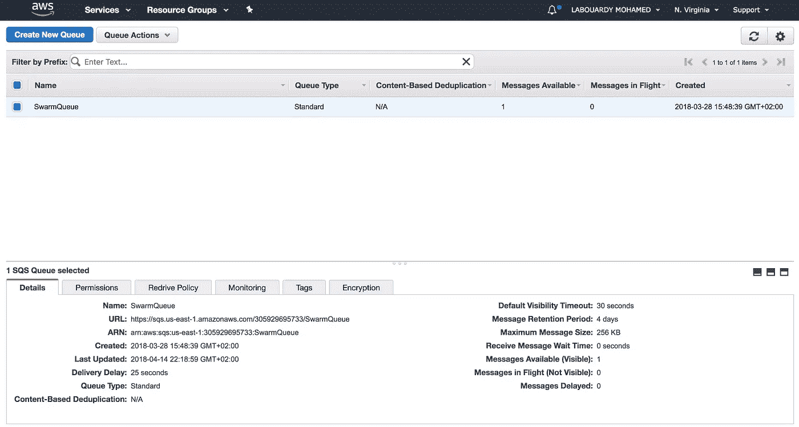

接下来，该函数将使用集群的当前状态向 **DynamoDB** 表中插入一个新项目:

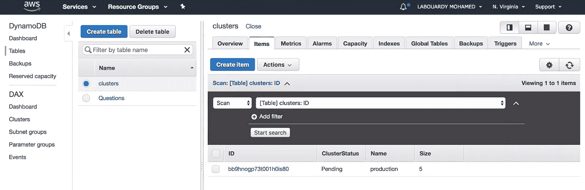

一旦 **SQS** 收到该消息，将触发 **CloudWatch 警报**(它监控*approximaturenumberofmessages visible*参数)，并因此向 **SNS 主题**发布消息:

**SNS** 话题触发订阅的 Lambda 函数:

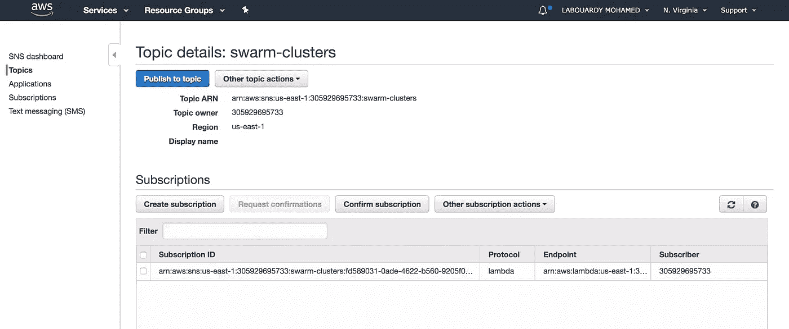

**Lambda** 函数将获取新集群的队列，并使用 **AWS 系统管理器 API** 在之前创建的 EC2 实例群上提供一个 Swarm 集群:

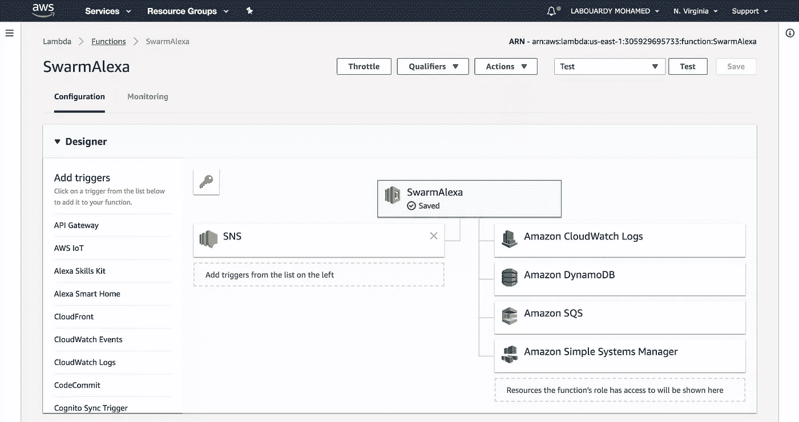

为了调试，该函数将把**群令牌**输出到 **CloudWatch** :

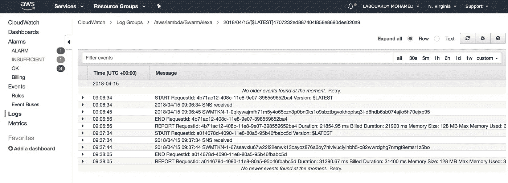

最后，它会将 **DynamoDB** 项的状态从*待定*更新为*完成*，并删除来自 SQS 的消息。

你可以在亚马逊 Echo、Echo Dot 或任何 Alexa 设备上测试你的技能，方法是说:“ *Alexa，打开 Docker* ”

在上述工作流程结束时，将创建一个**群集群**:

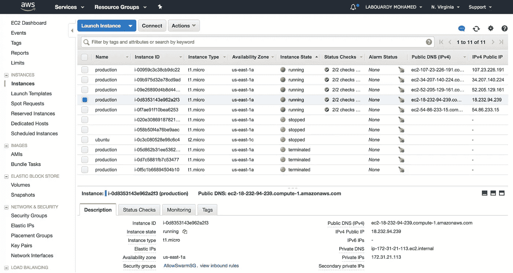

此时，您可以通过发出如下所示的命令来查看您的群状态:

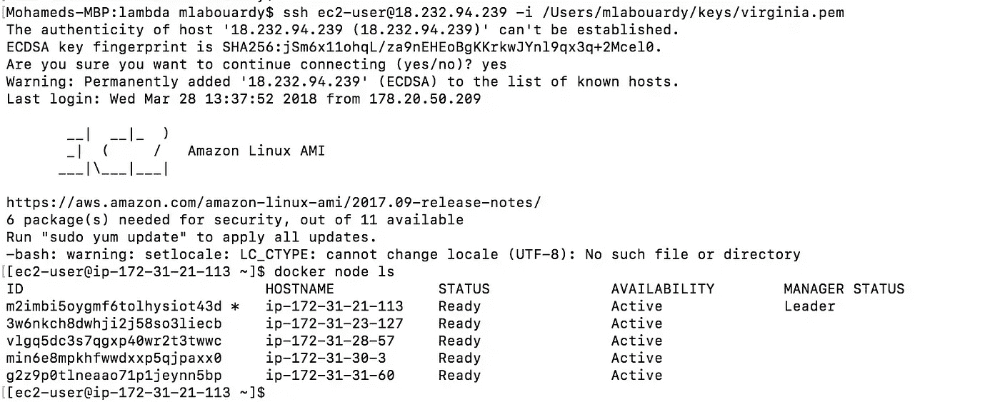

**改进&限制:**

*   **Lambda** 如果集群规模很大，执行超时。你可以使用一个**主** Lambda 函数来产生子 Lambda。
*   **cloud watch**&**SNS**如果支持 SQS 作为 Lambda 事件源(AWS PLEAAASE！). **DynamoDB streams** 或 **Kinesis streams** 不能用来通知 Lambda，因为我想在设置 Swarm 集群之前为要完全创建的实例创建某种**延迟**。(可能**简单工作流服务**？)
*   在 **SQS** 之前注入 **SNS** 。SNS 可以将消息添加到 SQS，并触发**λ**功能。我们不需要 CloudWatch 警报。
*   你可以通过添加新的定制意图来提高技能，在集群上部署 **Docker 容器**或者要求 Alexa 在 **VPC** 上部署集群…

关于这个技能的详细信息可以在我的 GitHub 上找到。请务必在下面留下您的评论、反馈或建议，或者直接在 Twitter 上与我联系[***@****mlabouardy*](https://twitter.com/mlabouardy)*。*