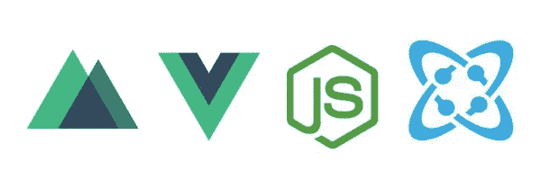
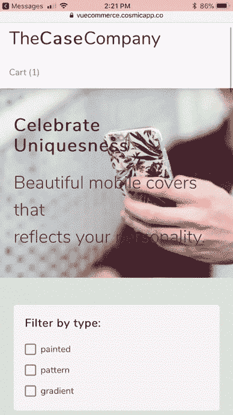
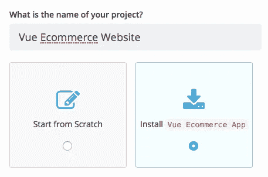
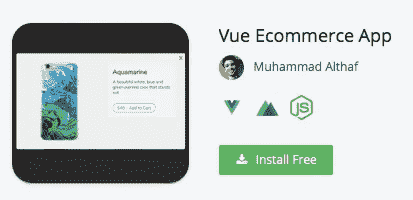
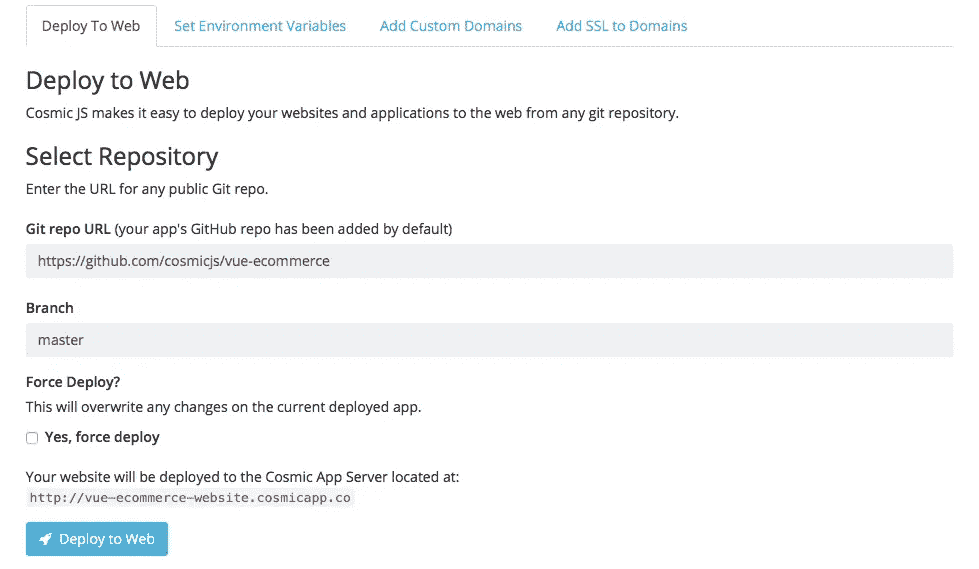
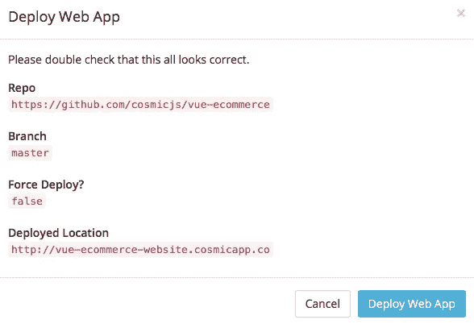

# 分 3 步部署 Vue 电子商务应用

> 原文：<https://medium.com/hackernoon/deploy-a-vue-ecommerce-app-in-3-steps-799cccb75f7b>

在这篇博客中，我将分三步演示如何部署一个电子商务网站。这个网站是用 Nuxt 和 Cosmic JS 搭建的一个简单的电商 app。Stripe 被集成为支付处理器。基于 Flexbox 的布尔玛框架与 Buefy 组件一起用于造型。这款应用由 [Muhammad Althaf](https://cosmicjs.com/althaffe) 为 Cosmic JS 社区打造，基于 Vue.js、Nuxt.js、Node.js 和 Cosmic JS。

安装和管理你的 [Vue 电子商务网站](https://cosmicjs.com/apps/vue-ecommerce-app)和所有来自你的宇宙 JS 桶仪表板的内容。简单。😎你可以参考下面的[原创教程](https://cosmicjs.com/articles/how-to-build-an-e-commerce-website-with-nuxt-and-cosmic-js-jdr4nros)从头开始构建 app，或者继续阅读简单的 3 步部署 Vue 电商网站。

# TL；速度三角形定位法(dead reckoning)

[Vue 电商网站](https://cosmicjs.com/apps/vue-ecommerce-app)
[Vue 电商网站演示](https://cosmicjs.com/apps/vue-ecommerce-app/demo)
[Vue 电商网站代码库](https://github.com/cosmicjs/vue-ecommerce)
[如何用 Nuxt 和 Cosmic JS 搭建电商网站](https://cosmicjs.com/articles/how-to-build-an-e-commerce-website-with-nuxt-and-cosmic-js-jdr4nros)

我们将使用 [Cosmic JS](https://cosmicjs.com/) 来安装我们的示例应用程序，部署并进行内容更新。Cosmic JS 是一个 API 优先的内容管理平台，允许开发人员以任何编程语言构建应用程序，同时为内容编辑器提供一个熟悉的内容编辑器来管理来自云的动态内容。如果你还没有，那就从[注册](https://cosmicjs.com/signup)宇宙 JS 开始吧。

# 1.创建新的存储桶

您的 bucket 的名称是您正在构建的网站、项目、客户端或 web 应用程序的名称。

# 2.安装 Vue 电子商务网站

[Cosmic JS](https://cosmicjs.com/) 让你能够在 Node.js、Vue.js、React、AngularJS 等框架和编程语言之间进行筛选。

# 3.部署到 Web

导航至位于 Bucket Dashboard 左侧导航栏设置下方的“部署 Web 应用程序”。我点击了“部署到 Web”。然后，我可以在部署 web 应用程序时编辑对象。您将收到一封电子邮件，确认您的 web 应用程序的部署。如果您在部署过程中遇到任何问题，您可能会被转到 [Cosmic JS 故障排除页面](https://cosmicjs.com/troubleshooting)。

# 确认部署位置和分支

# 部署分支机构确认模式

我正在使用来自[宇宙 JS 社区](https://cosmicjs.com/about)的 [Muhammad Althaf](https://cosmicjs.com/althaffe) 的内容就绪应用，所以我将使用他的主报告:

 [## cosmicjs/vue-电子商务

### vue-ecommerce -带有 Nuxt 和 Cosmic JS 的电子商务应用程序

github.com](https://github.com/cosmicjs/vue-ecommerce) 

现在你的应用已经部署到了 Cosmic JS 应用服务器，你可以自由地从一个地方完全管理你的 [Vue 电子商务网站](https://cosmicjs.com/apps/vue-ecommerce-app)及其所有内容。

[Cosmic JS](https://cosmicjs.com/) 是一个 API 第一的基于云的内容管理平台，可以轻松管理应用和内容。如果你对 Cosmic JS API 有任何疑问，请联系 Twitter 或 Slack 的创始人。

[卡森·吉本斯](https://twitter.com/carsoncgibbons)是[宇宙 JS](https://cosmicjs.com/) 的联合创始人& CMO，宇宙 JS 是一个 API 第一的基于云的[内容管理平台](https://cosmicjs.com/)，它将内容与代码分离，允许开发者用他们想要的任何编程语言构建流畅的应用和网站。