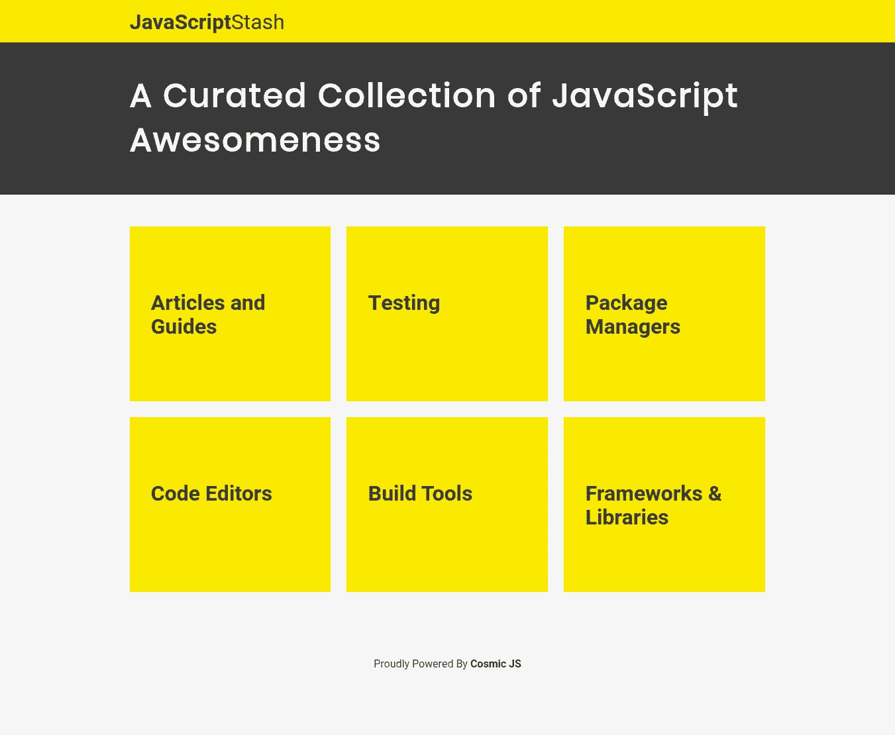
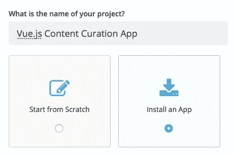
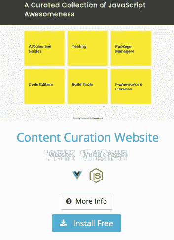
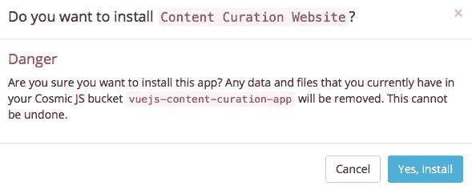
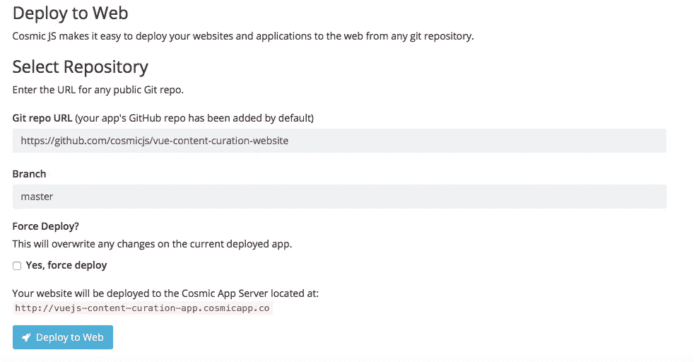
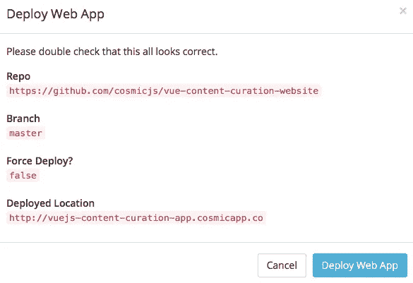

# 分 3 步部署 Vue.js 内容监管应用程序

> 原文：<https://medium.com/hackernoon/deploy-a-vue-js-content-curation-app-in-3-steps-e240095e8fb3>

在这篇博客中，我将分三步演示如何部署一个 Vue 内容监管应用程序。 [app](https://cosmicjs.com/apps/content-curation-website) 是一个简单的内容监管网站，由宇宙社区成员 [Muhammad Althaf 用](https://cosmicjs.com/althaffe) [Vue](https://cosmicjs.com/knowledge-base/vuejs-cms) 、布尔玛和[宇宙 JS](https://cosmicjs.com/) 搭建。在他最近的博客中，他写道，“建立资源和工具的精选收藏是在你的社区中获得可见性的一个简单方法。”

 [## 如何用 Vue 和 Cosmic JS 搭建内容策展网站

### 构建资源和工具的精选集合是在您的社区中获得可见性的简单方法。在这个…

hackernoon.com](https://hackernoon.com/how-to-build-a-content-curation-website-with-vue-and-cosmic-js-323cb4ac3681) 

从您的 Cosmic JS Bucket 仪表盘安装并管理您的 [Vue 内容管理应用](https://cosmicjs.com/apps/content-curation-website)及其所有内容。简单。😎可以参考下面的[原创教程](https://cosmicjs.com/articles/how-to-build-a-content-curation-website-with-vue-and-cosmic-js-jcu4c3us)从头构建 app，也可以继续阅读简单 3 步部署 [Vue 内容策展 App](https://cosmicjs.com/apps/content-curation-website) 。

# TL；速度三角形定位法(dead reckoning)

[Vue 内容策展 App](https://cosmicjs.com/apps/content-curation-website)
[Vue 内容策展 App 演示](https://cosmicjs.com/apps/content-curation-website/demo)
[Vue 内容策展 App 代码库](https://github.com/cosmicjs/vue-content-curation-website)
[如何利用 Vue 和 Cosmic JS 搭建内容策展网站](https://cosmicjs.com/articles/how-to-build-a-content-curation-website-with-vue-and-cosmic-js-jcu4c3us)

我们将使用 [Cosmic JS](https://cosmicjs.com/) 来安装我们的示例应用程序，部署并进行内容更新。Cosmic JS 是一个 API 优先的内容管理平台，允许开发人员以任何编程语言构建应用程序，同时为内容编辑器提供一个熟悉的内容编辑器来管理来自云的动态内容。如果你还没有，那就从[注册](https://cosmicjs.com/signup)宇宙 JS 开始吧。

# 1.创建新的存储桶

您的 bucket 的名称是您正在构建的网站、项目、客户端或 web 应用程序的名称。

# 2.安装 Vue 内容监管应用程序

[Cosmic JS](https://cosmicjs.com/) 让你能够在 Node.js、Vue.js、React、AngularJS 等编程语言之间进行筛选。

# 3.部署到 Web

导航至位于 Bucket Dashboard 左侧导航栏设置下方的“部署 Web 应用程序”。我点击了“部署到 Web”。然后，我可以在部署 web 应用程序时编辑对象。您将收到一封电子邮件，确认您的 web 应用程序的部署。如果您在部署期间遇到任何问题，您可能会被转到 [Cosmic JS 故障排除页面](https://cosmicjs.com/troubleshooting)。

# 确认部署位置和分支

我正在使用来自宇宙 JS 社区 [Muhammad Althaf](https://cosmicjs.com/althaffe) 的内容就绪应用程序，所以我将使用他的主报告:[https://github.com/cosmicjs/vue-content-curation-website](https://github.com/cosmicjs/vue-content-curation-website)

# 部署分支机构确认模式

现在你的应用已经部署到了 Cosmic JS 应用服务器，你可以自由地从一个地方完全管理你的 [Vue 内容管理应用](https://cosmicjs.com/apps/content-curation-website)及其所有内容。

[Cosmic JS](https://cosmicjs.com/) 是一个 API 第一的基于云的内容管理平台，可以轻松管理应用和内容。如果你有关于 Cosmic JS API 的问题，请在 [Twitter](https://twitter.com/cosmic_js) 或 [Slack](https://cosmicjs.com/community) 上联系创始人。

[卡森·吉本斯](https://twitter.com/carsoncgibbons)是[宇宙 JS](https://cosmicjs.com/) 的联合创始人& CMO，宇宙 JS 是一个 API 第一的基于云的[内容管理平台](https://cosmicjs.com/)，它将内容从代码中分离出来，允许开发人员用他们想要的任何编程语言来构建流畅的应用程序和网站。