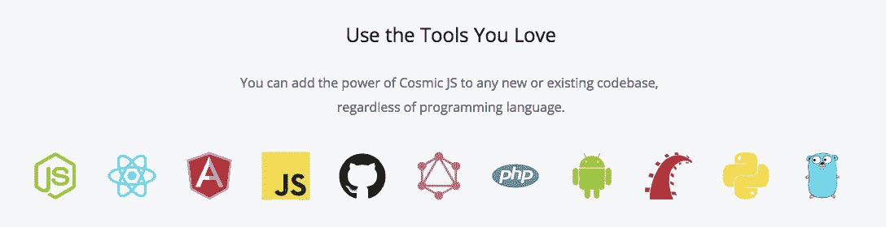
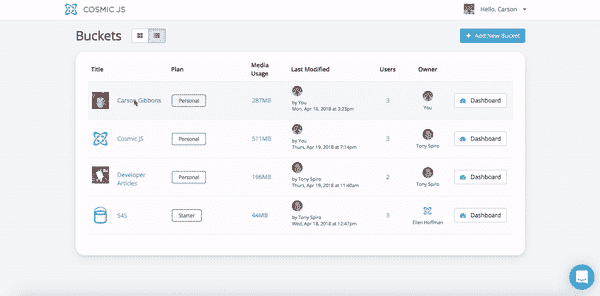

# 使用 Zeit、Heroku 和 Netlify 部署 Cosmic JS 驱动的应用程序

> 原文：<https://medium.com/hackernoon/deploy-cosmic-js-powered-apps-using-zeit-heroku-and-netlify-eb008710840a>

在[使用 Cosmic JS](https://cosmicjs.com/articles/how-to-deploy-your-codebase-using-cosmic-js-jfipau9p) 部署你的代码库中，我写了只使用 GitHub repo 和 Cosmic JS 系统部署 [Cosmic JS 应用](https://cosmicjs.com/apps)是多么容易。Cosmic JS 允许开发人员将他们的代码库部署到 Cosmic JS 应用程序服务器上，用于测试和演示目的，并且现在提供了新的生产部署选项，这些选项可用于一些您最喜欢的部署服务。

你现在可以部署 [Cosmic JS 驱动的应用](https://cosmicjs.com/apps)到 [Heroku](https://www.heroku.com/) 、 [Zeit](https://zeit.co/) 和 [Netlify](https://www.netlify.com/) 。构建快速的渐进式 web 应用程序需要使用强大的微服务工具，并根据应用程序的需求灵活地部署到您喜欢的服务。使用 Heroku、Zeit 或 Netlify 等服务轻松部署 web 应用程序，这得益于已经用您最喜欢的工具简化的开发流程。

[Cosmic JS](https://cosmicjs.com) 使用 Dokku (Docker + Heroku 类部署)将你的 app 从任何 GitHub、BitBucket 或任何其他公共 repo 部署到自己的子域。只要您的应用程序遵循 [Heroku 部署指南](https://devcenter.heroku.com/)，部署就会成功。如果您已经将 GitHub 帐户连接到 Cosmic JS，您也可以部署您的私人 GitHub repos。您部署的应用程序将包括用于连接到您的 Cosmic JS Bucket 的环境变量。您将需要一个用于部署 Cosmic JS 应用程序的服务帐户。

[浏览要部署到 Zeit、Heroku 或 Netlify 的应用](https://cosmicjs.com/apps)
[如何使用 Cosmic JS](https://cosmicjs.com/articles/how-to-deploy-your-codebase-using-cosmic-js-jfipau9p)
[开发人员文档](https://cosmicjs.com/docs)

我希望本教程对你有所帮助。如果你对[宇宙 JS](https://cosmicjs.com) 系统的特性有任何问题或意见，我很乐意听听。你可以参考我的 [Cosmic JS 简介](https://cosmicjs.com/carsongibbons)来获取更多关于如何直观地导航 Cosmic JS 仪表盘的内容。

[Cosmic JS](https://cosmicjs.com) 是一个 [API 优先的 CMS](https://cosmicjs.com) ，它允许开发者和编辑的混合团队围绕一个[编程语言不可知的 API](https://cosmicjs.com) 进行协作，以管理他们的内容、数据、文件和应用。