# 通过 Minikube 在本地将 Magento 2 和 MySQL 部署到 Kubernetes

> 原文：<https://medium.com/hackernoon/deploy-magento2-app-mysql-on-kubernetes-locally-via-minikube-558beebb0f>

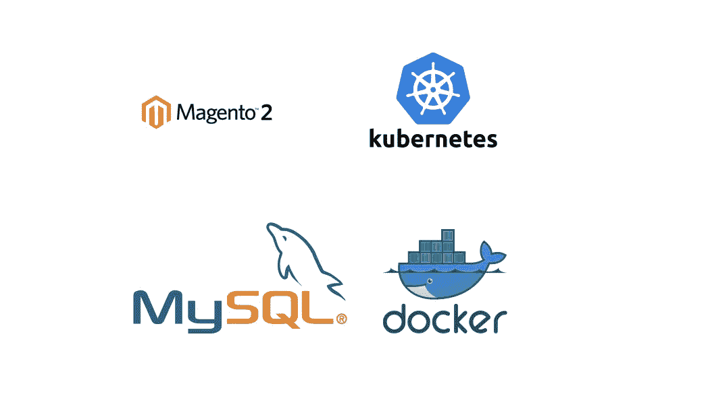

最近，我一直在探索容器和可伸缩微服务的美丽而令人惊叹的世界。这时候我才知道 Kubernetes，Docker 等*头牌*。所以作为一个“新手”，我搜索了关于如何使用 Kubernetes 管理 Dockerized Magento 2 应用程序的文章和教程。

我做了**拼凑(Magento，Kubernetes 和 Docker)** 的工作，我想分享它。本文的目标是将简单的 docker 图像([**alexcheng/magento 2**](https://hub.docker.com/r/alexcheng/magento2/)&[**MySQL:5.6**](https://hub.docker.com/_/mysql/))转化为运行在 Kubernetes 上的应用程序。基本上，MySQL 和 core Magento 2 web 应用程序被打包到单独的 Docker 容器中，这些 Docker 容器将通过 Minikube 在 kubernetes 上运行。

这只会在本地运行，不会在云上运行。我的下一篇技术文章将是关于在 Google Cloud——Kubernetes Engine(GKE)上运行 Magento 2，所以如果你对 **DevOps** 、**云计算、Site Reliable Engineering (SRE)、全栈开发**、**后端开发、解决方案架构、系统管理和计算机黑客**感兴趣，请点击下面的按钮。

**首先，这些家伙是谁，Magento，Kubenetes，Minikube，Docker？**

让我们来定义它们:

> [**Magento**](https://magento.com/) 为成千上万的零售商和品牌提供最好的电子商务平台和灵活的云解决方案，帮助他们快速创新和发展。
> 
> Kubernetes 是一个开源系统，用于自动化部署、扩展和管理容器化的应用程序。
> 
> [**Minikube**](https://github.com/kubernetes/minikube) 是一个可以轻松在本地运行 Kubernetes 的工具。Minikube 在笔记本电脑上的虚拟机中运行一个单节点 Kubernetes 集群，供希望尝试 Kubernetes 或日常使用它进行开发的用户使用。
> 
> [**Docker**](https://www.docker.com/) 是一个开放平台，开发人员和系统管理员可以在笔记本电脑、数据中心虚拟机或云上构建、发布和运行分布式应用。

我会试着一步步为你解释这个过程。这将花费我们几分钟时间。

在我们开始之前，让我们确保具备这些**先决条件**:

1.  **Docker:** 我们需要下载、安装并运行。

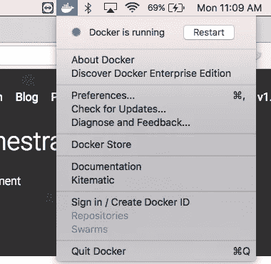

*Note: The platform I am using is Docker for Mac on OS X*

2.对于 OS X，我们需要**自制软件**来安装 xhyve 驱动程序。

3.克隆我的[**资源库**](https://github.com/siphesande/magento2-minikube) **。**

# **步骤 1:创建一个小型集群**

我们将使用 Minikube 创建一个本地集群。我们需要先下载它:

```
Use curl to download and install the latest Minikube release. Let us cut and paste this to the terminal**curl -Lo minikube https://storage.googleapis.com/minikube/releases/latest/minikube-darwin-amd64 && \
  chmod +x minikube && \
  sudo mv minikube /usr/local/bin/**Use Homebrew to install the xhyve driver and set its permissions:**brew install docker-machine-driver-xhyve
sudo chown root:wheel $(brew --prefix)/opt/docker-machine-driver-xhyve/bin/docker-machine-driver-xhyve
sudo chmod u+s $(brew --prefix)/opt/docker-machine-driver-xhyve/bin/docker-machine-driver-xhyve**-[kubernetes.io](https://kubernetes.io/docs/tutorials/stateless-application/hello-minikube/)
```

下一个挑战是下载 [**kubectl**](https://kubernetes.io/docs/tasks/tools/install-kubectl/) 命令行工具，我将使用它与 Kubernetes 集群进行交互:

```
$ brew install kubectl
```

现在让我们开始吧！第一件事是启动 minikube 集群。我们在终端中键入以下命令:

```
$ minikube start — vm-driver=xhyve
```

我们的输出将是这样的:

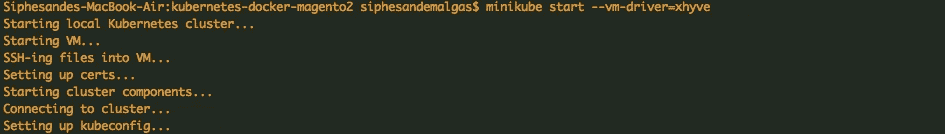

现在我们需要设置 Minikube 上下文。上下文决定了 kubectl 与哪个集群进行交互。

```
$ kubectl config use-context minikube
Output: Switched to context "minikube".
```

我们确保使用 Minikube Docker 守护程序:

```
$ eval $(minikube docker-env)
```

# 步骤 2:创建部署和服务

Kubernetes[**Pod**](https://kubernetes.io/docs/tutorials/stateless-application/hello-minikube/)**是一组一个或多个容器，为了管理和联网的目的而捆绑在一起。Kubernetes [部署](https://kubernetes.io/docs/concepts/workloads/controllers/deployment/)检查我们的 Pod 的健康状况，如果它终止，就重启 Pod 的容器。部署是管理 pod 的创建和扩展的推荐方式。**

## **Kubernetes 仪表板/UI**

**为了访问 [Kubernetes 仪表板](https://kubernetes.io/docs/tasks/access-application-cluster/web-ui-dashboard/)，我们在启动 minikube 后运行这个命令来获取地址:**

```
$ minikube dashboard 
```

**Kubernetes UI(仪表盘)会自动打开！**

**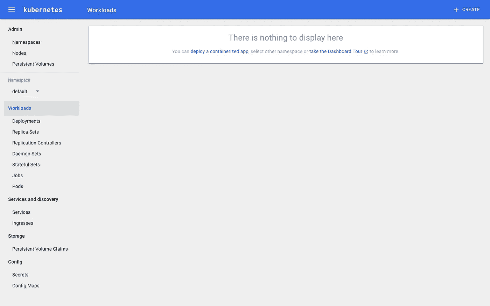**

**Nothing Deployed yet**

## ****部署 Magento 2****

**这是事情变得更加有趣，我保证你会发现 kubernetes 非常有吸引力。以下要点描述了 Magento 2 部署和服务的单实例。它使用类似于 [**秘密**](https://kubernetes.io/docs/concepts/configuration/secret/) 的特征作为密码。它使用不同的设置:`***type: NodePort***`。该设置将 Magento 2 暴露给来自 minikube 集群外部的流量。**

**在我们的终端上，我们键入以下命令来部署 Magento 2:**

```
$ kubectl create -f magento2-deployment.yaml
```

**要查看部署，我们只需键入以下命令:**

```
$ kubectl get deployments
```

**输出:**

**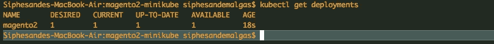**

**We have one deployment**

**让我们来看看豆荚:**

```
$ kubectl get pods
```

**输出:**

**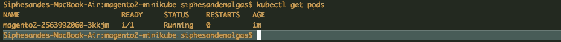**

**We have only one service**

**如果我们还想查看集群事件，只需在终端上键入以下命令:**

```
$ kubectl get events
```

## ****创建 Magento 2 服务—公开****

**您刚才看到了上面文件中的代码( [magento2-deployment.yaml](https://gist.github.com/siphesande/d422755b754013690470c8506df13566) )。以下代码取自上述文件，用于创建 Magento 2 服务。**

```
 apiVersion: v1
kind: Service
metadata:
  name: magento2
  labels:
    app: magento2
spec:
  ports:
    - port: 80
  selector:
    app: magento2
    tier: frontend
  type: NodePort 
```

> **注意:为了简化，您可以将这段代码放在一个单独的文件中(命名为:magento2-service.yaml ),并在终端中编写以下命令:**
> 
> **$ ku bectl create-f magento 2-service . YAML**
> 
> **它将为您公开 magento2 服务。**

**默认情况下，Pod 只能通过其在 Kubernetes 集群中的内部 IP 地址进行访问。因此，为了使 Magento 2 容器可以从 Kubernetes 虚拟网络外部访问，我们必须将 Pod 公开为 Kubernetes 服务。**

**要查看我们刚刚创建的服务。我们在命令行中编写以下命令:**

```
$ kubectl get services
```

**我们的产出:**

**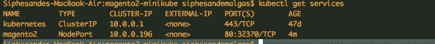**

**Note: magento2 TYPE is NodePort**

## ****部署 MySQL****

**它与部署 Magento 2 部署的过程相同。**

**mysql-deployment.yaml 文件如下所示:**

**Note: The MySQL container mounts the PersistentVolume at /var/lib/mysql. The `**MYSQL_ROOT_PASSWORD**` environment variable sets the database password from the Secret. To create Secrets object that stores a piece of sensitive data, password we type this in the terminal: `kubectl create secret generic mysql-pass --from-literal=password=MY_PASSWORD`**

```
$ kubectl create -f mysql-deployment.yaml 
```

**现在让我们查看所有部署:**

```
$ kubectl get deployments
```

**我们的产出:**

**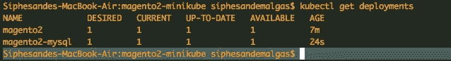**

**Note: now we have two deployments**

**让我们看看所有的豆荚:**

```
$ kubectl get pods
```

**输出:**

**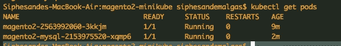**

**Note: now we have two pods**

## ****公开 MySQL 服务****

**我们已经用上面的代码在 **mysql-deployment.yaml** 文件**中公开了 MySQL。**要查看我们刚刚创建的服务:**

```
$ kubectl get services
```

**我们的产出:**

**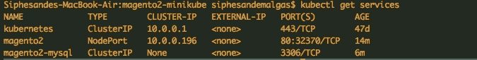**

****最后，我们的 kubernetes 用户界面(仪表板)将是这样的:****

**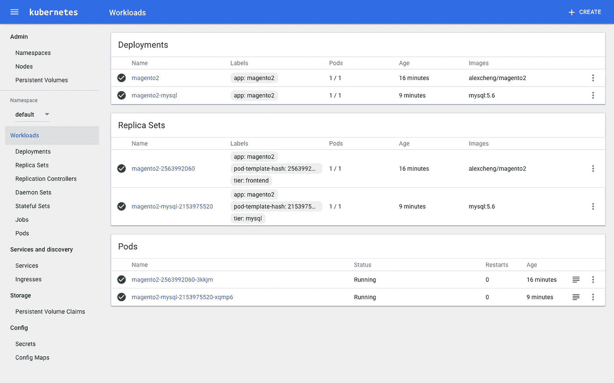**

**This is cool!**

> ****网络泄密****
> 
> **minikube 虚拟机通过一个主机专用的 IP 地址向主机系统公开，该地址可以通过 minikube ip 命令获得。任何 NodePort 类型的服务都可以通过该 IP 地址在 NodePort 上访问。要确定您的服务的节点端口，您可以使用 kubectl 命令，如下所示:**
> 
> **$ ku bectl get SERVICE $ SERVICE output = ' JSON path = " { . spec . ports[0]。节点端口}“”**
> 
> **[— kubernetes.io](https://kubernetes.io/docs/getting-started-guides/minikube/)**

# ****步骤 3 : Magento 2 设置****

**下面将使用本地 IP 地址自动打开一个浏览器窗口，显示 Magento 2 设置页面。**

```
$ minikube service magento2
```

**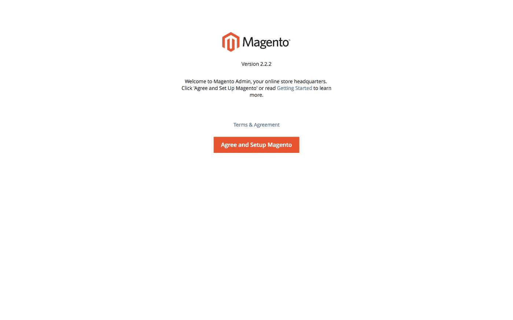**

**太神奇了！就这样！现在我们已经运行了 Magento 2 应用程序！**

**我们的下一步是按下**:按下同意并设置>恒星就绪检查>下一个****

**现在我们就要结束这一章了，看看下面几页，照着我做的去做，你就会成功了！**

**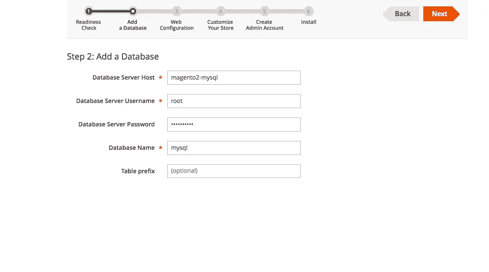****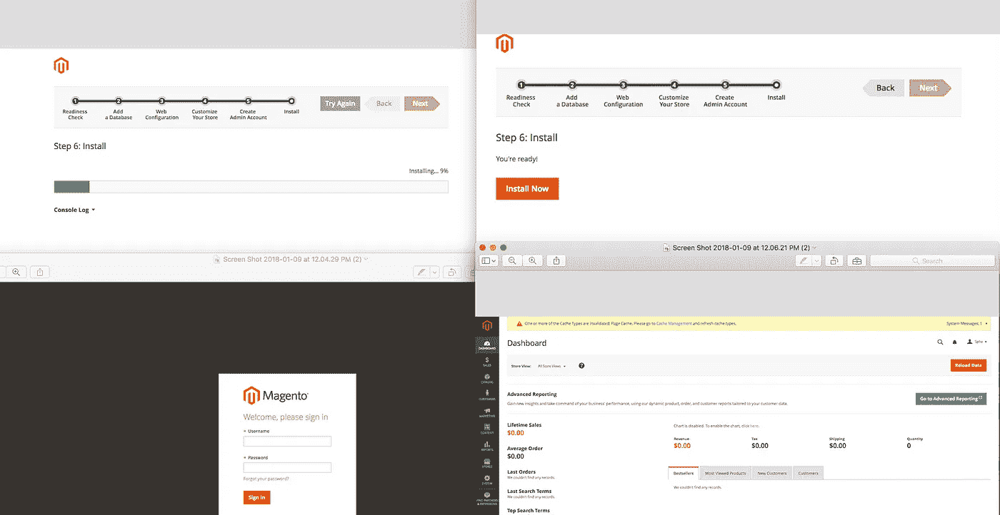**

**女士们，先生们，现在我们已经到达了旅程的终点。**

**还可以阅读一下 [**执着卷**](https://kubernetes.io/docs/concepts/storage/persistent-volumes/)**【s】**感谢 [**创作者**](https://github.com/alexcheng1982)**[**alexcheng/magento 2**](https://hub.docker.com/r/alexcheng/magento2/)的形象。如果您有任何问题，请在评论区发表或访问 [minikube 社区](http://slack.kubernetes.io/)。****

****我将发表另一篇博文，届时我将使用谷歌云——Kubernetes 引擎，而不是 minikube。请鼓掌，在 medium & Twitter[**@**sphemalgas](https://twitter.com/sphemalgas)上跟我来。****

> ****我感谢你…..我出来了！****