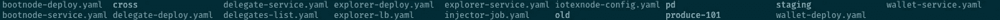

# 使用 Kubernetes 部署、操作和监控 IoTeX 集群

> 原文：<https://medium.com/hackernoon/deploy-operate-and-monitor-iotex-cluster-with-kubernetes-76a2cc547459>

Kubernetes 是一个开源系统，用于自动部署、扩展和管理容器化的应用程序。容器化是全机虚拟化的一种轻量级替代方案，它将应用程序封装在一个具有自己的操作环境的容器中。集装箱化在过去几年中已经成熟，并导致整个技术行业更多地采用 Kubernetes。

Kubernetes 极大地提高了用户运行测试和模拟的能力。在高层次上，它允许用户扩展他们传统限制之外的技术资源；例如，用户可以模拟一个 101 节点的区块链集群，而无需拥有 101 台物理机。这对于快速建立区块链集群的临时环境非常理想。它对于模拟具有利益证明(PoS)或委托利益证明(DPoS)一致机制的区块链网络也是特别有用的，这涉及有限数量(例如，101 个)地理上分布的块产生/验证节点。

从我们的[Testnet Beta“Epik”发布](/iotex/iotex-testnet-beta-epik-release-4d972efd9638)开始，IoTeX 已经使用 Kubernetes 来部署和优化我们的 Testnet 基础设施。总的来说，Kubernetes 极大地改善了我们的运营——在这篇博客中，我们分享了在 Kubernetes 上运行您自己的容器化应用程序和环境的经验和一些技巧。

# **在 Kubernetes 上设置 IoTeX 集群**

我们首先定义两种类型的 Kubernetes [服务](https://kubernetes.io/docs/concepts/services-networking/service/):

*   **bootnode 服务:**用于启动整个 IoTeX 集群。它是任何新 iotex 节点的入口点，并帮助新节点加入 P2P 网络。所有节点通过其内部 Pod 的 IP 地址相互识别。
*   **iotex 服务:**从所有 iotex 节点公开 JSON-RPC API。JSON-RPC 接口由我们的[开源](/@iotex/iotex-network-explorer-has-been-open-sourced-27479bd13101) [IoTeX Explorer](https://www.iotexscan.io/) 和我们的动作注入工具使用。

所有节点配置都通过 Kubernetes [ConfigMap](https://cloud.google.com/kubernetes-engine/docs/concepts/configmap) 部署，包括 genesis 块。这允许我们重新部署新的集群，而无需等待构建新的 docker 映像。

默认情况下，Kubernetes Pods 中运行的应用程序是无状态的，这意味着在重新部署后，任何应用程序中保存的数据都将不可用。为了解决这个问题，我们使用以下设置过程。在我们的场景中，每个 IoTeX 节点将利用相同的数据副本(即分布式分类帐)，因此没有必要持久存储每个节点的数据。因此，我们只将 Kubernetes [持久卷](https://kubernetes.io/docs/concepts/storage/persistent-volumes/)挂载到一个 iotex 节点——在我们的例子中，我们将它挂载到我们的引导节点。我们还将持久化数据备份到对象存储空间，如 S3 和数字海洋。由于除启动节点之外的所有节点在重新部署后都不会保存数据，因此它们需要在启动前首先下载备份。我们使用 init 容器来实现这一点。这个过程使我们的集群能够从崩溃故障中重新启动，而不用担心丢失以前的数据。

# **集群监控**

跟踪 21 个节点(更不用说 101 个节点)的状态并不简单，而且随着节点数量的增加，跟踪变得更加复杂。为了在我们的 IoTeX 集群中获得更好的可观察性，我们在 Kubernetes 中设置了监控功能，它由日志堆栈、指标堆栈和警报管理器组成。

对于测井叠加，我们使用 [Fluentd](https://www.fluentd.org/) + [弹性搜索](https://www.elastic.co/) + [Kibana](https://www.elastic.co/products/kibana) + [弹性搜索管理器](https://www.elastic.co/guide/en/elasticsearch/client/curator/5.5/index.html)。Fluentd 将日志从每个节点发送到弹性搜索客户端，弹性搜索主服务器对日志进行索引，这些日志可以通过 Kibana 进行查询。最后，我们使用弹性搜索管理器来清理过时的日志。

Refer from [Log aggregation with ElasticSearch, Fluentd and Kibana stack on ARM64 Kubernetes cluster](/@carlosedp/log-aggregation-with-elasticsearch-fluentd-and-kibana-stack-on-arm64-kubernetes-cluster-516fb64025f9)

对于度量堆栈，我们使用[普罗米修斯](https://prometheus.io/) + [普罗米修斯操作符](https://github.com/coreos/prometheus-operator) + [Grafana](https://grafana.com/) 。[CoreOS Prometheus Operator](https://coreos.com/operators/prometheus/docs/latest/user-guides/getting-started.html)提供了一种简单的方法来配置在 Kubernetes 集群中运行的 Prometheus。我们可以通过简单地公开一个度量服务，将 IoTeX 节点的 Prometheus 客户机与 Prometheus 服务器连接起来。

Refer from [CoreOS: Prometheus Operator](https://coreos.com/operators/prometheus/docs/latest/user-guides/getting-started.html)

我们还在努力使用 Prometheus Alert Manager 设置警报，以便在我们发现异常指标时向我们的待命工程师发送警报。

# **使用 Helm 管理多个配置**

对于单一环境，使用 yaml 配置在 Kubernetes 上部署不同类型的应用程序相当简单。但是，当您有多个环境(例如，测试、试运行、生产)和不同的节点扭曲/配置(例如，21 个代表对 101 个代表)时，用户在管理同一应用程序的各种 Kubernetes yaml 配置时会遇到更高的开销和冗余。为了解决这个问题，我们使用了 Helm。

[Helm](https://helm.sh/) 是 Kubernetes 应用程序的包管理器。它允许我们将 IoTeX 集群创建为包含版本和默认值的图表包。有了 Helm，我们不需要管理重复的 Kubernetes yaml 文件；相反，我们只需要为不同的环境和扭曲管理一个较小的配置子集，这将覆盖默认值。它还将启动新的 IoTeX 集群所需运行的命令简化为一条命令:

Helm 还允许我们轻松发布图表。未来，我们将向社区发布我们的 IoTeX 掌舵图，这样您可以在几分钟内设置一个 IoTeX 集群。

# **更多精彩来了！**

借助 Kubernetes 和其他操作工具的力量，IoTeX 的开发团队不仅节省了集群操作的时间，而且消化问题的速度和迭代速度都比以前更快。我们期待在未来分享更多技术观点——如有任何问题，请随时联系我们以支持@iotex.io。

# 关于 IoTeX

IoTeX 是世界上第一个以隐私为中心的区块链平台，快速、灵活、物联网(IoT)友好。IoTeX 的全球团队由密码学、分布式系统和机器学习领域的博士、顶级工程师和经验丰富的生态系统构建者组成。IoTeX 专为物联网而设计和优化，使用最先进的隐私、共识和子链创新来捕捉物联网的全部潜力。通过实现可信数据、互操作性和 M2M 自动化，IoTeX 连接了物理和数字世界，并为大众带来了可信的机器经济。

与我们保持联系！

> 网址:[https://iotex.io/](https://iotex.io/)
> 推特:[https://twitter.com/iotex_io](https://twitter.com/iotex_io)
> 电报公告频道:[https://t.me/iotexchannel](https://t.me/iotexchannel)
> 电报组:[https://t.me/IoTeXGroup](https://t.me/IoTeXGroup)
> 中:[https://medium.com/@iotex](/@iotex)
> Reddit:[https://www.reddit.com/r/IoTeX/](https://www.reddit.com/r/IoTeX/)
> 加入我们:[https://iotex.io/careers](https://iotex.io/careers)