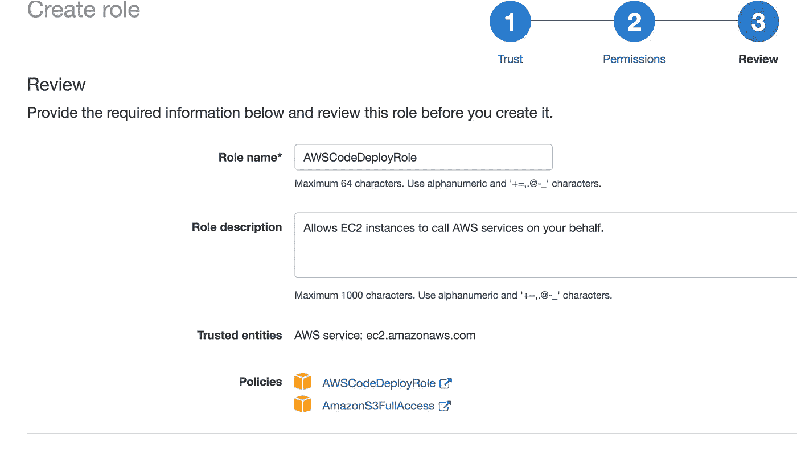
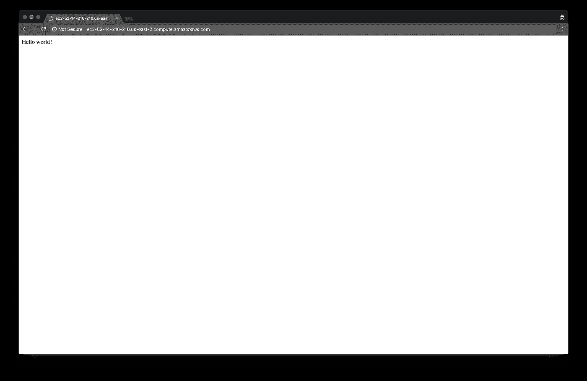

# 使用 AWS 代码从位存储桶管道部署到 EC2

> 原文：<https://medium.com/hackernoon/deploy-to-ec2-with-aws-codedeploy-from-bitbucket-pipelines-4f403e96d50c>


在持续交付和容器以及不可变环境的概念出现之前，人们在发布时用最新的代码手动更新环境。这是一个非常常见的地方，我敢打赌，大多数软件商店仍然以这种方式工作。

从这种状态到连续交付的一个非常简单的步骤是自动化该过程中的手工步骤。也就是说，用最新最好的代码自动更新环境。

这很容易通过结合两个非常有用的工具来实现:AWS CodeDeploy 和 Bitbucket 管道。

# 先决条件

在此部署管道可以运行之前，需要满足一些要求。我们将一起走过这些步骤。假设您具备一些基本的 AWS 知识。

## InternationalAssociationofMachinists 国际机械师协会

需要创建一个用户，Bitbucket 可以使用该用户将工件上传到 S3，并通知 CodeDeploy 一个新的修订版已经准备好进行部署。

首先创建一个名为 *CodeDeployGroup* 的 IAM 组。该组需要`AmazonS3FullAccess`和`AWSCodeDeployFullAccess`权限。创建一个用户并将其添加到该组。该用户只需要编程访问。


记下该用户的访问密钥。以后还会需要。

现在，我们将创建一个可以关联到 EC2 实例并与 CodeDeploy 交互的角色。

在转到角色并单击*创建角色*之后，选择`EC2` AWS 服务，因为 EC2 是将与 CodeDeploy 交互的服务。


确保**可信实体**和**策略**分别为`ec2.amazonaws.com`和`AWSCodeDeployRole`T5。



创建角色后，将**信任关系**编辑如下。将区域更改为您正在使用的区域。

```
{
  "Version": "2012-10-17",
  "Statement": [
    {
      "Effect": "Allow",
      "Principal": {
        "Service": [
            "ec2.amazonaws.com",
            "codedeploy.us-west-2.amazonaws.com"
        ]
      },
      "Action": "sts:AssumeRole"
    }
  ]
}
```

概括地说，我们创建了一个新的 IAM 用户，该用户属于一个拥有完全 CodeDeploy 和 S3 权限的组。我们记下了该用户的访问密钥信息供以后使用。

然后，我们为 EC2 创建了一个 IAM 角色，并编辑了信任关系以允许访问 CodeDeploy。

## S3

需要创建一个存储桶来存储应用程序的*版本*。修订版只是运行代码所需要的东西加上 [AppSpec](https://docs.aws.amazon.com/codedeploy/latest/userguide/application-specification-files.html) 文件的存档。


在一个真实世界的例子中，您可能想要修补这个铲斗的生命周期管理，以帮助节省成本，但是现在一切都保持默认。

## EC2

需要启动 CodeDeploy 可以用作部署目标的 EC2 实例。

选择 Amazon Linux AMI 和 t2.micro 实例类型。除了 IAM 角色之外，所有配置详细信息都是默认的，IAM 角色将是前面创建的角色。


保留默认的存储设置。设置一个你会记住的标签。CodeDeploy 使用此标记来标识要部署到的实例。我使用标签`Name=Code Deploy Instance`。安全组应该允许 SSH 和访问应用程序所需的任何端口。


最后，需要在实例上安装 CodeDeploy 代理。为了不重复信息，请按照[官方对您的平台](https://docs.aws.amazon.com/codedeploy/latest/userguide/codedeploy-agent-operations-install.html)的指示进行操作。这个代理就是 CodeDeploy 在 EC2 实例上实际进行更改的方式。

配置 EC2 的要点是，必须附加一个 IAM 角色，以允许 EC2 与 CodeDeploy 通信，CodeDeploy 代理需要在实例上运行，并且需要标记实例，以便 CodeDeploy 可以识别参与部署的实例。

## 代码部署

如果这是您第一次使用 CodeDeploy，您将看到以下屏幕。


选择自定义部署。

为应用程序和部署组命名。选择 EC2/内部和就地部署。


我们将部署到任何自动伸缩之外的现有 EC2 实例，因此选择 *Amazon EC2 实例*选项，并提供标识您想要部署到的实例的标记。


将部署配置设置为`CodeDeployDefault.OneAtATime`


服务角色应该设置为之前创建的 IAM 角色。


这太多了。简而言之，我们所做的就是告诉 CodeDeploy 我们有了一个新的应用程序，以及哪些 EC2 实例参与了部署。

## 比特桶

我们现在需要告诉 Bitbucket 所有这些信息。为存储库设置以下环境变量。这些将由 AWS SDK 通过稍后显示的 Python 脚本来使用。


`AWS_SECRET_ACCESS_KEY`和`AWS_ACCESS_KEY_ID`是本文开头创建的用户，不是你个人的 AWS 用户账号。

# 建造管道


Not this kind

所有的基础工作都已完成，剩下的唯一工作就是构建管道来触发 CodeDeploy。这分三步进行:

1.  将修订版*部署到 S3*
2.  告诉 CodeDeploy 新的修订版已经准备好了
3.  等待 CodeDeploy 执行部署

详细描述编程方式超出了本文的范围，所以只需下载[这个 Python 脚本](https://bitbucket.org/awslabs/aws-codedeploy-bitbucket-pipelines-python/src/73b7c31b0a72a038ea0a9b46e457392c45ce76da/codedeploy_deploy.py?at=master&fileviewer=file-view-default)并将其放在项目目录的根目录下。这个脚本将执行上述所有步骤。请随意通读，以了解正在发生的事情。您将看到这个脚本使用了我们在 Bitbucket 中设置的环境变量。

## bitbucket-pipeline . yml

第一步是写`bitbucket-pipelines.yml`文件。对于我非常简单的 Sinatra 服务器来说，除了创建要发送到 S3 的修订版之外，什么也不用做。

如果你对 AWS SDKs 不熟悉，`boto3`只是一个针对 AWS 的 Python SDK。

如您所见，我们已经用`app.rb`、`appspec.yml`和整个`scripts/`目录创建了一个 zip 存档(这可以是任何主要的存档格式)。这个归档文件需要包含运行应用程序所需的所有代码和库，因为这是最终部署的归档文件。

## 应用代码

`app.rb`是我为此创作的非常简单的 Sinatra。这里没什么值得注意的。

## 生命周期脚本

包含管理应用程序生命周期的所有脚本。在最基本的配置中，应该有启动服务器、停止服务器和安装服务器所需的依赖项的脚本。记得让这些脚本可执行。

我有以下脚本来管理我的 Sinatra 服务器。在实际环境中，您可能希望使用 systemd 或 pm2 之类的东西来管理服务器的启动和停止。

## 应用规范

`appspec.yml`是 CodeDeploy 配置。这里可以配置几个生命周期事件挂钩，但是我们只担心三个。`BeforeInstall`、`ApplicationStop`和`ApplicationStart`。

`BeforeInstall`在下一个版本移入之前运行。这是确保运行应用程序所需的一切就绪的好地方。

`ApplicationStop`是下载修订版前的第一步。这应该包含一些优雅地关闭应用程序的方法。

在 CodeDeploy 流程接近尾声时运行，负责启动应用程序。

[阅读更多关于这些生命周期事件挂钩和其他可用活动的信息](https://docs.aws.amazon.com/codedeploy/latest/userguide/reference-appspec-file-structure-hooks.html)。

此时，您的存储库应该类似于下面这样。


## 运行管道

此时，我们已经准备好将所有内容推送到 Bitbucket 并启动管道。希望一切都已正确配置，您将获得一个漂亮的绿色部署！



Success!

干得好！现在，您已经使用 CodeDeploy 和 Bitbucket 管道成功地实现了自动化部署！这是一个非常基本的设置，但是你应该掌握足够的知识来实现你想要的。

请继续关注未来的文章，在那里我将讨论常见的 CodeDeploy 错误以及如何对它们进行故障排除。

感谢阅读！如果你喜欢你所读的，那么留下一个👏或者很少有人跟随。