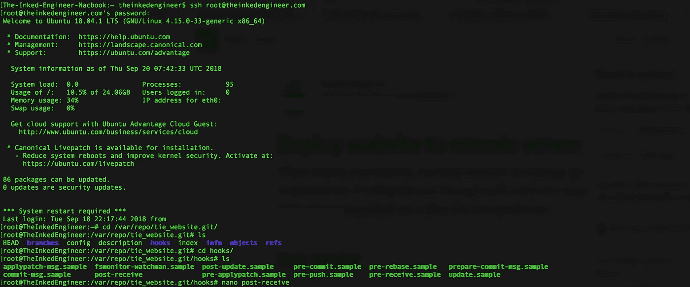

# 如何使用 GIT 将网站部署到远程服务器

> 原文：<https://medium.com/hackernoon/deploy-website-to-remote-server-using-git-da6048805637>



这是一个循序渐进的教程，教你如何利用 git 将你的网站部署到你的远程服务器上。它会引导你走完每一步。熟悉 [Git](https://git-scm.com) 和 [Linux Shell](http://linuxcommand.org/lc3_learning_the_shell.php) 更佳，但不是强制性的。

# 工作

## 1.登录到服务器

使用以下命令打开终端并登录到服务器:

```
ssh your_user@server_ip_address
```

*   用您服务器的实际 ip 地址[替换*服务器 IP 地址*。](https://en.wikipedia.org/wiki/IP_address)
*   用实际的用户名替换 *your_user* 。默认情况下，用户名与主机相同，除非您指定不同的代理。

输入你的密码，瞧，你现在已经登录到你的服务器了。

## 2.安装 GIT

要在您的服务器上安装 git，请将以下命令一次一个地复制到终端中，然后点击`Return`。如果出现提示，请输入您的密码。

```
sudo apt-get update
sudo apt-get install git
```

## 3.为您的代码创建一个文件夹

你网站的源代码需要放在某个地方。按照惯例，代码放在`/var/www`目录中。使用以下方式导航:

```
cd /var/www
```

现在，创建一个新文件夹来存放源代码。对于本教程，它将被称为*网站 _ 文件夹。*

```
mkdir website_folder
```

现在，放置源代码的完整路径是`/var/www/website_folder/`。记住这个路径很重要，因为在设置 git 存储库时会用到它。

## 4.在您的服务器上初始化 git 存储库

git 存储库需要一个文件夹来存放它。在`/var`中，创建一个名为 *repo，*的文件夹，其中的将包含您的 git 库。其中之一就是*网站。为此，请运行以下命令:*

```
mkdir -p /var/repo/website.git
```

现在，导航到`/var/repo/website.git`并初始化您的 git 存储库:

```
cd /var/repo/website.git/
git init --bare
```

瞧……现在你有了一个用于共享的[裸](http://www.saintsjd.com/2011/01/what-is-a-bare-git-repository/)库。

## 5.创建挂钩

> 钩子是一个程序，你可以把它放在钩子目录中，在 git 执行的某些时候触发动作。

Git 有几个钩子，它可以在不同的阶段之后自动调用。您将使用 *post-receive* 钩子，它在您的存储库接收到推送的代码之后被调用。

初始化 git 存储库后，新的文件夹应该出现在`/var/repo/website.git/`中。导航到*钩子*并使用您喜欢的文本编辑器创建一个名为 *post-receive* 的新 [bash](https://en.wikipedia.org/wiki/Bash_(Unix_shell)) 。

```
cd hooks
nano post-receive
```

在新创建的文件中，您需要告诉 git 将推送的文件放在哪里。为此，请粘贴以下代码:

```
#!/bin/shgit --work-tree=*path_to_website_folder* --git-dir=*path_to_git_directory* checkout -f name_of_branch
```

*   用我们在第 3 点创建的正确路径`/var/www/website_folder`替换 *path_to_website_folder* 。
*   将 *path_to_git_directory* 替换为裸 git 存储库的路径，在本例中是`/var/repo/website.git`。
*   name_of_branch 是可选参数。如果没有指定，默认为`master`。

您可以使用您选择的任何其他命令来执行该脚本，例如重新启动服务器。

使用`ctrl+x`退出编辑器，并确保将文件保存为*接收后*。

## 6.使脚本可执行

为了让操作系统执行脚本，后者需要具有可执行权限。为此，请运行以下命令:

```
chmod +x post-receive
```

您的服务器上的工作已经完成。你现在只需运行`logout`并点击`Return`即可注销

## 7.将本地代码推送到服务器

从您的终端，导航到您的本地文件夹，如果它还不是一个工作的 git 存储库，将其初始化为一个。然后，为了配置 git 将代码推送到远程服务器，您需要将它指向它的地址。

```
git initgit remote add *name_of_repository* ssh://your_user@server_ip_address/*path_to_git_directory*
```

*   *存储库名称*可以是您想要的任何名称。这是远程存储库的名称。
*   将*服务器 ip 地址*替换为您服务器的实际 [IP 地址](https://en.wikipedia.org/wiki/IP_address)。
*   用实际的用户名替换 *your_user* 。默认情况下，用户名为 [root](https://en.wikipedia.org/wiki/Root_directory) 。
*   将 *path_to_git_directory* 替换为裸 git 存储库的路径，在本例中是`var/repo/website.git/`。

现在，要将代码推送到远程服务器，只需从本地 git 存储库中运行以下命令:

```
git push *name_of_repository name_of_branch*
```

输入您的密码，现在您的代码是活的，应该可以在`/var/www/website_folder`中找到