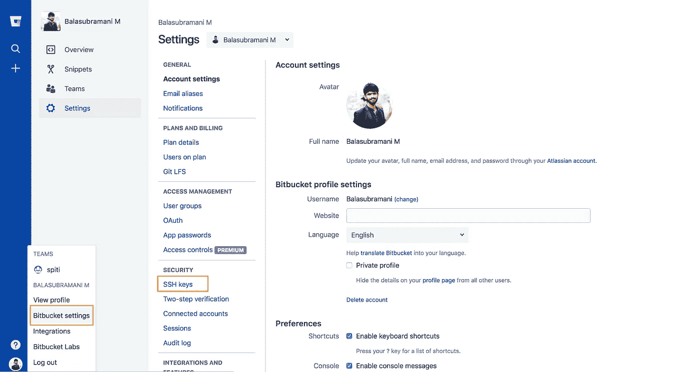
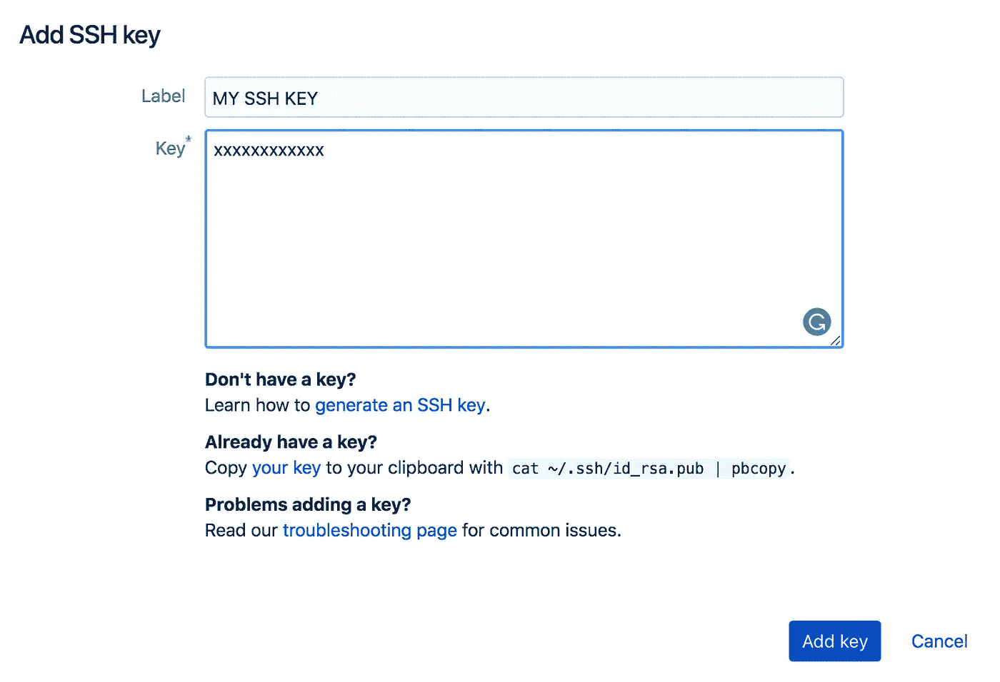
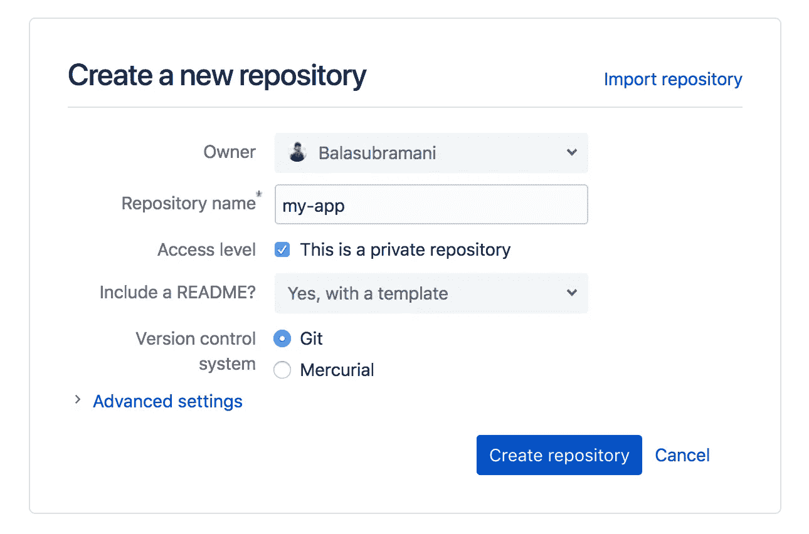
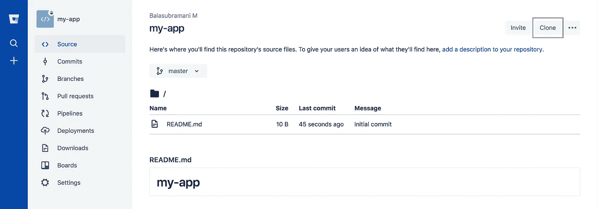
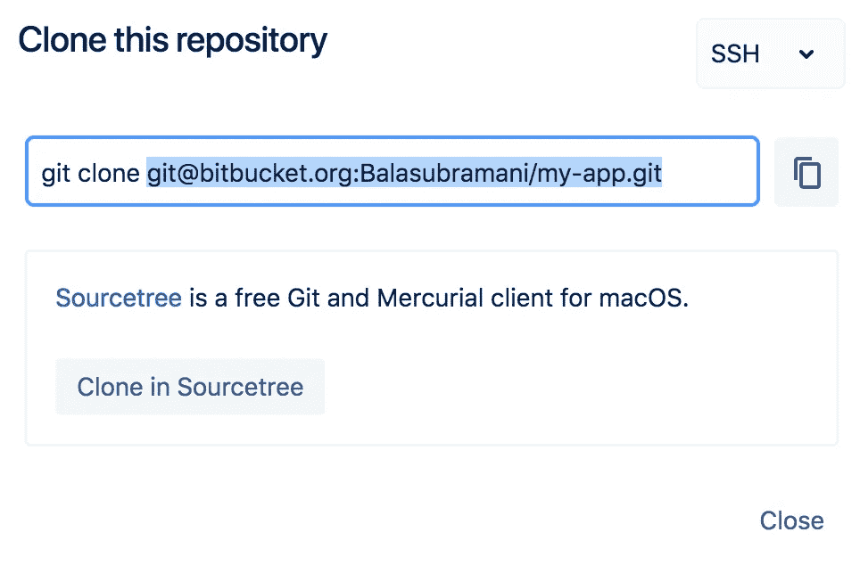

# 在生产中部署 Node.js 应用程序，并使用 BitBucket 来自动化部署。

> 原文：<https://medium.com/hackernoon/deploy-your-node-js-app-in-production-and-use-bitbucket-to-automate-your-deployment-50b07b18914c>

## 在本教程中，我们将创建一个示例 Node.js 服务器，将其推送到 BitBucket 并使用 PM2，我们将在生产中自动部署。


BitBucket

## 为什么是 BitBucket？为什么不是 Git？

> Bitbucket 是 Atlassian 拥有的基于 web 的版本控制库托管服务，用于使用 Mercurial 或 Git 版本控制系统的源代码和开发项目。Bitbucket 提供商业计划和免费账户。—维基。

与 Git 相比，我想到的唯一区别是，我们可以拥有任意数量的私有存储库，但在 Git 中不能，而在后者中我们只能拥有一个。如果您不想共享您的代码并使其保密，您可以使用 BitBucket。如果你还没有帐户，你可以得到一个@[https://bitbucket.org/](https://bitbucket.org/)

# 创建一个样本 Node.js 服务器

## 快速发电机

让我们使用 express-generator 在几秒钟内安装一个示例 Node.js 服务器。将 express-generator 安装为全局模块。打开您的终端并发出以下命令。

```
$ sudo npm install -g express-generator
```

导航到所需的目录并执行以下命令。这将安装一个名为`my-app`的示例应用程序。

```
$ express — view=hbs my-app
```

导航到您的应用程序`my-app`。

```
$ cd my-app
```

让我们安装运行应用程序所需的模块。

```
$ sudo npm install
```

使用以下命令启动应用程序。

```
$ sudo npm start
```

默认情况下，这将在端口 3000 上运行应用程序。你可以在`[http://localhost:3000/](http://localhost:3000/)`查看你的申请，你会在这里看到下面的屏幕。


Express application welcome screen.

# 在 BitBucket 中上传您的代码

在初始设置过程中，需要遵循几个步骤。因此，让我们从创建一个 SSH 密钥开始，从本地机器向您的 BitBucket 帐户进行身份验证。

总共有两种类型的认证，称为`SSH`和`HTTPS`。

这是一个一次性的过程，我们不想使用`HTTPS`选项进行身份验证，因为每当我们从您的机器拉取、推送或提交时，我们都需要提供我们的凭据。

SSH 认证机制如下。

1.  生成新的 SSH 密钥。
2.  将您的 ssh 密钥添加到 SSH 代理中
3.  将 SSH 密钥添加到您的 GitHub 帐户

## 步骤 1:生成新的 SSH 密钥。

开放终端。

```
$ cd ~/.ssh/ #To navigate to your default SSH key location.
```

粘贴以下文本，替换为您的 BitBucket 电子邮件地址。

```
$ ssh-keygen -t rsa -b 4096 -C "*your_email@example.com*"
```

这将创建一个新的 ssh 密钥，使用提供的电子邮件作为标签。

当提示您“输入保存密钥的文件”时，请按 Enter 键。这接受默认的文件位置。

```
Enter a file in which to save the key (/Users/*you*/.ssh/id_rsa): *[Press enter]*
```

在提示符下，按 enter 键两次，不输入任何密码。就这样，您已经成功地创建了名为`id_rsa`的 SSH 密钥。

## 步骤 2:将您的 ssh 密钥添加到 SSH 代理中

在后台启动 ssh-agent。

```
$ eval "$(ssh-agent -s)"
```

将您的 ssh 私有密钥添加到 SSH 代理中。

```
$ ssh-add -K ~/.ssh/id_rsa
```

## 步骤 3:向 GitHub 帐户添加新的 SSH 密钥

将 SSH 密钥复制到剪贴板。

```
$ pbcopy < ~/.ssh/id_rsa.pub
# Copies the contents of the id_rsa.pub file to your clipboard
```

如果没有 pbcopy，可以使用任何编辑器打开该文件并复制其全部内容。我使用 sublime，如果你想在 sublime 编辑器中打开上面的文件，发出下面的命令。

```
$ subl ~/.ssh/id_rsa.pub 
# Either issue this or above command. Don't execute both.
```

让我们转到我们的 BitBucket 帐户并粘贴密钥。导航到您的 BitBucket 帐户设置，然后单击 SSH 密钥。(参考图片)。



BitBucket Account Settings Page.

点击添加键，并根据您的意愿给出标签名称。让我把它命名为我的 SSH 密钥。在“密钥”框中，粘贴复制的密钥并单击“添加密钥”。



就是这样。现在，您已经通过身份验证，可以从终端执行 BitBucket 帐户中的操作。让我们推送我们的代码，稍后在 EC2 中部署它。

## 在 BitBucket 中部署代码。

首先，让我们在 BitBucket 中创建一个存储库，我们将把代码放在那里。

转到在您的 BitBucket 帐户中创建存储库，或单击此 [URL](https://bitbucket.org/repo/create) 导航到回购创建页面。看起来像下面。



输入名为`my-app`的应用程序名称，然后点击`Create repository`。

**注意:目前不包括 README。在图像中，我已经包含了自述文件。**

您将被导航至您的回购来源页面。单击右上角的克隆按钮。有关信息，请参考图像。



并复制图像中给出的突出显示的文本。由于我们将把这个回购提交给我们的本地应用程序，`git clone`是不需要的。



创建一个名为。gitignore 在你的根目录下忽略不必要的文件上传到我们的 BitBucket repo。粘贴以下内容并保存文件。有关结构的更多信息，请参考完整的存储库源代码。

```
# See [http://help.github.com/ignore-files/](http://help.github.com/ignore-files/) for more about ignoring files.# dependencies
node_modules# testing
coverage# production
build# misc
.DS_Store
.env
npm-debug.log
```

现在导航到您的应用程序目录(`cd /my-app`)并逐一执行以下命令，将您的本地回购链接到您的 BitBucket 回购并推送您的更改。

```
git init
git add --all
git commit -m "Initial Commit"
git remote add origin [git@bitbucket.org](mailto:git@bitbucket.org):Balasubramani/my-app.git
git pull origin master
git push -u origin master
```

搞定了。您的存储库现在在 Bitbucket Server 中可用。

如果您在发布`git pull origin master`时遇到任何类似合并问题的错误，只需键入`:q!`并按回车键退出并放弃提交消息。现阶段没有必要。

# 在 EC2 中部署您的应用

## 亚马逊 EC2

如果您知道 Amazon EC2 实例，并且知道如何配置和使用它，那么您不需要做任何事情。

但是，如果您不知道，您可以浏览下面的链接并设置您的远程实例 ready，这是托管 Node.js 服务器所必需的。

[](/full-stack-web-development-from-scratch-to/make-your-amazon-ec2-instance-up-and-running-ab80120eb23) [## 启动并运行您的 Amazon EC2 实例。

### 在这一部分，我们将创建一个 Amazon 帐户 EC2 实例，并通过 SSH 连接到该实例。

medium.com](/full-stack-web-development-from-scratch-to/make-your-amazon-ec2-instance-up-and-running-ab80120eb23) 

**注意:您需要一个服务器(EC2 实例)来部署您的生产就绪 Node.js 服务器。**

## PM2 设置

> 生产 Node.js 应用程序的高级流程管理器。

让我们在本地存储库中配置 PM2，它将实际完成我们的部署工作。

发出以下命令，在根目录下安装 PM2。

```
$ sudo npm i pm2 --save-dev
```

在根目录中，创建一个名为 ecosystem.config.js 的文件，并将以下内容添加到其中。

```
module.exports = {
 apps: [
  {
   name: "my-app",
   script: "./bin/www",
   env: {
    PORT: 3000,
    NODE_ENV: "production"
   }
  }
 ],
 deploy: {
  production: {
   user: "ubuntu",
   host: "ec2-xx-xxx-xxx-xx.us-east-2.compute.amazonaws.com",
   key: "~/.ssh/AWS-EC2-INSTANCE-LIVE.pem",
   ref: "origin/master",
   repo: "[git@bitbucket.org](mailto:git@bitbucket.org):Balasubramani/my-app.git",
   path: "/home/ubuntu/my-app",
   "post-deploy":
    "npm install && pm2 startOrRestart ecosystem.config.js"
  }
 }
};
```

记得用您的 Amazon 实例主机、PEM 密钥位置替换您的主机，并更新您的回购链接(您之前已经复制了该链接，即突出显示的文本)。希望你记得)。

一切都已准备就绪。我们开始吧。

当然了。在终端中从根目录运行下面的命令，在远程服务器上设置应用程序。

```
$ sudo pm2 deploy ecosystem.config.js production setup
```

这将在 EC2 实例中配置我们的应用程序。

最后，发出下面的命令，在远程服务器上使用 PM2 托管并运行您的应用程序。

```
$ sudo pm2 deploy ecosystem.config.js production
```

万岁！！！Node.js 服务器现在位于生产服务器中，可以使用了。

登录到您的远程服务器并键入

```
$ sudo pm2 status
```

查看你的申请状态。

现在，您的应用程序正在远程服务器上运行。要检查，添加 3000 作为一个端口以及您的远程 IP 地址，以检查应用程序运行…

*例如:http:// <你的远程 ip 地址> :3000*

**注意:您需要在 EC2 实例的安全组中允许端口 3000。参考上面的** [**链接**](/full-stack-web-development-from-scratch-to/make-your-amazon-ec2-instance-up-and-running-ab80120eb23) **关于如何允许远程服务器上的安全组中的端口。**

你可以在这里下载最终的 GitHub 应用[。](https://github.com/BalasubramaniM/nodejs-pm2-ec2-app)

在下一个教程中，让我们映射我们的自定义域，配置 Nginx 并向 Node.js 服务器添加 SSL 层。

谢谢你。