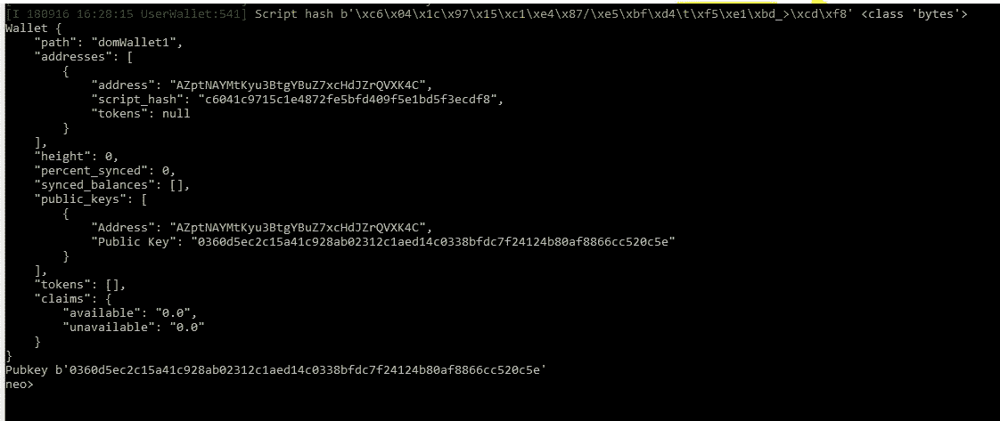
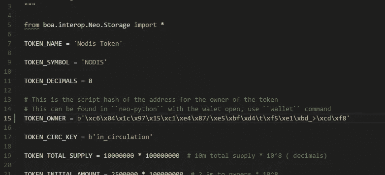

# 部署 NEP-5 智能合同(第 1 部分)

> 原文：<https://medium.com/hackernoon/deploying-a-nep-5-smart-contract-part-1-fc81f312a096>

如果你还没有建立女贞网，请看看我以前的文章， [1](https://hackernoon.com/getting-started-on-a-neo-smartcontract-d36927e4bf1f) [2](https://hackernoon.com/building-your-private-neo-network-on-aws-part-1-c01525dadc1c) & [3](https://hackernoon.com/building-your-private-neo-network-on-aws-part-2-4dc975744bf8) 。


Photo by [Markus Spiske](https://unsplash.com/@markusspiske?utm_source=medium&utm_medium=referral) on [Unsplash](https://unsplash.com?utm_source=medium&utm_medium=referral)

在我们开始之前，我们需要讨论一下**智能合约**的主题；这是什么？智能合约是一组功能代码(不是面向对象的！)，通过交易写入区块链，此后可由钱包调用。NEO 的一个主要优势是它支持许多当今最著名的语言，如 *C#、Python、Java …* 我们的文章主要关注 Python 的使用。

什么是 **NEP-5** ？与用于[以太坊](https://hackernoon.com/tagged/ethereum)的 ERC20 类似，NEP-5 是一种货币标准，建议您实现几个预定义的函数(*名称、符号、余额、转账……*)。与任何标准化系统一样，这允许数字钱包专注于其人口统计偏好，而不用担心令牌，而您[可爱的智能合约开发者]不需要担心用户体验！

最后，我们不能在不谈论编译器的情况下谈论部署！我们将需要一个编译器，因为 NEO 节点不理解 Python 或 Java 或 C#或任何其他高级语言。相反，它理解字节码，编译器的工作就是为我们翻译它！我们选择的编译器将是 **Neo-boa** :采用我们符合 NEP-5 的 python 智能契约，并将其转换成字节码或机器可读代码。

**工作流总结**:编码→编译→部署！开始吧！

第一步:创建你的钱包

在 Ubuntu 中打开 neo-prompt，`source venv/bin/activate`，`np-prompt -p <server ip>`。然后:

```
create wallet testWallet1
```

输入至少 10 个字符的密码

第二步:募集资金

你的新钱包里没有汽油了*(很明显)* …但是你需要一些来部署合同。幸运的是，[网络](https://hackernoon.com/tagged/network)已经有一个可导入的 with 私钥，里面有钱。

```
import wif KxDgvEKzgSBPPfuVfw67oPQBSjidEiqTHURKSDL1R7yGaGYAeYnr
wallet rebuild
```

** WIF 可能随时改变，参考文档* [*此处*](https://hub.docker.com/r/cityofzion/neo-privatenet/)

**步骤 3:** 从互联网上拉 an NEP-5 标准模板

我假设您已经在本地安装了 [git](https://git-scm.com/downloads) 。打开一个新的**命令提示符**:

```
:you may want to use the same base path as your neo-python install
cd <storage location>
git clone [https://github.com/neonexchange/neo-ico-template](https://github.com/neonexchange/neo-ico-template)
```

**步骤 4** :安装 Neo-boa(编译器)

```
:you may want to use the same base path as your neo-python install
cd <storage location>
git clone [https://github.com/CityOfZion/neo-boa.git](https://github.com/CityOfZion/neo-boa.git)cd neo-boa/
python3.6 -m venv venv
source venv/bin/activatepip install -r requirements.txt
```

**步骤 5:** 编辑智能合约代码:获取钱包哈希

转到您的 np-prompt 控制台，键入`wallet`，您将看到以下内容:



example testnet wallet

复制脚本哈希在最上面，我的是`b’\xc6\x04\x1c\x97\x15\xc1\xe4\x87/\xe5\xbf\xd4\t\xf5\xe1\sbd_>\scd\xf8'`

使用你最喜欢的编辑器，打开`<smartcontract>/nex/token.py`。用你自己的钱包散列替换 TOKEN_OWNER。

将 TOKEN_NAME 和 TOKEN_SYMBOL 重命名为您想要的任何名称！



现在，您已经准备好编译和部署您的*个性化* NEP5 智能合约了！

[Nodis.io](https://nodis.io) 是一个面向当地企业的营销平台，通过小型活动产生参与度，并向用户奖励加密货币，用户以后可以在商店消费。请在 [Instagram](https://www.instagram.com/nodis.io/) 、[脸书](https://www.facebook.com/NodisGetNoticed/)和 [Telegram](https://t.me/nodisgetnoticedgroup) 上查看我们并给我们反馈！

关注我 [Instagram](http://www.instagram.com/domfungus) 和[脸书](https://www.facebook.com/fung.dominic)！

**下周指南:**部署 NEP-5 智能合同(第二部分)

感谢 thomas saunders 和 NEX 团队为我们提供了如此棒的智能合同模板！