# 使用 Firebase 部署 Angular Universal v6+🚀 🔥

> 原文：<https://medium.com/hackernoon/deploying-angular-universal-v6-with-firebase-c86381ddd445>

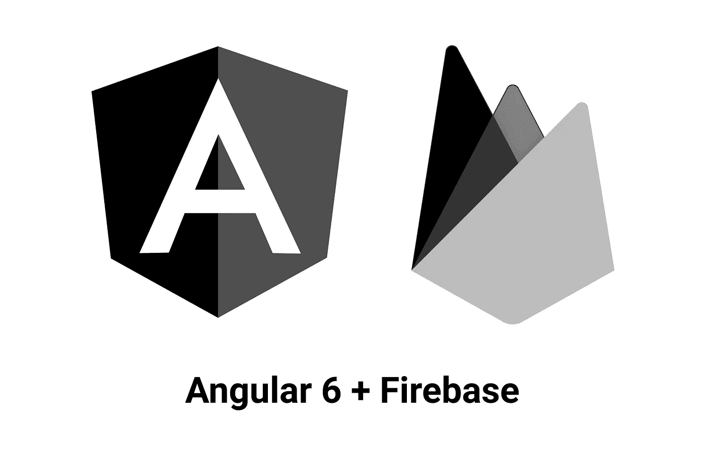

免责声明:这篇博文将是一个有重点的分步指南，介绍如何使用 [Firebase](https://hackernoon.com/tagged/firebase) 托管来部署 [Angular](https://hackernoon.com/tagged/angular) Universal App。对于任何关于 Angular Universal 和服务器端渲染的解释，Angular 在他们的网站上有一个很棒的文档。

你也可以在 [Github](https://github.com/aaronte/angular-universal-firebase) 上找到源代码。

# 要求

*   node.js(我在本教程中使用的是 8.11.1 版)
*   Angular 6+(我写过一篇[类似文章](https://hackernoon.com/deploy-angular-universal-w-firebase-ad70ea2413a1)部署 Angular < v6)

# 第一部分:设置角应用🛠

## 1.安装全局依赖项

我们将在命令行中使用`@angular/cli`和`firebase-tools`来构建和部署您的应用程序。

*   [@angular/cli ≥ 6.0.0](https://github.com/angular/angular-cli)
*   [firebase-tools 3 . 18 . 4 版](https://github.com/firebase/firebase-tools)

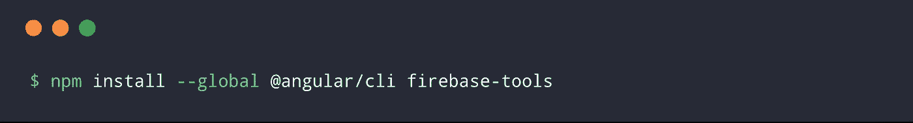

## 2.创建新的角度项目

使用`@angular/cli`，我们将创建一个新的`angular`应用程序。既然这样，我就把它命名为`angular-universal-firebase`。

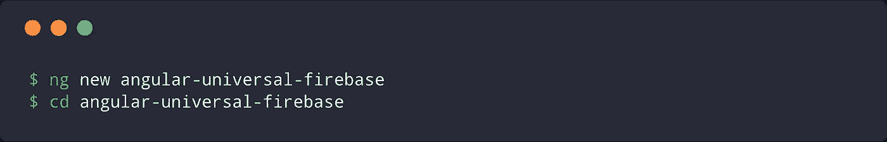

## 3.安装@ angular/平台服务器

为了构建和呈现您的`universal`应用程序，我们需要安装`@angular/platform-server`。

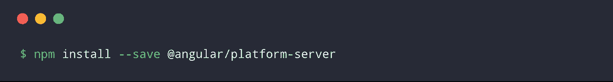

## 4.添加服务器端渲染配置

在`@angular/cli@v6.0.0+`中，`.angular-cli.json`改为`angular.json`。这定义了我们的项目是如何构建的，以及这个项目的构建配置。我们希望在`projects.PROJECT_NAME.architect`路径中为项目添加一个`server`配置。

请注意，我们已经添加了`server`，它为我们的应用程序的服务器端版本定义了`builder`和`options`配置。

## 5.将项目输出修改到 Firebase 文件夹

为了简单起见，我们将在与构建服务器版本相同的目录中构建我们应用程序的浏览器版本，以便在 Firebase 中进行服务器端渲染。为此，将`angular.json`的`PROJECT_NAME.architect.build.options.outputPath`编辑为`functions/dist/browser`。

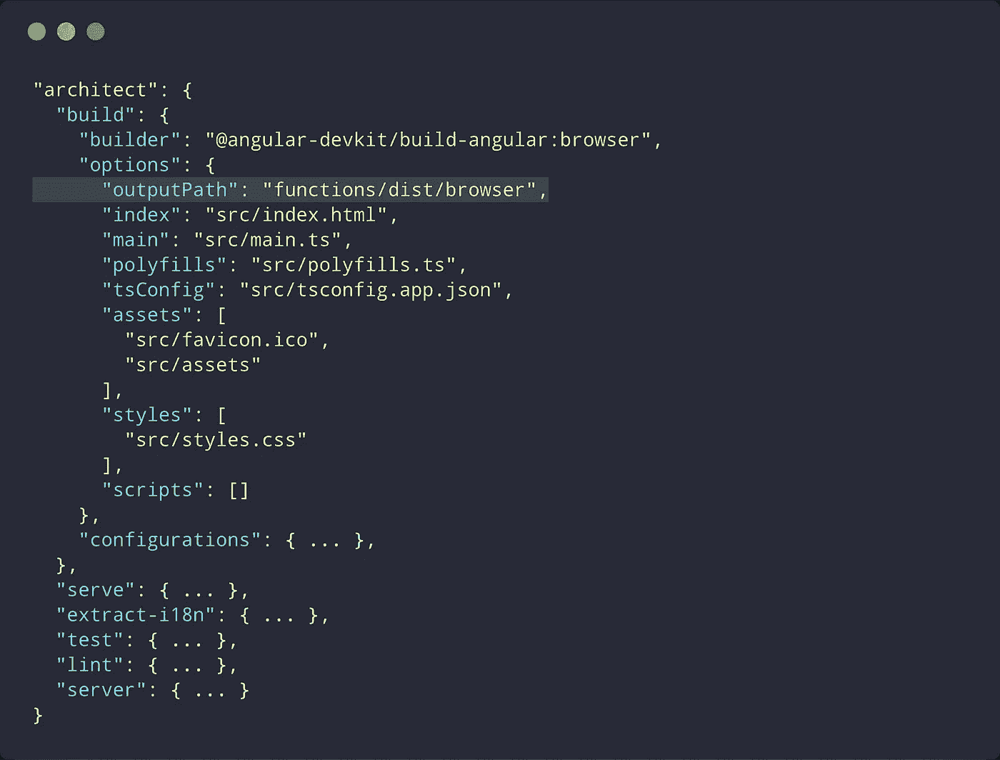

## 6.为应用服务器版本创建必要的文件

*   `src/app/app.server.module.ts`

为应用程序的服务器版本创建一个新模块。

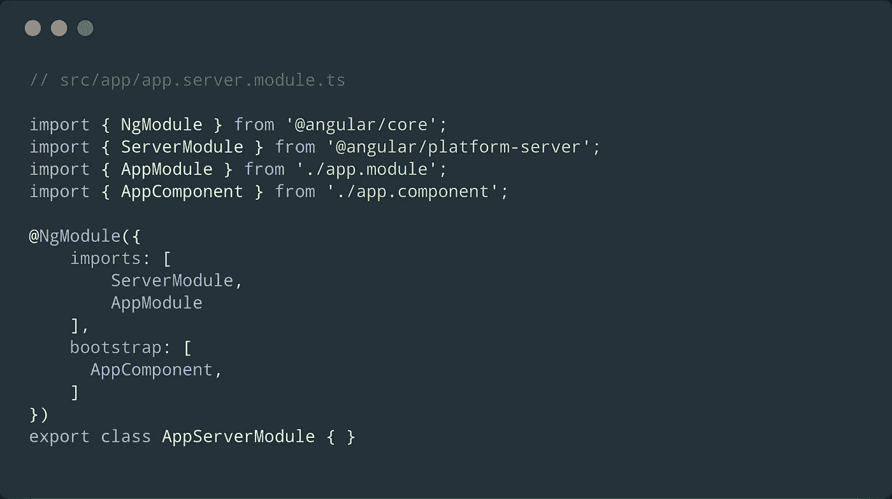

[https://github.com/aaronte/angular-universal-firebase/blob/master/src/app/app.server.module.ts](https://github.com/aaronte/angular-universal-firebase/blob/master/src/app/app.server.module.ts)

*   `src/main-ssr.ts`

为`server`模块创建入口点。这是我们在`angular.json`的服务器配置中引用的`main`文件。

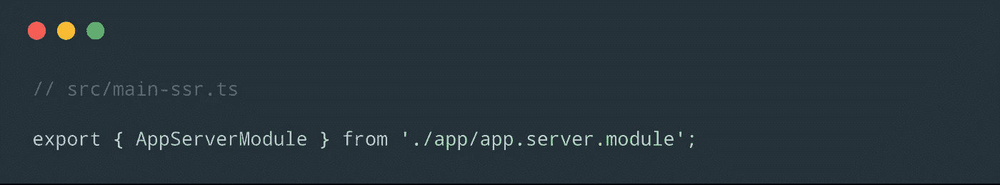

[https://github.com/aaronte/angular-universal-firebase/blob/master/src/main-ssr.ts](https://github.com/aaronte/angular-universal-firebase/blob/master/src/main-ssr.ts)

*   `src/tsconfig.app-ssr.json`

为服务器版本创建`tsconfig`。类似于浏览器版本，除了`angularCompilerOptions.entryModule`将引用我们刚刚创建的服务器版本的入口模块。这在`angular.json`中也被称为`tsConfig`。

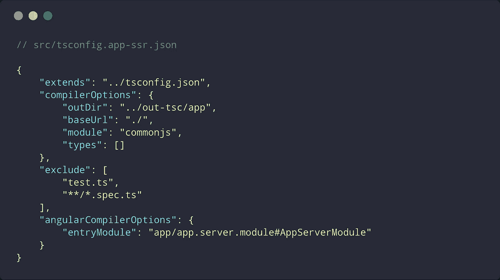

[https://github.com/aaronte/angular-universal-firebase/blob/master/src/tsconfig.app-ssr.json](https://github.com/aaronte/angular-universal-firebase/blob/master/src/tsconfig.app-ssr.json)

## 7.在应用程序的浏览器模块中包含服务器转换

由于我们在浏览器版本之前将您的应用的服务器版本发送到浏览器，因此在`imports`中添加`BrowserModule`时，我们需要添加`.withServerTransition({ appId })`。

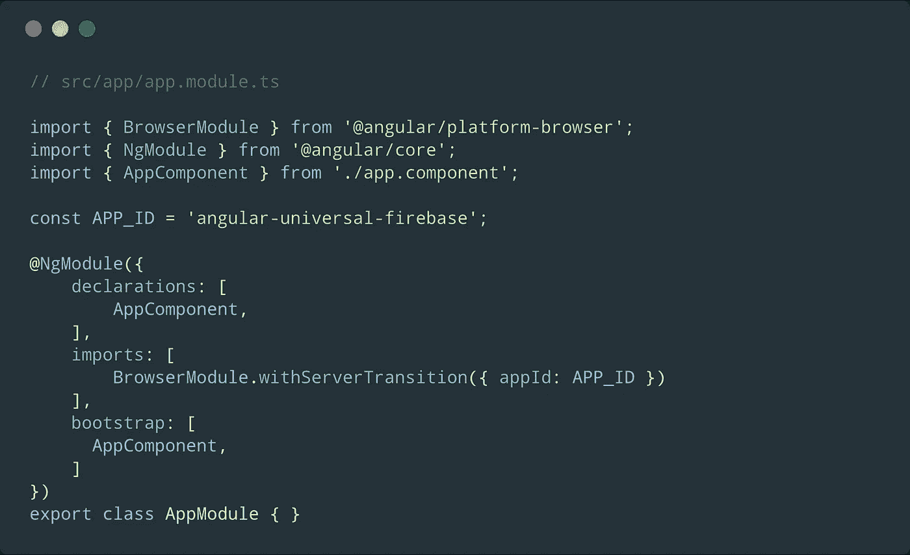

[https://github.com/aaronte/angular-universal-firebase/blob/master/src/app/app.module.ts](https://github.com/aaronte/angular-universal-firebase/blob/master/src/app/app.module.ts)

现在我们已经准备好构建应用程序的服务器和浏览器版本了！

## 8.构建应用程序的浏览器和服务器版本

使用`@angular/cli`，我们将构建两个版本的应用程序。

*   `ng build --prod`:这将使用`prod`配置构建应用程序的浏览器版本。
*   `ng run PROJECT_NAME:server`:这将构建应用程序的服务器版本。它将生成一个`ngFactory`文件，我们可以用它来使用`node`渲染我们的应用程序。

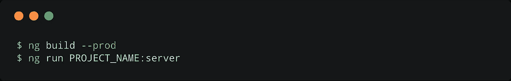

当两个构建都完成后，您现在应该在您的`root`目录中有一个`functions`文件夹，其中有`browser`和`server`文件夹。厉害！！！🎉

# 第二部分:使用 Firebase 部署🚀

[1] *在继续之前，您应该已经创建了一个 firebase 项目* [*这里*](https://console.firebase.google.com) *。我把这个例子命名为* `*angular-universal-firebase*` *。*

## 1.在命令行中登录到``firebase`'

在命令行中使用您在[1]中创建 firebase 项目时使用的 google 帐户登录 firebase。

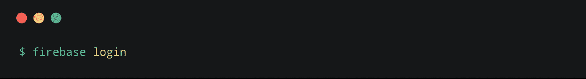

## 2.在“angular”项目中初始化 Firebase

通过命令行初始化 firebase 配置:

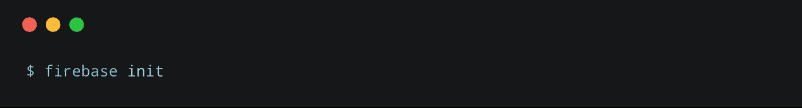

*   选择`Functions`和`Hosting`进行功能设置

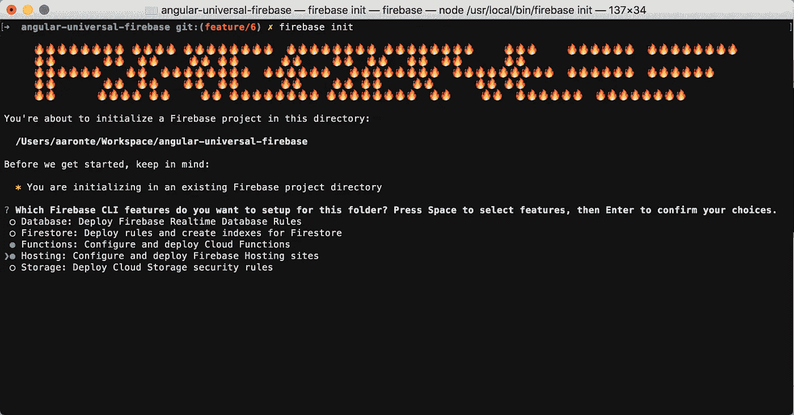

Firebase set up configuration (Functions and Hosting)

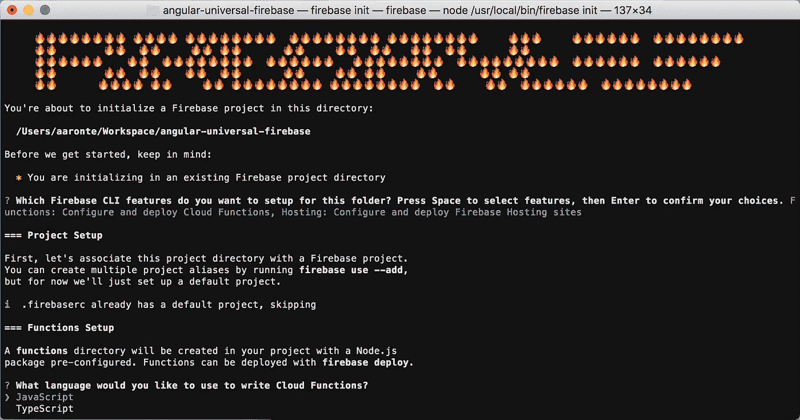

Javascript as Cloud function language for simplicity

*   选择您在[1]中创建的 firebase 项目。(对我来说，是`angular-universal-firebase`。

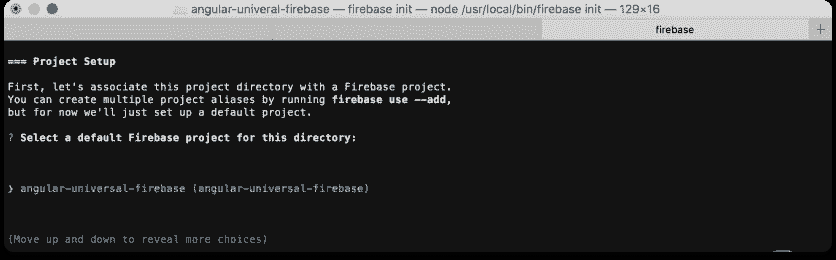

*   接受此阶段的所有默认值；我们将在后面的步骤中配置其余部分。(在本教程中，我们将在`Javascript`中编写我们的函数)。

## 3.将包依赖项添加到“函数”

由于我们通过`firebase-functions`使用节点服务器，我们需要在`functions/package.json`中包含`angular`依赖项来呈现应用程序的服务器版本。

*先不说:目前，我不知道有什么方法可以减轻这种依赖声明的重复，因为据我所知，你不能在任何* `*firebase-functions*` *javascript 文件中访问* `*functions*` *目录之外的文件。但是如果你知道一个方法，请让我知道！*

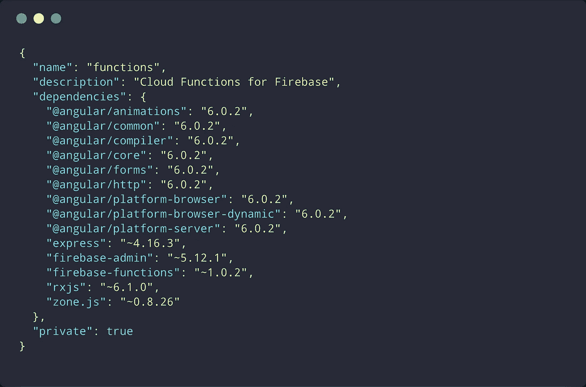

[https://github.com/aaronte/angular-universal-firebase/blob/master/functions/package.json](https://github.com/aaronte/angular-universal-firebase/blob/master/functions/package.json)

## 4.在``functions`'目录下安装包

安装 da 依赖项！

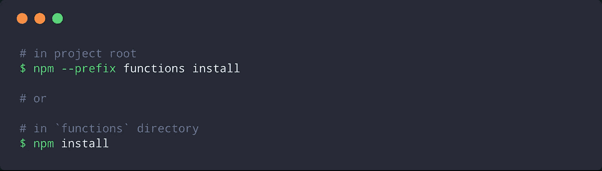

## 5.创建 Firebase 函数以服务于应用程序

我们将使用`functions.https.onRequest` Firebase 函数类型从我们的 express 服务器发送响应。该文件中有许多内容，但最值得注意的是:

*   正在导入在**部分 I:步骤 8 —服务器版本**中生成的`AppServerModuleNgFactory`。
*   创建一个`index`变量，该变量获取我们从**第一部分生成的`index.html`文件:步骤 8 —浏览器版本**。
*   使用`renderModuleFactory`生成一个`html`文件，我们用`url`和`document`参数作为响应发送该文件。
*   `url`参数决定了 app 要渲染的路线。指定这一点允许`renderModuleFactory`构建该路线的 html。
*   `document`是应该用于呈现的页面的完整文档 HTML。在这种情况下，它将是该应用程序的浏览器版本`index.html`。

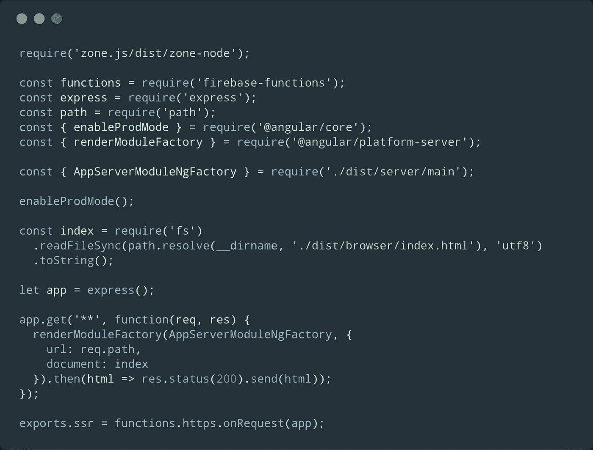

[https://github.com/aaronte/angular-universal-firebase/blob/master/functions/index.js](https://github.com/aaronte/angular-universal-firebase/blob/master/functions/index.js)

## 7.配置 Firebase 托管

现在我们已经构建了呈现页面的函数，我们需要更改 firebase 主机配置来使用这个函数。更改`firebase.json`中的`hosting.rewrites`。第一个条目是通过我们的公共文件夹发送静态文件(css 和 js)。第二个条目是将所有请求指向`ssr`函数。

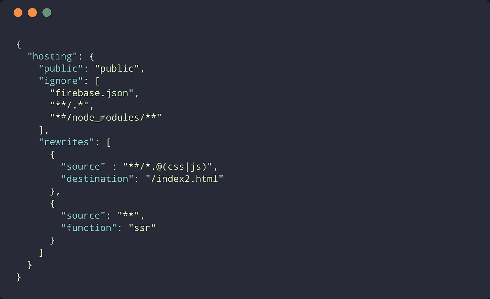

[https://github.com/aaronte/angular-universal-firebase/blob/master/firebase.json](https://github.com/aaronte/angular-universal-firebase/blob/master/firebase.json)

## 8.将“功能/分布/浏览器”的所有内容复制到“公共”

因为我们希望像普通应用程序一样运行我们的应用程序，所以我们希望将构建浏览器平台所生成的所有文件放在 public 文件夹中。这意味着 functions/dist/browser 中的 html、js、css 等都应该出现在 public 文件夹中。注意:但是，我们必须将`index.html`的名称改为`index2.html`，因为如果 firebase 在`public`文件夹中找到`index.html`，它将不会运行`ssr`函数。

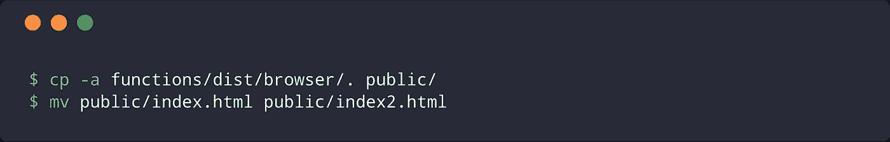

## 9.部署到火力基地🚀 🔥

如果一切顺利，您应该能够将您的应用程序部署到 Firebase:

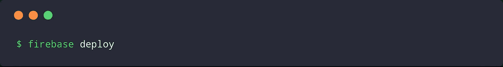

# 就是这样！👍

你可以在 [Github](https://github.com/aaronte/angular-universal-firebase) 上查看源代码。

我希望这篇教程在某些方面有所帮助！如果您有任何反馈或问题，请将它们添加到 [Github 问题](https://github.com/aaronte/angular-universal-firebase/issues)中，以确保每个查看代码的人都会受益。😄

编码快乐！😃