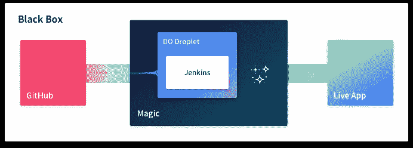

# 部署前端应用程序—有趣的方式

> 原文：<https://medium.com/hackernoon/deploying-frontend-applications-the-fun-way-bc3f69e15331>

Word cloud with DevOps and FrontEnd technologies

在这篇文章中，我将告诉你我如何使用 GitHub、Jenkins、Docker 和 [Digital Ocean](https://m.do.co/c/4dc4ded1ea2f) 部署我的前端应用程序。[在我的学习旅程中，我有一些疑问](https://stackoverflow.com/questions/49472695/how-to-run-container-in-a-remote-docker-host-with-jenkins)，所以我决定把我所学到的贴在这个帖子上，作为一个自我记录。

**注意:**这篇文章不是为你我的朋友，专家和顾问大师 15 年以上 exp DevOps 建筑师；这是为我们这些刚刚开始发现 CI/CD 技术之美的人准备的。本帖可能包含一些不良做法，请半信半疑。

# 废话少说，把 TL 射我；速度三角形定位法(dead reckoning)

你和我一样，四处找子弹，然后离开。这是 TL。为你博士:

> 1.启动安装了 Docker 的 2 台服务器:构建和生产服务器
> 
> 2.在您的构建服务器中安装 Jenkins(或任何其他 CI)
> 
> 3.在您的 CI 中创建一个任务，在 docker 映像中克隆、安装和构建您的项目
> 
> **4.在 GitHub 中设置 webhooks，在每次推送时触发作业**
> 
> **5.将 docker 映像推送到您的个人 Docker Hub**
> 
> **6.SSH 到您的生产服务器**
> 
> **7.从 Docker Hub 中提取映像并运行容器**
> 
> **8.利润**

****

**Docker based continuous deployment workflow**

**感谢阅读。**

**希望我引起了你的注意，你现在想要更多的细节。在下面的段落中，我将概述我的思考过程，并解释我的部署管道是如何工作的。我不会深入讨论技术细节，而是会提供一些有用的链接供你进一步研究。**

# **问题是**

**简单:我在 Angular 中开发了一个 [TypeScript AST 交互式查看器](https://github.com/caroso1222/ast-viewer)，我想部署它。**

****

**[TypeScript AST Interactive Viewer](https://ast.carlosroso.com/)**

***Bu…但是，为什么不用 Firebase，Google Engine，vanilla FTP，GH pages 呢？你可能会问，就像“一键部署”一样。所有这些工具都很棒，但大多数要么太贵，要么感觉太神奇(没有什么比“gcloud app deploy”更好)，而且**学起来并不那么有趣**！我希望了解、自动化并完全控制整个部署流程。我想要挑战，我想要学习，我想要享受乐趣(见鬼，我很有灵感)。***

## **归根结底是什么**

**我设置了自己的挑战，看起来像这样:**

1.  **我想推送代码并让它自动部署——也就是持续交付。**
2.  **我想支付一个便宜的托管服务**

**让我们在黑盒图中画出这些非功能性需求:**

****

**Problem illustration. From GitHub to Live App. Icon: magic by ✦ Shmidt Sergey ✦ from the Noun Project**

# **解开魔盒**

**我将这一章分成三个部分。每一部分将展示我的魔法盒的一小部分:**

1.  **从 GitHub 到 Magic**
2.  **发展魔法**
3.  **从魔术到直播 App**

## **1.从 GitHub 到 Magic**

**推送代码，坐着休息，刷新直播 app，盈利。这就是我想要的。**

*****选择我的 VPS(虚拟专用服务器)*****

**第一步是建立一个服务器，它可以从 GitHub 获取我的代码并执行一系列命令(*NPM I&&NPM run build*)。不太清楚下一步该做什么，但我知道我必须从那里开始。**

**在阅读了最好的 VPS 提供商之后，我最终选择了[数字海洋](https://m.do.co/c/4dc4ded1ea2f)。很棒的教程，对新手来说很容易，体面的 DNS 管理和不错的价格——这是显而易见的。**

*****CI 工具无处不在*****

**注册后，我知道我需要某种工具，让我获取代码并自动化构建过程——CI 工具*(持续集成)*。已经有几个了，其中一些是针对开源项目的，一些主要是为自我托管而设计的，一些是高级的，一些是免费的。我选择 Jenkins 主要是因为它的管道概念，也因为我对这个工具有些熟悉。**

**通过阅读一些教程，让我的 Jenkins 实例运行起来相对容易。现在，我需要告诉詹金斯，每当我按下按钮时，就获取我的代码。原来有几十个帖子在讨论如何设置 GitHub webhook，从你的 repo 指向你的 Jenkins Droplet IP。设置这个比我预期的要快(虽然对于私有的 GitHub repos 来说不是很简单)。**

*****我们来回顾一下*****

**此时，我有一个 DO droplet 运行 Linux，Jenkins 实例在每次 git 推送时从 GitHub 提取代码。多酷啊。让我们看看我们的魔盒是如何开始显现的:**

****

**Black box diagram with Digital Ocean Droplet and Jenkins**

*****有用链接:*****

1.  **[如何在数字海洋中创建一个水滴](https://www.digitalocean.com/docs/droplets/how-to/create/)。**
2.  **[如何在一个 DO 滴里安装詹金斯](https://www.digitalocean.com/community/tutorials/how-to-install-jenkins-on-ubuntu-16-04)。**
3.  **[如何设置和詹金斯的管道](https://jenkins.io/doc/book/pipeline/)。**
4.  **[如何整合 GitHub 和 Jenkins](https://www.digitalocean.com/community/tutorials/how-to-set-up-continuous-integration-pipelines-in-jenkins-on-ubuntu-16-04) 。**

## **2.发展魔法**

**在接下来的几段中，我将开发我的策略的核心，利用 Docker 和 DO droplets。让我们开始吧。**

*****把所有的事情都归档*****

**此时，我有了一个 *dist* 文件夹，其中有一个【index.html】和的*依赖项，准备好了。我知道我需要启动一个网络服务器来通过网络提供这些文件。然后让我们在同一个服务器上安装 *nginx* (或者 *Apache* )并提供服务。我还需要安装节点和几个全局节点包。简单，让我们开始吧…***

> **“但是，等等，Carlos，嗯……这感觉不像是正确的做法—你最终会在服务器上安装一大堆东西，管理你的依赖项将是一个地狱……只是说“ *—内在自我***

**事实上，我需要一种方法来封装依赖项、dist 工件甚至 web 服务器，这样它就不会搞乱我的服务器。让我们使用 **Docker** 。它可以让我用运行在我的服务器端口上的 web 服务器构建一个映像，而我的服务器文件系统几乎不会注意到我刚才做了什么。多酷啊。**

**我为我的应用程序设置了一个 [Dockerfile](https://github.com/caroso1222/ast-viewer/blob/master/Dockerfile) ，并在 Jenkins 中编辑了这个作业，以构建一个 docker 映像并运行暴露了 80 端口的容器。它非常有效。我可以从 *http://my.server.ip* 访问我的应用程序。**

*****关于缩放和填充*****

**我计划使用相同的服务器，用相同的模式部署许多应用程序。在同一个服务器上运行 Jenkins 和我所有的容器是没有意义的。我只是觉得我可以做得更好——我想把关注点分开。当然，我可以应付不同的用户，让 Jenkins 生活在自己的用户中，等等，但是我真的想拥有一台专门用于构建我的应用程序的机器。**

**基于这个前提，我创建了另一个 droplet ( *aka server* )，它具有更少的内存(没有繁重的工作，只是为了服务 webapps)，并且安装了 Docker，因为它应该能够运行 Docker 容器。然后我会在这个服务器上运行我所有的应用程序。这将使我可以很好地伸缩，因为我可以很容易地改变我的构建服务器上的内存分配，而不影响我的应用程序。**

*****我们来回顾一下*****

**我们已经取得了相当大的进步。我们已经满足于将 Docker 作为我们的核心构建机制，并且我们还决定通过在另一个服务器中构建一个独立的产品服务器来分离关注点，以利于可维护性。**

****

**Deployment workflow with Docker and 2 DO droplets**

*****有用链接:*****

1.  **如何对接[角度](/@tiangolo/angular-in-docker-with-nginx-supporting-environments-built-with-multi-stage-docker-builds-bb9f1724e984)、[反应](/ai2-blog/dockerizing-a-react-application-3563688a2378)和 [Vue](https://vuejs.org/v2/cookbook/dockerize-vuejs-app.html) 应用？**
2.  **[如何在 Ubuntu 中安装 Docker](https://www.digitalocean.com/community/tutorials/how-to-install-and-use-docker-on-ubuntu-18-04)。**

## **3.从魔术到直播 App**

**我不确定如何集成我的服务器(构建+生产)。在[寻求帮助](https://stackoverflow.com/questions/49472695/how-to-run-container-in-a-remote-docker-host-with-jenkins)和研究之后，我得出结论，对于我的特定用例，我可以实现以下工作流:**

1.  **在*构建服务器*中构建 docker 镜像**
2.  **将 docker 图像推送到我的 *Docker Hub***
3.  **通过 SSH 登录到我的生产服务器**
4.  **从 *Docker Hub* 中拉出图像并运行容器**

**这是有意义的，因为我不必求助于使用 docker-machine 或 kubernetes 这样的工具来编排我的服务器。*很好用，*很简单，对我来说看起来足够干净。**

***关于安全性的注意事项:*建议在您的生产服务器上禁用基于密码的认证，而仅从您的构建服务器启用[基于密钥的认证。也就是说，如果不是从您的构建服务器登录到您的生产服务器，实际上是不可能的。](https://hostpresto.com/community/tutorials/how-to-enable-key-based-authentication-for-ssh-on-your-linux-server/)**

*****给我看一些代码*****

**在你展示一些代码之前，一篇技术文章不是一篇技术文章。让我们看看整合整体时，CI 中的 Jenkins 管道是什么样的:**

****

**Jenkins Scripted Pipeline. Visit [gist here](https://gist.github.com/caroso1222/e2fcd6fd274d82d91334ebe6e4ce0586).**

**我在代码片段中标记了一些行，让我们快速浏览一下:**

1.  **基于[docker 文件](https://github.com/caroso1222/ast-viewer/blob/master/Dockerfile)构建 docker 映像。**
2.  **将 docker 图片推送至我的 *Docker Hub* 账户。**
3.  **SSH 到生产服务器**
4.  **从我的 Docker Hub *中提取图像。***
5.  **运行我们刚提取的图像中的容器。我在端口 8080 上运行容器，但这是因为我设置 nginx 通过子域 *proxy_pass* 将流量路由到同一个服务器中的几个容器(例如，domainA.com 服务容器 A，domainB.com 服务容器 B)。我不会详细阐述这种技术，因为它超出了本文的范围。**

**如本文开头所述，这条管道运行在 master 中的每一个 *git 推送*上。下图显示了每次部署在 Jenkins 上发生的情况。顺便说一句，**我喜欢这张图片，因为它描绘了潜水前我脑海中的挑战。****

****

**Stage view of the Jenkins pipeline. Each line represents a deployment triggered by a git push.**

*****让我们总结一下*****

**我们终于成功了。我们已经解开了我们的黑盒。每一个秘密已经被揭露，我们已经能够覆盖它的每一个组成部分。**现在让我们来看看我们最终的部署工作流程是什么样的！****

****

**Diagram of the full deployment strategy covered in this post. A Docker image is built in the build server, goes through the Docker Hub and finally made it to the production server.**

*****有用链接*****

1.  **[在 Ubuntu 中启用基于密钥的认证](https://hostpresto.com/community/tutorials/how-to-enable-key-based-authentication-for-ssh-on-your-linux-server/)。**
2.  **[运行 Docker 容器并暴露端口](https://medium.freecodecamp.org/expose-vs-publish-docker-port-commands-explained-simply-434593dbc9a3)。**

# **结论**

**有大量的部署策略，每一种都有其优点和缺点，每一种都依赖于不同的堆栈，各有各的特色。这就是它的美妙之处。在本文中，我只介绍了这些策略中的一种，它允许我使用两个服务器(CI 和 Docker)来完全控制我的定制部署管道。**

**如果你不太熟悉我们介绍的概念，这听起来可能会让人望而生畏。我说，不要害怕。这是一篇很长的帖子，主要是因为它总结了一个跨越近 3 个月的学习之旅，每天晚上花 1-2 个小时研究这些服务器并阅读我不太熟悉的内容。**

**即使你是一个专注于浏览器领域的前端开发人员，我仍然认为你熟悉整个堆栈是非常有价值的。当你在公司讨论 DevOps 的事情时，它会给你一些工具来进行一个可靠的对话并形成一个观点。最好说*“你们是专家，但这是我对此事的看法……”*而不是说“*嗯，那不是我的事，你们运营部门的人自己解决吧”。***

**我希望您能从中获得一些灵感，继续实施您的个人部署管道，并了解所有这些 DevOps 技术——未来会有很多乐趣！**

# **无耻的自我推销**

**我不是一个业余的 SoundCloud 说唱歌手，也没有在 Patreon 寻找资金。我只是想让你看看我的其他帖子，比如[这个](https://hackernoon.com/how-to-create-fancy-revealing-animations-with-these-simple-css-tricks-5b34614ae69a)或者[这个](https://codeburst.io/how-i-got-accepted-into-the-best-remote-working-platforms-a9250041531f)，也许你可以抓住一两件你喜欢的东西。**

**在 twitter 上找到我，别忘了问好！**