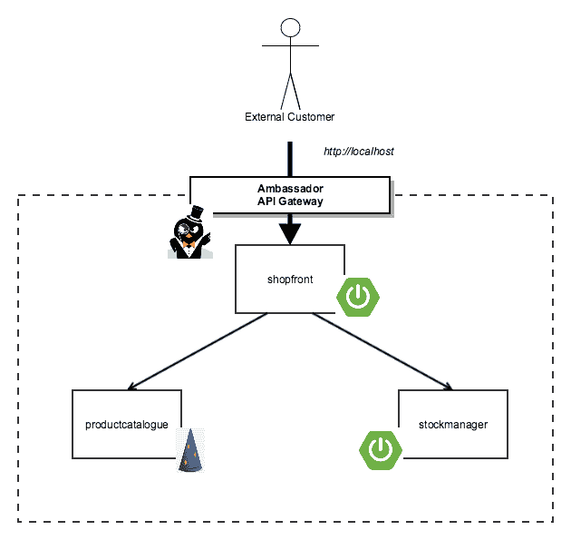
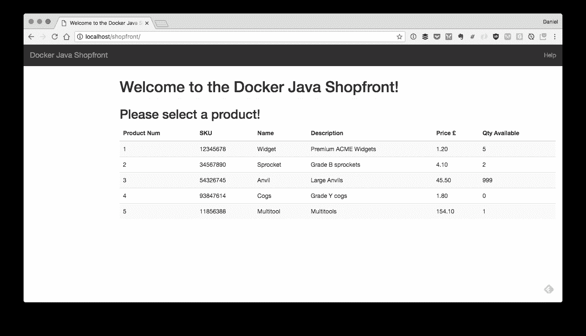
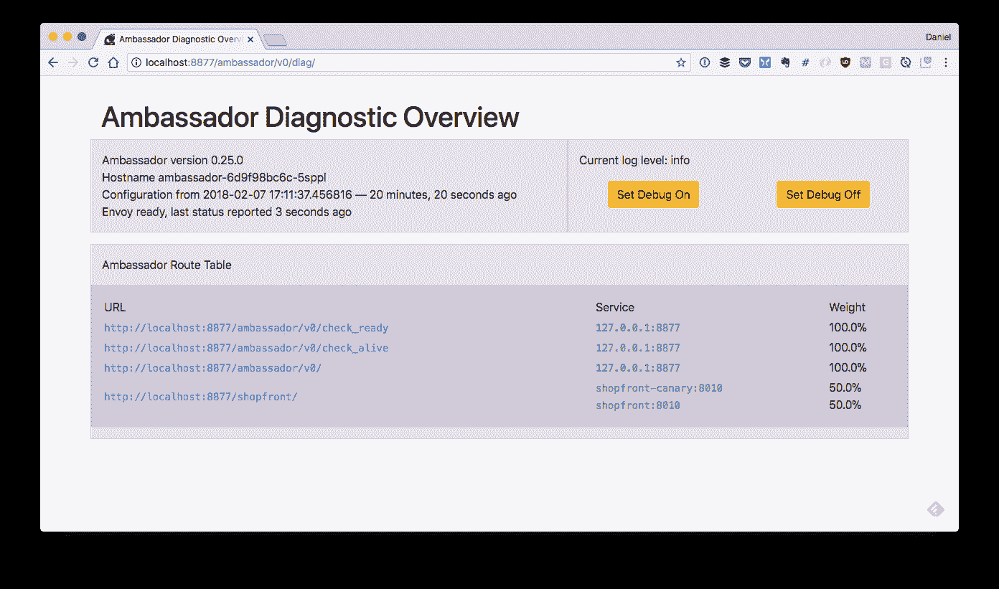

# 使用 Kubernetes 和 API 网关部署 Java 应用程序

> 原文：<https://medium.com/hackernoon/deploying-java-applications-with-kubernetes-and-an-api-gateway-fc471644bea7>

在本文中，您将了解如何将三个简单的 Java 服务部署到 Kubernetes 中(通过新的 Docker for Mac/Windows Kubernetes 集成在本地运行)，并通过 Kubernetes-native Ambassador API 网关向最终用户公开前端服务。所以，拿起你选择的含咖啡因的饮料，在你的终端前舒服地休息一下吧！

# 快速回顾:架构和部署

去年 10 月 [Daniel Bryant](https://twitter.com/danielbryantuk/) 在 [Kubernetes 支持下](https://www.oreilly.com/ideas/how-to-manage-docker-containers-in-kubernetes-with-java)扩展了他简单的基于 Java 微服务的“ [Docker Java Shopping](https://github.com/danielbryantuk/oreilly-docker-java-shopping) 容器部署演示。如果您有时间完成本教程，您应该已经在 Docker 镜像中打包了三个简单的 Java 服务——Spring Boot 商店和库存管理器服务，以及产品目录 Java EE DropWizard 服务，并且将生成的容器部署到本地的由 minikube 支持的 Kubernetes 集群中。他还向您展示了如何通过使用[节点端口服务](https://kubernetes.io/docs/concepts/services-networking/service/#type-nodeport)映射和公开 Kubernetes 集群端口，向最终用户开放店面服务。虽然这对于演示来说是可行的，但是许多人问如何在 API 网关后面部署应用程序。这是一个很好的问题，因此我们渴望在本教程系列中添加另一篇文章(在 Daniel 的帮助下)，目标是在开源的 Kubernetes-native[Ambassador API Gateway](https://www.getambassador.io/)后面部署“Docker Java Shopping”Java 应用程序。



**图一。与 Ambassador API 网关一起部署的“Docker Java 购物”应用程序**

# 快速旁白:为什么要使用 API 网关？

你们中的许多人以前都用过(或者至少碰到过)API 网关的概念。Chris Richardson 在 [microservices.io](http://microservices.io/patterns/apigateway.html) 上写了一篇很好的细节概述，而创建大使 API 网关 [Datawire](https://www.datawire.io/) 的团队也谈到了使用 [Kubernetes-native API 网关](https://www.getambassador.io/about/why-ambassador)的好处。API 网关允许你集中应用程序的许多横切关注点，比如负载平衡、安全和速率限制。此外，API 网关可以成为帮助[加速持续交付](https://blog.getambassador.io/continuous-delivery-how-can-an-api-gateway-help-or-hinder-1ff15224ec4d)的有用工具。运行 Kubernetes-native API 网关还允许您将一些与部署和维护网关相关的操作问题——比如实现弹性和可伸缩性——转移到 Kubernetes 本身。

Java 开发者有几个 API 网关可供选择，比如[网飞的 Zuul](https://github.com/Netflix/zuul) 、 [Spring Cloud Gateway](https://cloud.spring.io/spring-cloud-gateway/) 、 [Mashape 的 Kong](https://getkong.org/) ，一个云厂商的实现(比如[亚马逊的 API 网关](https://aws.amazon.com/api-gateway/)，当然还有传统热门的 [NGINX](https://www.nginx.com/) 和 [HAProxy](http://www.haproxy.org/) ，还有一些更现代的变种比如 [Traefik](https://traefik.io/) 。选择一个 API 网关需要做大量的工作，因为这是你的基础设施的一个关键部分(将每一点流量都接触到你的应用程序)，并且有许多权衡要考虑。特别是，注意潜在的高耦合点——例如，[将“Filter”](https://github.com/Netflix/zuul/wiki/zuul-simple-webapp)Groovy 脚本动态部署到的 Zuul 中的能力使业务逻辑能够在服务和网关之间传播——以及随着最终用户流量的增加部署复杂数据存储的需求——例如，Kong 需要一个 [Cassandra 集群或 Postgres 安装](https://getkong.org/about/faq/#how-does-it-work)来进行水平扩展。

为了简单起见，本文中我们将使用开源的 Kubernetes-native API Gateway，Ambassador。Ambassador 有一个简单的实现，减少了偶然将任何业务逻辑耦合到它上面的可能性。它还允许您通过声明性方法指定服务路由，这种方法与 Kubernetes 和其他现代基础设施的“原生云”方法一致。额外的好处是，路由可以很容易地存储在版本控制中，并与所有其他代码更改一起被推入 CI/CD 构建管道。

# 入门:节点端口和负载平衡器 101

首先，确保您从一个新的(空的)Kubernetes 集群开始。这个演示将使用 Docker for Mac 中新的 Kubernetes 集成。如果你想继续下去，你需要确保你已经安装了 Mac 版的[Docker](https://blog.docker.com/2018/01/docker-mac-kubernetes/)或者 Windows 版的[Docker](https://blog.docker.com/2018/01/docker-windows-desktop-now-kubernetes/)，并且按照 [Docker Kubernetes 文档](https://docs.docker.com/docker-for-mac/#kubernetes)中的说明启用了 Kubernetes 支持。在切换到 Ambassador 之前，我们将首先使用节点端口设置入口。如果你有兴趣了解更多关于 Kubernetes ingress 的细微差别，[这篇文章有更多的细节](https://blog.getambassador.io/kubernetes-ingress-nodeport-load-balancers-and-ingress-controllers-6e29f1c44f2d)。

接下来克隆[“Docker Java shop front”GitHub 存储库](https://github.com/danielbryantuk/oreilly-docker-java-shopping)。如果您想探索目录结构并了解组成应用程序的三个服务中的每一个，那么可以看看本系列的前一篇文章[或相关的迷你书](https://www.oreilly.com/ideas/how-to-manage-docker-containers-in-kubernetes-with-java)[Java 中的容器化连续交付](https://www.nginx.com/resources/library/containerizing-continuous-delivery-java/)。成功克隆存储库后，您可以导航至`kubernetes`目录。如果您按照教程进行操作，那么您将在这个目录中进行修改，因此欢迎您派生您自己的 repo 副本并创建一个分支，您可以将您的工作推进到这个分支。我不建议跳过前面(或作弊)，但`[kubernetes-ambassador](https://github.com/danielbryantuk/oreilly-docker-java-shopping/tree/master/kubernetes-ambassador)`目录包含完整的解决方案，以防你想检查你的工作！

```
$ git clone [git@github.com](mailto:git@github.com):danielbryantuk/oreilly-docker-java-shopping.git
$ cd oreilly-docker-java-shopping/kubernetes
(master) kubernetes $ ls -lsa
total 24
0 drwxr-xr-x 5 danielbryant staff 160 5 Feb 18:18 .
0 drwxr-xr-x 18 danielbryant staff 576 5 Feb 18:17 ..
8 -rw-r — r — 1 danielbryant staff 710 5 Feb 18:22 productcatalogue-service.yaml
8 -rw-r — r — 1 danielbryant staff 658 5 Feb 18:11 shopfront-service.yaml
8 -rw-r — r — 1 danielbryant staff 677 5 Feb 18:22 stockmanager-service.yaml
```

如果您在您选择的编辑器/IDE 中打开`[shopfront-service.yaml](https://github.com/danielbryantuk/oreilly-docker-java-shopping/blob/master/kubernetes/shopfront-service.yaml)` ,您将会看到我们将店面服务公开为可通过 TCP 端口 8010 访问的`NodePort`。这意味着可以通过任何公开的群集节点 IP(不受防火墙阻止)上的端口 8010 访问该服务。

```
---
apiVersion: v1
kind: Service
metadata:
 name: shopfront
 labels:
 app: shopfront
spec:
 type: NodePort
 selector:
 app: shopfront
 ports:
 — protocol: TCP
 port: 8010
 name: http
```

通过 minikube 运行该服务时，`NodePort`允许您通过集群外部 IP 访问该服务。当通过 Docker 运行服务时，NodePort 允许您通过 localhost 和 Kubernetes 分配的端口访问服务。假设 Docker for Mac 或 Windows 已经配置为成功运行 Kubernetes，那么现在您可以部署这个服务了:

```
(master) kubernetes $ kubectl apply -f shopfront-service.yaml
service “shopfront” created
replicationcontroller “shopfront” created
(master) kubernetes $ kubectl get services
NAME        TYPE       CLUSTER-IP   EXTERNAL-IP PORT(S)        AGE
kubernetes  ClusterIP  10.96.0.1    <none>      443/TCP        19h
shopfront   NodePort   10.110.74.43 <none>      8010:31497/TCP 0s
```

您可以看到已经创建了店面服务，虽然没有列出外部 ip，但是您可以看到在 `stockmanager-service.yaml` (8010)中指定的端口已经映射到端口 31497(您的端口号在这里可能不同)。如果你正在使用 Docker for Mac 或 Windows，你现在可以从本地主机获取数据(因为 Docker 应用程序在幕后发挥了一些神奇的作用)，如果你正在使用 minikube，你可以通过在终端中键入`minikube ip`来获取集群 IP 地址。

假设您正在使用 Docker，并且您只部署了单个的店面服务，那么您应该会看到来自 curl 的这个响应，它使用了从`kubectl get svc`命令中可以看到的端口号(对我来说是 31497):

```
(master) kubernetes $ curl -v localhost:31497
* Rebuilt URL to: localhost:31497/
* Trying ::1…
* TCP_NODELAY set
* Connected to localhost (::1) port 31497 (#0)
> GET / HTTP/1.1
> Host: localhost:31497
> User-Agent: curl/7.54.0
> Accept: */*
>
< HTTP/1.1 500
< X-Application-Context: application:8010
< Content-Type: application/json;charset=UTF-8
< Transfer-Encoding: chunked
< Date: Tue, 06 Feb 2018 17:20:19 GMT
< Connection: close
<* Closing connection 0{“timestamp”:1517937619690,”status”:500,”error”:”Internal Server Error”,”exception”:”org.springframework.web.client.ResourceAccessException”,”message”:”I/O error on GET request for \”http://productcatalogue:8020/products\": productcatalogue; nested exception is java.net.UnknownHostException: productcatalogue”,”path”:”/”}
```

您会注意到这个 curl 会得到一个 HTTP 500 错误响应，这是意料之中的，因为您还没有部署所有的支持服务。但是，在部署其余服务之前，您需要将所有服务的节点端口配置更改为 ClusterIP。这意味着每个服务只能在群集内的其他网络上访问。当然，您可以使用防火墙来限制 NodePort 公开的服务，但是通过在我们的本地开发环境中使用 ClusterIP，您将不得不通过除了我们将部署的 API 网关之外的任何方式来访问我们的服务。

在编辑器中打开`shopfront-service.yaml`，将`NodePort`改为`ClusterIP`。你可以在下面看到文件内容的相关部分:

```
---
apiVersion: v1
kind: Service
metadata:
 name: shopfront
 labels:
 app: shopfront
spec:
 type: ClusterIP
 selector:
 app: shopfront
 ports:
 — protocol: TCP
 port: 8010
 name: http
```

现在您可以将包含在`productcatalogue-service.yaml`和`stockmanager-service.yaml`文件中的服务修改为`ClusterIP`。

现在，您还可以删除现有的 shopfront 服务，为在本教程的下一部分中部署整个堆栈做好准备。

```
(master *) kubernetes $ kubectl delete -f shopfront-service.yaml
service “shopfront” deleted
replicationcontroller “shopfront” deleted
```

# 部署整个堆栈

再次使用空的 Kubernetes 集群，您现在可以部署完整的三服务堆栈，并获得每个服务的相关 Kubernetes 信息:

```
(master *) kubernetes $ kubectl apply -f .
service “productcatalogue” created
replicationcontroller “productcatalogue” created
service “shopfront” created
replicationcontroller “shopfront” created
service “stockmanager” created
replicationcontroller “stockmanager” created(master *) kubernetes $ kubectl get services
NAME             TYPE      CLUSTER-IP EXTERNAL-IP PORT(S)  AGE
kubernetes       ClusterIP 10.96.0.1  <none>      443/TCP  2h
productcatalogue ClusterIP 10.106.8.5 <none>      8020/TCP 1s
shopfront        ClusterIP 10.9.19.20 <none>      8010/TCP 1s
stockmanager     ClusterIP 10.96.27.5 <none>      8030/TCP 1s
```

您可以看到服务中声明的端口按指定可用(即 8010、8020、8030) —每个运行的 pod 都有自己的集群 IP 和关联的端口范围(即每个 pod 都有自己的“网络名称空间”)。我们无法在集群外部访问该端口(就像我们可以使用`NodePort`一样)，但是在集群内部，一切都按预期工作。

您还可以看到，使用`ClusterIP`并没有通过尝试卷曲端点来对外公开服务(这一次您应该会收到“连接被拒绝”):

```
(master *) kubernetes $ curl -v localhost:8010
* Rebuilt URL to: localhost:8010/
* Trying ::1…
* TCP_NODELAY set
* Connection failed
* connect to ::1 port 8010 failed: Connection refused
* Trying 127.0.0.1…
* TCP_NODELAY set
* Connection failed
* connect to 127.0.0.1 port 8010 failed: Connection refused
* Failed to connect to localhost port 8010: Connection refused
* Closing connection 0
curl: (7) Failed to connect to localhost port 8010: Connection refused
```

# 部署 API 网关

现在是时候部署 Ambassador API 网关了，以便向最终用户公开您的店面服务。其他两个服务可以在集群中保持私有，因为它们是支持服务，不必公开。

首先，创建一个`LoadBalancer`服务，该服务使用 Kubernetes 注释将来自集群外部的请求路由到适当的服务。将以下内容保存在名为`ambassador-service.yaml`的新文件中。注意`getambassador.io/config`的注释。您可以使用 [Kubernetes annotations](https://kubernetes.io/docs/concepts/overview/working-with-objects/annotations/) 将任意的非标识性元数据附加到对象上，并且像 Ambassador 这样的客户端可以检索这些元数据。

```
—--
apiVersion: v1
kind: Service
metadata:
  labels:
    service: ambassador
  name: ambassador
  annotations:
    getambassador.io/config: |
    ---
    apiVersion: ambassador/v0
    kind: Mapping
    name: shopfront
    prefix: /shopfront/
    service: shopfront:8010
spec:
  type: LoadBalancer
  ports:
  - name: ambassador
    port: 80
    targetPort: 80
  selector:
    service: ambassador
```

大使注释是网关如何工作的关键——它如何将来自集群外部的“进入”流量(例如，最终用户请求)路由到集群内的服务。让我们来分解一下:

*   `getambassador.io/config: |`指定该注释用于大使
*   `apiVersion: ambassador/v0`指定大使 API/模式版本
*   `kind: Mapping`指定您正在创建一个“映射”(路由)配置
*   `name: shopfront`是这个映射的名称(它将出现在调试 UI 中)
*   `prefix: /shopfront/`是您想要内部路由的 URI 的外部前缀
*   `service: shopfront:8010`是您要路由到的 Kubernetes 服务

简而言之，该注释声明任何对 LoadBalancer 服务的外部 IP(在 Mac/Windows 的 Docker 示例中为`localhost`)的带有前缀`/shopfront/`的请求都将被路由到运行在(ClusterIP)端口 8010 上的 Kubernetes shopfront 服务。在您的示例中，当您在 web 浏览器中输入[http://localhost/shopfront/](http://localhost/shopfront/)时，您应该会看到由 shop front 服务提供的 UI。希望这一切都有意义，但如果没有意义，那么请访问[大使吉特](https://gitter.im/datawire/ambassador)并提出任何问题，或在 twitter 上 ping 我！

您可以部署大使服务:

```
(master *) kubernetes $ kubectl apply -f ambassador-service.yaml
service “ambassador” created
```

您还需要部署 Ambassador Admin 服务(以及相关的 pod/containers ),它们负责与路由相关的繁重工作。值得注意的是，路由是由“sidecar”代理进行的，在本例中是[特使代理](https://www.envoyproxy.io/)。[特使](https://www.datawire.io/envoyproxy/)负责 Lyft 内部的所有生产网络流量。它的创作者[马特·克莱恩](https://twitter.com/mattklein123?lang=en)，写了很多关于[细节](https://blog.envoyproxy.io/envoy-threading-model-a8d44b922310)的[非常有趣的](https://eng.lyft.com/envoy-7-months-later-41986c2fd443)内容[。今天，由于种种原因，它是 NGINX 和 HAProxy 增长最快的替代品。你可能也听说过新兴的“](https://blog.envoyproxy.io/service-mesh-data-plane-vs-control-plane-2774e720f7fc)[服务网格](https://buoyant.io/2017/04/25/whats-a-service-mesh-and-why-do-i-need-one/)技术，流行的 [Istio](https://istio.io/) 项目也使用 Envoy。

反正回到教程！您可以在 [getambassador.io](https://www.getambassador.io/) 网站上找到为 [Ambassador Admin](https://getambassador.io/yaml/ambassador/ambassador-no-rbac.yaml) 预先准备的 Kubernetes 配置文件(在本演示中，您将使用“无 RBAC”版本的服务，但是如果您运行的是启用了基于角色的访问控制(RBAC)的 Kubernetes 集群，您也可以找到启用了 RBAC 版本的[配置文件](https://getambassador.io/yaml/ambassador/ambassador-rbac.yaml)。您可以下载配置文件的副本并在应用前查看，或者您可以通过互联网直接应用服务:

```
(master *) kubernetes $ kubectl apply -f [https://getambassador.io/yaml/ambassador/ambassador-no-rbac.yaml](https://getambassador.io/yaml/ambassador/ambassador-no-rbac.yaml)
service “ambassador-admin” created
deployment “ambassador” created
```

如果您发出一个`kubectl get svc`，您可以看到您的大使负载平衡器和大使管理服务已经成功部署:

```
(master *) kubernetes $ kubectl get svc
NAME             TYPE         CLUSTER-IP EXTERNAL-IP PORT(S) AGE
ambassador       LoadBalancer 10.12.1.42 <pending>   80:31053/TCP 5m
ambassador-admin NodePort     10.15.58.25 <none>     8877:31516/TCP 1m
kubernetes       ClusterIP    10.96.0.1  <none>      443/TCP  20h
productcatalogue ClusterIP    10.106.8.5 <none>      8020/TCP 22m
shopfront        ClusterIP    10.98.1.20 <none>      8010/TCP 22m
stockmanager     ClusterIP    10.96.2.45 <none>      8030/TCP 22m
```

你会在 ambassador 服务上注意到 external-ip 被列为<pending>，这是 Docker for Mac/Windows 的一个[已知错误。您仍然可以通过 localhost 访问`LoadBalancer`服务——尽管您可能需要等待一两分钟，以便在幕后成功部署所有的东西。](https://www.datawire.io/docker-mac-kubernetes-ingress/)</pending>

现在让我们尝试使用您之前在 Ambassador 注释中配置的`/shopfront/`路线访问店面。您可以 `curl localhost/shopfront/`(无需指定端口，因为您将大使`LoadBalancer`服务配置为监听端口 80):

```
(master *) kubernetes $ curl localhost/shopfront/
<!DOCTYPE html><html lang=”en” xmlns=”http://www.w3.org/1999/xhtml">
<head>
<meta charset=”utf-8" />
<meta http-equiv=”X-UA-Compatible” content=”IE=edge” />
<meta name=”viewport” content=”width=device-width, initial-scale=1" />
<! — The above 3 meta tags *must* come first in the head; any other head content must come *after* these tags -->...<! — jQuery (necessary for Bootstrap’s JavaScript plugins) →
<script src=”https://ajax.googleapis.com/ajax/libs/jquery/1.12.4/jquery.min.js"></script>
<! — Include all compiled plugins (below), or include individual files as needed -->
<script src=”js/bootstrap.min.js”></script>
</body>
</html>
```

就是这样！您现在可以通过 Ambassador 访问隐藏在 Kubernetes 集群中的店面服务。您还可以通过浏览器访问店面 UI，这提供了一个更加友好的视图！



# 奖励:大使诊断

如果你想看看大使诊断用户界面，那么你可以使用端口转发。我们将在以后的文章中解释如何使用它，但是现在你可以自己四处看看。首先你需要找到大使舱的名字:

```
(master *) kubernetes $ kubectl get pods
NAME                        READY STATUS  RESTARTS AGE
ambassador-6d9f98bc6c-5sppl 2/2   Running 0        19m
ambassador-6d9f98bc6c-nw6z9 2/2   Running 0        19m
ambassador-6d9f98bc6c-qr87m 2/2   Running 0        19m
productcatalogue-sdtlc      1/1   Running 0        22m
shopfront-gr794             1/1   Running 0        22m
stockmanager-bp7zq          1/1   Running 1        22m
```

这里我们就挑`ambassador-6d9f98bc6c-5sppl`。现在，您可以从本地网络适配器端口转发到集群内部，并公开在端口 8877 上运行的大使诊断 UI。

```
(master *) kubernetes $ kubectl port-forward ambassador-6d9f98bc6c-5sppl 8877:8877
```

现在可以在浏览器中访问[http://localhost:8877/ambassador/v 0/diag](http://localhost:8877/ambassador/v0/diag)四处看看了！



完成后，您可以通过`ctrl-c`退出端口转发。您还可以通过在 kubernetes 目录中发出一个`kubectl delete -f .`来删除您已经部署到 Kubernetes 集群中的所有服务。您还需要删除已经部署的 ambassador-admin 服务。

```
(master *) kubernetes $ kubectl delete -f .
service “ambassador” deleted
service “productcatalogue” deleted
replicationcontroller “productcatalogue” deleted
service “shopfront-canary” deleted
replicationcontroller “shopfront-canary” deleted
service “shopfront” deleted
replicationcontroller “shopfront” deleted
service “stockmanager” deleted
replicationcontroller “stockmanager” deleted(master *) kubernetes $ kubectl delete -f [https://getambassador.io/yaml/ambassador/ambassador-no-rbac.yaml](https://getambassador.io/yaml/ambassador/ambassador-no-rbac.yaml)
service “ambassador-admin” deleted
deployment “ambassador” deleted
```

# 下一步是什么？

Ambassador 使[金丝雀测试变得非常容易](https://www.datawire.io/faster/canary-workflow/)，所以请期待未来的一篇关于 Java 微服务的文章。我们将探讨的其他主题是将所有这些集成到 CD 管道中，以及如何最好地建立本地开发工作流。此外，Ambassador 支持 [gRPC](https://blog.getambassador.io/grpc-and-the-open-source-ambassador-api-gateway-510eaaf9a0e0) 、 [Istio](https://www.getambassador.io/user-guide/with-istio) 和 [statsd 风格的监控](https://www.getambassador.io/reference/statistics)，这些都是当今云原生环境中的热门话题。如果您有任何想法或反馈，请随时评论！

*注:本文基于丹尼尔·布莱恩特* [*原著*](https://blog.getambassador.io/deploying-java-apps-with-kubernetes-and-the-ambassador-api-gateway-c6e9d9618f1b) *搭配 Java 微服务和 API 网关。*