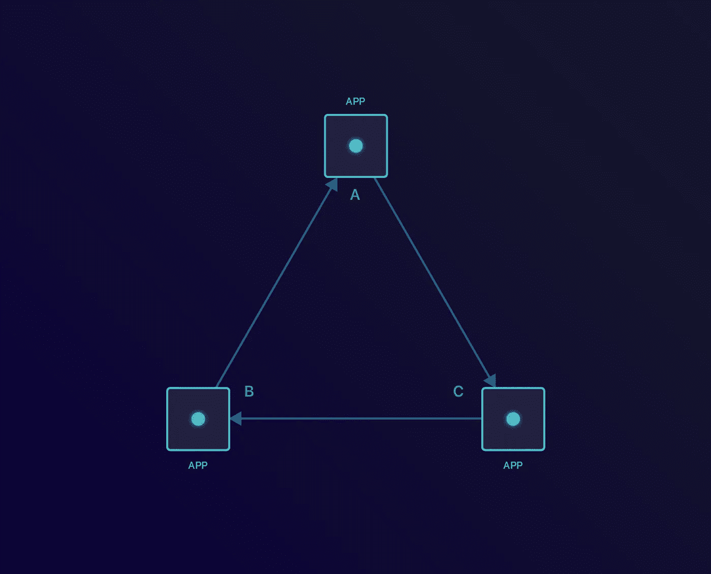
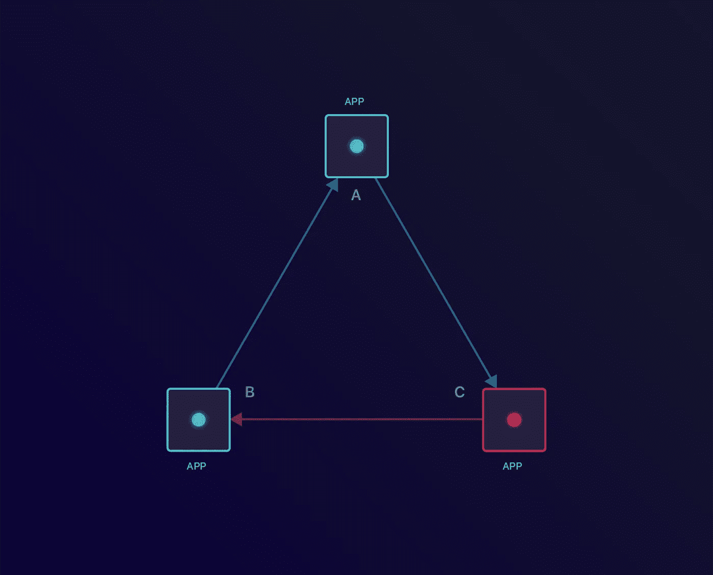
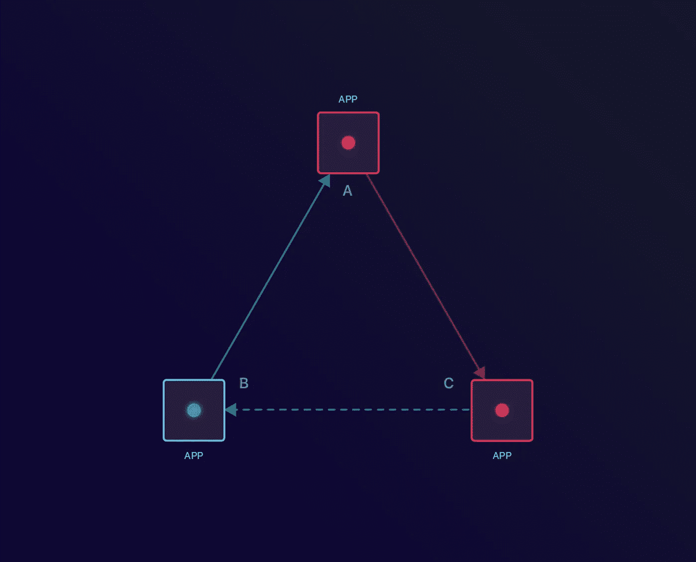
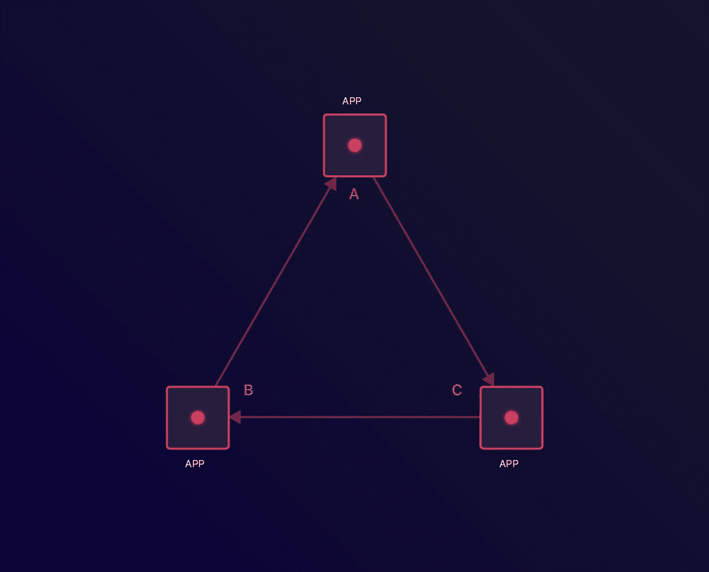
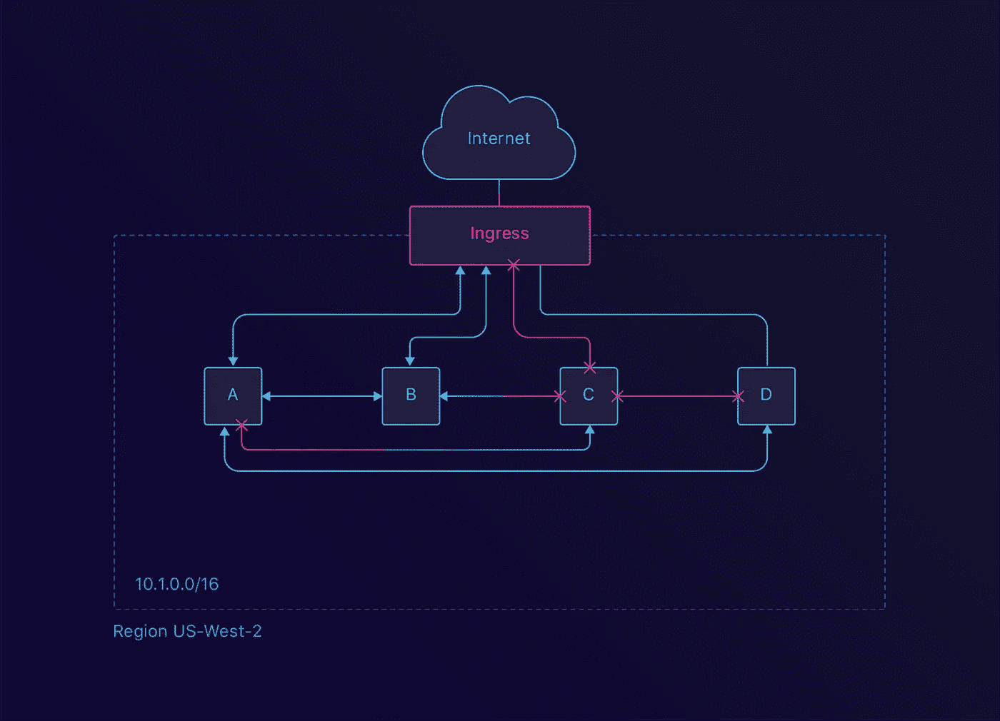
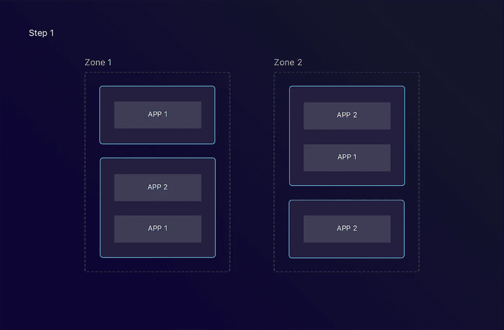
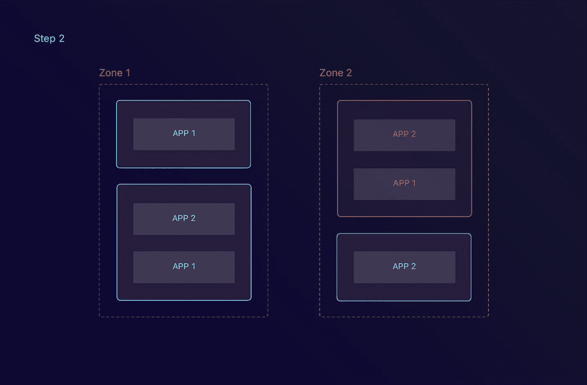
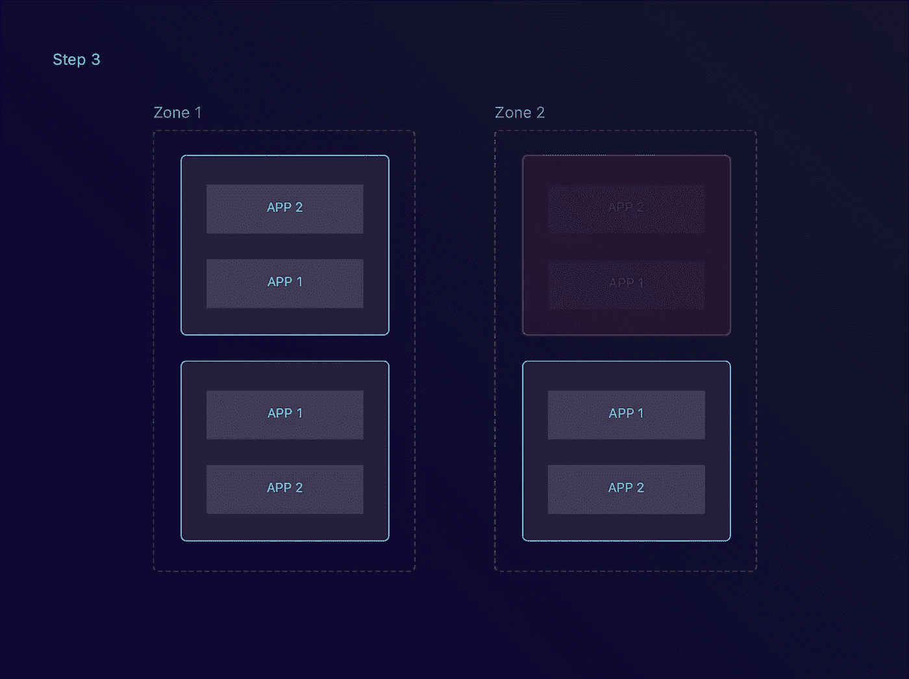
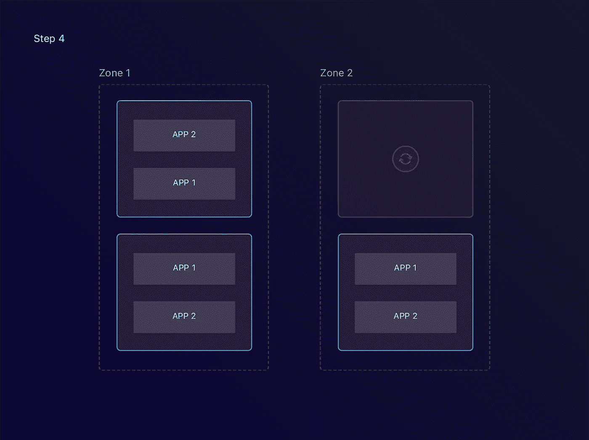
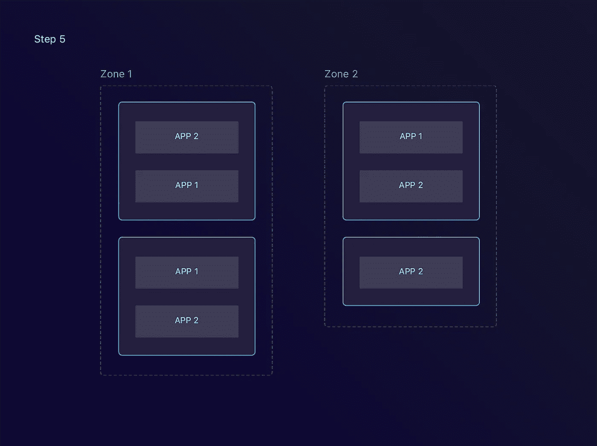

# 使用 Kubernetes 部署坚如磐石的应用程序

> 原文：<https://medium.com/hackernoon/deploying-rock-solid-applications-with-kubernetes-230fd9bb61f4>

> 披露: [*流形*](https://goo.gl/cF8TcH) *，独立开发者服务的市场*，之前赞助过黑客正午。 [*使用 code HACKERNOON2018 获得任何服务 10 美元的折扣。*](https://goo.gl/cF8TcH)

在之前的博客文章中，我们描述了如何建立我们的 [Kubernetes](https://hackernoon.com/tagged/kubernetes) 集群。我们还检查了支持我们的应用程序的初始配置。现在我们已经启动并运行了集群，是时候开始部署这些应用程序了。

在这篇博文中，我们将看看我们在[应用](https://hackernoon.com/tagged/application)层面所做的一些改变。

# 健康检查

迁移到 Kubernetes 让我们有机会设置[活跃度和就绪性探测器](https://kubernetes.io/docs/tasks/configure-pod-container/configure-liveness-readiness-probes/)。如果您的应用程序需要进行一些引导，准备就绪检查是有用的。活性检查对于长时间运行的服务特别有用。

为了简化，我们创建了 [healthz 包](https://github.com/manifoldco/healthz)。我们将这一点与我们的框架挂钩，默认情况下为我们的所有服务和工作人员启用这一点。

## 警告:循环依赖

当一个服务与另一个服务对话时，对此进行检查是明智的。这伴随着建立循环依赖的风险。发生这种情况时，您可能会面临难以恢复的完全集群中断。为了减轻这种情况，使用“*降级*状态。这可以让您知道有问题，但不会将您的服务标记为不可用。

3 applications which depend on each other

Outage in Application C

Due to the Application C dependency in Application A, Application A becomes unavailable

Application A is now unavailable, making Application B unavailable. None of the apps can reboot.

# 保护 Docker 图像

在迁移的同时，我们还决定提高我们的 [Docker 映像](https://docs.docker.com/engine/reference/commandline/images/)的安全性。我们通过确保我们的容器[运行无特权](/@lizrice/non-privileged-containers-based-on-the-scratch-image-a80105d6d341)来做到这一点。

为了更进一步，我们还研究了在 Kubernetes 中建立 [Pod 安全策略](https://kubernetes.io/docs/concepts/policy/pod-security-policy/)。有了这些策略，我们将强制用户作为非根用户运行他们的容器。遗憾的是，我们还没有设法让[准入控制器](https://kubernetes.io/docs/admin/admission-controllers/)工作。在我们的遗留系统中没有这种强制措施，所以我们同意推迟这一点。

*PS:* 谷歌已经[宣布在他们的](https://cloud.google.com/kubernetes-engine/docs/how-to/pod-security-policies) [Kubernetes 引擎](https://cloud.google.com/kubernetes-engine/)上支持这个。

# 网络策略

一些服务应该只接收来自一组特定源的请求。您的日志聚合器不需要与您的用户服务对话。这就是网络政策发挥作用的地方。

默认情况下，我们的任何服务都不能从集群外部获得。与这些服务之一对话的唯一方式是通过我们的 [Nginx 入口](https://github.com/kubernetes/ingress-nginx)。

在我们自己的应用程序网络中，我们已经建立了一个规则，以便所有服务都可以相互通信。为此，我们用组件标签标记每个应用程序，如*组件:市场*。现在我们可以为这个特定的组件设置一个选择器。

通过添加服务标签，您还可以创建更细粒度的策略。其中一个策略可能是只允许流量从您的*计费服务*流向您的*货币服务*。

We can restrict Ingress and Egress traffic as well as inter-application traffic with Network Policies.

# 容忍节点故障

在我们之前的博文中，我们讨论了如何为实例设置高可用性(HA)。这并不能保证我们的应用程序以高可用性的方式运行。

## 行程安排

首先，您需要运行 Kubernetes 部署的多个副本。这将确保当其中一个副本出现故障时，其他副本仍然可以为流量提供服务。然后，一个新的健康副本将替换不健康的副本。

最常见的设置是有几个可用性区域。每个可用性区域也有一组节点。在理想情况下，副本分布在这些实例中。

通过使用[部署关系](https://kubernetes.io/docs/concepts/configuration/assign-pod-node/#affinity-and-anti-affinity)，我们完全可以做到这一点。我们可以要求 [Kubernetes 调度器](https://kubernetes.io/docs/reference/generated/kube-scheduler/)寻找这种类型的服务还没有运行的实例。我们还可以要求找到一个该服务尚未激活的可用区域。然后 Kubernetes 将决定一个节点，并在那里部署应用程序。

你可以在这里看到完整的例子:

podAntiAffinity example to spread load across multiple instances and zones.

2 different applications are deployed across different zones and nodes

One of the nodes becomes unavailable, marking all the applications within unhealthy.

The unhealthy applications are rescheduled on healthy nodes.

通过这样配置，可以降低在同一个实例上安排 pod 的可能性。这反过来增加了你的可用性。我们已经将集群配置为使用 preferedDuringScheduling 节。这告诉 Kubernetes 尝试这样做，但是如果没有满足要求的实例，就不要强制执行。

## 重新安排

当 Kubernetes 第一次看到吊舱时，它会决定在哪里发射吊舱。如上所述，我们也可以对此进行一些约束。

鉴于集群是动态的——pod 来来去去——而调度是静态的，随着时间的推移，这些约束可能会被违反。例如，这可能是由于其他实例上缺少资源或由于实例失败。

我们通过在集群中安装一个[调度器](https://github.com/kubernetes-incubator/descheduler)解决了这个问题。这可以做几件事。其中之一是确保实例间的负载在给定的范围内。另一个是取消违反它们的相似性规则的 pod。

如果我们继续前面的例子，看起来是这样的:

The AutoScaling Group creates a new instance

Once the new node becomes available, apps get rescheduled on the new node.

需要注意的一件重要事情是，去调度器尊重[podisruption budgets](https://kubernetes.io/docs/concepts/workloads/pods/disruptions/)。如果没有配置，特定部署的所有副本可能会同时取消调度。这可能会导致意外的服务中断。

# 结论

Kubernetes 做了很好的现成工作。然而，它需要一些帮助，让它知道你的应用程序设置。一旦你知道了这一点，你将能够使用一套强大的工具:

*   [健康检查](https://kubernetes.io/docs/tasks/configure-pod-container/configure-liveness-readiness-probes/)
*   [Pod(反)亲和力](https://kubernetes.io/docs/concepts/configuration/assign-pod-node/#affinity-and-anti-affinity)
*   [网络策略](https://kubernetes.io/docs/concepts/services-networking/network-policies/)
*   [安全策略](https://kubernetes.io/docs/concepts/policy/pod-security-policy/)
*   [重新安排](https://github.com/kubernetes-incubator/descheduler)
*   [PodDisruptionBudgets](https://kubernetes.io/docs/concepts/workloads/pods/disruptions/)

为了使这更容易，我们开始建造[高度线](https://heighliner.com/)。它会为你设置一堆合理的默认值。如果您愿意，可以覆盖这些内容。