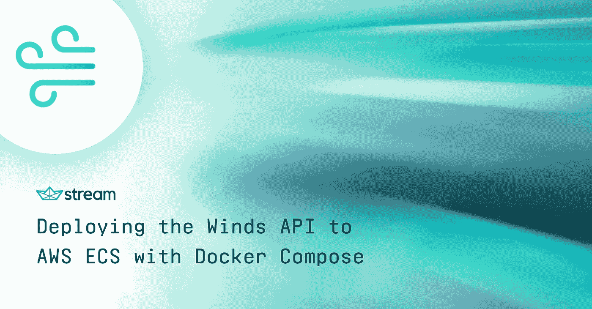
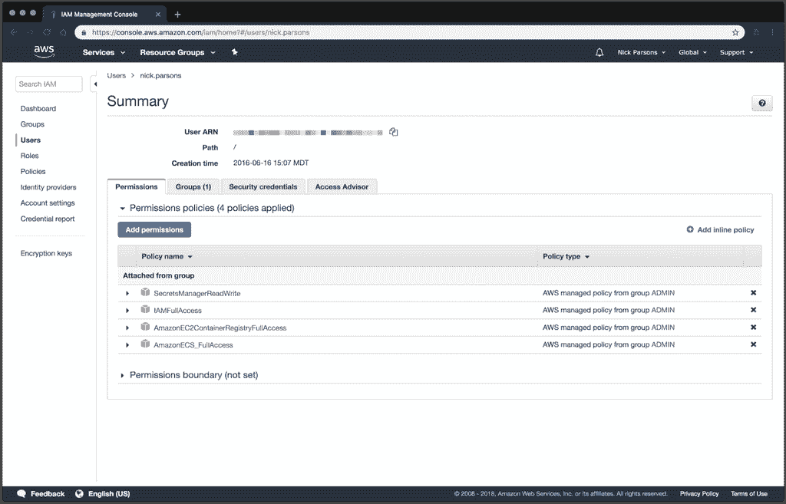

# 使用 Docker Compose 将 Winds API 部署到 AWS ECS

> 原文：<https://medium.com/hackernoon/deploying-the-winds-api-to-aws-ecs-with-docker-compose-4daf8d130d3b>

https://getstream.io/winds

[Winds](https://getstream.io/winds) 是由 [Stream](https://getstream.io/try-the-api) 提供的一个流行的 RSS 和播客应用程序——一个允许你在几个小时而不是几个月内建立新闻和活动提要的服务。Winds 是 100%开源的，后端很容易安装在本地环境或云中——这是我们将在本教程中讨论的任务。为了确保您顺利完成教程，*请*确保完成所有的先决条件。

# 先决条件📚

与任何教程一样，它也有一些要求。对于这篇文章，您需要确保您已经启动并运行了以下内容，并在继续之前做好了准备。如果你决定跳过这些需求，你很可能会在某个地方停滞不前——我们不希望这种情况发生。

1.  对 [ECS](https://aws.amazon.com/ecs/) 和[elastic cache](https://aws.amazon.com/elasticache/)拥有完全访问权限的亚马逊网络服务(AWS)账户
2.  来自 https://github.com/GetStream/Winds[的风的新克隆](https://github.com/GetStream/Winds)
3.  拥有 [MongoDB Atlas](https://cloud.mongodb.com/) 或其他 MongoDB 提供商的账户(我们推荐 MongoDB Atlas)
4.  一个有[流](https://getstream.io/try-the-api)的自由账户
5.  AWS ElastiCache 设置和运行 Redis 的实例(*复制 URI，因为您很快就会需要它*
6.  来自 Mercury 的免费 API 密钥(它处理 RSS 文章解析，因此非常重要)
7.  来自 [Algolia](https://algolia.com/) 的一套免费凭证
8.  安装在您机器上的 AWS CLI
9.  除 AWS CLI 外，还安装了 ECS CLI
10.  Docker Hub 上的一个账户(如果你愿意，你可以使用另一个提供商；然而，我强烈建议坚持使用 Docker Hub)

我想提到的另一件事是，您应该在您的 AWS 帐户上拥有以下权限(或类似权限):

*   amazone C2 containerregistryfull access

就是这样！💥

# 设置相关性🛠

由于我们在上面提供了详尽的列表，希望您已经有机会完成各个步骤，并复制您的第三方 URIs 和凭据以继续下一步。下一步需要我们修改位于 Winds 的 **/api** 目录中的 **docker-compose-aws** 文件。

当我们开始时，该文件将如下所示:

按照 **docker-compose-aws.yml** 文件中的指示填写凭证。不要忘记一个[随机值](https://randomkeygen.com/)给你的 JWT。

您最终应该得到一个类似如下的文件:

> *注意:我们在 docker-compose.yml 文件上使用了****docker-compose-AWS . yml****文件，因为我们在同一个目录中有两个 docker-compose 文件。通过将“-aws”附加到文件中，我们可以很容易地指定在构建环境时要访问什么文件。*

# 使用 ECS CLI 启动和运行🤔

Amazon Web Services (AWS CLI)的弹性容器服务命令行接口提供了高级命令，以简化从本地开发环境创建、更新和监控集群和任务。

这里重要的是，ECS CLI 支持 Docker Compose 文件，这是我们用来定义我们的应用程序如何以及应该如何在云中运行的文件。虽然它是针对多容器应用程序的(我们在 **docker-compose-aws.yml** 中也有一个文件)，但出于本教程的目的，我们将使用单个容器应用程序。

让我们继续配置 AWS ECS CLI，这样我们就可以开始运行了。首先，我们将使用以下命令创建一个“概要文件”:

接下来，我们将使用以下命令完成配置:

> *注意:将 launch type 替换为您希望默认使用的 launch type(EC2 ),将 region_name 替换为您希望的 AWS 区域，将 cluster_name (WINDS)替换为要使用的现有 Amazon ECS 集群或新集群的名称，将 configuration_name (WINDS)替换为您希望为此配置指定的名称。*

# 使用 EC2 任务✍创建群

AWS ECS 需要权限，以便您的 EC2 任务可以在 CloudWatch 中存储日志。该权限由任务执行 IAM 角色负责。为此，我们需要使用 AWS CLI 创建一个任务执行 IAM 角色。

1.创建名为**task-execution-assume-role . JSON**的文件，内容如下:

2.创建任务执行角色(与**task-execution-assume-role . JSON**在同一目录下):

3.附加任务执行角色策略:

# 创建群集和安全组🔑

接下来，我们将创建一个带有安全组的 Amazon ECS 集群。

1.我们已经在集群配置中将 EC2 指定为默认启动类型，因此以下命令创建一个空集群和一个配置了两个公共子网的 VPC:

> *注意:创建资源时，此命令可能需要几分钟才能完成。您还需要记下创建的 VPC 和子网 id，我们很快就会用到它们。*

2.使用 AWS CLI，使用上一个命令输出中的 VPC 值创建一个安全组:

3.使用 AWS CLI，我们将添加一个安全组规则，以允许端口 80 上的入站访问:

# 指定 AWS ECS 🖥的参数

除了我们已经为您创建的 **docker-compose-aws.yml** 文件之外，您还需要创建一个包含以下内容的 **ecs-params.yml** 文件:

> *注意:这个 params 文件特定于 AWS ECS，如果您想在 AWS 上运行 Winds API，它是必需的。您需要指定的值可以在前面的请求中找到。*

# 将映像部署到 Docker Hub🚴

在本节中，我们将概述如何构建、标记和上传 Winds API 到 Docker 和 AWS。

# 创建和上传

对于这一步，您需要使用以下命令登录 Docker:

然后，运行以下命令来构建 Docker 映像(您必须在 **/api** 目录中):

# 标记和推送

首先，您需要获得 docker 图像 ID，您可以运行 **docker 图像列表**，它将输出您所有的 Docker 图像。从标记为“winds”的文件中获取 ID，并将其放入下面的命令中。

正确标记图像所需的命令是:

现在，是时候将标记的图像推送到 AWS 了。您可以通过以下方式实现这一点:

大约需要 30 秒，但完成后。

# 部署到集群📤

现在我们已经配置好了文件和基础设施，我们可以使用以下命令将 Docker compose 文件部署到 ECS:

> *注意:默认情况下，该命令在当前目录中查找名为 docker-compose.yml 的文件；因为我们有两个文件，所以我们需要用–file 选项(或简称为-f)指定一个不同的 docker 合成文件。*

如果一切顺利，您应该会在 ECS 控制台中看到以下内容！如果您单击该任务，您会注意到有一个公共 IP 地址，允许您查看 API(它应该以“pong”响应)。

# 搞定了。👏

我希望你喜欢这篇关于如何使用 Docker 将 Winds 部署到 AWS 的教程。在以后的文章中，我将概述如何在 Google 和 Digital Ocean 上进行同样的部署。

如果你对部署前端感兴趣，看看这篇文章，这篇文章概述了如何使用 AWS S3 和 CloudFront 来部署前端。

编码快乐！🎉

标签: [AWS ECS](https://getstream.io/blog/tag/aws-ecs/) ，[集装箱](https://getstream.io/blog/tag/containers/)，[调配](https://getstream.io/blog/tag/deployment/)，[码头](https://getstream.io/blog/tag/docker/)，[大风](https://getstream.io/blog/tag/winds/)

*最初发布于 2018 年 9 月 6 日*[*getstream . io*](https://getstream.io/blog/deploying-the-winds-api-to-aws-ecs-with-docker-compose/)*。*