# 将 Winds 应用部署到亚马逊 S3 和 CloudFront

> 原文：<https://medium.com/hackernoon/deploying-the-winds-app-to-amazon-s3-and-cloudfront-9652e13fc905>

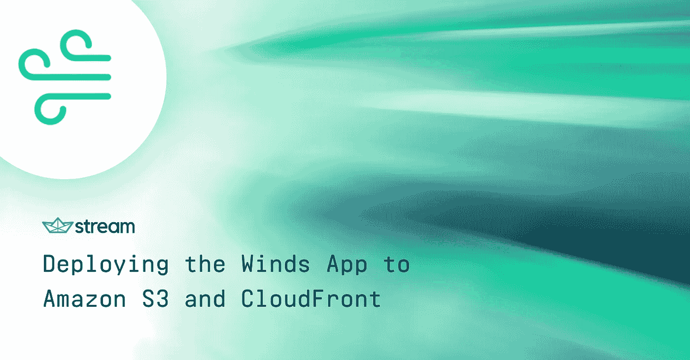

https://getstream.io/winds

[Winds](https://getstream.io/winds) 是一款受欢迎的 RSS 和播客应用，由 [Stream](https://getstream.io/try-the-api) 提供支持——这项服务可以让你在几个小时内而不是几个月内建立新闻和活动提要。Winds 是 [100%开源的](https://github.com/getstream/winds)，前端很容易安装在本地环境或云中——这是我们将在本教程中讨论的任务。为了确保您完成本教程，*请*确保完成所有的先决条件。

# 先决条件📚

与任何教程一样，它也有一些要求。对于这篇文章，您需要确保您已经启动并运行了以下内容，并在继续之前做好了准备。如果你决定跳过这些需求，你很可能会在某个地方停滞不前——我们不希望这种情况发生。

1.  一个 AWS 账户，通过 IAM 访问 [S3](https://aws.amazon.com/s3/) 和 [CloudFront](https://aws.amazon.com/CloudFront/)
2.  [AWS CLI](https://aws.amazon.com/cli/) 安装在您的机器上并进行配置
3.  将 Winds 从 GitHub 的本地目录中克隆出来

# 创建桶🗑

首先，前往 AWS 上的 [S3 控制台](https://console.aws.amazon.com/s3/home)创建一个桶。我将把我的桶命名为“winds-2–0-hosted”，不过，你可以随意命名你的桶。单击“下一步”并继续完成这些步骤。我们将更改一些设置，请务必遵守。😀

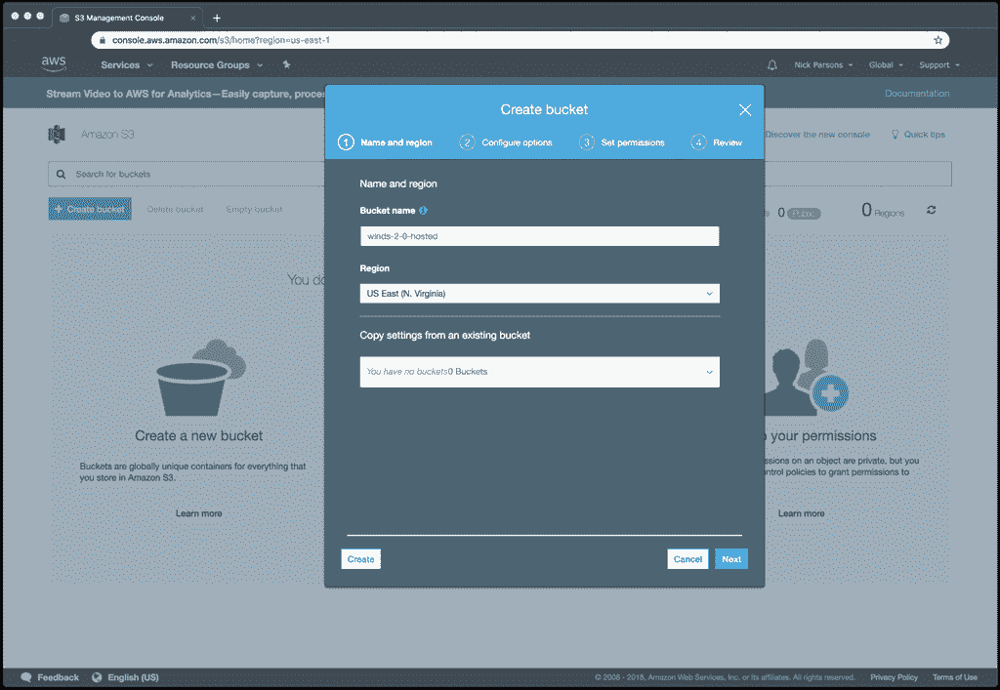

接下来，在“属性”中，打开“静态网站托管”选项卡并选择“启用网站”。为索引和错误文件填写**index.html**。通过将**index.html**指定为错误文档，我们可以允许 react-router 处理根之外的路由。

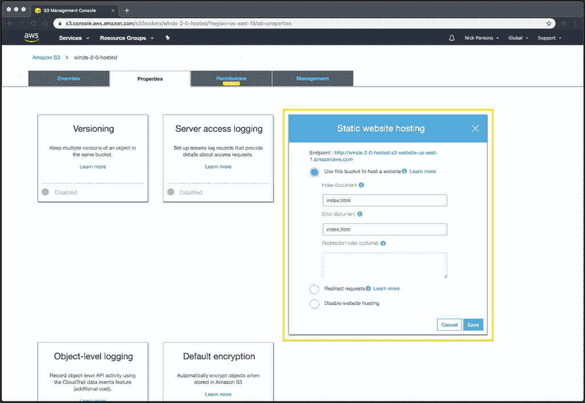

打开“权限”选项卡并选择“编辑策略”。这里，我们将修改 bucket 的权限，以确保用户可以查看和加载 Winds 的内容。可以在下面找到存储桶策略:

# 设置 CloudFront💨

CloudFront 是 AWS 提供的内容交付网络(CDN)服务。cdn 通过将您的内容推到世界各地的边缘位置来优化速度，使其在全球范围内高度可用。因为 Winds 是一个要求相当高的应用程序，并且有很多资源要添加，所以我们将通过 CloudFront 将其提升到一个新的水平。

让我们继续设置 CloudFront。设置完成后，我们将把它指向我们在上一步中创建的 S3 存储桶。

要开始，前往 [CloudFront 控制台](https://console.aws.amazon.com/cloudfront/home)并点击“创建发行版”。您将看到以下屏幕。在“网络”部分选择“开始”。

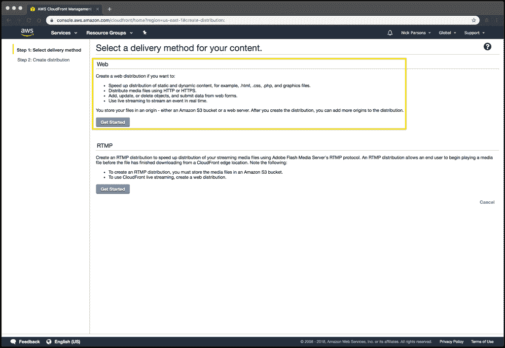

在名为“源域名”的下拉列表中，选择之前创建的 S3 存储桶。在我们的例子中，它将被命名为“winds-2–0-hosted . S3 . Amazon AWS . com”。

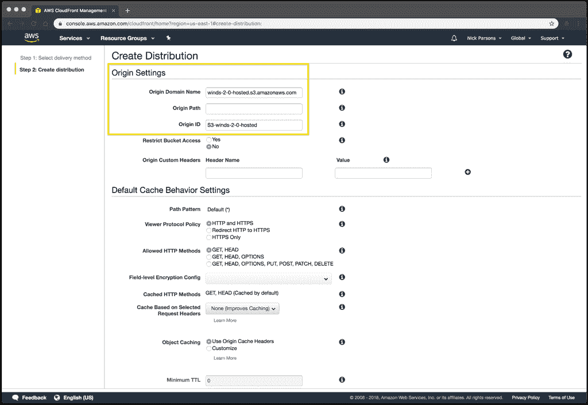

其余设置将预先填入正确的值，因此滚动到底部并单击“创建分配”。您的发行版将需要几分钟的时间来生成，所以请耐心等待。

生成之后，单击 CloudFront 发行版，然后单击“distribution”选项卡。一旦加载完毕，点击“编辑”按钮，将“默认根对象”设置为 index.html 的**并点击底部的“是，编辑”按钮。**

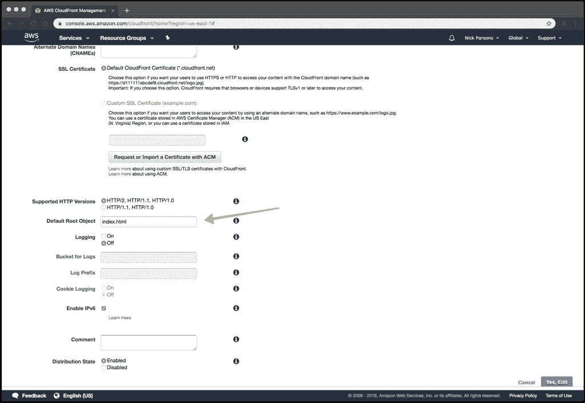

现在，单击您新创建的发行版的 ID 以到达它的设置页面，然后单击“错误页面”选项卡。选择“创建自定义错误响应”。为自定义错误响应选择“是”，为“响应页面路径”设置“/index.html”，为“HTTP 响应代码”设置“200: OK”。CloudFront 发行版中的这个定制错误页面类似于 S3 bucket 上的错误文档。完成后，单击创建。

您还需要创建第二个错误页面，这一次将“HTTP 错误代码”设置为“404”，将“响应页面路径”路径设置为“/index.html”(再次)，将“HTTP 响应代码”设置为“200: OK”。

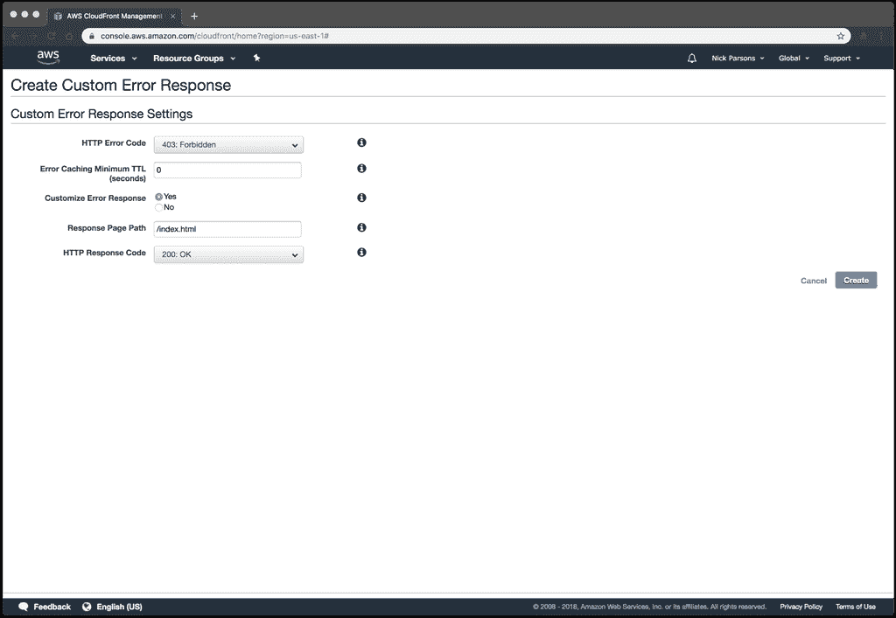

完成后，回到设置界面，点击“行为”标签。单击“创建行为”并选择“重定向 HTTP 到 HTTPS”以强制所有流量到 HTTPS，以及“允许的 HTTP 方法”以“获取、标题、选项、上传、发布、修补和删除”。然后点击底部的“是，编辑”。

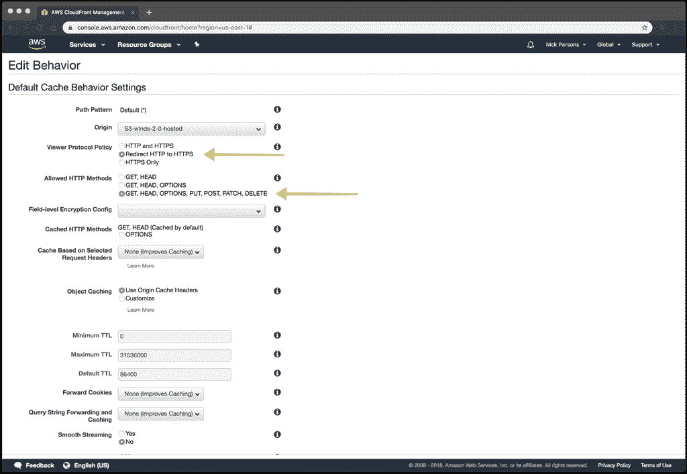

暂时就这样吧！您可以在“分布列表”页面的“域名”列下找到 URL。让您的发行版等待几分钟，让所有的设置都传播出去。

# 更改 API URL👨‍🚀

我想快速地指出，更改您的 API URL 很重要，因为您可能已经决定在其他地方使用您的 API。为此，进入 Winds 目录，在 **/app** 下会有一个. env 文件。更改 **REACT_APP_API_ENDPOINT** 环境变量。请务必在上传之前完成此操作，否则您的应用程序将无法加载。

# 准备部署脚本🚀

当在我们的终端部署 Winds 时，我们在前端和后端都使用一些脚本。幸运的是，前端只需要一个文件。该文件必须位于您的 Winds 目录中，并且具有适当的权限。

要创建脚本，进入 Winds 目录并创建一个名为 **deploy.sh** 的文件。打开 **deploy.sh** ，将以下内容粘贴到文件中:

接下来，让我们设置文件的权限:

> *注意:为了让部署脚本正常工作，您必须更改以下内容！*

**1。在第 16 行，将主页改为 CloudFront 提供的域名，如下图截图所示:**

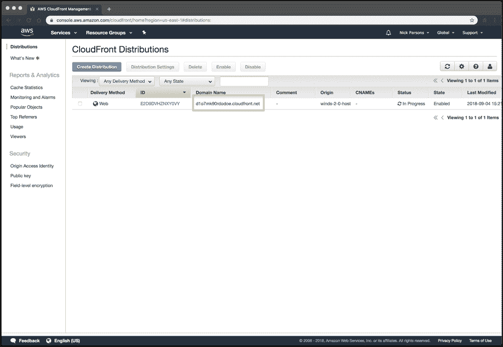

**2。在第 20 行，将 S3 URL 更改为您创建的 S3 bucket URL(例如 winds-2–0-hosted):**

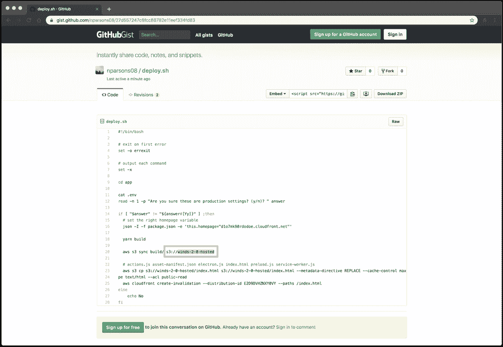

**3。在第 23 行，在两个指定的位置更改 S3 的 URL 以匹配您的 S3 桶 URL(例如 winds-2–0-hosted):**

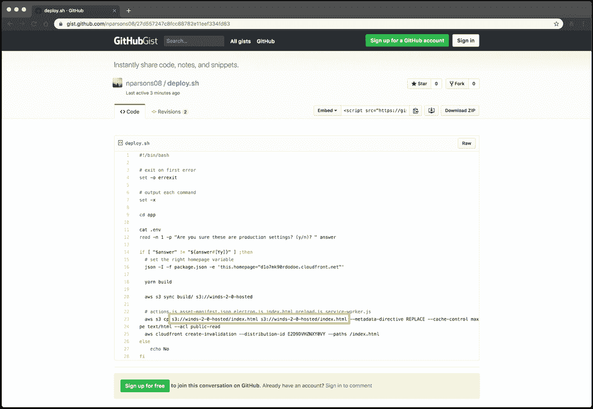

**4。最后，在第 25 行更新您的发行版 ID(由 CloudFront 提供，如下图所示):**

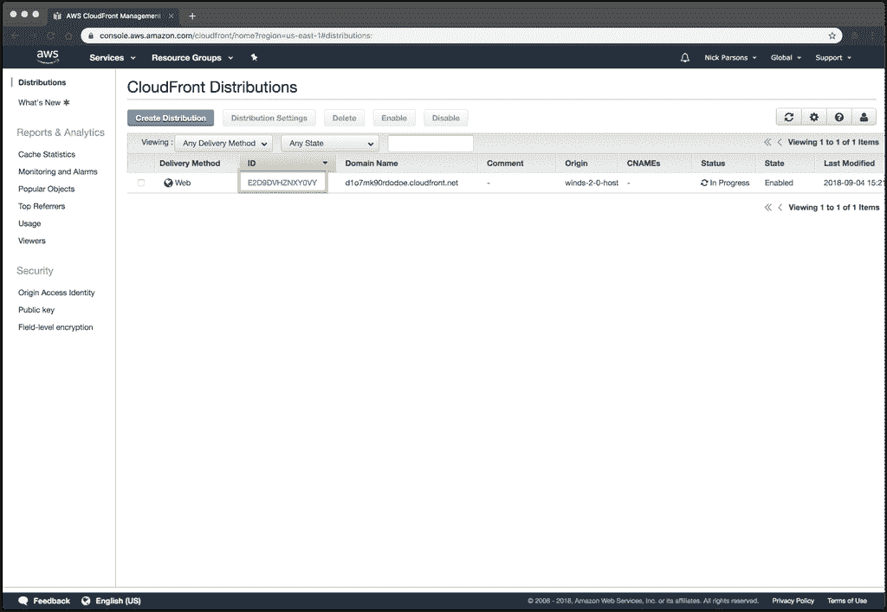

一旦正确设置了 **deploy.sh** 文件，它将为您处理以下内容:

*   **确认您想要实际部署**
*   **进入/app 目录**
*   用编译的文件和资源创建一个构建目录
*   将构建文件和资产同步到您的 S3 存储桶
*   将非构建但必要的文件同步到 S3

部署到 S3 和云锋🤟

现在一切都已创建并正确设置好了，让我们开始尝试吧！确保您在 Winds 目录中，并键入**。/deploy.sh** 启动脚本。当它提示您时，请按“y ”,然后按 enter。一系列事件将自动发生，当脚本完成时，您将看到下面的输出。

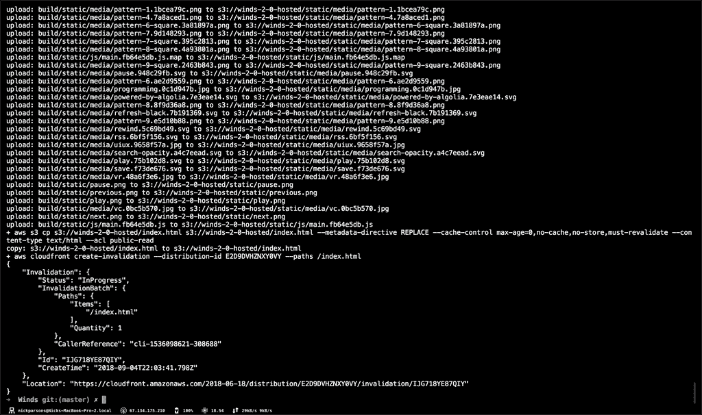

你做到了！您的应用程序现在应该在 CloudFront 提供的 URL 上运行。

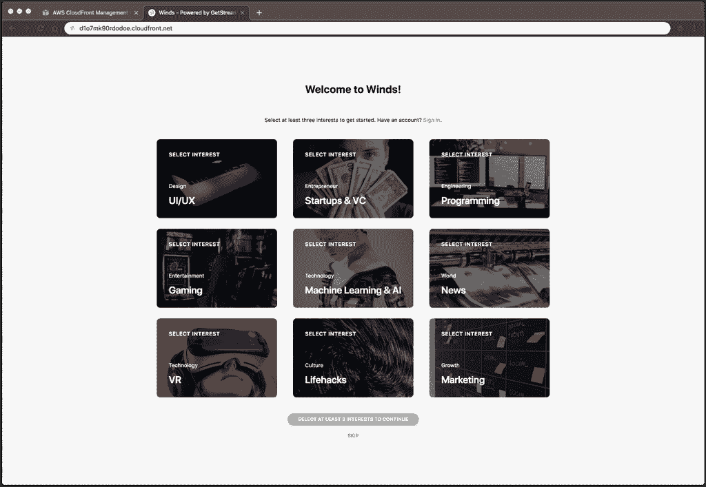

# 最后的想法🤔

如果你想改变网址，我建议你看看 AWS Route53 的 DNS 服务。您可以将您的自定义 URL 映射到您的 CloudFront 发行版，让 Winds 拥有一个自定义域！

如果你还没有机会查看关于如何部署 Winds API 的帖子，你可以在这里阅读。一如既往，如果你有任何想法或评论，请在下面的评论中留下！

编码快乐！🎉

*原载于 2018 年 9 月 6 日*[*getstream . io*](https://getstream.io/blog/deploying-the-winds-app-to-amazon-s3-and-cloudfront/)*。*