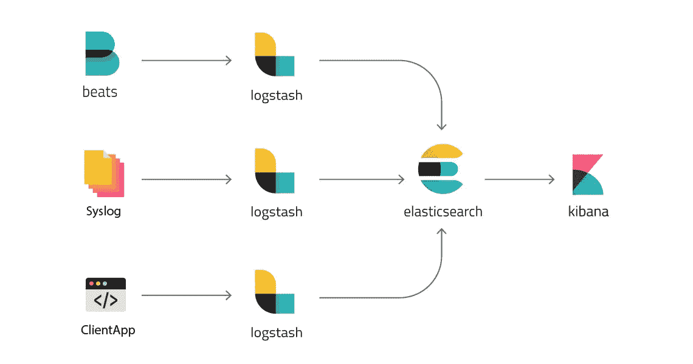
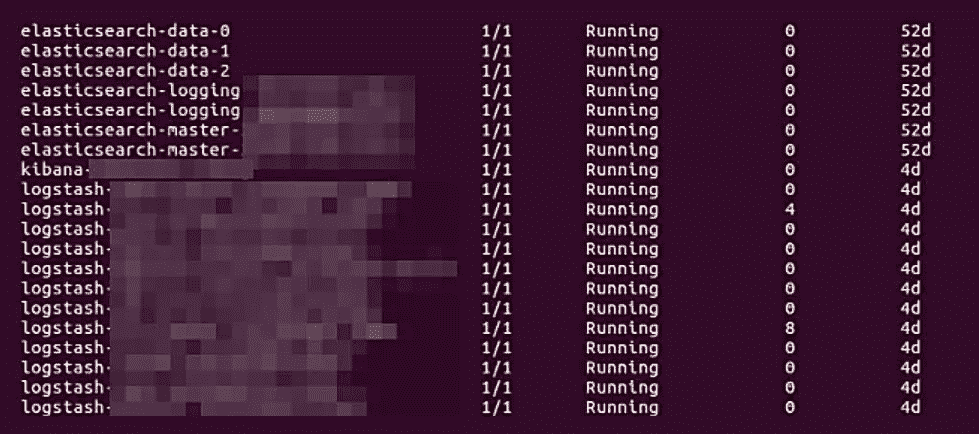

# 向 Kubernetes 部署全尺寸 ELK 堆栈

> 原文：<https://medium.com/hackernoon/deployment-of-full-scale-elk-stack-to-kubernetes-6f38f6c57c55>

Elasticsearch、Logstash 和 Kibana，被称为 [ELK stack](https://www.elastic.co/products) 或 [Elastic stack](https://www.elastic.co/products) ，是日志聚合和分析的工具。由于这些 devops 服务是最常被请求的服务之一，我们使用 [Github](https://github.com/ITSvitCo/aws-k8s/tree/master/kubernetes-manifests/elasticsearch) 上的工具自动完成了它们的部署。

麋鹿的大概方案:



这些清单不包括 Filebeat 安装！参考[官方 Filebeat 配置文档](https://www.elastic.co/guide/en/beats/filebeat/5.5/filebeat-configuration-details.html)。

# 配置新的 ELK 安装

这种安装适合 AWS 部署上的 [Kubernetes。默认情况下使用名称空间“elasticsearch”。Elasticsearch 有两个端点:](https://github.com/ITSvitCo/aws-k8s)[外部](https://github.com/ITSvitCo/aws-k8s/blob/master/kubernetes-manifests/elasticsearch/client-svc-external.yaml)和[内部](https://github.com/ITSvitCo/aws-k8s/blob/master/kubernetes-manifests/elasticsearch/client-svc.yaml)。两个都用，或者去掉不必要的。

1.克隆 https://github.com/ITSvitCo/aws-k8s 库

2.创建 [StorageClass](https://github.com/ITSvitCo/aws-k8s/blob/master/kubernetes-manifests/storageclass-gp2.yml) 以便允许 Kubernetes 供应 AWS EBS 卷。

```
docker run --rm -ti -v ${HOME}/.opsbox -v ${PWD}:/opsbox itsvit/opsbox kubectl apply -f kubernetes-manifests/storageclass-gp2.yml
```

3.启动 [HA 弹性搜索集群](https://github.com/ITSvitCo/aws-k8s/tree/master/kubernetes-manifests/elasticsearch)。将有 2 个弹性搜索大师，2 个弹性搜索客户端，3 个弹性搜索数据节点。

```
docker run --rm -ti -v ${HOME}/.opsbox -v ${PWD}:/opsbox itsvit/opsbox kubectl apply -f kubernetes-manifests/elasticsearch
```

# 自定义日志存储

1.如果需要在各种索引中存储数据，应该为 Logstash 创建一个新的清单。例如，从现有清单中复制一份[log stash-application . YAML](https://github.com/ITSvitCo/aws-k8s/blob/master/kubernetes-manifests/elasticsearch/logstash-application.yaml)

2.在输出部分设置所需的索引名称:

```
yaml
 output {
 elasticsearch {
 hosts => "elasticsearch-logging.elasticsearch:9200"
 index => "new_index-%{+YYYY.MM.dd}"
 document_type => "%{[@metadata][type]}"
 }
 }
```

其中 new_index 是所需的索引名称
3。运行以下命令部署新的日志存储:

```
docker run --rm -ti -v ${HOME}/.opsbox -v ${PWD}:/opsbox itsvit/opsbox kubectl apply -f kubernetes-manifests/elasticsearch/logstash-application.yaml
```

# 摘要

我们成功地将该 devops 解决方案用作数据分析和处理系统的一部分。以下是一个运行解决方案的示例:



这是定制 IT Svit DevOps 工具集合中的又一个简洁模块，可确保快速简单地将全周期 ELK 堆栈部署到 Kubernetes。

这个故事最初发表在我公司的博客上—[https://it svit . com/blog/deployment-elk-stack-kubernetes-single-command/](https://itsvit.com/blog/deployment-elk-stack-kubernetes-single-command/)