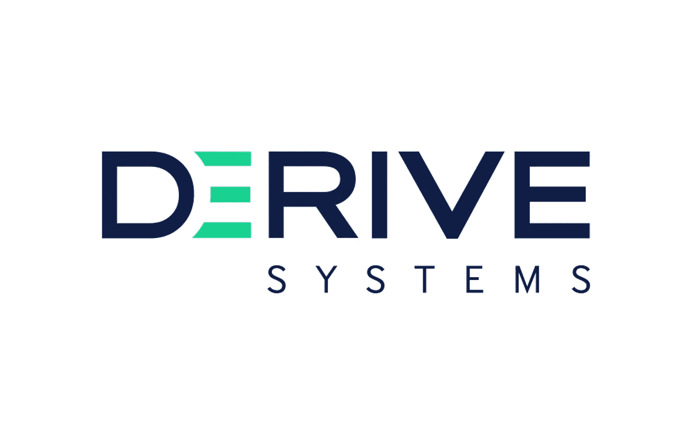

# Derive Systems 使用 Cosmic JS GraphQL API 构建了一个 React 网站

> 原文：<https://medium.com/hackernoon/derive-systems-builds-a-react-website-using-the-cosmic-js-graphql-api-5cd5b11132d7>

[Derive Systems](https://derivesystems.com/) 是一家领先的汽车技术公司，拥有超过 200 万个软件安装，为当今行驶在路上的驾驶员提供升级体验。Derive 将车辆及其引擎连接到数字世界，使个人和车队能够控制和优化性能、燃油效率、安全性等。

Derive Systems 的团队正在寻找一种无头 CMS，它将为开发人员提供开箱即用的灵活性，同时使他们的内容经理能够在一个熟悉的现代 CMS 仪表板中管理内容。他们选择了 [Cosmic JS](https://cosmicjs.com) ，因为它为他们的博客、新闻、关于和团队部分提供了简单的内容建模工具。Derive 现在运行一个 Next.js、React 和 Express 框架，该框架利用 [Cosmic JS](https://cosmicjs.com) GraphQL API 来交付其内容。

> *“利用 Cosmic JS GraphQL API 可以轻松更新我们的新闻和博客，同时保持有效负载小而快。由于他们的大力支持，与 Cosmic JS 的整合再容易不过了。我们期待在该平台上开发更多功能。”*
> 
> *— Dustin Brink，衍生系统公司前端开发人员*

查看更多[案例研究](https://cosmicjs.com/case-studies)团队使用一套强大的内容交付 API 在现代 CMS 仪表板中管理内容。

卡森·吉本斯是宇宙 JS 的联合创始人。在推特上关注他。