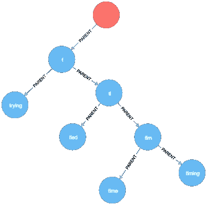

# 用 Python 设计自动完成系统

> 原文：<https://medium.com/hackernoon/design-auto-complete-system-in-python-8fab1470cd92>


自动完成是许多 web 服务的关键特性。当你在谷歌中输入一些短语时，它会显示一个搜索建议列表。有时这些结果使用您的输入作为前缀，有时不使用。谷歌是如何做到如此快速准确的呢？我们如何用 Python 设计一个简化的自动完成系统？

因为我们正在设计 web 服务的后端，所以我们需要考虑服务器和数据库之间的数据流，以及服务器停机时的恢复机制。下面是从分布式系统基础设施角度来看的特性列表。

*   可以从数据库构建新的和恢复的应用服务器。
*   复制和分区数据库的选项。
*   应用服务器应该能够用最新的使用数据更新数据库。
*   应用服务器能够从头开始构建数据库。

从服务器的角度来看，我们需要考虑如何优化性能。

*   我们如何更新排名靠前的结果？如果我们要每秒处理数千个请求，延迟必须最小化。
*   我们多久执行一次更新？我们假设最终的一致性吗？
*   如果有必要，我们如何从服务器上删除短语？

## 数据结构和算法

为了处理大量数据，服务器应该能够快速搜索、插入和删除短语。此外，我们应该优化更新操作。

考虑所有建议都具有用户输入的相同前缀的基本情况。那么存储数据最省时的数据结构就是前缀树，也称为 **Trie** 。我们不打算详细说明 Trie 是如何工作的，因为有大量的[文章](/basecs/trying-to-understand-tries-3ec6bede0014)是用于这个目的的。基本上给定一个最长长度为 M 的短语列表，在 Trie 中搜索任何短语需要 O(M)时间。多亏了 Trie，`search`操作本来就很快。

然而，我们仍然需要精心设计架构来支持其他操作。Trie 节点设计如下。TrieNode 是具有前缀字符串和指向子/父节点的指针的节点。它使用 Python 计数器存储热门建议。我们可以使用`most_common()`内置方法高效地访问最常访问的结果。还要注意，它有一个标志，指示节点中的前缀是否是一个完整的单词，支持各种方法的逻辑是极其重要的。

```
*class* TrieNode:
    *def* __init__(self, *prefix*=None, *parent*=None, *is_word*=False):
        """

        :param prefix: prefix of this node
        :param parent: parent node in the trie
        :param is_word: True if the node stores a node
        """
        self.prefix = *prefix* self.children = dict()
        self.parent = *parent* self.count = 0      
        self.top_results = Counter()
        *if is_word*:
            self.top_results[self.prefix] = 1
        self.isWord = *is_word*
```

因为服务器的主要结构是基于 Trie 的，所以涉及的基本算法是图算法。当我们需要遍历整个图时，基本的图遍历算法如深度优先搜索(DFS)和广度优先搜索(BFS)在代码中被广泛使用。当然，细节因函数而异，比如 DFS 函数签名。

作为 BFS 的一个简单例子，删除短语的`__delete_helper`方法查找子树中的所有短语。

```
*def* __delete_helper(self, *node*):
    """
    Breadth-first search to find all children nodes that are words
    :param node: TrieNode, subtree root
    :return: set(str)
    """
    q = deque([*node*])
    res = set()
    *while* q:
        cur = q.popleft()
        *if* cur.isWord:
            res.add(cur.prefix)
        *for* _, child *in* cur.children.items():
            q.append(child)
    *return* res
```

`__search_helper`方法使用 DFS 搜索错误拼写的替换。它遍历一个`word_list`对象，这是一个嵌套的字符串列表，并返回所有单词的组合。

```
@staticmethod
*def* __search_helper(*word_list*, *idx*, *path*, *res*):
    *if idx* == len(*word_list*):
        *res*.append(list(*path*))
        *return
    for* word *in word_list*[*idx*]:
        *path*.append(word)
        Server.__search_helper(*word_list*, *idx*+1, *path*, *res*)
        *path*.pop()
```

## 数据库ˌ资料库

我们想建立一个连接到数据库的自动完成服务器。数据库的选择是 Neo4j，这是一个在图形中表达复杂关系的绝佳选择。我们使用 [py2neo](/labcodes/graph-databases-talking-about-your-data-relationships-with-python-b438c689dc89) Python 包，它提供了与数据库通信所需的所有 API。这是在插入 4 个词{尝试，平局，时间，计时}后，数据在 Neo4j 浏览器中的可视化效果。



## 组件设计

对于更新操作，我们不是搜索子树中的所有节点，而是使用从树叶一直到根的遍历来更新顶部的搜索结果。这种优化将时间复杂度从指数级降低到多项式级。

然而，当服务器存储数百万个短语时，更新顶级搜索结果需要很长时间。我们应该找到一个合理的更新频率，以便在一致性和延迟之间取得平衡。可以通过类属性配置服务器更新频率。

我在设计服务器类时遇到了无数的挑战。我想分享一下解决这些问题的思路。

第一个设计挑战是如何更新数据库。术语的子集可能已经存储在数据库中，而其他的是新术语。当遍历图形数据库时，我们必须区分节点是否存在。如果节点存在，则添加新的计数；如果没有，则在正确的位置创建新的节点。但是如何更新数据库中每个短语的计数呢？这个想法是每个节点应该保持自己的短语计数不变。更新数据库时，我们总是使用这个值来保持一致性。

当你使用谷歌搜索时，请注意，即使你键入一些胡言乱语，系统也会自动纠正你的输入，并返回合理的搜索结果。我们希望实现类似的目标。从[彼得·诺维格](https://norvig.com/spell-correct.html)扩展经典的自动纠正器，我们创建了一个`Spell`类，在拼写错误的情况下返回大量自动纠正结果。这个想法是，如果输入的单词不在英语词汇表中(大约 40K 个单词)，它的替换词将被搜索并插入到服务器中。然而，这种设计产生了另一个问题。如果我们有太多的替换，那么排序和排名将大大增加延迟。因此，在当前版本中，我们将每个拼写错误的单词的替换限制在一个较小的数字内，比如 2。

序列化对于将对象转换为字节序列以便存储在磁盘中或通过网络传输是必不可少的。序列化 Trie 服务器这样的复杂对象并不是一件容易的事情。我们必须考虑哪些是最需要压缩的数据，以及如何在给定序列化表示的情况下重建应用服务器。为了尽可能准确地重建 TrieNode，我们必须序列化`prefix, number_children, top_results and is_word`。序列化和反序列化应用服务器序列成对出现。我们决定使用深度优先搜索序列进行序列化。有了所有这些设计决策，我们能够序列化一个应用服务器并反序列化以创建一个新的应用服务器。下面是一个用单个单词“time”进行服务器序列化的例子。列表中的序列是 DFS 序列，每一项都对我们上面描述的数据进行编码。

```
[['', '0', 'time 1', '1'],
 ['t', '0', 'time 1', '1'],
 ['ti', '0', 'time 1', '1'],
 ['tim', '0', 'time 1', '1'],
 ['time', '1', 'time 1', '0']]
```

## 未来的工作

目前用户通过运行基于 Python 标准库中 Tkinter 包的`app.py`来访问服务器。未来的计划包括使用 Flask 提供一个 REST API 来访问服务。我们还可以添加功能来重定向用户选择。

## 开放源码

请随时查看 GitHub 的实现细节，我们欢迎任何改进建议。

[](https://github.com/weihesdlegend/Auto-complete-System) [## weihesdlegend/自动完成系统

### 使用 Neo4j 图形数据库进行数据存储和检索的自动完成系统。搜索 API…

github.com](https://github.com/weihesdlegend/Auto-complete-System)