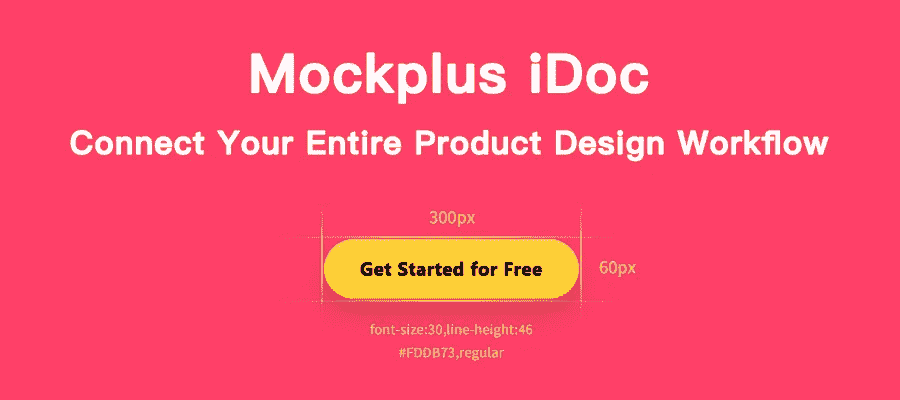
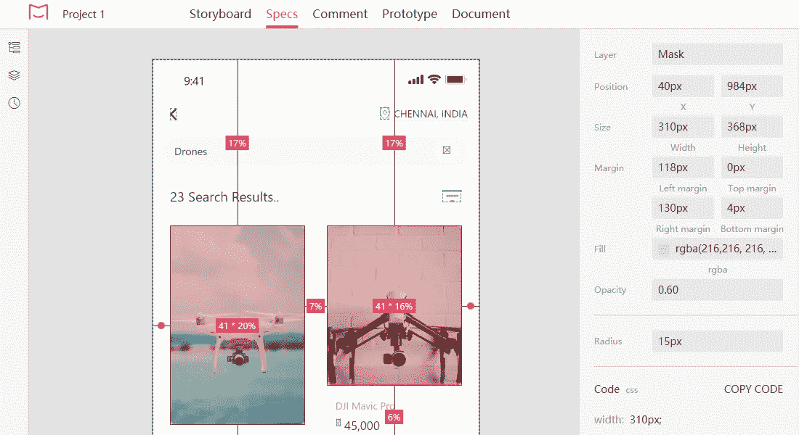
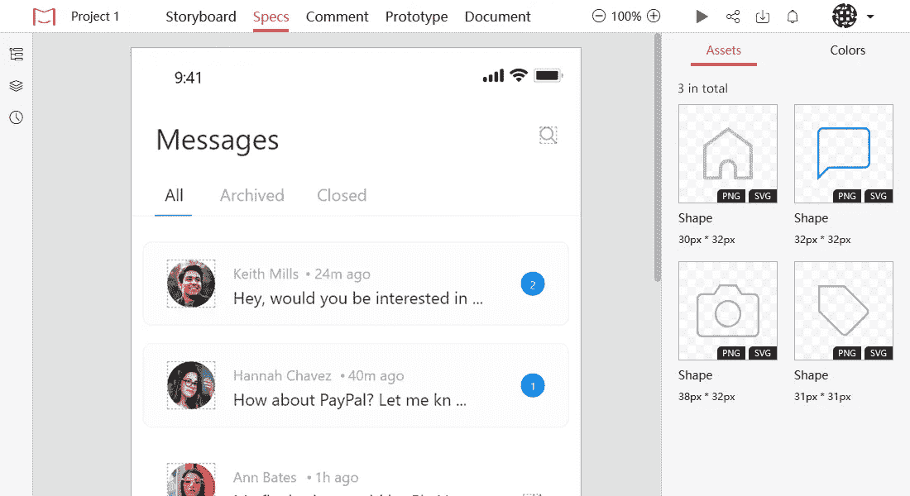

# 设计移交:开发人员必须知道的关于设计规范的 7 件事

> 原文：<https://medium.com/hackernoon/design-handoff-7-things-must-known-about-design-specs-for-developers-965d93bbdd27>

# 快速总结:

当设计师完成工作并需要向开发人员交付成果时，设计移交就发生了。设计移交的最终目标是减少猜测，提高设计过程的效率。设计师可以做以下 7 件事，让交接尽可能顺利:

*   **建立有效的沟通**
*   **准备移交清单**
*   **准备优质资产**
*   **使用特殊工具自动完成移交过程**
*   **边缘案例设计**
*   **详细描述复杂的动画效果**
*   **安排移交会议**

# 1.建立有效的沟通

设计和工程团队之间的关系在项目成功中起着至关重要的作用。许多产品团队都犯了同样的错误——他们孤立了设计和开发团队。因此，两个团队独立工作，设计移交是设计过程中团队交换信息的唯一点。

这个决定很少有积极的结果。通常，这会导致开发人员和设计人员之间额外的反馈循环。

设计移交的准备工作应该在实际移交之前就开始；它应该发生在整个设计过程的最开始。尽早让开发人员参与到设计过程中是至关重要的。

# 不要把设计和实现分开

产品设计师应该尽早和开发人员分享设计。为了使协作富有成效，建立检查点是很重要的——在产品设计过程中发生的事件，设计师和开发人员在这里会面讨论设计。

小贴士:永远试着面对面交流。这样的会议将帮助你建立更好的信任。

# 练习实时协作

对于设计师来说，理解他们所使用的技术的可能性和局限性是至关重要的。如果没有这种理解，设计师提出的解决方案很有可能在技术上不可行。

通过让开发人员参与交互设计过程，有可能获得这种理解。当设计人员处理复杂的应用程序状态(如动画过渡)时，这尤其有益。设计者可以咨询从事该项目的开发人员，以了解某件事情是否容易实现。

# 2.准备移交清单

与任何其他过程类似，组织得越好，最终结果就越好。很明显，要求设计师记住他们需要提供给开发人员的所有工件是错误的。项目经理应该准备一份清单——交付所需的设计工件的列表。该清单应该作为任务管理工具中的一项任务来呈现。每次当设计人员进行移交时，他们都应该仔细检查这个清单。

# 3.准备优质资产

# 定义命名约定

无论设计项目如何，命名约定在组织项目结构中起着至关重要的作用。正确的命名约定有助于开发人员浏览文件并防止重复。

对于每个项目设计团队的工作，应该有一个标准的方式命名文件，标记元素和层。正确的命名约定减少了问题，并使移交过程更加可预测。

小贴士:

*   在命名文件时，不要在文件名中包含任何形式的版本控制。屏幕的名称应该简单地描述它的功能。不应该是“搜索屏幕新版本 24.png”应该只是“搜索. png”
*   命名屏幕时使用一致的大小写。选择“句子大小写”、“小写”或其他格式，并将其用于您设计的所有屏幕。

# 共享一个流，而不是独立屏幕的集合

许多设计师认为与开发人员共享静态模拟就足够了。实际上，如果看不到屏幕之间的连接，可能很难理解屏幕之间的关系。

这就是为什么把设计作为一个流程来提供如此重要——基本的屏幕应该相互连接。这种方法对设计者也是有益的。当设计师为移交准备流程时，这有助于他们揭示缺失的步骤或边缘情况。

提示:建议创建一个安静的视频漫游，由设计师解释用户的旅程。

# 4.使用特殊工具自动化移交过程

过去，设计师很难为开发人员导出所有必需的资产。他们必须手动准备一个包含所有必要资产的档案，并将其发送给开发人员。不仅要花很多时间，而且一些重要的细节也很容易被忘记。当设计需要改进时，情况变得更糟，设计师不得不再次重复整个过程。

希望最近情况有所改变。 [**Mockplus iDoc**](https://idoc.mockplus.com/?hmsr=cherrymedium) 允许设计师自动化设计移交。可以直接从草图、Photoshop 或 Adobe XD 导出设计，并看到自动准备的规范。创建交互式和动画原型。让设计协作更容易。

**功能:**

# 1.不再手动制作规格

一键上传设计，智能生成规格，简单鼠标点击即可查看规格数据；

在右侧面板上查看详细的图层数据。

# 2.不再手动切割切片

一键标记图层导出，自动生成高清切片；

自动上传，并在网上实时刷新切片。

# 3.构建您团队的设计风格指南

自动收集和组织您团队的项目和资源，如组件、颜色、文本样式，形成易于维护的样式指南。

# 4.高保真交互式原型

只需点击一下鼠标，即可轻松地将静态设计文件转换为工作原型。IDoc 提供 9 个过渡动画，支持自动跳转和设置固定区域。

更多 iDoc 特性:[https://idoc.mockplus.com/download/ps](https://idoc.mockplus.com/download/ps)

Mockplus iDoc，连接您的整个产品设计工作流程

[免费上手](https://idoc.mockplus.com/?hmsr=cherrymedium)

# 5.边缘情况下的设计

设计师总是设计出一个产品的理想状态——当一个产品工作出色，用户没有犯任何错误。这在真实文件中很少发生。但是，开发人员创建空状态和错误案例只是因为设计团队没有考虑到它们，这种情况很常见。

为了交付好的设计，设计师应该在他们的清单中为屏幕提供空状态和错误状态。针对边缘情况进行设计不仅可以减轻开发人员的负担，还可以为用户带来更好的用户体验。

# 6.详细描述复杂的动画效果

功能动画在现代数字体验中扮演着至关重要的角色。如果使用得当，动画可以描述屏幕之间的关系，通知用户当前的体验状态，甚至用视觉效果取悦用户。但是要做到这一点，动画应该被恰当地设计和实现。

即使一部动画在原型中设计得很完美，也不能保证最终产品的质量也是一样的。为什么？因为设计师在一个特殊的设计工具(如 Adobe After Effects)中创建动画，而开发人员将不得不使用一套完全不同的工具(如 Apple XCode)对其进行编码。设计工具只提供视觉效果，当开发人员没有足够的关于动画效果的信息时(例如，动画的类型、时间等等)。)，他们需要或者联系设计师获取这些信息，或者根据自己的经验来实现。

为了减轻开发人员的工作负担，负责动画效果的设计人员应该在完成工作后立即在一份说明书中详细描述该效果。他们提供的信息将帮助开发人员编写动画代码。

# 7.安排移交会议

如果你让设计师想象一个理想的设计移交，他们很可能会描述这样一个案例:他们简单地移交完美的像素设计，而开发人员不问任何问题就把它放进代码里。不幸的是，这在现实生活中很少发生。在大多数情况下，开发人员需要一些解释。这就是为什么设计移交不仅仅是向开发团队发送设计工件。

在开发人员收到所有需要的工件后，设计人员应该联系开发人员检查设计。设计师应该和开发人员安排一次会议。会议将是设计师描述细节和阐明一些设计决策的绝佳机会。

# 结论

大多数设计师都知道同理心对于好的设计有多重要。对用户感同身受的能力是优秀设计师和糟糕设计师的区别。但是成为一名伟大的设计师需要你不仅对你的用户感同身受，而且对和你一起工作的人——开发人员——感同身受。设计移交是向工程团队展示同理心的最简单方式之一。