# 格式塔驱动的 UX:驱动我们世界的模式

> 原文：<https://medium.com/hackernoon/design-psychology-gestalt-driven-ux-64ac01cd257a>

## 我们如何以及为什么以我们的方式看待事物

想想我们在过去 30 年取得的成就，真是难以置信。我们已经数字化了我们的日常生活，包括我们彼此之间的互动和有形的世界。

因此，我们必须进化和适应我们消费技术的方式:触摸、声音、声音...味道？我们不得不用更少的时间处理更多的复杂信息。真的是一片混乱！或者..如果我们不把格式塔心理学应用到我们的互动体验中，至少会是这样。

让我们来看看这道美食甜点。

看起来好吃吗？老实说，我不确定它到底是什么，但它在同一个盘子上，对吗？所以一定要搭配！

但是，如果我把盘子拿走，而配料就放在桌子上同样的位置，会怎么样呢？去餐馆的人还能推断出这是一道统一的菜吗？为什么或为什么不？我需要做些什么来统一这道菜，让去餐馆的人知道什么可以搭配？当我去掉明确的界限时，我的大脑如何知道如何将事物组合在一起？

这是格式塔心理学的精髓。

# 完全形态

格式塔心理学起源于 20 世纪 20 年代，并在 30 年代和 40 年代首次应用于视觉世界。它试图了解人类如何在一个内在混乱的世界中感知、获取和保持信息。本质上，它是模式感知背后的科学:我们如何下意识和有意识地对信息进行分组，以推断额外的意义。这是我们识别模式和简化复杂事物的方式。

> 格式塔主义是一种整体哲学，研究人类如何识别模式并简化复杂、分散的信息。

现在，让我们深入了解它是如何工作的，以及我们如何利用格式塔来建立更多愉快的体验。

# 原则

多年来，格式塔主义增加了新的原则。我们将介绍几个你在日常工作中很可能会用到但却不知道的主要方法。

# 邻近和公共区域

我们认为彼此靠近的物体是相似的。因此，我们倾向于将相近的事物分组，即使它们是不同的。只要最接近的分组具有定义的边界，无论是显式的轮廓还是带有边距/填充，这都是可行的。

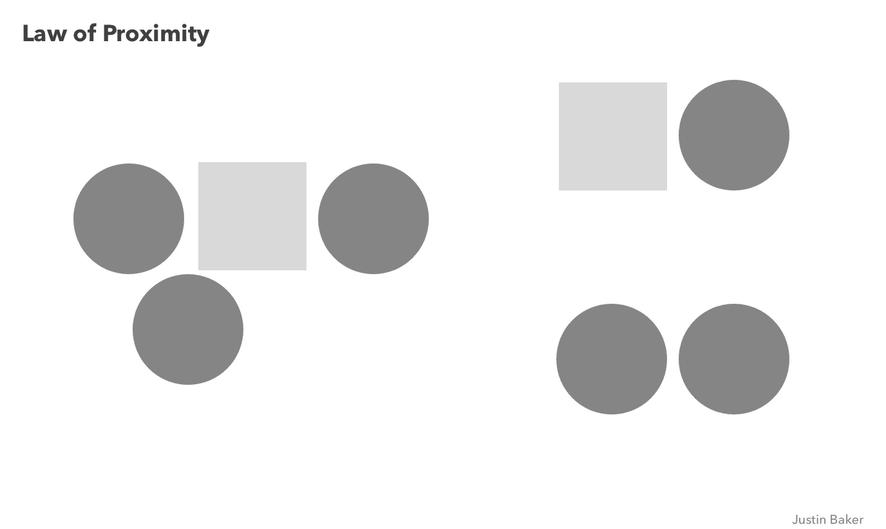

# 类似

我们认为具有共同视觉特征(大小、颜色、质地、尺寸、形状或方向)的物体属于同一类。这些对象不需要彼此相邻或接近，但是通常将一致地共享一个或多个特征，以便在视觉上区别于其他对象分组。基本上，当我们看到彼此相似的物体时，我们倾向于将它们归为一类。

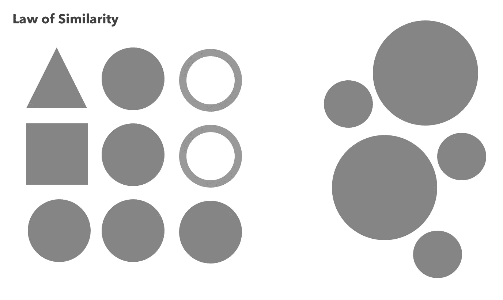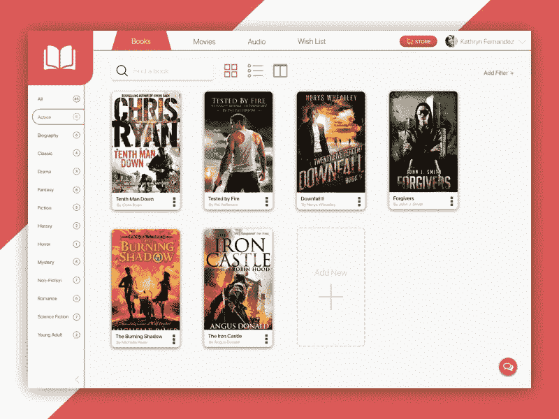

Gestalt Similarity — Repetition of Navigation, Alignment

# 图形-背景

我们的眼睛可以在视觉上以稳定、可逆或模糊的方式将物体与背景分开。我们也可以认为这是前景和背景的分离。

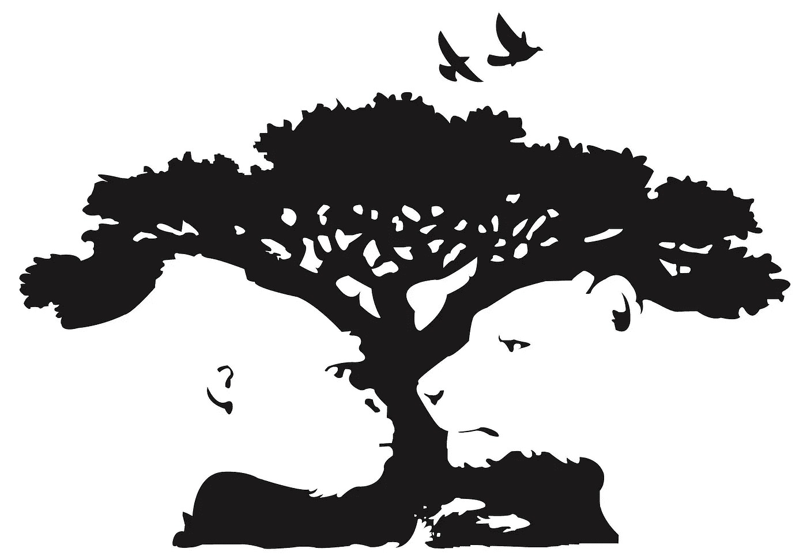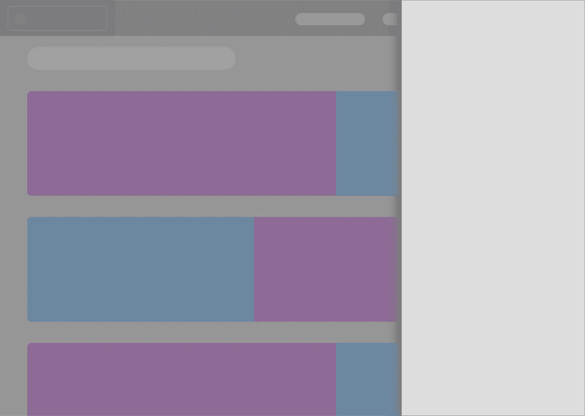

Gestalt Figure Ground — Layering

# 对称

我们认为相互对称的物体比相互不对称的物体更容易被组合在一起。我们可以根据对称性推断出模式，并将这些模式应用于我们的群体信息。我们还可以推断，包含在这些对称模式中的信息具有共同的属性。

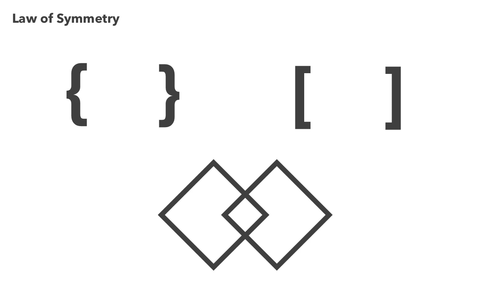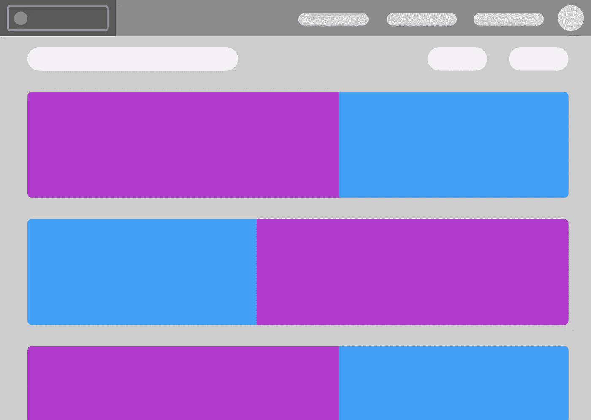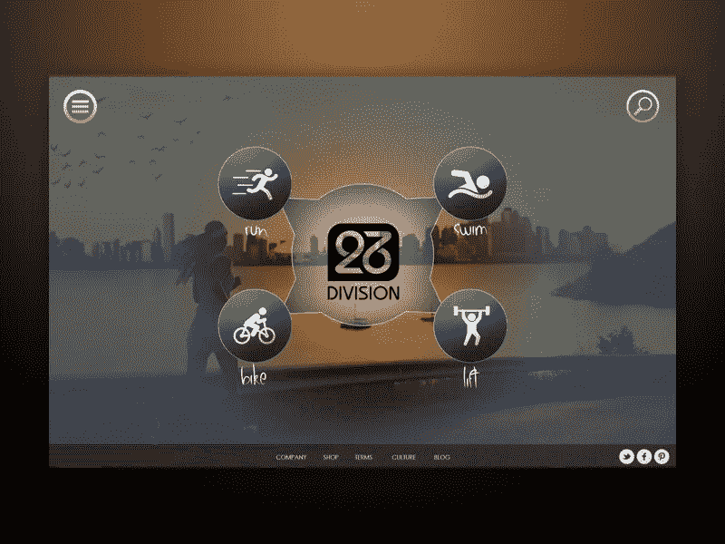

Gestalt Symmetry — Unification

# 关闭

我们的大脑会感知完整形式的物体和图形，即使该物体的一部分缺失或不明显。我们会看到封闭经常应用于图像，我们的大脑负责对一个物体进行快速的感官解读。

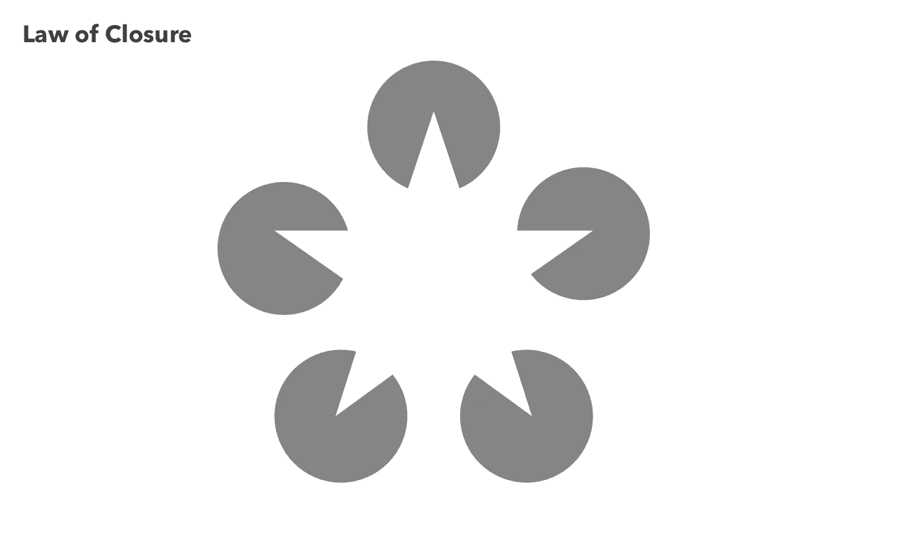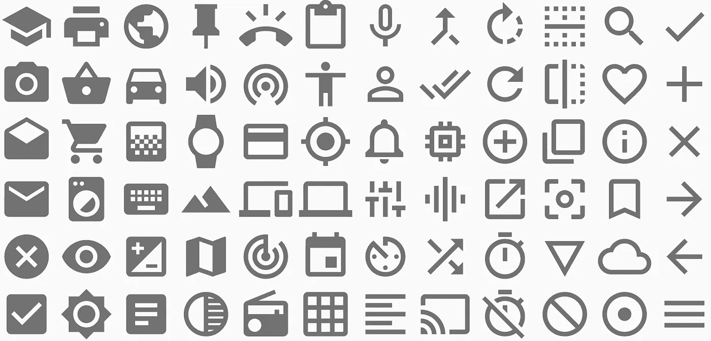

# 连续性

我们通过遵循固有的视觉模式来确定物体之间的关系:直线、曲线、波浪和序列。我们经常看到连续性应用于图像幻灯片或应用程序，其中部分功能/元素被视口截断。

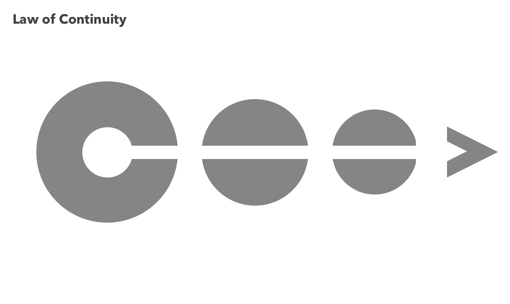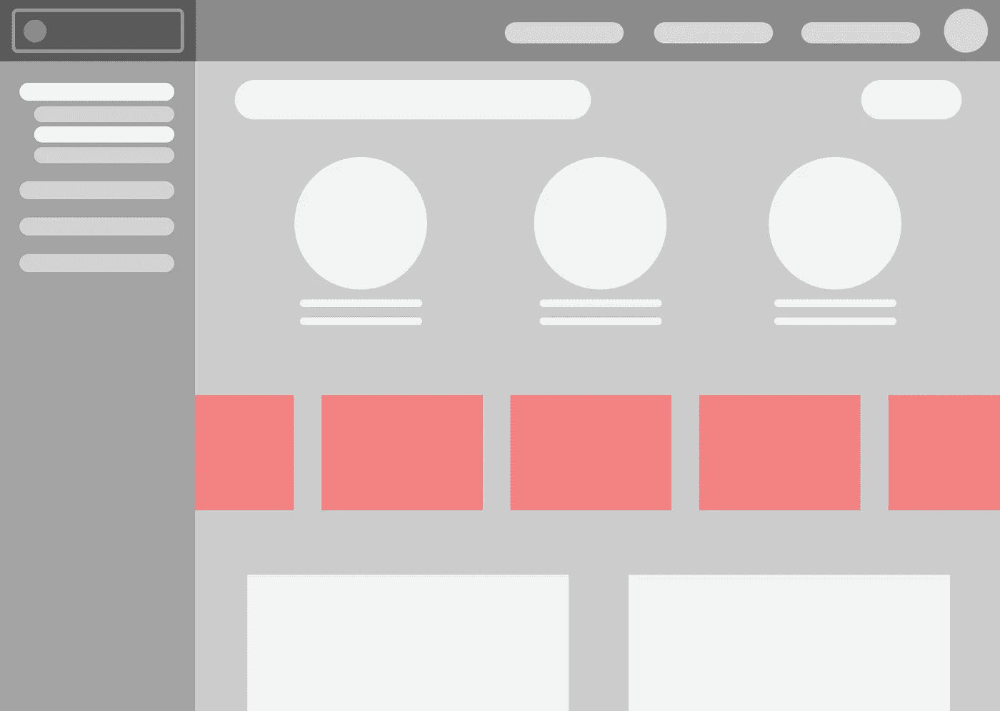

Gestalt Continuity — Graphs with Scrollable X Axis

# 共同的命运

我们将移动或指向同一方向的物体组合在一起。我们把这些物体统一起来，因为我们认为它们具有单一的刺激。如果你曾经使用过一步一步的教学向导，你会推断每一步都是连续的，因为在模式和方向上有相似之处。

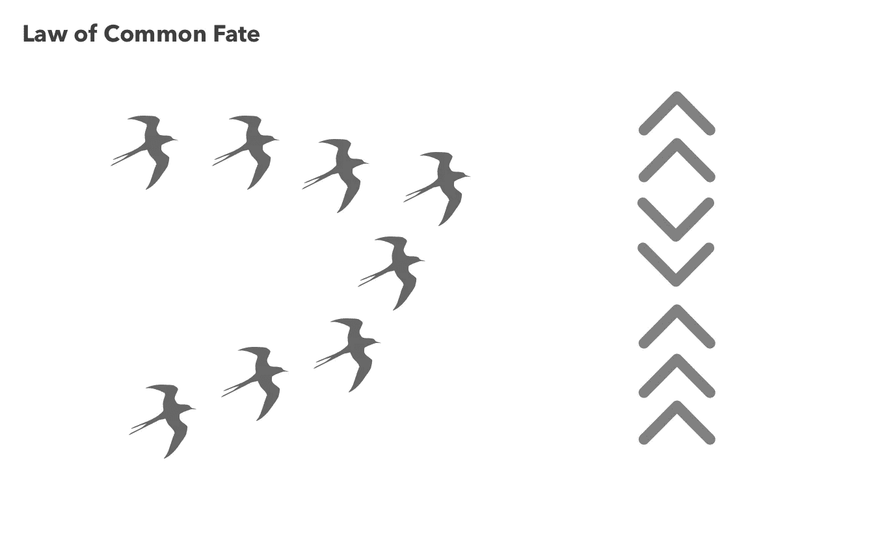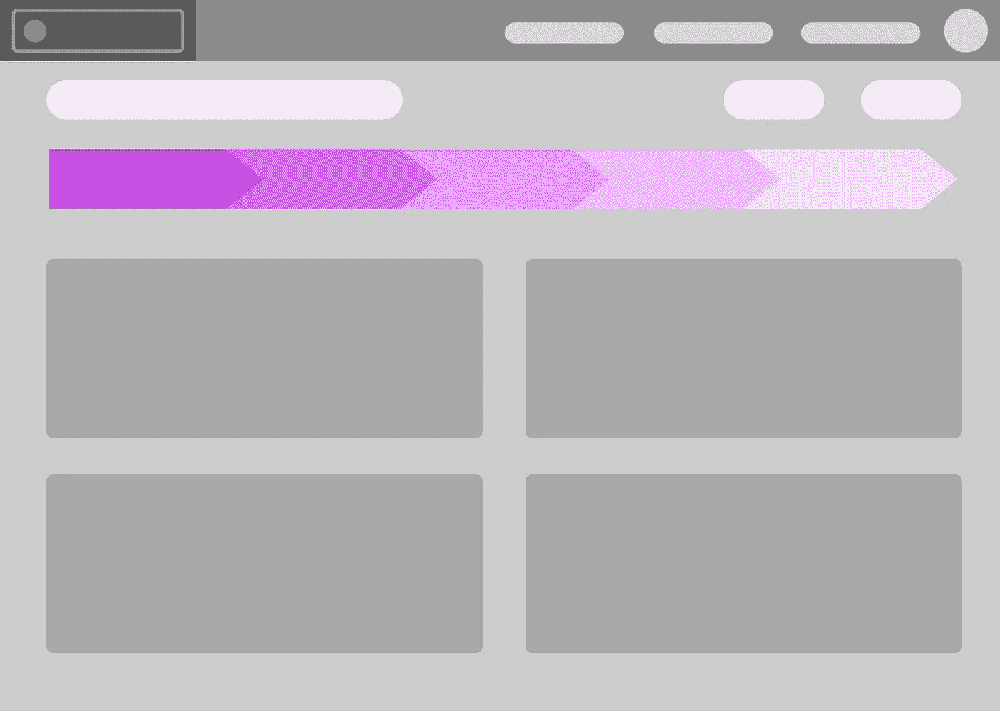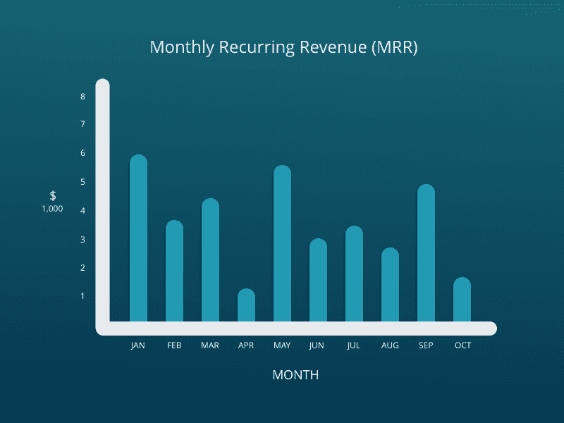

Gestalt Common Fate — Motion Trends in Graphs

# 周期性

我们更喜欢看到周期性重复的物体。可以把这想象成一个地毯图案，它看起来可能很复杂，但是当它覆盖了整个地板时，就显得完整了。我们可以根据复杂的趋势来推断模式，只要模式相对可重复，并且随着时间的推移趋势方向一致。

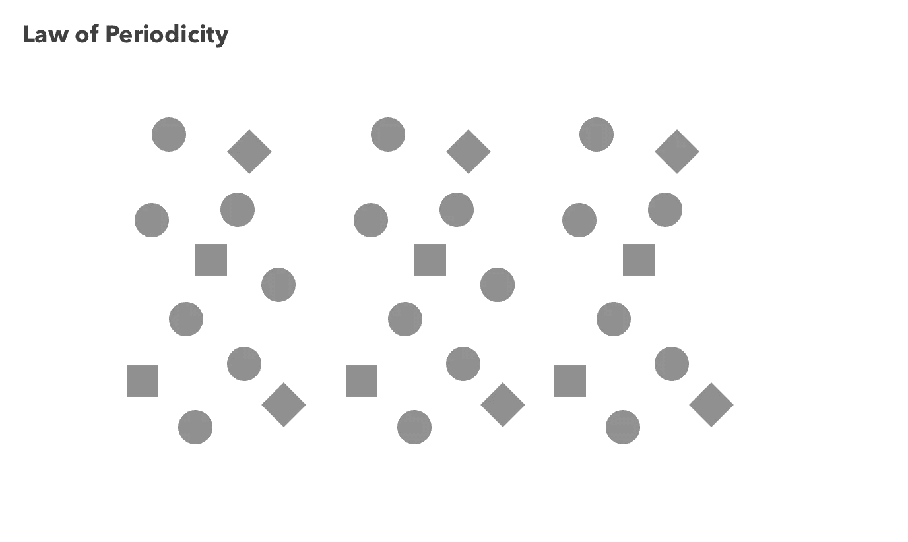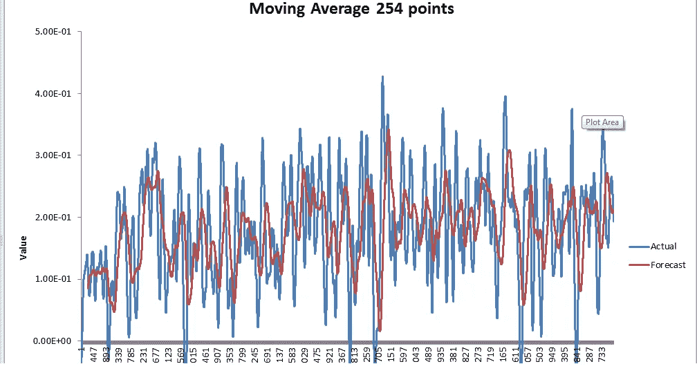

# 格式塔主义在 UX 设计中的应用

我们感知世界的方式并不总是与真实世界相符。我们发展感知假说。因此，格式塔原则支持我们在解释感官信息时做出的有根据的猜测。

> 感知假设是我们用来理解感官信息(视觉、听觉和动觉)的有根据的猜测。

考虑你的用户。他们是如何发展他们的假设的？是什么支撑着他们的感官解读？我们看待世界的方式受到许多因素的影响:我们的经验、个性、教养和期望。这些为我们的感知基线提供了信息:构建我们如何感知和与我们的世界互动的背景。

这里有一些 UX 的小贴士可以帮助你:

1.  **解构你的用户感知基线。**根据他们的经验和他们熟悉的应用程序，这些会如何影响他们对产品交互的理解？他们目前熟悉哪些交互模式？他们需要学习哪些模式？
2.  **谨防图地混乱。当你创建一个包含多层的复杂界面时，要格外注意直观地组织你的层，使它们逻辑有序。确保你的用户不会混淆前景内容区域和惰性背景。**
3.  **宁可填充/边距“过多”,也不要填充/边距不够。在对齐、图案一致性和间距方面要一丝不苟。减少填充/边距总是比增加填充/边距容易。**
4.  **去掉细节，看大局。**从 10，000 英尺的角度看你的用户界面。检查分组。检查模式。检查整体布局。元素和特性是直观分组的吗？

# 大外卖

> 设计师最大的收获是从更高层次的感官角度来审视你的 UX。将你的设计解构为最基本的空间元素——识别并检查图案之间的相互作用。

即使是现有的经验，你也可以去掉细节，只关注一般的领域和模式。如果移动元素会发生什么？如果你增加一个新的特性会怎么样？如果你修改你的布局会发生什么？如果你去掉了所有的细节，你的用户能理解你的产品的内在模式和关系吗？

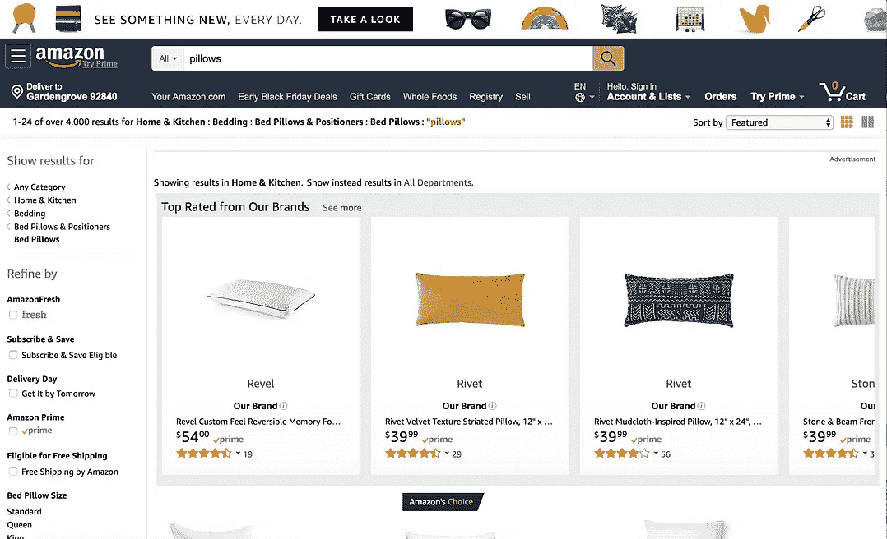

Original -> Deconstruction

更高层次的感官视角可以帮助你创造一种与用户的认知假设相吻合的体验——提供真正令人愉快的 UX。