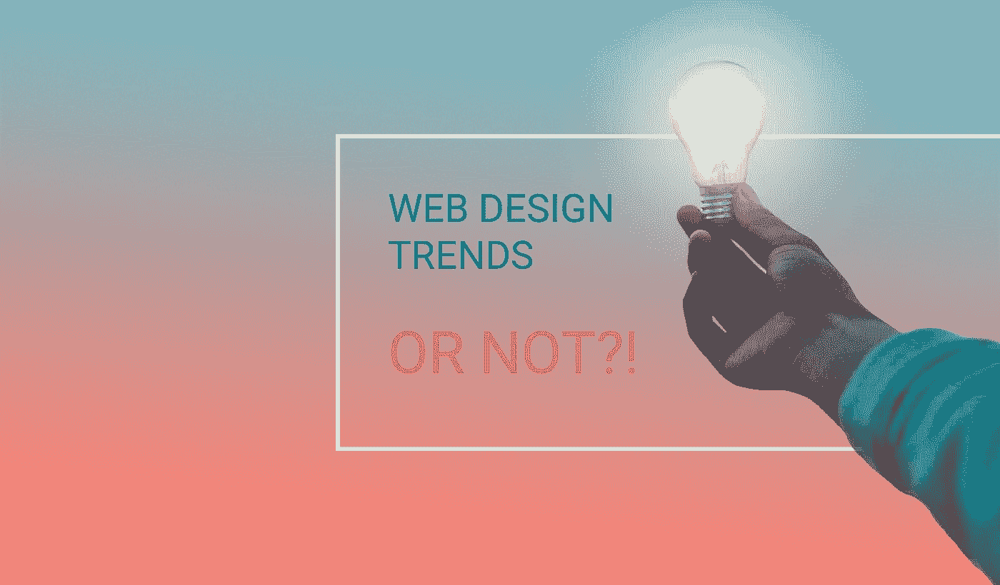

# 设计过山车。5 款经典失败产品对比 5 款时尚必备产品

> 原文：<https://medium.com/hackernoon/design-rollercoaster-5-epic-fails-vs-5-trendy-must-haves-91c2e052080d>

有时候创建一个[网页设计](https://freshcodeit.com/services)就像穿越雷区。你永远不知道哪个创造性的解决方案会让用户喜欢，哪个会让他们永远离开这个品牌。虽然研究和分析工具提供了对用户偏好的洞察，但一些设计错误仍然存在。今天，我们想带你经历一次过山车，看看网页设计师可能犯的五个最严重的错误，以及纠正它们的五个时髦方法。

# 阻碍可用性的设计创意

设计师沉迷于创意流，忘记了他们是为用户创造界面，而不是他们自己。当人们找不到内容时，他们会从感兴趣变成恼火，然后就离开，再也不回来了。无用的类别名称、过多的链接和菜单、不合逻辑的结构以及意想不到的界面元素位置，比如搜索栏，都会让潜在客户望而却步。

请记住，互联网用户大部分时间都花在其他网站上，他们对界面应该是什么样子以及如何工作有一定的期望。有时候简单易懂胜过有创意和独特。不过，如果你希望你的网站脱颖而出，使用

# 破碎的网格和不对称的布局

每个人和他们的母亲都使用经典的网格布局。它们干净、简单又无聊。这就是为什么在过去的一年里，越来越多的设计师打破了传统的网格，将图像和文字重叠并模糊成一个美丽的设计。不对称的布局吸引那些厌倦了经典板块的客户，只要他们保持用户友好和逻辑。大品牌和小创业公司都已经接受了这一趋势，这一趋势很可能在 2018 年成为主流。

# 用内容压倒用户

多年来，设计师和营销专家认为，在第一卷中尽可能多地填充信息是正确的做法。结果，互联网上充斥着大量的网页和应用程序，用大量的文本、数十张图片、CTA 和按钮来轰炸用户。用户被内容之墙淹没，离开去寻找更好的去处。设计师忘记考虑的是，在线用户浏览网页，而不是阅读所有内容。

没有副标题、要点和亮点的非结构化文本对于 web 应用来说是一种空间浪费和机会错失。如果你想一开始就吸引客户，那就雇佣他们。

# 互动和引人入胜的动画

虽然详尽的 gif 可能是一个主要的障碍，但是巧妙的动画是一个有用的工具，可以引导用户的注意力，并使其专注于设计或副本的关键元素。经典的动画可以吸引客户而不分散他们的注意力，尽管有些人觉得它们太过了。今年最突出的两个趋势是动画页面过渡，它将所有页面链接成一个无缝的体验，以及可变的滚动速率，它创造了一个令人兴奋的效果，并为用户体验设定了速度。

# 忽略其他尺寸的屏幕

多年来，designer 专门从事面向桌面的 web 应用程序和网站。他们设计了聪明的悬停状态动画，选择了令人惊叹的照片，开发了漂亮的多级菜单，只为看到流量大幅下降。所有这些解决方案都不能很好地转化为手机。不可读的小文本、增加的加载时间和花哨的动画会让移动用户失去兴趣，并促使他们寻求其他服务和品牌。

设计师需要记住，2017 年移动流量终于超过了桌面流量。如果你还没有考虑过，你应该开始设计小屏幕。或者更好的是，

# 首先开发移动友好的体验

一些面向移动的解决方案已经成为行业标准，比如菜单和图标的展示汉堡，而不是大插图和照片。设计师们努力让手机版本更直观，更简洁，因为屏幕的大小对内容的数量和结构有很多限制。许多公司首先开发移动版本，然后添加到其中，为桌面用户创造舒适的体验。

# 类似广告的设计元素

通往地狱的路是由好的设计师意图铺成的。为了将用户的注意力吸引到一个特定的链接或按钮上，设计者将它周围的整个区域变成了他们的游乐场。他们用大胆的颜色、花哨的排版或浮华的动画来吸引客户。然而，尽管他们尽了一切努力，链接仍然没有被触及，成为选择性关注和广告盲的牺牲品。人们会忽略任何类似横幅或点击诱饵图片的东西，毫不犹豫地关闭弹出窗口。

有很多方法可以控制和操纵用户，让他们在整个网站中遵循既定的路径。要掌握这些技术，请开始使用

# 经典定制插图

一张图胜过千言万语。然而，库存照片最近失去了设计师的青睐。由于艺术和时尚周而复始，现在是定制插图的时候了。它们赋予网页界面时尚的外观，吸引人们的注意力，形成独特的品牌形象。另一个好处是，绘画不会像照片那样限制观众的身份。手绘简笔画没有种族、国籍或性别，不像任何库存照片上的现实生活中的人。因此，使用插图可以扩大目标受众，吸引新客户。

# 使用糟糕的现场搜索引擎

即使设计师使用最简单的布局和导航工具，一些用户也会感到困惑。他们转向搜索栏来引导他们的体验，当他们看到零个搜索结果时，立即感到失望。文字搜索引擎不考虑复数，单词的变化，甚至是错别字，注定网络应用会被遗忘。另一个不可原谅的失礼是根据查询词的数量而不是相关性和重要性对搜索结果进行排序。

在谷歌时代，没有人愿意浪费时间去揣摩你的搜索栏。除了改进搜索引擎之外，尝试通过实现

# 浮动导航工具

用户不喜欢迷失的感觉，这就是为什么设计师努力确保他们总是在指尖有导航菜单。浮动菜单已经成为一个重要的趋势，并且在可预见的将来还会持续下去。然而，为了利用这种解决方案，设计师们将导航条从它们通常的位置上撕下来，并将导航工具移到页面的前台，使它们在材料和平面设计中弹出屏幕。隐藏菜单栏下的其他设计元素给网页设计以深刻的印象。

我们希望这个列表对你和我们一样令人兴奋和鼓舞。时不时回过头来提醒自己，2018 年我们不应该在线重复的设计错误。

你喜欢这篇文章吗？请为我们鼓掌！在媒体上与其他人分享文章。

访问我们的企业 [*FreshCode.blog*](https://freshcodeit.com/blog) 获取更多有趣的文章。

欢迎随时联系我们的[*fresh code . website*](https://freshcodeit.com/)

在[*LinkedIn*](https://www.linkedin.com/company/freshcode-it/)*[*脸书*](https://www.facebook.com/freshcodeit/)*[*推特*](https://twitter.com/FreshCode1)*[*insta gram*](https://www.instagram.com/freshcode_it/)*[*Behance*](https://www.behance.net/freshcode)*[*Medium【中*](/@FreshCodeIT)*****

**[原文*此处*原文](https://freshcodeit.com/freshcode-post/design-rollercoaster-5-epic-fails-vs-5-trendy-must-haves)**