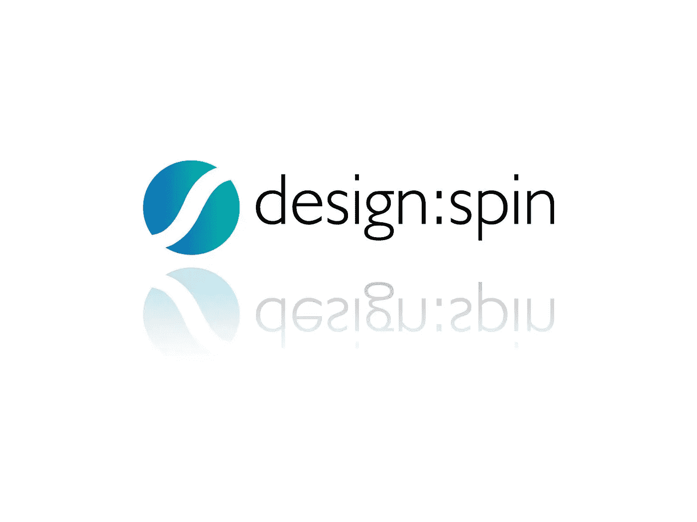

# Design Spin 用 Cosmic JS 搭建了一个 React 网站

> 原文：<https://medium.com/hackernoon/design-spin-builds-a-react-website-with-cosmic-js-eab8f5349062>

[Design Spin](https://designspin.co.uk/) 是一家位于英国诺里奇的精品独立设计开发店。负责人[杰森·福斯特](https://twitter.com/Design_Spin?lang=en)专注于通过网络和移动应用开发为客户创造优质的互动体验。更新 Design Spin 网站已经在他的雷达上有一段时间了，本周我们看到了发布的[产品](https://designspin.co.uk/)。请继续阅读，直接聆听杰森·福斯特在他的博客[中的叙述。](https://designspin.co.uk/article/new-site-for-design-spin)

Jason Foster :“我们不认为这个网站已经完成，而是一个正在进行的项目，我们将随着时间的推移不断迭代和改进。我们以前的网站是用 [WordPress](https://hackernoon.com/cosmic-js-vs-wordpress-668608df4e22) 建立的。我们喜欢 WordPress，我们的客户也喜欢使用它。但是我们希望新的网站是现代的，结合一些最新的网络提供的东西。

JavaScript 作为一种语言在过去的几年里取得了很大的进步，并且变得非常流行。它过去被称为前端语言，主要用于为网页提供效果和交互，例如像图像滑块这样的东西。但是今天随着 node.js 的出现，有可能做更多的事情。

节点允许 [JavaScript](https://cosmicjs.com/knowledge-base/javascript-cms) 在服务器端运行。如果这是一个 WordPress 网站，我们将在服务器端使用 PHP 语言，但我们仍将在客户端使用 [JavaScript](https://cosmicjs.com/knowledge-base/javascript-cms) 进行任何浏览器欺骗，比如上面提到的图片滑块。正如我们所看到的，这是使用 Node 进行服务器端实现的好处之一:服务器端使用的许多代码库可以与客户端共享，反之亦然。

当你访问这个网站时，第一页是从服务器传送过来的，然后进一步的页面修改由客户端处理。这使得整个体验看起来非常快。我将概述两个用来完成这项工作的工具。

# 反应

由脸书开发的， [react](https://reactjs.org/) 是一个流行的用于开发用户界面的 JavaScript 库。 [React](https://cosmicjs.com/knowledge-base/react-cms) 允许你将你的页面/用户界面分解成更小的可重用组件，这些组件可以有状态，也可以由状态驱动。当应用程序的状态改变时， [React](https://cosmicjs.com/knowledge-base/react-cms) 只会通过自己复杂的不同算法改变需要改变的内容。

这个库还包括在服务器端呈现组件的方法。你可能见过这样的应用程序，当它被加载到你的浏览器中时，你会看到一个空的应用程序容器或者一个加载微调器，紧接着是内容。随后的内容在初始页面提供后被触发加载。这听起来很简单，但是如果从 SEO 的角度来看，这些内容很重要，那么搜索引擎可能永远也不会知道。

我们使用 react 的服务器渲染特性，所以在初始页面加载时，我们的内容可以被搜索引擎抓取。

# 宇宙 JS

由于我们不再使用 [WordPress](https://hackernoon.com/cosmic-js-vs-wordpress-668608df4e22) ，我们需要一些东西来替换我们的内容管理系统。WordPress 有一个内置的 Restful API，这对于这个项目来说很好，但是我们发现了 [Cosmic JS](https://cosmicjs.com) 。Cosmic 做 WordPress 做的所有事情，但是没有程序上的麻烦，所以我们可以让网站更快地运行起来。它们提供了一个有用的库，可以方便地查询您的数据，所以我们将这个功能包装在我们自己的服务器路径上，这样我们就可以在将来需要的时候轻松地切换它。

[Cosmic JS](https://cosmicjs.com) 还提供了 [Web Hooks](https://cosmicjs.com/docs/webhooks) 用于设置你选择的 URL。当我们创建一篇新文章时，Cosmic JS 通过我们指定的 URL 通知我们，允许我们做一些事情，比如更新我们的站点地图和发送推送通知。

# 渐进式网络应用

当我们建立这个网站时，我们希望确保我们勾选了由 [Lighthouse](https://developers.google.com/web/tools/lighthouse/) 概述的渐进式网络应用程序的方框。 [Lighthouse](https://developers.google.com/web/tools/lighthouse/) 在谷歌 Chrome 浏览器开发工具中可用，允许你快速审计你的任何网页的进步网络应用、性能、最佳实践和可访问性。

我们关心谷歌认为什么是重要的，所以尽可能努力让谷歌的灯塔成为一个高性能的网站/网络应用。我们获得了 100%的 PWA，并且仍在努力提高我们的性能分数，上次检查为 86%。

我们的主页有一个我的脸的像素化动画！在编码的第一次迭代中，性能分数真的很糟糕，因为它基本上阻止了网站上的交互，在 Lighthouse 看来这是一个很大的问题。我们知道我们想要这个动画，因为它看起来很酷，对吗？所以我们最终计算了每个像素应该在网络工作者中的位置。这让我们回到了一个非常好的成绩，每个人都很高兴了，唷！"

> “我希望在未来，这个新网站将说服客户避开 WordPress，使用奇妙的 Cosmic JS API 来构建应用程序和管理内容。”
> 
> — Jason Foster，首席开发人员

 [## 宇宙 JS vs. WordPress

### Cosmic JS 是一个 API 优先的 CMS，帮助开发人员和内容编辑团队更快地构建应用程序。64.5%的开发人员…

hackernoon.com](https://hackernoon.com/cosmic-js-vs-wordpress-668608df4e22) 

[Cosmic JS](https://cosmicjs.com/) 是一个 API 第一的基于云的内容管理平台，使管理应用和内容变得容易。如果你有关于 Cosmic JS API 的问题，请在 [Twitter](https://twitter.com/cosmic_js) 或 [Slack](https://cosmicjs.com/community) 上联系创始人。

[卡森·吉本斯](https://twitter.com/carsoncgibbons)是[宇宙 JS](https://cosmicjs.com/) 的联合创始人& CMO，宇宙 JS 是一个 API 第一的基于云的[内容管理平台](https://cosmicjs.com/)，它将内容与代码分离，允许开发者用他们想要的任何编程语言构建流畅的应用和网站。