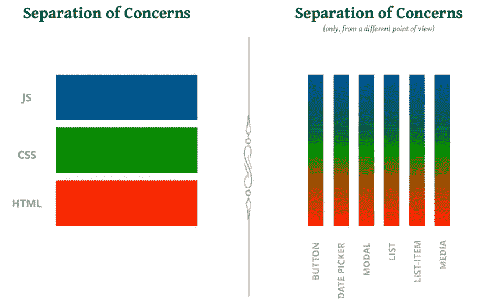
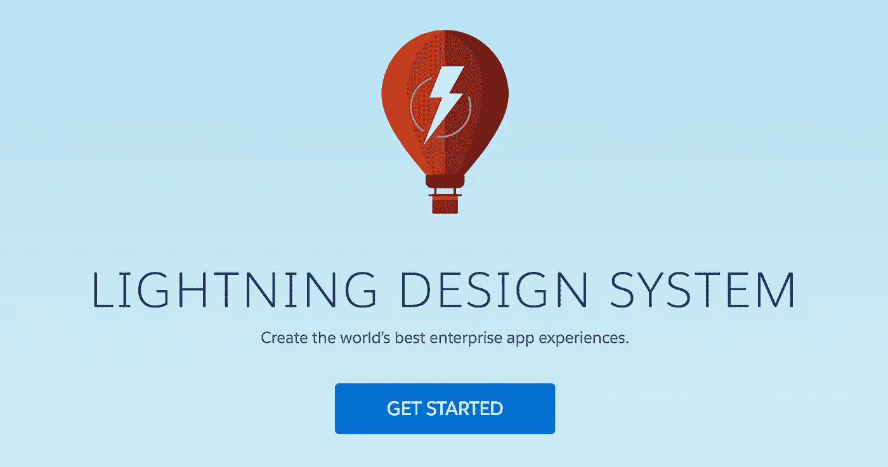
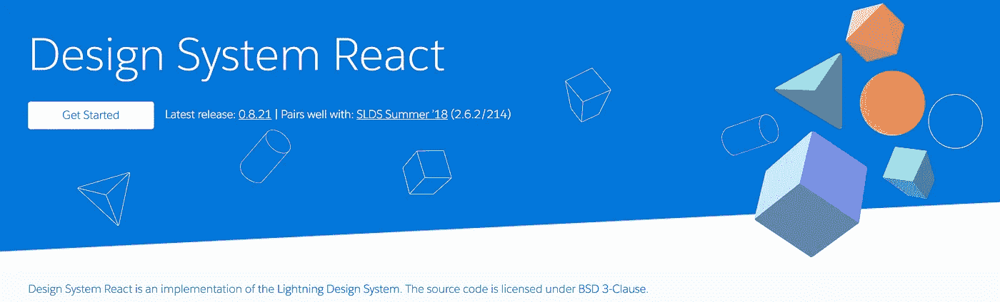
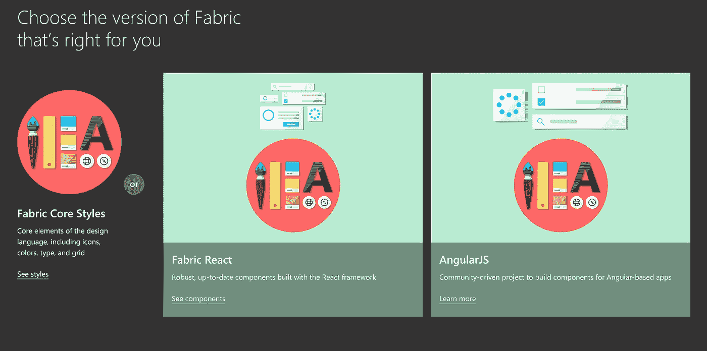
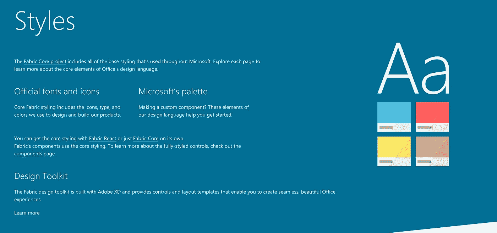
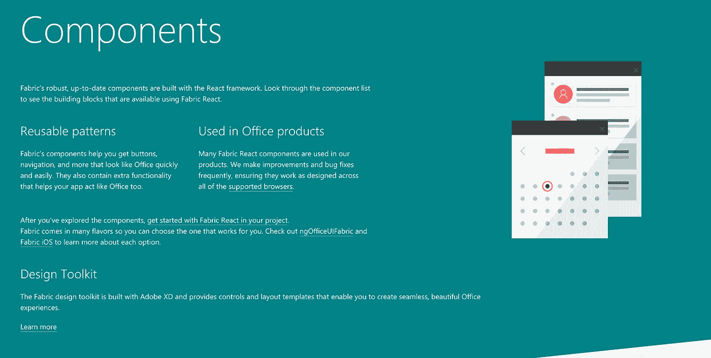
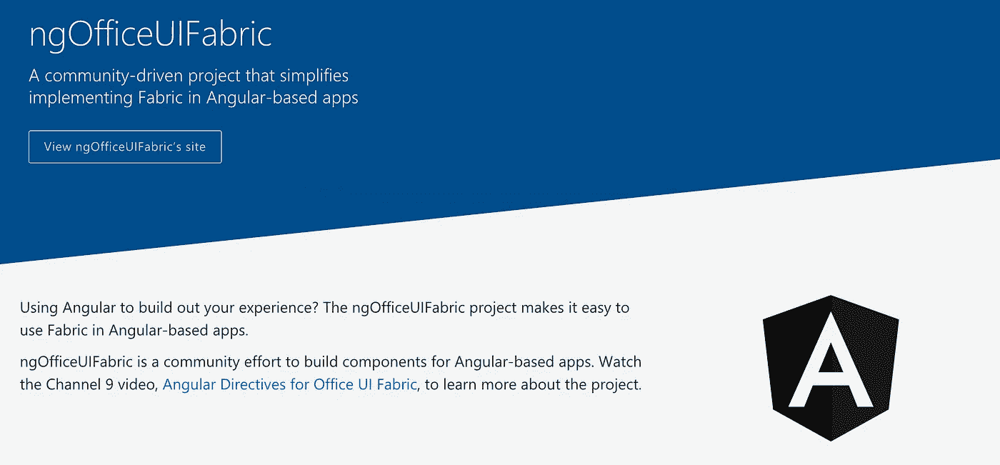
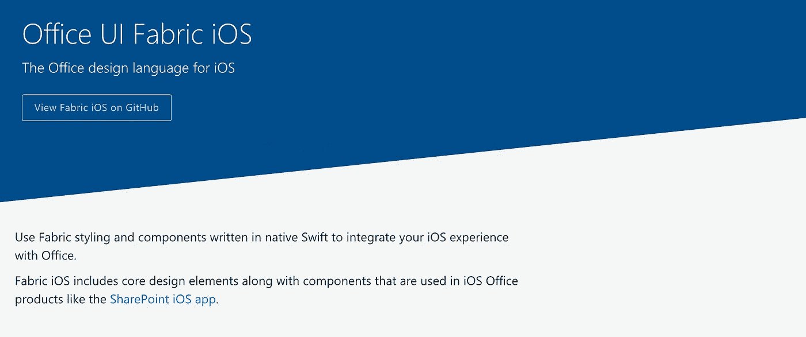
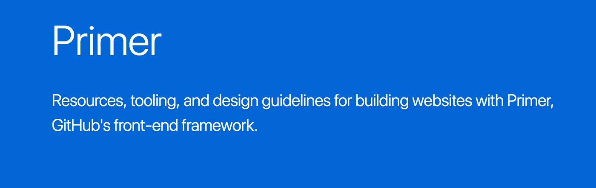

# 设计系统应该是 JavaScript 框架不可知的

> 原文：<https://medium.com/hackernoon/design-systems-should-be-javascript-framework-agnostic-2a0c47129ec8>

设计系统的一个新兴趋势是将你的核心 HTML CSS 从当前的 JavaScript 框架中分离出来。在[表示 JavaScript](http://bradfrost.com/blog/post/frontend-design/) 和现代前端框架 [React](https://hackernoon.com/tagged/react) 、Angular 和 Vue 中使用的 [JavaScript](https://hackernoon.com/tagged/javascript) 之间有明显的区别。

当您专门使用 React、JSS 或任何其他颠覆传统关注点分离的 JavaScript 时，在您的设计系统中看到这种分离的价值可能是一个挑战:

[Slidedeck](https://speakerdeck.com/didoo/let-there-be-peace-on-css?slide=62) by Cristiano Rastelli

Jeremy Keith 最近用一个奇妙的比喻[描述了上图中关注点的分离:](https://adactio.com/journal/14103)

> 把它们看做是二元选择，就好像说“我以前吃意大利菜，但现在我喝意大利酒。”
> 
> 杰里米·基思

乍一看，似乎我们的 HTML & CSS 注定要在组件级与 JavaScript 永远结合在一起。

让我们看看*为什么*你想要在设计系统层面创造这种分离，以及一些领先的公司如何公开分享他们的实践。

那么为什么要在你的设计系统中分离核心 HTML 和 CSS 呢？在我看来，有三个潜在的驱动因素:

1.  积簇
2.  JavaScript 框架变动
3.  预测未来

**产品品种**

首先，保持 HTML 和 CSS 分离的需要将直接取决于你的设计系统必须支持的产品数量，以及每种产品的底层技术。更广泛的种类(一个使用 React，一个使用 Angular 一个使用 Sass，另一个使用普通 CSS，等等。)，就越需要以 HTML & CSS 的形式提供核心组件。

**JavaScript 框架变动**

我不需要说服你 JavaScript 框架正以指数级的速度发布。这里相关的想法是，如果你在设计系统层面上整合了一个 JavaScript 框架，你为你的团队创造的工作量也是指数级的。

假设您的团队决定将 Vue 纳入设计系统。你已经得到了该公司在 Vue 上标准化的大量支持。太棒了。然后，3 个月后，一个团队决定他们不想使用 Vue，而是更喜欢 React。他们要么从零开始构建东西，要么弄清楚如何使用 Vue 工作。

随着公司的成长，将这一点延伸到产品和多个业务领域，你就会明白这种需求。即使当公司标准化时，不同的团队中总会有离群值。当下一个 Vue 出现时，更大的问题是重写你设计系统中的一切。那会是三年后吗？三个月？ *3 天？*

**预测未来**

我不擅长这个。如果你是梅林，你可以在这里停止阅读。还在吗？好吧，让我们来看看一些最佳实践。

# Salesforce 闪电设计系统

Salesforce Lightning 设计系统正在成为现代前端设计系统的典范。纪娜·安妮不仅创建了它，她还创建了第一个 100% [专注于设计系统的会议](https://www.clarityconf.com/)。她撰写了《InVision 设计系统手册》的第二章。

Salesforce 团队必须支持各种平台，并保持它们之间的一致性。除了 web 项目，Lightning 还支持 [iOS、Android 和 Windows Phone](https://www.lightningdesignsystem.com/platforms/ios/) 。下面是系统的 FAQ 对 JavaScript 的评论:

框架中包含任何 JavaScript 吗？

> 不需要。Salesforce Lightning 设计系统是一个纯 CSS 框架，您可以将其用于任何您喜欢的前端开发框架，包括特定于 Salesforce 的技术，如 Visualforce 和 Lightning，以及第三方框架，如 React 或 Angular。

这就是有趣的地方。Salesforce 团队能够获得核心 HTML & CSS Lightning 组件，并从它们创建一个单独的基于 React 的项目。以下是纪娜在[时尚指南播客](http://styleguides.io/podcast/jina-anne/)中对此的评论:

> “是的，我们的开源设计系统中没有任何 JavaScript，这是因为一旦你引入它，就很难保持不可知论；你基本上是在堆栈中引入观点。然而，在内部，这实际上也可能是开源的；我们确实有一个 React 版本的设计系统，我们的一些较小的产品团队使用它，然后 Lightning 组件附带了所有这些功能，因此如果 Salesforce 的开发人员使用 Lightning 组件，他们不必担心构建它，因为有人已经将它构建到组件中了。”
> 
> —纪娜·安妮，在时尚指南播客上

幸运是，React 项目已经公开了:

Lightning 设计系统是一整套用普通 HTML & CSS 编写的组件的例子，在它们的“设计指南”中有很棒的文档，并且关注可访问性。这使得他们的团队能够为基于 React 的项目构建 React 版本，但是该项目从内置的所有核心最佳实践开始。也许我只是眼花缭乱，因为闪电很好地实现了布拉德最初在《原子设计》中描述的:

> 建立一个深思熟虑的设计系统的最大优势之一是它允许组织扩展最佳实践。如果所有这些最佳实践——响应性、可访问性、性能、UX、人体工程学等等——都融入到系统中，用户可以简单地插入模式并获得回报。这意味着设计系统用户不一定要成为高级设计师或开发人员才能做出好的作品；设计系统充当质量控制工具，帮助用户应用最佳实践，而不管每个人的技能水平如何。
> 
> —布拉德·弗罗斯特，原子设计

# 微软织物设计系统

Micah Godbolt 为设计系统写了精彩的[前端架构，其中包括一些非常好的想法，将你的设计系统抽象成 JSON，他称之为“模式驱动设计”。自从这本书出版后，弥迦一直在微软工作，从事](http://shop.oreilly.com/product/0636920040156.do)[布料设计系统](https://developer.microsoft.com/en-us/fabric)。

Fabric design 系统旨在支持 core web、React、Angular 和 iOS。“开始”流程提供了以下选项:

**CSS**

Fabric 核心包含非常低级的 CSS 和设计元素，可以轻松地跨项目共享:

我真正感到兴奋的是 Fabric 核心中的“主题生成器”——在“输出”部分，我们有 JSON、Sass 和 PowerShell 等主题值。这表明 Fabric 的大部分核心都是可转换为不同格式的数据，这可能是支持 React、Angular 和 iOS 的驱动力:

**做出反应**

**有角度的**

Angular docs 中引用的[视频详细解释了他们的团队能够实现的目标，以及一些挑战。](https://channel9.msdn.com/Shows/Office-Dev-Show/Office-Dev-Show-Episode-25-Angular-Directives-for-Office-UI-Fabric)

**iOS**

Fabric 与 Lightning 的不同之处在于，它主要暴露其核心的底层部分(图标、颜色、布局等)。)，而不是拥有 Lightning 所称的所有组件的“组件蓝图”。

我认为，如果团队开始从他们的 JavaScript 层中抽象出核心部分，Fabric 示例可能是一个很好的起点。您可以在 Fabric 代码库中进一步研究，并且 [Micah 也有一篇博客文章](https://micahgodbolt.com/blog/what-s-right-with-css-in-js/)，其中提到了 Fabric 中使用的一些方法。

# Github 引物设计系统

还记得我之前提到的设计系统会议吗？是的，去年 [Diana Mounter 做了一个关于 color](https://www.youtube.com/watch?v=VYWPH8QGuGE) 的精彩演讲，我很自然地调查了一下，看看是否有任何与她的工作和 GitHub 的前端设计系统方法团队相关的公开信息。幸运的是，有一个闪亮的新文档网站:

《初级读本》非常充实，包含核心原则(颜色、布局、排版等)。)、实用工具类和一个文档非常完整的组件库。这里明显缺少的是 JavaScript。[原则文档](https://styleguide.github.com/primer/principles/)可能是我遇到的向开发团队解释 HTML/CSS 框架背后的方法论作为设计系统基础的最好例子。与 DRY 等其他软件原则相比，有一个明显的关注点是更容易理解。

# 果壳

很明显，在设计系统层面将 HTML & CSS 与 JavaScript 分离是有价值的。我们在这里结束，因为当 MVC 风格的 JS 框架被引入时，它们被视为另一种依赖，当它们显然是 JavaScript 扮演的角色的根本转变时。jQuery 是最后一个流行的“表示”JavaScript 库，它可以作为一个依赖项添加，并在需要功能时使用。杰里米·基思这样描述棱角分明:

> 嗯，是的，*技术上* Angular **是**一个前端框架，但是概念上和哲学上它更像一个后端框架(实际上，我认为它在概念上最接近一个原生 SDK 更类似于编写 iOS 或 Android 应用程序，而其他人则将其与 ASP.NET 相提并论。
> 
> 杰里米·基思

MVC 风格的 JavaScript 框架与表示 JavaScript 的分层有很大不同，我们需要改变我们为 web 编写代码的方式。在上面的例子中，我们已经看到了新兴的趋势是如何改变我们在核心层面上对设计系统的看法的。React 和 Angular 被视为更类似于 Fabric 中的 iOS，因为它们只是:与 Fabric 核心中提供的低级片段有很大不同。

我可以想象一个核心的 HTML/CSS 设计系统，它不仅包含所有的底层元素(颜色、字体等等)。)，以及构建在普通 HTML/CSS 中的组件，但是另外还有在系统支持的产品中使用的不同模板语言或 JS 框架中的组件的示例。类似于 [Pattern Lab 如何为 HTML 和 Mustache](http://demo.patternlab.io/?p=viewall-atoms-buttons) 使用标签。

无论你决定走哪条路，都将在很大程度上取决于你上面提到的产品种类。从长远来看，你越早决定在设计系统层次上抽象低层次的部分，你就开始为你的团队节省大量的工作。