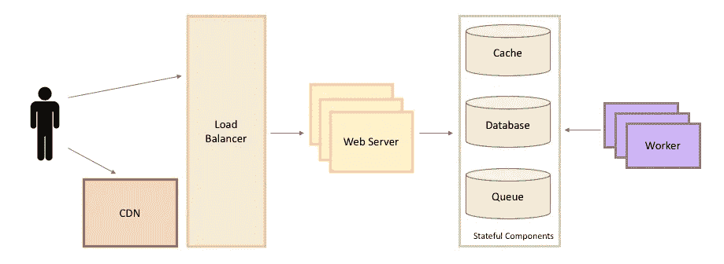
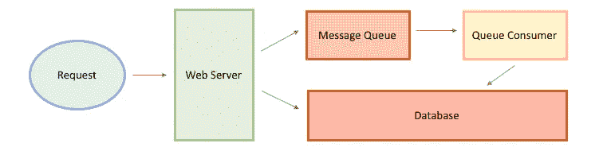

# 设计闪耀:如何赢得下一次系统设计面试

> 原文：<https://medium.com/hackernoon/design-to-shine-how-to-ace-your-next-system-design-interview-2282bbf45c40>

## 了解在面试过程中应该采取哪些思维过程和行动，同时尽量减少错误

阻碍你找到理想工作的是漫长而又令人疲惫的面试过程——尤其是如果你的梦想是在四大之一工作的话。设计大规模分布式系统已经成为软件工程面试的标准，主要针对高级职位，这意味着一旦你通过了电话筛选和编码面试，你就必须忍受并通过令人恐惧的系统设计面试(SDI)。

与编码问题不同，系统设计面试的非结构化本质使他们更难准备。即使有一些构建大型系统经验的程序员也不喜欢这些面试，主要是因为没有标准答案的设计问题的开放性。

不确定如何在面对面的面试中设计一个大规模的分布式系统？不要害怕。这里是你需要知道的关于无缝和毫不费力地操纵 SDIs 的一切。或者，至少你会有这种感觉。

# 认为你知道什么是系统设计面试——再想想

虽然系统设计问题已经成为软件工程面试过程的标准部分，但是 SDI 已经超出了测试传统编码、技术和分析技能的范围。系统设计面试的主要目的是给候选人一个机会来展示他们的知识，看看他们如何在动态的、不可预测的情况下工作，以及如何面对一些棘手的问题。您不会看到可以运行或编译的编码问题。你经常会被问到一些开放性的问题，包括设计一个新的、大规模的分布式系统，比如 YouTube、另一个社交平台、URL 缩短服务或类似的东西，能够解决一个开放性的问题，类似于你作为一名软件工程师应该做的规划和构建。

Message queues — System Design

# 在 SDI 过程中，面试官在寻找什么

在 SDI 过程中，通信线路始终保持畅通至关重要。这是因为面试官希望看到你如何处理动态的、开放式的工程情况。因此，根据以下主要因素评估这些面试中的表现:

1.  **你的知识** —博学而实用
2.  **你表达想法的能力** —引导对话，与面试官讨论高级组件、细节、设计利弊以及其他相关信息。稍后将详细介绍思维过程。
3.  **您的运营效率** —您是否根据最佳实践步骤工作，例如:
    ***A .需求收集*** :澄清模糊之处并确定系统最终目标，以评估问题或手头任务的确切范围。
    ***B .系统接口定义*** :识别并定义任何预期的系统 API。
    ***C .系统规模估算*** :确保自己知道自己系统的范围。
    ***D .数据模型定义*** :阐明数据将如何在不同的系统组件之间流动，并实现更好的数据划分和管理。
    ***E .高层设计*** :确定端到端解决 SDI 问题所需的组件，首先在基础层面，然后在更深的层面。
    ***F .识别和解决瓶颈*** :确定如何最好地减轻其影响。
4.  **你迭代和改进的能力**——一旦你设计了系统，你将如何继续努力使它变得更好？

你的面试官也可能想看看你是否拥有以下的技能和能力:抽象、数据库、网络、并发性、评估、可用性和可靠性。

# SDI 期间最常见的问题

现在你知道你的面试官想要什么，你可以更好地准备一些最常见的 SDI 问题的答案:

1.  给定一个(典型的)长 URL，你将如何设计一个 TinyURL 或 bit.ly(一个 URL 缩短服务)，一个相同网址的缩短形式的唯一 ID？
2.  设计一个社交网络，比如脸书、Quora 或 Reddit，用户可以在上面查看和发布消息、评论和链接。
3.  设计一个全球聊天服务，比如 WhatsApp 或 Messenger，既方便用户又安全。
4.  设计一个全球视频流服务，像 YouTube 一样，包括基本功能，如数据记录和社交评论。
5.  设计一个全局文件存储和共享服务，为多个用户同时使用而优化。
6.  设计一个搜索引擎或相关服务，如网络爬虫或提前输入。

# 如何在 SDI 中运用批判性思维

如上所述，面试官对你使用的[思维过程](https://www.palantir.com/how-to-ace-a-systems-design-interview/)和你如何表达自己感兴趣，就像他对你最终的系统设计结果感兴趣一样。事实上，你的思维过程是面试的主要焦点。这意味着你需要在众目睽睽之下大声工作，问关键的和澄清的问题，引导你构建最有效的系统，在黑板上画图表，与面试官一起头脑风暴，哪怕只是为了向他展示你的大脑是如何工作的。保留自己的笔记，但一定要分享重要的内容。**确保你明白你问的问题和你得到的答案**。否则，你可能会设计出一个与你预想的截然不同的系统。

# 熟能生巧

老实说，[系统设计面试](https://www.pramp.com/use-case/system-design?utm_source=blog&utm_medium=guest-blog-post&utm_campaign=hackernoon)并不是自己最容易准备的；由于设计面试是高度动态的，并且类似于实际的设计会议，**对于任何给定的场景都没有标准答案**。这有助于与同事，最好是有经验的工程师一起集思广益，交流和解决潜在的问题，就像你在实际面试中一样。换句话说，举行一次模拟面试，练习，练习，再练习。

有很多资源可以让你找到系统设计的问题，但是它不能代替真正的头脑风暴会议，那需要你大声说出你的想法。你可能想[查一下 Pramp](https://www.pramp.com/ref/hackernoon-gp?utm_source=blog&utm_medium=guest-blog-post&utm_campaign=hackernoon) ，一个点对点的模拟面试平台。

使用 Pramp 练习你的系统设计面试技巧是为实际的 SDI 和未来的设计会议做准备的好方法。[模拟面试](https://www.pramp.com/ref/hackernoon-gp?utm_source=blog&utm_medium=guest-blog-post&utm_campaign=hackernoon)，特别是系统设计等非结构化的面试类型，可以帮助你磨练技能并获得新的技能(用于面试目的)，这样你就可以像专业人士一样在下一次 SDI 中表现出色。