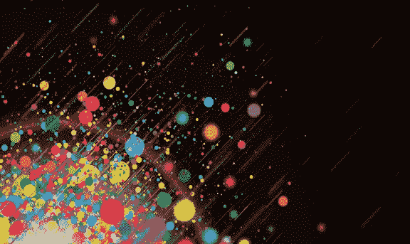
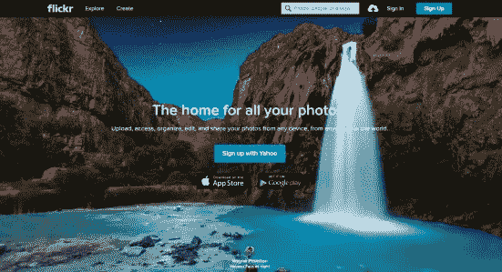

# 设计师套路:你必须知道的 25 个 UI/UX 设计网站

> 原文：<https://medium.com/hackernoon/designers-routine-25-ui-ux-design-websites-you-must-know-12a266ec0f0b>

你总是期待找到完美的图案、最好的设计工具和最酷的颜色组合吗？我们知道，所谓“完美”的标准是根据每个设计师的多样化要求而区分的。如果有一个几乎包括所有你想要的设计资源或网站的列表呢？

亲爱的朋友，不要担心，你会在这个列表中找到答案。

**色彩灵感**

担心找不到完美的颜色？没有色彩灵感？查看这些网站:

1.[平面 UI 颜色选择器](http://www.flatuicolorpicker.com/) —平面设计的绝佳资源。按类别分组的颜色。

2.[colour lovers](http://www.colourlovers.com/)——一个创意社区，来自世界各地的人们在这里创造和分享颜色、调色板和图案，讨论最新趋势，探索多彩的文章。

3.[材料调色板](http://www.materialpalette.com/) —选择您最喜欢的颜色，生成并下载您的材料设计调色板。

4.一个简单而奇妙的资源。只需向前&调整色调，向上&向下调整亮度，滚动调整饱和度。

5.[酷派](http://coolors.co/) —为您的设计创造完美的色彩组合。

6. [ColRd](http://colrd.com/) —根据颜色、渐变、调色板和其他信息为您找到图像。

7. [Color Hunter](http://www.colorhunter.com/) —帮助您在上传的图片中找到前五种颜色。

8. [BrandColors](http://brandcolors.net/) —为你总结品牌的配色方案。

9. [ColorKit](http://colorkit.maketheweb.pl/) —色彩管理的生产力工具。

10.TinEye 实验室——TinEye 是第一个使用图像识别技术的网络图像搜索引擎。给定一张要搜索的图片，TinEye 会告诉你这张图片在网络上的位置和出现方式——即使它已经被修改过。

**设计社区**

设计社区是 UI/UX 设计师学习和讨论最新设计趋势的最佳平台。所以你应该加入一个设计社区，在那里设计师们互相学习，互相帮助，共同成长。即使是最具挑战性的项目，你也能得到反馈。

1.Behance——Behance 一直是设计师改进的好地方。

2. [Dribble](http://www.dribble.com/) — Dribbble 是一个展示、讲述、推广、发现和探索设计的地方。

3.[Flickr](https://www.flickr.com/search/groups/?text=graphic%20design)–Flickr 是一个寻找设计师、分享照片和设计作品的伟大社区，你也可以从其他设计师那里获得灵感。

4.Web Blend —一个面向设计师、开发者和技术爱好者的在线社区平台。

5.[平面设计论坛](http://www.graphicdesignforum.com/forum/) —一个让你沉浸在平面设计社区的绝佳媒介

6. [DeviantArt](http://www.deviantart.com/) —最大的在线艺术画廊和社区，为艺术的创作、发现和分享提供文化背景。

7. [DreamInCode](http://www.dreamincode.net/forums/forum/3-graphic-design/) —面向 web 开发人员和程序员的文章、教程和论坛。

**UX 设计播客**

跑步或慢跑时听 UX 设计播客是个好主意，对吗？

1.黛比·米尔曼的《设计至关重要》[——第一个，也是最好的设计主题播客之一。](http://www.debbiemillman.com/designmatters/)

2.[大型网络节目](http://5by5.tv/bigwebshow) —主持人杰弗里·泽尔德曼将采访专业视觉设计师、开发人员、用户体验设计师和企业家。

3. [UIE 脑火花](http://www.uie.com/brainsparks/audio/)——与大型网络展会侧重于视觉设计、前端开发不同，UIE 脑火花的主题更侧重于 UX 设计。

4. [UX 播客](http://uxpodcast.com/)——即兴的、计划外的采访总能激发你用新的视角来看待信息架构和用户体验设计。

5.网格上的—每周播客涵盖设计主题。

**原型/线框设计**

众所周知，原型制作/线框图是交互设计师、项目经理和网站开发者之间的桥梁，也是网站或移动应用开发的关键步骤。以下是最流行的原型制作/线框工具。(你可能也感兴趣:[基本 UI/UX 设计概念之间的区别线框&原型](http://goo.gl/swy7n8))

1. [Axure RP](http://www.axure.com/) (Mac &赢)

Axure RP 是一个桌面应用程序，允许设计师创建、测试和共享交互式原型。被称为最全面的(就功能而言)原型工具，它是静态、低保真度原型和更复杂、交互式原型的理想桌面软件。作为一个非常专业的 UX 工具，Axure 需要一个陡峭的学习曲线。

2. [Justinmind](http://www.justinmind.com/) (Mac &赢)

Justinmind prototype 是一个灵活的工具，支持 Web 和移动应用程序原型和高保真原型。手势支持特性使其在移动应用程序设计中更加出色。但是，由于变量和函数的复杂性，对新手来说比较困难。

3. [Mockplus](http://goo.gl/an0eTN) (Mac &赢)

Mockplus 是一个全面的快速原型制作工具，支持 PC、网站和移动设备的主流平台。打包的交互组件和创造性的预览方法允许设计师在几分钟内完成设计和预览。这是一个可靠的原型制作应用程序，适用于希望制作高质量原型但没有太长学习曲线的专业设计师。

(完整的[原型工具列表&应用程序](http://goo.gl/C5nYQJ)收藏以供参考。)

自从我在上一篇文章中收集了一些 [UI / UX 书籍和资源](http://goo.gl/QxIWor)，在这篇文章中，我主要关注一些实用的设计工具、社区、播客和颜色资源。我们将继续更新，并收集更多的优秀资源。这是一次积极的对话。如果你认为有什么资源必须添加到这个列表中，请在下面的评论中告诉我。分享是关爱，别忘了分享给你的朋友。